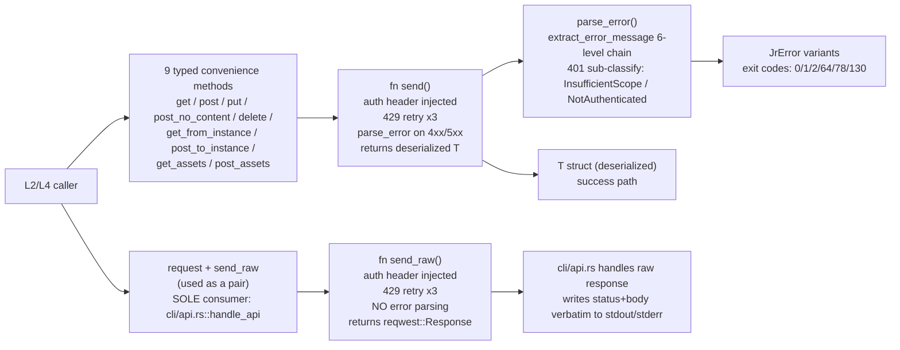

# Component Graph — jr (jira-cli)

**traces_to:** README.md
**Source:** Pass 1 broad + R1 verified edges + R2 cycle-check (1 phantom edge retracted)
**Verification status:** DAG confirmed acyclic. All edges grounded in `use` statement reads.

---

## Module Dependency Graph

```mermaid
graph TD
    main["main.rs (L0)\n268 LOC"] --> cli_mod["cli::mod (L1)\n772 LOC"]
    main --> config["config (L6)\n1,223 LOC"]
    main --> error["error (L6)\n137 LOC"]
    main --> output["output (L6)\n76 LOC"]
    main --> api_client["api::client::JiraClient (L3)\n490 LOC"]

    cli_mod --> api_client
    cli_mod --> config
    cli_mod --> cache["cache (L6)\n899 LOC"]
    cli_mod --> adf["adf (L6)\n1,826 LOC"]
    cli_mod --> jql["jql (L6)\n395 LOC"]
    cli_mod --> partial_match["partial_match (L6)\n200 LOC"]
    cli_mod --> duration["duration (L6)\n159 LOC"]
    cli_mod --> error

    subgraph cli_issue["cli::issue::* (L2)"]
        cli_issue_list["list.rs\n1,083 LOC"]
        cli_issue_view["view.rs\n286 LOC"]
        cli_issue_comments["comments.rs\n61 LOC"]
        cli_issue_workflow["workflow.rs\n788 LOC"]
        cli_issue_create["create.rs\n375 LOC"]
        cli_issue_helpers["helpers.rs\n813 LOC"]
        cli_issue_links["links.rs\n293 LOC"]
        cli_issue_changelog["changelog.rs\n847 LOC"]
        cli_issue_format["format.rs\n226 LOC"]
        cli_issue_assets["assets.rs\n65 LOC"]
        cli_issue_jsonout["json_output.rs\n149 LOC"]
    end

    cli_issue_format --> obs["observability (L6 pub(crate))\n39 LOC"]
    cli_issue_changelog --> obs

    cli_auth["cli::auth (L2)\n1,998 LOC"] --> api_auth["api::auth (L3)\n1,397 LOC"]
    cli_auth --> api_auth_embedded["api::auth_embedded (L3)\n250 LOC"]

    cli_assets["cli::assets (L2)\n1,055 LOC"] --> assets_objects["api::assets::objects\n237 LOC"]
    cli_assets --> assets_workspace["api::assets::workspace\n58 LOC"]
    cli_assets --> assets_schemas["api::assets::schemas\n45 LOC"]

    cli_board["cli::board (L2)\n334 LOC"] --> boards_impl
    cli_sprint["cli::sprint (L2)\n438 LOC"] --> sprints_impl

    cli_issue_assets --> assets_linked["api::assets::linked\n557 LOC"]
    cli_issue_list --> assets_linked
    cli_issue_list --> jql
    cli_issue_view --> assets_linked

    api_client --> api_auth
    api_client --> api_rate_limit["api::rate_limit (L3)\n56 LOC"]
    api_client --> error
    api_client --> config

    api_auth --> api_auth_embedded
    api_auth --> keychain[("OS Keychain\nkeyring crate")]:::external
    api_auth --> network_auth[("auth.atlassian.com\nOAuth IdP")]:::external
    api_auth --> listener[("127.0.0.1:53682\nor :0 dynamic")]:::external
    api_auth_embedded --> outdir[("$OUT_DIR/embedded_oauth.rs\nbuild.rs codegen")]:::external

    subgraph api_jira["api::jira::* (L4 — 11 files, impl JiraClient)"]
        issues_impl["issues.rs"]
        boards_impl["boards.rs"]
        sprints_impl["sprints.rs"]
        fields_impl["fields.rs"]
        statuses_impl["statuses.rs"]
        links_impl["links.rs"]
        teams_impl["teams.rs"]
        worklogs_impl["worklogs.rs"]
        projects_impl["projects.rs"]
        users_impl["users.rs"]
        resolutions_impl["resolutions.rs"]
    end
    api_jira --> api_client
    api_jira --> api_pagination["api::pagination (L3)\n374 LOC"]
    api_jira --> types_jira["types::jira::* (L5)"]

    subgraph api_jsm["api::jsm::* (L4)"]
        servicedesks_impl["servicedesks.rs"]
        queues_impl["queues.rs"]
    end
    api_jsm --> api_client
    api_jsm --> api_pagination
    api_jsm --> types_jsm["types::jsm::* (L5)"]

    subgraph api_assets_grp["api::assets::* (L4 — 5 files)"]
        assets_linked
        assets_objects
        assets_workspace
        assets_schemas
        assets_tickets["tickets.rs\n19 LOC"]
    end
    api_assets_grp --> api_client
    api_assets_grp --> api_pagination
    api_assets_grp --> types_assets["types::assets::* (L5)"]
    api_assets_grp --> cache

    cache --> fs1[("~/.cache/jr/v1/profile/\nXDG_CACHE_HOME")]:::external
    config --> fs2[("~/.config/jr/config.toml\n+ repo/.jr.toml")]:::external
    config --> figment["figment crate"]:::libcrate

    api_client --> reqwest["reqwest (rustls-tls)"]:::libcrate
    api_client --> network_jira[("Atlassian APIs\nJira/JSM/Assets/GraphQL")]:::external

    classDef external fill:#fef3c7,stroke:#b45309,stroke-width:1px;
    classDef libcrate fill:#e0f2fe,stroke:#0369a1,stroke-width:1px;
```

---

## Validated vs Raw HTTP Path

**Verified (Pass 1 R2 §4.1):** `send_raw` consumers = exactly 1 (`cli/api.rs:155`). `request` consumers = exactly 1 (`cli/api.rs:143`). Both used together as a composite escape hatch for `jr api`.

---

## DAG Acyclicity Verification

**Pass 1 R2 §3 confirmed:** the dependency graph is acyclic. Spot-checked all utility-layer modules (`error`, `output`, `cache`, `config`, `jql`, `duration`, `partial_match`, `adf`, `observability`, `api/pagination`, `api/rate_limit`, `api/auth_embedded`) — none import from `cli/`, `api/client`, or `types/`. No upward edges exist.

**One phantom edge retracted (Pass 1 R2 §2 correction):** R1 incorrectly claimed `types/jira/issue.rs` → `observability`. That file uses an inline `static AtomicBool` + `eprintln!` pattern, NOT `crate::observability::log_parse_failure_once`. The edge is absent from this graph.

**Actual `observability` callers (2 only):**
- `cli/issue/format.rs:127`
- `cli/issue/changelog.rs:276`

---

## Layer Isolation Summary

| Layer | Imports from | Does NOT import from |
|-------|-------------|---------------------|
| L0 main | L1, L2 (via jr crate), L3, L6 | nothing above it |
| L1 cli (clap derive) | std, clap | everything (pure derive) |
| L2 handlers | L3, L6 | L4 directly (via L3 client) |
| L3 client | L3 siblings (auth, rate_limit), L6 (config, error) | L2, L4, L5 |
| L3 auth | L3 (auth_embedded), L6 (config, error) | L2, L4, L5 |
| L4 resource impls | L3 client, L5 types, L6 (cache, error) | L2 |
| L5 types | serde, std | everything in crate |
| L6 utilities | std, libcrates | L0-L4 (no upward deps) |
