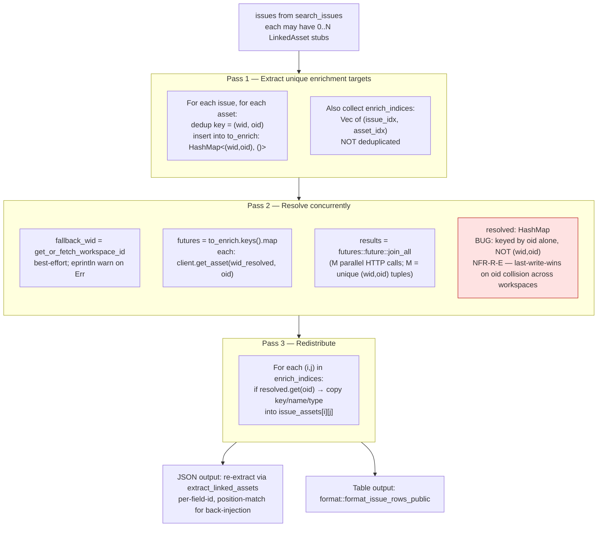

# State Machines — jr (jira-cli)

**traces_to:** README.md
**Source:** Pass 1 R1 §4a-e + R2 §8 verification (all 5 pass audit)
**Status:** Definitive. All diagrams verified against source citations.

---

## SM-1: OAuth Login State Machine

**Source pins:** `api/auth.rs:382-690`
**BC anchors:** BC-1.5.031..BC-1.5.041 (OAuth login state machine BCs)
**Failure modes:** EADDRINUSE (friendly error), CSRF mismatch (bail), partial keychain state (surface to user)

```mermaid
stateDiagram-v2
    [*] --> ResolveCredentials: jr auth login --oauth --profile P
    ResolveCredentials --> ChooseStrategy: (id, secret, OAuthAppSource)
    note right of ResolveCredentials
        Login resolver chain:
        Flag > Env > Keychain > Embedded > Prompt
        OAuthAppSource ∈ {Flag, Env, Keychain, Embedded, Prompt, None}
    end note

    ChooseStrategy --> RequestFixed: source = Embedded
    ChooseStrategy --> RequestDynamic: source ∈ {Flag, Env, Keychain, Prompt}

    RequestFixed --> BindFixed: RedirectUriStrategyRequest::Fixed(53682).bind()
    RequestDynamic --> BindDynamic: RedirectUriStrategyRequest::Dynamic.bind()

    BindFixed --> ValidateScopes: Ok(ResolvedRedirect{listener, FixedPort(53682)})
    BindFixed --> EaddrInUseFriendly: io::Err EADDRINUSE
    BindDynamic --> ValidateScopes: Ok(ResolvedRedirect{listener, DynamicPort(p)})
    BindDynamic --> BindError: io::Err other

    EaddrInUseFriendly --> [*]: UserError "port 53682 in use; try BYO --client-id..."
    BindError --> [*]: propagate I/O error

    ValidateScopes --> PersistApp: scopes non-empty/whitespace
    ValidateScopes --> [*]: ConfigError "oauth_scopes is empty"

    PersistApp --> OAuthLogin: keychain write skipped if Embedded source
    OAuthLogin --> GenerateState: 32 bytes from OsRng → 64 hex chars
    GenerateState --> BuildAuthorizeUrl: percent-encoded params via urlencoding::encode
    note right of BuildAuthorizeUrl
        NO PKCE — no code_challenge / code_challenge_method
        (NFR-S-A, NEW-INV-178; ADR-0006 accepted threat model)
    end note
    BuildAuthorizeUrl --> OpenBrowser: open::that(auth_url)
    OpenBrowser --> ListenerAccept: open succeeded OR eprintln warn (non-fatal)
    ListenerAccept --> CallbackHandler: GET /callback?code=X&state=Y
    CallbackHandler --> ValidateState: extract code, state
    ValidateState --> TokenExchange: state matches generated state
    ValidateState --> [*]: bail "CSRF — state mismatch"
    TokenExchange --> AccessibleResources: POST /oauth/token\n(client_secret + code; no code_verifier)
    AccessibleResources --> SelectFirstSite: GET /accessible-resources
    SelectFirstSite --> StoreTokens: resources.first() — silent first-result-wins\n(NFR-O-S, NEW-INV-179)
    StoreTokens --> ReloadConfig: namespaced "P:oauth-access-token" + "P:oauth-refresh-token"
    StoreTokens --> PartialStateError: keychain write failed mid-pair
    ReloadConfig --> WriteProfile: Config::load_lenient_with
    WriteProfile --> [*]: success — site_name printed to stdout

    PartialStateError --> [*]: surface "partial state — run logout then login"
```

### Transition Table

| From | Event | To | Error type |
|------|-------|----|-----------|
| ResolveCredentials | flag/env/keychain/embedded/prompt | ChooseStrategy | — |
| BindFixed | EADDRINUSE | EaddrInUseFriendly | UserError (exit 64) |
| ValidateScopes | empty scopes | terminal | ConfigError (exit 78) |
| ValidateState | state mismatch | terminal | bail (exit 1) |
| TokenExchange | 401/400 from /oauth/token | terminal | ApiError (exit 1) |
| StoreTokens | keychain partial failure | PartialStateError | ApiError (exit 1) |

### Key invariants

- `ResolvedRedirect` holds the `TcpListener` in private fields — TOCTOU window is eliminated (verified `api/auth.rs:459-478`)
- Fixed callback: `http://127.0.0.1:53682/callback` (literal IPv4, ADR-0006)
- `generate_state`: 32 bytes from `OsRng` → 64 lowercase hex chars (BC-1.5.035)
- `resources.first()` is silent first-wins — a user with multiple cloud sites may authenticate to the wrong one (NFR-O-S)

---

## SM-2: OAuth Refresh State Machine (Dual-Path)

**Source pins:** `cli/auth.rs::refresh_credentials`; `api/auth.rs:704-770`
**BC anchors:** BC-1.4.026 (refresh credential resolution), BC-1.4.030 (resolve_refresh_app_credentials Keychain→Embedded only)

```mermaid
stateDiagram-v2
    [*] --> CheckProfile: jr auth refresh --profile P

    state ProductionPath {
        [*] --> ClearTokens: clear_profile_creds(P)\ndelete "P:oauth-access-token" + "P:oauth-refresh-token" from keychain
        ClearTokens --> ChooseFlow: read auth_method from ProfileConfig
        ChooseFlow --> RelLoginToken: auth_method = api_token
        ChooseFlow --> ReLoginOAuth: auth_method = oauth
        RelLoginToken --> [*]: invoke handle_login(LoginArgs{api_token: true, ...})
        ReLoginOAuth --> [*]: invoke login_oauth (full SM-1 flow)
    }

    state AltPath {
        [*] --> ResolveAppCreds: resolve_refresh_app_credentials\n(Keychain → Embedded ONLY; Flag/Env/Prompt DELIBERATELY excluded)
        ResolveAppCreds --> RefreshGrant: POST /oauth/token\ngrant_type=refresh_token
        RefreshGrant --> StoreNewTokens: rotate access + refresh tokens
        StoreNewTokens --> [*]: NO production callers — kept for future 401 auto-refresh
    }

    CheckProfile --> ProductionPath: user-facing path (cli/auth.rs::refresh_credentials)
    CheckProfile --> AltPath: UNUSED — api/auth.rs:704 refresh_oauth_token\n(pub, has tests, zero production callers)
```

### Key invariants

- Production path is **clear-and-relogin** — not a token-refresh grant. The refresh-token grant path (`refresh_oauth_token`) exists as `pub` with no production callers (NFR-O-B).
- Refresh-side resolver has only 2 sources: Keychain → Embedded. Flag/Env/Prompt are deliberately absent. The refresh token must reuse the same app that issued it; silently sharing the login resolver would risk wrong-app reuse.
- `client.send()` does NOT auto-refresh on 401 (verified Pass 2 R6). 401 surfaces as `JrError::NotAuthenticated`; user must run `jr auth refresh`.

---

## SM-3: Asset Enrichment 3-Pass Dataflow

**Source pins:** `cli/issue/list.rs:395-463`, `api/assets/linked.rs:216`
**BC anchors:** BC-4.3.001 (MUST-FIX), BC-4.1.001
**Critical bug:** NFR-R-E — Pass 2 result map keyed by `oid` alone, not `(wid, oid)` (ADR-0008)



### Performance contract

N issues × K average-assets-per-issue enrichments collapse to M unique `(wid, oid)` tuples. Total HTTP cost = M (concurrent via `join_all`), not N×K serial. Single-workspace tenants are unaffected by the NFR-R-E bug (oid is unique within a workspace).

### Fix scope (ADR-0008)

Change `resolved: HashMap<String, _>` to `resolved: HashMap<(String, String), _>` at 3 sites in `cli/issue/list.rs` (lines 440, 446, 449, 456). ~5 LOC change.

---

## SM-4: Sprint-Aware List Dispatch

**Source pins:** `cli/issue/list.rs` (JQL composition path), `cli/sprint.rs` (kanban hard-error)
**BC anchors:** BC-2.1.001..BC-2.1.017, BC-5.1.001
**Failure modes:** silent degrade (scrum + no active sprint), hard error (board 404, other board fetch error)

```mermaid
stateDiagram-v2
    [*] --> CheckJQL: jr issue list ...
    CheckJQL --> CustomJQL: --jql provided by user
    CheckJQL --> CheckBoard: --jql unset

    CustomJQL --> ComposeFilters: use as base JQL; append filter clauses

    CheckBoard --> NoBoardConfig: board_id absent in .jr.toml
    CheckBoard --> FetchBoardConfig: board_id present in .jr.toml

    NoBoardConfig --> ProjectScope: base = "project = {pk}"

    FetchBoardConfig --> BoardError404: get_board_config → 404
    FetchBoardConfig --> BoardErrorOther: get_board_config → other Err
    FetchBoardConfig --> BoardOk: get_board_config → Ok

    BoardError404 --> [*]: UserError "Board X not found..."
    BoardErrorOther --> [*]: anyhow context "Failed to fetch... Remove board_id"

    BoardOk --> ScrumBranch: board_type.to_lowercase() == "scrum"
    BoardOk --> KanbanBranch: else (kanban, or unknown — falls into kanban arm)

    state ScrumBranch {
        [*] --> ListSprints: list_sprints(active)
        ListSprints --> SprintFound: Ok with non-empty Vec
        ListSprints --> NoActiveSprint: Ok with empty Vec
        ListSprints --> SprintError: Err
        SprintFound --> [*]: base = "sprint = {sprint.id}"\n+ ORDER BY rank ASC
        NoActiveSprint --> [*]: base = "project = {pk}"\n+ ORDER BY updated DESC\nSILENT DEGRADE — no eprintln warning\n(NFR design tension: UX scope shift undisclosed)
        SprintError --> [*]: anyhow context "Failed to list sprints..."
    }

    state KanbanBranch {
        [*] --> KBase: base = "project = {pk}"\n+ "statusCategory != Done"\n+ ORDER BY rank ASC
    }

    ProjectScope --> ComposeFilters
    ScrumBranch --> ComposeFilters
    KanbanBranch --> ComposeFilters

    ComposeFilters --> [*]: append assignee/reporter/status/open/team/recent/asset/created clauses\nthen paginate via search_issues
```



### Cross-module asymmetry (documented inconsistency)

`cli/issue/list.rs` silently degrades (scrum + no active sprint → project scope). `cli/sprint.rs` hard-errors on kanban ("Sprints are not available on kanban boards"). Same input class, different error policy. This is a known UX tension documented in NFR-O-M.

### `--open` filter dual mechanism

Server-side: `statusCategory != Done` in JQL for Jira issues.
Client-side: `status.colorName != "green"` for connected tickets in `cli/assets.rs`.
Both implement the same semantic ("not done") via different mechanisms. Intentional by design per NFR-O-M.

---

## SM-5: Cache Lifecycle

**Source pins:** `cache.rs:16-150`
**BC anchors:** BC-6.2.001..BC-6.2.014, BC-X.8.001

```mermaid
stateDiagram-v2
    [*] --> ReadAttempt: read_X_cache(profile, ...)
    ReadAttempt --> NotFound: file does not exist (NotFound I/O error)
    ReadAttempt --> ReadOK: fs::read_to_string → Ok(content)
    ReadAttempt --> IoError: other I/O error (permissions, etc.)

    NotFound --> [*]: Ok(None) — caller treats as cache miss; triggers refetch

    IoError --> [*]: propagate Err → JrError

    ReadOK --> Deserialize: serde_json::from_str(content)
    Deserialize --> CorruptCache: Err (format changed, truncated, etc.)
    Deserialize --> ParsedOK: Ok(Expiring<T>)

    CorruptCache --> [*]: eprintln! "warning: cache file ... unreadable; will refetch"\nreturn Ok(None) — self-healing

    ParsedOK --> CheckTTL: now - fetched_at >= CACHE_TTL_DAYS (7)?
    CheckTTL --> Expired: yes
    CheckTTL --> Fresh: no

    Expired --> [*]: Ok(None) — triggers refetch
    Fresh --> [*]: Ok(Some(payload)) — cache hit

    note right of CorruptCache
        Corrupted file remains on disk until
        next successful write overwrites it.
        No explicit cleanup on read-path.
    end note
```

### Cache types (6 distinct)

| Cache file | Key strategy | TTL | Notes |
|-----------|-------------|-----|-------|
| `teams.json` | File-level | 7 days | Per-profile |
| `project_meta.json` | Per-project-key TTL | 7 days | Keyed cache within file |
| `workspace.json` | File-level | 7 days | Assets workspace ID |
| `cmdb_fields.json` | File-level | 7 days | Stores `(id, name)` tuples |
| `object_type_attrs.json` | File-level | 7 days | Per-workspace |
| `resolutions.json` | File-level | 7 days | Per-profile |

### Write path

`std::fs::write` (direct, non-atomic). Crash between start and end leaves indeterminate file state. Mitigation: deserialization failure on next read → `Ok(None)` (self-healing). Risk classified LOW for single-user CLI (NFR-R-G).

### Profile isolation

`clear_profile_cache(profile)` is called by `jr auth remove`. No-op if directory absent. All reader/writer functions take `profile: &str` as first argument — convention-enforced, not compile-time-enforced (see ADR-0011).
