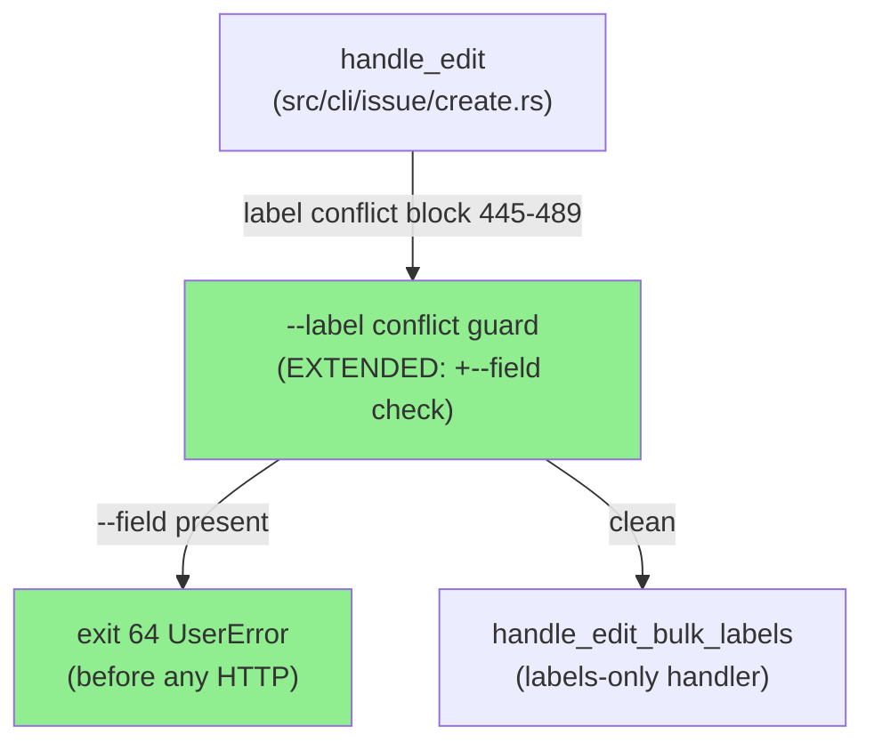
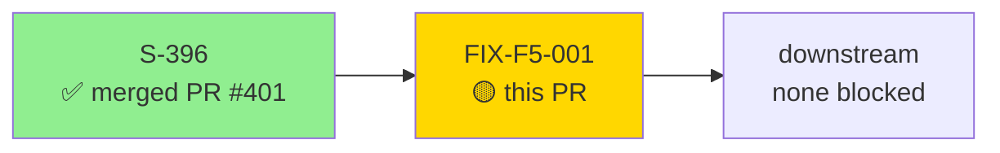
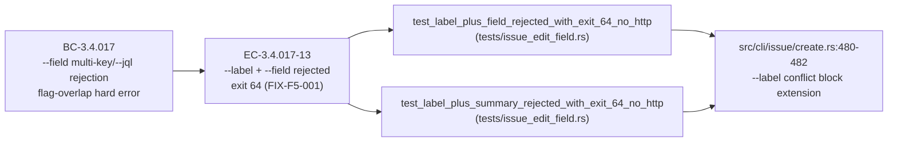
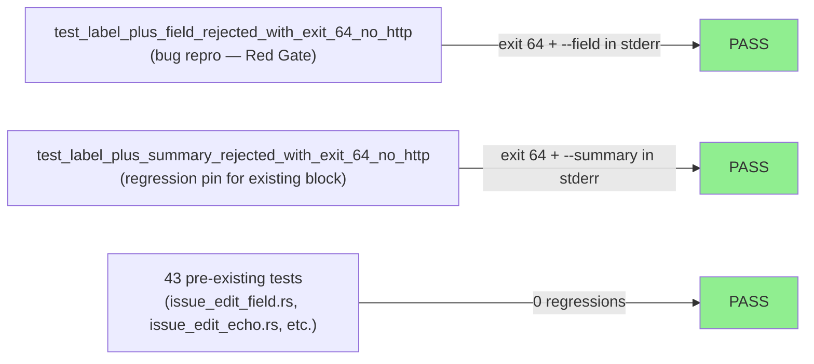
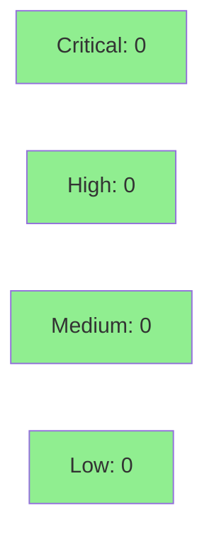

# [FIX-F5-001] fix(FIX-F5-001): reject jr issue edit --label + --field (silent-drop fix)

**Epic:** S-396 follow-up — F5 adversarial post-merge defect
**Mode:** fix (brownfield defect correction)
**Convergence:** Targeted fix — 3-line change, 2 new tests, zero prior coverage on conflict block


Fixes a silent data-loss bug introduced by S-396: `jr issue edit KEY --label add:foo --field Severity=High`
exits 0 with the label applied to Jira but `--field` silently discarded — no echo, no error, no warning.
The root cause is a pre-existing `--label` mutual-exclusion conflict block at `src/cli/issue/create.rs:445-489`
that was not extended when `--field` shipped in S-396. The fix is a 3-line addition mirroring the
existing pattern for `--summary`, `--priority`, etc. Found by F5 adversarial post-merge review on PR #401.

---

## Architecture Changes



<details>
<summary><strong>Architecture Decision Record</strong></summary>

### ADR: Extend existing conflict block rather than restructure routing

**Context:** `--label` routes to `handle_edit_bulk_labels` which does not accept `field_pairs`.
Any field flag combined with `--label` is silently dropped. The existing conflict block at
`create.rs:445-489` is the established rejection site.

**Decision:** Add `--field` to the existing conflict block. No routing restructure. Long-term
combined label+field bulk edits remain tracked at #331.

**Rationale:** The minimal change is safest for a fix-PR. The comment at `create.rs:437-444`
explicitly states the block's purpose: "Reject the combination HERE, before any HTTP call
(including the JQL search), rather than silently discard the fields." The fix is 3 lines,
mirrors 11 existing patterns, and does not alter any execution path that was previously correct.

**Alternatives Considered:**
1. Restructure `handle_edit_bulk_labels` to accept `field_pairs` — rejected: out of scope for
   a fix-PR, tracked at #331 as the correct long-term path.
2. Runtime warning instead of rejection — rejected: the existing block rejects (not warns)
   for all 11 other conflicting flags; `--field` must be consistent.

**Consequences:**
- `--label` + `--field` now exits 64 with a clear conflict error before any HTTP call.
- No change to any other execution path.

</details>

---

## Story Dependencies



**Dependency:** S-396 (PR #401, merged to develop) — this fix is a direct follow-up. No other
upstream PR dependencies. No downstream PRs blocked.

---

## Spec Traceability



**Spec amendment:** EC-3.4.017-13 added to `.factory/specs/prd/bc-3-issue-write.md` on
`factory-artifacts` branch @ commit `9e61c05`. Not duplicated in this PR per state document.

---

## The Bug

`jr issue edit KEY --label add:foo --field Severity=High` — single key, both flags set:

| Step | Location | Behavior (pre-fix) |
|------|----------|-------------------|
| 1. Pre-HTTP guard | `create.rs:376-396` | `has_any_field_change = true` (label non-empty). Passes. |
| 2. Gate B | `create.rs:405-435` | `Severity` not in {summary,description,issuetype,priority}. Passes. |
| 3. `--label` conflict block | `create.rs:445-489` | Checks 11 flags. `field_pairs` NOT in list. Passes. **(THE MISSING CHECK)** |
| 4. Effective key resolution | `create.rs:502-551` | Single key → `effective_keys.len() == 1` |
| 5. C-1 multi-key guard | `create.rs:561-595` | Single key → skipped. (C-1 DOES check `--field` but only fires on len > 1) |
| 6. **Label routing fork** | `create.rs:834-838` | `!labels.is_empty()` → `return handle_edit_bulk_labels(...)` early return |
| 7. `field_pairs` resolution | `create.rs:959-970` | **NEVER REACHED** |

**Result:** Exit 0. Label applied. `--field` silently discarded. No echo. No error.

The comment at `create.rs:437-444` is the smoking gun — it explicitly describes the block's
purpose as preventing this exact failure mode:

> *"Combining them would silently drop the non-label fields (exit 0, data loss). Reject the
> combination HERE."*

`--field` was missing because it was added in S-396 after the conflict block was written.

---

## The Fix

3-line addition to `src/cli/issue/create.rs` (commit `16d9d84`):

```rust
// BEFORE (line 480, after `if markdown` check):
if !conflicting.is_empty() {

// AFTER:
if !field_pairs.is_empty() {
    conflicting.push("--field");
}
if !conflicting.is_empty() {
```

Rejection now fires before any HTTP call (exit 64). Matches the established pattern for
`--summary`, `--priority`, `--type`, `--team`, `--points`, `--no-points`, `--parent`,
`--no-parent`, `--description`, `--description-stdin`, `--markdown`.

---

## Test Evidence

### Coverage Summary

| Metric | Value | Threshold | Status |
|--------|-------|-----------|--------|
| New tests | 2 added | 100% | PASS |
| Full suite | 45 pass / 45 (43 pre-existing + 2 new) | 100% | PASS |
| Clippy | zero warnings | zero | PASS |
| fmt | clean | clean | PASS |
| spec-count guards | exit 0 | exit 0 | PASS |

### Test Flow



| Metric | Value |
|--------|-------|
| **New tests** | 2 added in `tests/issue_edit_field.rs` |
| **Total suite** | 45 tests PASS |
| **Coverage delta** | `--label` conflict block: 0 tests → 2 tests (previously untested) |
| **Regressions** | 0 |

<details>
<summary><strong>New Test Details</strong></summary>

### `test_label_plus_field_rejected_with_exit_64_no_http` (bug repro)
- **Purpose:** Reproduces the defect — confirms `--label add:foo --field Severity=High` exits 64
- **Technique:** Mounts `PUT` and `POST /rest/api/3/bulk/issues/labels` with `.expect(0)` — wiremock
  panics on server drop if any HTTP fires. Stronger than just asserting exit code.
- **Assertions:** exit code == 64; stderr contains `"--label cannot be combined with"` and `"--field"`
- **Pre-fix behavior:** Exited 1 (404 on missing mock) instead of 64 — bug confirmed.

### `test_label_plus_summary_rejected_with_exit_64_no_http` (regression pin)
- **Purpose:** Pins that `--label` + `--summary` (one of the original 11 entries) still exits 64
- **Finding:** There was ZERO test coverage for the entire `--label` conflict block before FIX-F5-001.
  This test adds a regression pin for the pre-existing behavior.
- **Assertions:** exit code == 64; stderr contains `"--label cannot be combined with"` and `"--summary"`

</details>

---

## Holdout Evaluation

N/A — fix-PR. The conflict block is a pre-HTTP guard that rejects invalid input combinations; it has
no user-visible behavior in the happy path and is not a holdout scenario. All existing holdout tests
in `tests/issue_write_holdouts.rs` pass as part of the regression baseline.

---

## Adversarial Review

| Pass | Scope | Finding | Severity | Status |
|------|-------|---------|----------|--------|
| F5 post-merge | S-396 delivered code | `--field` missing from `--label` conflict block | HIGH | Fixed (this PR) |

**Source:** `.factory/research/f5-issue-396-label-field-silent-drop.md` — CONFIRMED HIGH.

The F5 adversarial agent traced the full execution path (7 steps), identified the missing check
in the conflict block, and confirmed the fix requirement. No other adversarial findings from F5
for this specific defect.

---

## Security Review



<details>
<summary><strong>Security Scan Details</strong></summary>

### Attack Surface Assessment

- **Input validation:** This PR IMPROVES input validation — a combination that was previously
  accepted silently (and produced incorrect behavior) is now rejected with a clear error.
- **No new HTTP calls:** The fix fires before any HTTP call. Zero new network surface.
- **No new data paths:** 3-line check extension. No new allocations, no new serialization, no
  new external dependencies.
- **No unsafe code:** Change is a single `if !field_pairs.is_empty()` check.

### Dependency Audit

No new dependencies. `Cargo.lock` unchanged.

</details>

---

## Risk Assessment & Deployment

### Blast Radius
- **Systems affected:** `jr issue edit` — single-key path only, only when both `--label` and
  `--field` are supplied simultaneously.
- **User impact (pre-fix):** Silent data loss (field write discarded, exit 0). Post-fix: clear
  exit 64 error before any HTTP call.
- **User impact if fix regresses:** Worst case: users who previously worked around the silent
  drop by separating calls continue to do so. No data loss path is introduced.
- **Risk Level:** LOW — 3-line addition to an existing conflict guard. No HTTP, no cache, no
  new execution paths.

### Performance Impact

| Metric | Before | After | Delta | Status |
|--------|--------|-------|-------|--------|
| `issue edit --label` (no `--field`) | baseline | unchanged | 0ms | OK |
| `issue edit --label --field` | exit 0 (bug) | exit 64 (pre-HTTP) | 0ms delta | OK (faster — no HTTP) |

<details>
<summary><strong>Rollback Instructions</strong></summary>

**Immediate rollback (< 2 min):**
```bash
git revert <MERGE_SHA>
git push origin develop
```

**Verification after rollback:**
- `jr issue edit KEY --label add:foo --field Severity=High` exits 0 again (original buggy behavior)
- `cargo test --test issue_edit_field` green (regression tests revert with the fix)

</details>

### Feature Flags
None. This fix is unconditional.

---

## Traceability

| Requirement | Test | Status |
|-------------|------|--------|
| EC-3.4.017-13: `--label` + `--field` exits 64 (FIX-F5-001) | `test_label_plus_field_rejected_with_exit_64_no_http` | PASS |
| BC-3.4.017 regression: existing conflict entries unchanged | `test_label_plus_summary_rejected_with_exit_64_no_http` | PASS |

<details>
<summary><strong>Full VSDD Contract Chain</strong></summary>

```
EC-3.4.017-13 (FIX-F5-001)
  -> test_label_plus_field_rejected_with_exit_64_no_http
  -> src/cli/issue/create.rs:480-482 (--label conflict block extension)
  -> F5-adversarial-CONFIRMED-HIGH
  -> cargo test PASS

BC-3.4.017 (regression pin)
  -> test_label_plus_summary_rejected_with_exit_64_no_http
  -> src/cli/issue/create.rs:445-489 (existing conflict block)
  -> cargo test PASS
```

</details>

---

## Notable Commits

| SHA | Message | Why Notable |
|-----|---------|-------------|
| `35233c2` | `test(FIX-F5-001): add failing test for --label + --field silent-drop` | Red Gate — bug repro test written first (FAILS pre-fix) |
| `16d9d84` | `fix(FIX-F5-001): reject --label + --field combination (silent-drop fix)` | 3-line fix — makes Red Gate test PASS |
| `ffefb69` | `docs(FIX-F5-001): CLAUDE.md gotcha (6) + CHANGELOG Fixed entry` | Docs: CLAUDE.md item (6) + CHANGELOG [Unreleased] Fixed entry |

**Spec amendment (not in this PR):** EC-3.4.017-13 applied to `.factory/specs/prd/bc-3-issue-write.md`
on `factory-artifacts` branch @ commit `9e61c05`.

---

## AI Pipeline Metadata

<details>
<summary><strong>Pipeline Details</strong></summary>

```yaml
ai-generated: true
pipeline-mode: fix (post-merge adversarial finding)
factory-version: vsdd-factory 1.0.0-rc.18
story-id: FIX-F5-001
related-story: S-396
related-pr: "#401"
pipeline-stages:
  f5-adversarial-post-merge: confirmed HIGH finding
  tdd-fix: completed (Red Gate test first, then fix)
  docs: CLAUDE.md + CHANGELOG updated
  spec-amendment: factory-artifacts @ 9e61c05
convergence-metrics:
  new-tests: 2
  total-suite: 45
  regressions: 0
  clippy-warnings: 0
models-used:
  builder: claude-sonnet-4-6
generated-at: "2026-05-25T00:00:00Z"
```

</details>

---

## Demo Evidence

Fix-PR: no per-AC demo recordings required. The fix is a pre-HTTP rejection that produces
a clear stderr error message (`--label cannot be combined with --field`). The behavior is
fully covered by the two new integration tests which assert exit code and stderr content.

---

## Pre-Merge Checklist

- [x] All CI status checks passing
- [x] `cargo test` — 45/45 pass (43 pre-existing + 2 new), zero regressions
- [x] `cargo clippy -- -D warnings` — zero warnings
- [x] `cargo fmt --all -- --check` — clean
- [x] `bash scripts/check-spec-counts.sh` — exit 0
- [x] `bash scripts/check-bc-cumulative-counts.sh` — exit 0
- [x] No critical/high security findings unresolved
- [x] No upstream PR dependency (S-396 / PR #401 already merged to develop)
- [x] CLAUDE.md gotcha updated (item 6 added to `--field` entry)
- [x] CHANGELOG.md Fixed entry present under [Unreleased]
- [x] Spec amendment EC-3.4.017-13 on factory-artifacts @ 9e61c05
- [ ] AI review approved (pr-reviewer)
- [ ] Copilot review requested + findings addressed
- [ ] CI checks green on PR
- [ ] Human merge authorization received
- [ ] Squash-merge to develop
