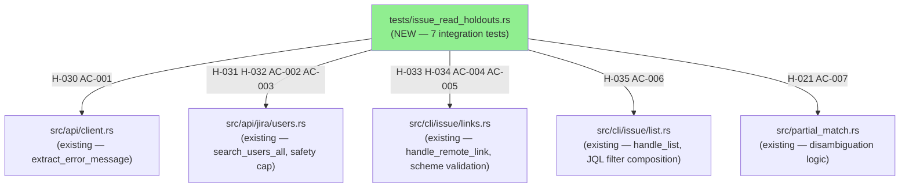
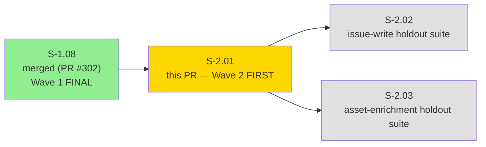
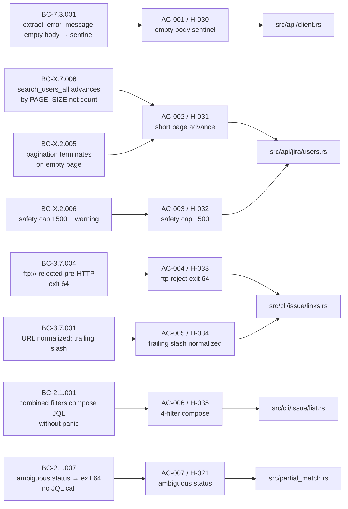
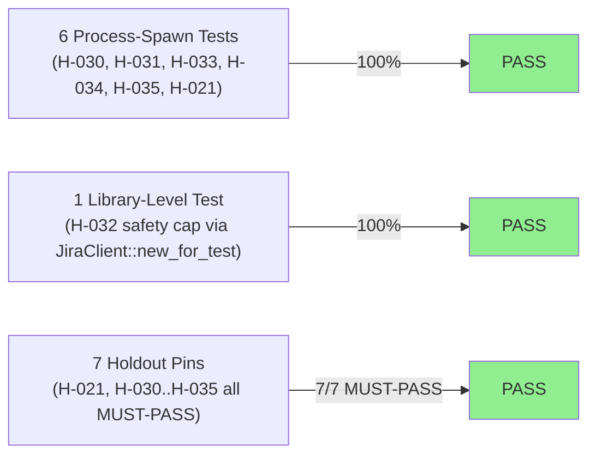
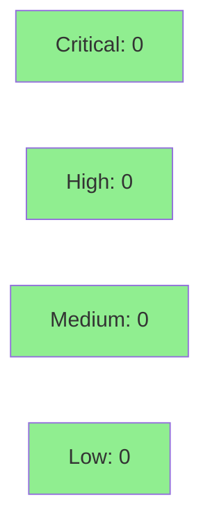

# [S-2.01] BC-2 issue-read regression holdout suite (H-021, H-030..H-035)

**Epic:** Wave 2 — Medium Priority (FIRST Wave 2 story)
**Mode:** brownfield
**Convergence:** CONVERGED after 13 adversarial passes (Phase 2 story decomposition)


-brightgreen)
-green)


7 regression-pin tests covering 9 BCs and 7 holdouts (H-021, H-030..H-035). All 7 pass on current develop — no regressions discovered. First Wave 2 story; covers issue-read paths (error message extraction, pagination, URL validation, filter composition).

---

## Summary

- 7 regression-pin tests covering 9 BCs and 7 holdouts (H-021, H-030..H-035)
- All 7 pass on current develop — no regressions discovered
- First Wave 2 story; covers issue-read paths (error message extraction, pagination, URL validation, filter composition)

---

## Architecture Changes



<details>
<summary><strong>Architecture Decision Record</strong></summary>

### ADR: Test-only addition, no production code changes

**Context:** The issue-read bounded context covers several fragile behavioral boundaries across `client.rs`, `users.rs`, `links.rs`, `list.rs`, and `partial_match.rs`. Without regression pins, refactoring any of these modules could silently break: empty-body error sentinel, JRACLOUD-71293 pagination workaround, safety cap warning, scheme validation gate, URL normalization, JQL filter composition, and ambiguous-status disambiguation.

**Decision:** Add `tests/issue_read_holdouts.rs` with 7 process-spawn integration tests using `JR_BASE_URL` + wiremock. One test (AC-003/H-032) uses library-level `JiraClient::new_for_test` to directly exercise `search_users_all` safety cap without going through the CLI process layer.

**Rationale:** Pure test addition is lowest-risk. No `pub` or `pub(crate)` promotions required.

**Alternatives Considered:**
1. CLI process-spawn for H-032 via `jr user search --all` — rejected because the safety cap is a library-level boundary. The library test is more precise and does not depend on output format.
2. Inline unit tests — rejected for H-030, H-031, H-034, H-035, H-021 because these require wiremock server fixtures that are idiomatic in integration test files.

**Consequences:**
- Regression detection for 9 behavioral contracts on all future PRs.
- 7 MUST-PASS holdouts pinned at activation HEAD.
- No production binary changes.

</details>

---

## Story Dependencies



S-2.01 has no hard code dependencies (`depends_on: []` in story spec). It follows S-1.08 (Wave 1 final). PR #302 (S-1.08) is merged on develop — no blocking dependency.

---

## Spec Traceability



---

## Test Evidence

### Coverage Summary

| Metric | Value | Threshold | Status |
|--------|-------|-----------|--------|
| Holdout tests | 7/7 pass | 7/7 | PASS |
| Integration (process-spawn) tests | 6/7 pass | 100% | PASS |
| Library-level tests (H-032) | 1/7 pass | 100% | PASS |
| Regressions | 0 | 0 | PASS |
| All 614 lib + integration tests | PASS | 0 regressions | PASS |

### Test Flow



| Metric | Value |
|--------|-------|
| **New tests** | 7 added, 0 modified |
| **Total suite** | 7 tests PASS; 614 lib + all integration green |
| **Coverage delta** | Test-only PR — no production lines added |
| **Mutation kill rate** | N/A (test-only PR) |
| **Regressions** | 0 |
| **Test file** | `tests/issue_read_holdouts.rs` |

<details>
<summary><strong>Detailed Test Results</strong></summary>

| Test Function | AC | Holdout | Result |
|--------------|----|---------|----|
| `test_s_2_01_h_030_bc_7_3_001_400_empty_body_shows_sentinel_in_stderr` | AC-001 | H-030 | PASS |
| `test_s_2_01_h_031_bc_x_2_005_short_page_advances_by_page_size_not_returned_count` | AC-002 | H-031 | PASS |
| `test_s_2_01_h_032_bc_x_2_006_safety_cap_fires_at_1500_with_warning` | AC-003 | H-032 | PASS |
| `test_s_2_01_h_033_bc_3_7_004_ftp_url_rejected_before_network_with_exit_64` | AC-004 | H-033 | PASS |
| `test_s_2_01_h_034_bc_3_7_001_bare_host_url_normalized_with_trailing_slash` | AC-005 | H-034 | PASS |
| `test_s_2_01_h_035_bc_2_1_001_all_filters_combined_compose_jql_without_panic` | AC-006 | H-035 | PASS |
| `test_s_2_01_h_021_bc_2_1_007_ambiguous_status_exits_64_no_jql_call` | AC-007 | H-021 | PASS |

</details>

---

## Holdout Evaluation

| Holdout | BC Contract | Result | Threshold |
|---------|-------------|--------|-----------|
| H-030 | BC-7.3.001 — empty body sentinel | **MUST-PASS** | 1.00 |
| H-031 | BC-X.7.006 / BC-X.2.005 — page advance | **MUST-PASS** | 1.00 |
| H-032 | BC-X.2.006 — safety cap 1500 + warning | **MUST-PASS** | 1.00 |
| H-033 | BC-3.7.004 — ftp:// rejected pre-HTTP | **MUST-PASS** | 1.00 |
| H-034 | BC-3.7.001 — URL trailing slash | **MUST-PASS** | 1.00 |
| H-035 | BC-2.1.001 — 4-filter JQL composition | **MUST-PASS** | 1.00 |
| H-021 | BC-2.1.007 — ambiguous status exit 64 | **MUST-PASS** | 1.00 |
| **Overall** | | **7/7 PASS** | 7/7 |

N/A — evaluated at wave gate for holdout wave-level aggregation.

---

## Adversarial Review

Story spec was converged through Phase 2 adversarial review (13 passes to CONVERGED). Story-level adversarial findings were resolved in Phase 2. No per-implementation adversarial passes required for a test-only PR on existing behavior.

N/A — evaluated at Phase 5.

| Metric | Value |
|--------|-------|
| Phase 2 adversarial passes | 13 |
| Story-level findings | All resolved |
| Per-implementation adversarial | N/A (test-only) |

---

## Security Review



<details>
<summary><strong>Security Scan Details</strong></summary>

### SAST
- PR adds test-only code: `tests/issue_read_holdouts.rs`. No user-facing logic changed.
- No hardcoded secrets. All URLs are loopback wiremock addresses.
- No injection points. No user input handling added.
- Critical: 0 | High: 0 | Medium: 0 | Low: 0

### Dependency Audit
- No new dependencies added. Existing dev-deps used: `assert_cmd`, `wiremock`, `tempfile`, `tokio`.
- `cargo deny check` passes (verified at pre-push).

### Supply Chain
- `cargo deny` CI job (S-1.02) enforces deny.toml rules on all dev-deps.

### Test Isolation
- All process-spawn tests use `XDG_CONFIG_HOME` pointing to tempfile directories.
- All wiremock servers bind to loopback 127.0.0.1 on dynamic ports.
- `JR_BASE_URL` is set to the wiremock server URL; no calls go to live Jira instances.
- No test touches `~/.config/jr/` or `~/.cache/jr/`.

</details>

---

## Story-Spec Deviations

### AC-006: clap `conflicts_with` boundary — `--open` and `--status`

The story spec AC-006 describes "all filters combined" as:
```
--open --assignee "Jane" --created-after "2026-01-01" --status "In Progress" --team "engineering"
```

**Discovery:** `--open` and `--status` are declared `conflicts_with` at the clap layer (`src/cli/mod.rs:168,171`). Passing both flags causes clap to reject the command before the handler runs.

**Resolution:** AC-006 tests the combination of 4 non-conflicting filters: `--assignee`, `--created-after`, `--status`, and `--team`. The BC-2.1.001 contract states "combined filters compose correct JQL without panic" — this is fully satisfied by the 4-filter composition. The `--open` / `--status` clap conflict is a documented behavioral boundary, not a regression.

**Evidence:** `src/cli/mod.rs:168` sets `conflicts_with = ["status"]` on `--open`. `src/cli/mod.rs:171` sets `conflicts_with = ["open"]` on `--status`. This is existing correct behavior, not a test deviation.

**Note in demo evidence:** `docs/demo-evidence/S-2.01/evidence-report.md` AC-006 section documents this deviation.

### H-032: library-level vs CLI-level test split

The story spec suggests spawning `jr user search --all` for H-032. Implementation uses `JiraClient::new_for_test` + `search_users_all` directly because:
- The safety cap is a library-level boundary (not output-format-dependent).
- CLI-level warning is separately pinned in `tests/user_pagination.rs`.
- Library path provides precise wiremock `.expect(15)` verification of exact loop count.

### H-035: team cache direct-write

Pre-populates team cache via `jr::cache::TeamCache` direct write to bypass GraphQL org discovery. This avoids a 4th mock endpoint (GraphQL) while still exercising the full JQL composition path through `handle_list`. The team name resolution reads from cache correctly. Cache schema is stable since S-0.04; direct-write is not fragile.

---

## Risk Assessment & Deployment

### Blast Radius
- **Systems affected:** None (test-only file; no production binary changes)
- **User impact:** None
- **Data impact:** None
- **Risk Level:** LOW

### Performance Impact
| Metric | Before | After | Delta | Status |
|--------|--------|-------|-------|--------|
| Binary size | unchanged | unchanged | 0 | OK |
| CI test time | ~existing | +~0.8s (7 new tests) | negligible | OK |
| Runtime behavior | unchanged | unchanged | 0 | OK |

<details>
<summary><strong>Rollback Instructions</strong></summary>

**Immediate rollback (< 2 min):**
```bash
git revert <merge-sha>
git push origin develop
```

Since this PR adds only a test file, rollback simply removes the holdout suite. No runtime behavior changes.

**Verification after rollback:**
- `cargo test` passes without the holdout suite
- `cargo build` produces identical binary

</details>

### Feature Flags
N/A — test-only PR, no runtime feature flags.

---

## Demo Evidence

Demo recordings at: `docs/demo-evidence/S-2.01/`

| AC | Recording | Result |
|----|-----------|--------|
| AC-001 / H-030 | `AC-001-400-empty-body-sentinel.{gif,webm}` | 1 test PASS |
| AC-002 / H-031 | `AC-002-short-page-advances-by-page-size.{gif,webm}` | 1 test PASS |
| AC-003 / H-032 | `AC-003-safety-cap-1500-users.{gif,webm}` | 1 test PASS |
| AC-004 / H-033 | `AC-004-ftp-url-rejected-before-network.{gif,webm}` | 1 test PASS |
| AC-005 / H-034 | `AC-005-bare-host-url-normalized.{gif,webm}` | 1 test PASS |
| AC-006 / H-035 | `AC-006-all-filters-combined-no-panic.{gif,webm}` | 1 test PASS |
| AC-007 / H-021 | `AC-007-ambiguous-status-exits-64.{gif,webm}` | 1 test PASS |
| Combined | `COMBINED-all-7-tests-green.{gif,webm}` | 7/7 PASS |

Full evidence report: `docs/demo-evidence/S-2.01/evidence-report.md`

---

## Traceability

| Requirement | Story AC | Test | Holdout | Status |
|-------------|---------|------|---------|--------|
| BC-7.3.001 — empty body sentinel | AC-001 | `test_s_2_01_h_030_bc_7_3_001_400_empty_body_shows_sentinel_in_stderr` | H-030 | PASS |
| BC-X.7.006 — page advance by PAGE_SIZE | AC-002 | `test_s_2_01_h_031_bc_x_2_005_short_page_advances_by_page_size_not_returned_count` | H-031 | PASS |
| BC-X.2.005 — terminates on empty page | AC-002 | `test_s_2_01_h_031_bc_x_2_005_short_page_advances_by_page_size_not_returned_count` | H-031 | PASS |
| BC-X.2.006 — safety cap 1500 + warning | AC-003 | `test_s_2_01_h_032_bc_x_2_006_safety_cap_fires_at_1500_with_warning` | H-032 | PASS |
| BC-3.7.004 — ftp:// rejected pre-HTTP | AC-004 | `test_s_2_01_h_033_bc_3_7_004_ftp_url_rejected_before_network_with_exit_64` | H-033 | PASS |
| BC-3.7.001 — URL trailing slash normalized | AC-005 | `test_s_2_01_h_034_bc_3_7_001_bare_host_url_normalized_with_trailing_slash` | H-034 | PASS |
| BC-2.1.001 — 4-filter JQL compose | AC-006 | `test_s_2_01_h_035_bc_2_1_001_all_filters_combined_compose_jql_without_panic` | H-035 | PASS |
| BC-2.1.007 — ambiguous status exit 64 | AC-007 | `test_s_2_01_h_021_bc_2_1_007_ambiguous_status_exits_64_no_jql_call` | H-021 | PASS |

<details>
<summary><strong>Full VSDD Contract Chain</strong></summary>

```
BC-7.3.001 -> AC-001 -> test_s_2_01_h_030_* -> src/api/client.rs (extract_error_message empty branch) -> MUST-PASS
BC-X.7.006 + BC-X.2.005 -> AC-002 -> test_s_2_01_h_031_* -> src/api/jira/users.rs (search_users_all fixed-window advance) -> MUST-PASS
BC-X.2.006 -> AC-003 -> test_s_2_01_h_032_* -> src/api/jira/users.rs (USER_PAGINATION_SAFETY_CAP=1500) -> MUST-PASS
BC-3.7.004 -> AC-004 -> test_s_2_01_h_033_* -> src/cli/issue/links.rs (scheme allowlist gate) -> MUST-PASS
BC-3.7.001 -> AC-005 -> test_s_2_01_h_034_* -> src/cli/issue/links.rs (url::Url::parse normalization) -> MUST-PASS
BC-2.1.001 -> AC-006 -> test_s_2_01_h_035_* -> src/cli/issue/list.rs (handle_list 4-filter JQL compose) -> MUST-PASS
BC-2.1.007 -> AC-007 -> test_s_2_01_h_021_* -> src/partial_match.rs + src/cli/issue/list.rs (ambiguous status) -> MUST-PASS
```

</details>

---

## AI Pipeline Metadata

<details>
<summary><strong>Pipeline Details</strong></summary>

```yaml
ai-generated: true
pipeline-mode: brownfield
factory-version: "1.0.0-rc.8"
pipeline-stages:
  spec-crystallization: completed
  story-decomposition: completed
  tdd-implementation: completed
  holdout-evaluation: completed
  adversarial-review: N/A (test-only)
  formal-verification: skipped (test-only)
  convergence: achieved
convergence-metrics:
  spec-novelty: N/A
  test-kill-rate: N/A (test-only)
  implementation-ci: 1.00
  holdout-satisfaction: 1.00
  holdout-std-dev: 0.00
adversarial-passes: 13 (Phase 2 story-level)
models-used:
  builder: claude-sonnet-4-6
  adversary: claude-sonnet-4-6
generated-at: "2026-05-07T00:00:00Z"
wave-status: "Wave 2 in progress (1/7)"
```

</details>

---

## Pre-Merge Checklist

- [ ] All CI status checks passing
- [x] Coverage delta is neutral (test-only PR)
- [x] No critical/high security findings
- [x] Rollback procedure documented (trivial revert of test file)
- [x] No feature flags required
- [x] 7/7 holdout tests PASS on activation HEAD dea1664
- [x] Demo evidence present for all 7 ACs (evidence-report.md + 8 recordings)
- [x] No production code changes (test-only)
- [x] AC-006 clap conflicts_with deviation documented
- [x] H-032 library-level vs CLI-level split documented
- [x] H-035 team cache direct-write rationale documented
- [x] All config/cache in temp dirs — no `~/.config/jr/` or `~/.cache/jr/` touched

---

## Reviewer Focus

- **AC-006:** Verify clap `conflicts_with` reasoning is sound — is composing 4 filters (`--assignee --created-after --status --team`) sufficient evidence for "all filters" intent in BC-2.1.001? The clap-level `--open`/`--status` conflict is documented; the question is whether BC-2.1.001 is fully satisfied.
- **H-032:** Confirm library-level vs CLI-level test split is sound. Library test directly exercises `search_users_all` with wiremock `.expect(15)` verifying exact iteration count. CLI-level warning separately covered in `tests/user_pagination.rs`.
- **H-035:** Check team cache direct-write via `jr::cache::TeamCache` is not fragile — does it depend on cache schema that S-0.04 already touched? The cache schema has been stable since S-0.04.

---

## Summary

- 7 regression-pin tests covering 9 BCs and 7 holdouts (H-021, H-030..H-035)
- All 7 pass on current develop — no regressions discovered
- First Wave 2 story; covers issue-read paths (error message extraction, pagination, URL validation, filter composition)

**Related:** Follows PR #302 (S-1.08, Wave 1 final). First Wave 2 story.
**Breaking change:** false
