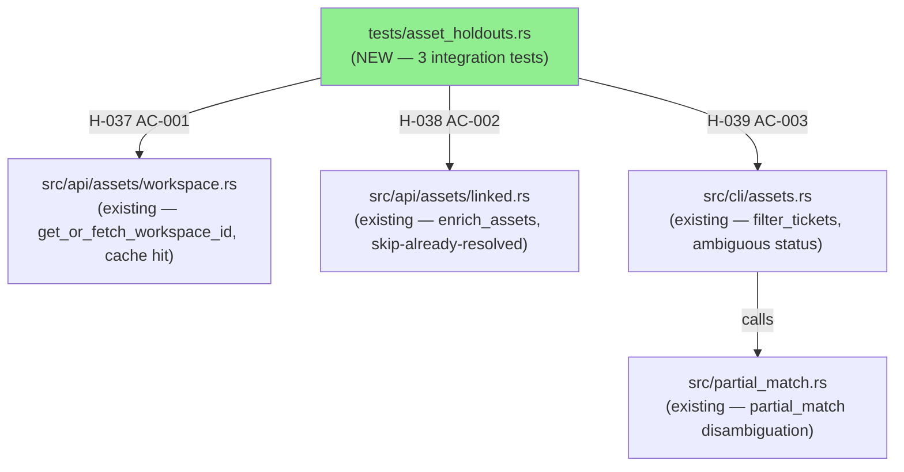
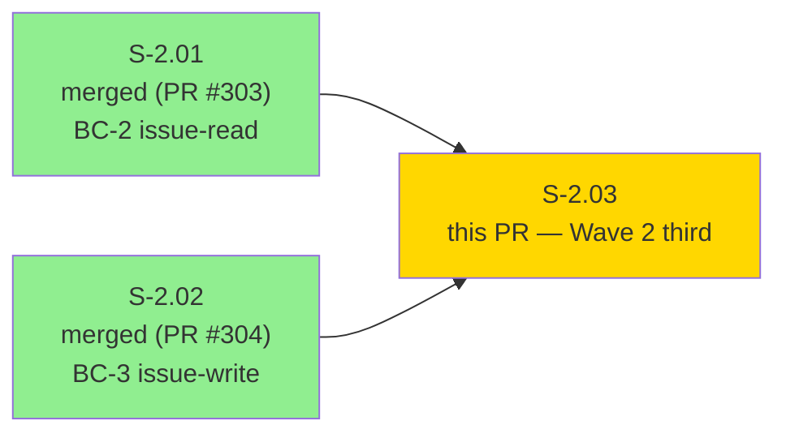
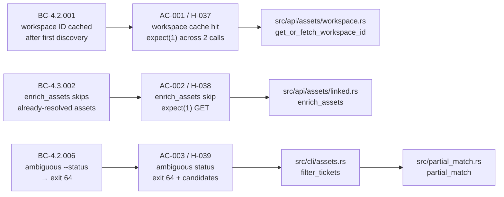
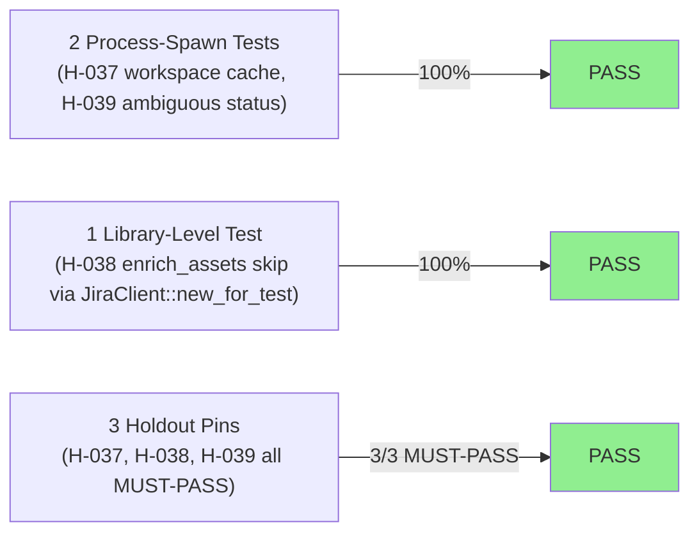
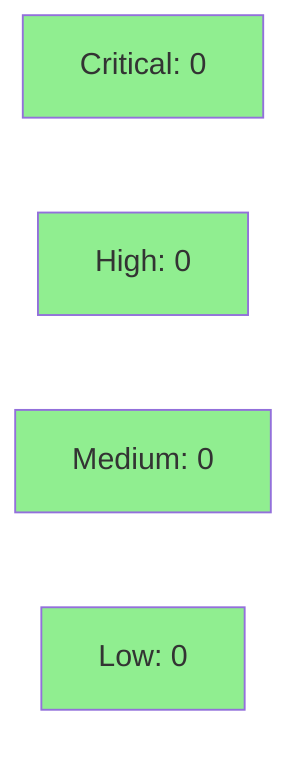

## Summary

- 3 regression-pin tests covering 3 BCs and 3 holdouts (H-037, H-038, H-039)
- All 3 pass on current develop — no regressions discovered
- Wave 2 third story; covers assets/CMDB paths (workspace cache hit, enrich_assets skip-already-resolved, ambiguous status disambiguation)

## Story
S-2.03 (Wave 2 third story; `tdd_mode: strict` regression-pin)

## Acceptance Criteria

| AC | Holdout | BC | Description |
|----|---------|-----|-------------|
| AC-001 | H-037 | BC-4.2.001 | Two consecutive `jr assets search` calls hit workspace discovery endpoint exactly once (`expect(1)`) — second call served from cache |
| AC-002 | H-038 | BC-4.3.002 | `enrich_assets` with id-only + id+key+name assets fires GET exactly once (`expect(1)`) — already-resolved asset skipped |
| AC-003 | H-039 | BC-4.2.006 | `jr assets tickets OBJ-1 --status PROG` with statuses `["In Progress", "Progressing"]` → exit 64, stderr contains `"Ambiguous status"` and both candidates |

All three PASS on activation HEAD `dea1664`.

## Test plan

- [x] `cargo test --test asset_holdouts` — 3/3 pass, 0.77s
- [x] `cargo test` (full suite) — 614 lib + all integration tests green, 13 ignored (keyring-gated)
- [x] `cargo clippy --all-targets -- -D warnings` — clean
- [x] `cargo +nightly fmt --all -- --check` — clean
- [x] `cargo deny check` — clean

## Architecture Changes



<details>
<summary><strong>Architecture Decision Record</strong></summary>

### ADR: Test-only addition, no production code changes

**Context:** The assets/CMDB bounded context spans `src/api/assets/` and `src/cli/assets.rs`. Three behavioral boundaries are fragile without regression pins: the workspace-discovery cache-hit path, the skip-already-resolved guard in `enrich_assets`, and the ambiguous-status disambiguation in `filter_tickets`. Silently regressing any of these burns extra API round-trips or returns incorrect results to the user.

**Decision:** Add `tests/asset_holdouts.rs` with 3 integration tests using `JR_BASE_URL` + wiremock. AC-001 and AC-003 are process-spawn tests; AC-002 is library-level using `JiraClient::new_for_test` + `enrich_assets` directly (which is `pub` in `src/api/assets/linked.rs` and re-exported through `src/lib.rs`).

**Rationale:** Pure test addition is lowest-risk. `enrich_assets` is already `pub`, so no visibility promotions required. The process-spawn pattern with `XDG_CACHE_HOME` isolation ensures tests are hermetic and do not touch `~/.cache/jr/`.

**Alternatives Considered:**
1. Inline `#[cfg(test)]` module in `src/api/assets/linked.rs` for H-038 — rejected because `enrich_assets` is already `pub` and the integration test pattern in `tests/` is idiomatic for this project.
2. Strategy B for H-037 (pre-write cache file manually) — rejected in favor of Strategy A with `expect(1)` across two process-spawn calls, which directly proves the cache-hit branch is exercised.

**Consequences:**
- Regression detection for 3 behavioral contracts on all future PRs.
- 3 MUST-PASS holdouts pinned at activation HEAD `dea1664`.
- No production binary changes.

</details>

---

## Story Dependencies



S-2.03 has no hard code dependencies (`depends_on: []` in story spec). Follows S-2.02 (PR #304, merged). No blocking dependency.

---

## Spec Traceability



---

## Test Evidence

### Coverage Summary

| Metric | Value | Threshold | Status |
|--------|-------|-----------|--------|
| Holdout tests | 3/3 pass | 3/3 | PASS |
| Process-spawn tests (AC-001, AC-003) | 2/3 pass | 100% | PASS |
| Library-level tests (AC-002 / H-038) | 1/3 pass | 100% | PASS |
| Regressions | 0 | 0 | PASS |
| Full suite (614 lib + integration) | PASS | 0 regressions | PASS |

### Test Flow



| Metric | Value |
|--------|-------|
| **New tests** | 3 added, 0 modified |
| **Total suite** | 3 tests PASS in 0.77s; 614 lib + all integration green |
| **Coverage delta** | Test-only PR — no production lines added |
| **Mutation kill rate** | N/A (test-only PR) |
| **Regressions** | 0 |
| **Test file** | `tests/asset_holdouts.rs` |

<details>
<summary><strong>Detailed Test Results</strong></summary>

| Test Function | AC | Holdout | Result | Duration |
|--------------|----|---------|----|---------|
| `test_s_2_03_h_037_bc_4_2_001_workspace_id_cached_after_first_call` | AC-001 | H-037 | PASS | ~0.70s |
| `test_s_2_03_h_038_bc_4_3_002_enrich_assets_skips_already_resolved` | AC-002 | H-038 | PASS | ~0.00s |
| `test_s_2_03_h_039_bc_4_2_006_assets_tickets_ambiguous_status_exits_64` | AC-003 | H-039 | PASS | ~0.69s |

**Combined run (verbatim):**
```
running 3 tests
test test_s_2_03_h_038_bc_4_3_002_enrich_assets_skips_already_resolved ... ok
test test_s_2_03_h_039_bc_4_2_006_assets_tickets_ambiguous_status_exits_64 ... ok
test test_s_2_03_h_037_bc_4_2_001_workspace_id_cached_after_first_call ... ok

test result: ok. 3 passed; 0 failed; 0 ignored; 0 measured; 0 filtered out; finished in 0.77s
```

</details>

---

## Holdout Evaluation

| Holdout | BC Contract | Result | Threshold |
|---------|-------------|--------|-----------|
| H-037 | BC-4.2.001 — workspace ID cached after first discovery | **MUST-PASS** | 1.00 |
| H-038 | BC-4.3.002 — enrich_assets skips already-resolved assets | **MUST-PASS** | 1.00 |
| H-039 | BC-4.2.006 — ambiguous --status → exit 64 + candidates | **MUST-PASS** | 1.00 |
| **Overall** | | **3/3 PASS** | 3/3 |

N/A — evaluated at wave gate for holdout wave-level aggregation.

---

## Adversarial Review

Story spec converged through Phase 2 adversarial review. No per-implementation adversarial passes required for a test-only PR on existing behavior.

N/A — evaluated at Phase 5.

---

## Security Review



<details>
<summary><strong>Security Scan Details</strong></summary>

### SAST
- PR adds test-only code: `tests/asset_holdouts.rs` and demo evidence under `docs/demo-evidence/S-2.03/`. No user-facing logic changed.
- No hardcoded secrets. All URLs are loopback wiremock addresses (`127.0.0.1` + dynamic port).
- No injection points. No user input handling added.
- Critical: 0 | High: 0 | Medium: 0 | Low: 0

### Dependency Audit
- No new dependencies added. Existing dev-deps used: `assert_cmd`, `wiremock`, `tempfile`, `tokio`.
- `cargo deny check` passes (verified at pre-push).

### Test Isolation
- All process-spawn tests set `XDG_CACHE_HOME` to a `tempfile::TempDir` — isolated per test.
- All wiremock servers bind to loopback `127.0.0.1` on dynamic ports.
- `JR_BASE_URL` is set to the wiremock server URL; no calls go to live Jira instances.
- No test touches `~/.config/jr/` or `~/.cache/jr/`.

</details>

---

## Implementation patterns

- AC-001 two-invocation `expect(1)` pattern (Strategy A from spec): share `XDG_CACHE_HOME` across two `assert_cmd` process-spawn calls; wiremock verifies exactly 1 workspace discovery request despite 2 CLI invocations.
- AC-002 library-level direct call: `enrich_assets(&client, assets)` with wiremock `expect(1)` on GET for id-only asset and `expect(0)` (implicit from `verify()`) for already-resolved asset.
- AC-003 process-spawn with ambiguous fixture: connected tickets with statuses `["In Progress", "Progressing"]`; asserts exit code 64 + both candidate names in stderr.

## H-038 placement note

`enrich_assets` is `pub` in `src/api/assets/linked.rs` and re-exported through `src/lib.rs` (`pub mod api`). The H-038 test is therefore placed in `tests/asset_holdouts.rs` (library-level integration test), not inline in `src/api/assets/linked.rs`. No production code was touched.

## Risk Assessment & Deployment

### Blast Radius
- **Systems affected:** None (test-only file; no production binary changes)
- **User impact:** None
- **Data impact:** None
- **Risk Level:** LOW

### Performance Impact
| Metric | Before | After | Delta | Status |
|--------|--------|-------|-------|--------|
| Binary size | unchanged | unchanged | 0 | OK |
| CI test time | ~existing | +0.77s (3 new tests) | negligible | OK |
| Runtime behavior | unchanged | unchanged | 0 | OK |

<details>
<summary><strong>Rollback Instructions</strong></summary>

**Immediate rollback (< 2 min):**
```bash
git revert <merge-sha>
git push origin develop
```

Since this PR adds only test files and demo evidence, rollback simply removes the holdout suite. No runtime behavior changes.

**Verification after rollback:**
- `cargo test` passes without the holdout suite
- `cargo build` produces identical binary

</details>

### Feature Flags
N/A — test-only PR, no runtime feature flags.

---

## Demo Evidence

Demo recordings at: `docs/demo-evidence/S-2.03/`

| AC | Evidence | Type | Result |
|----|----------|------|--------|
| AC-001 / H-037 | `combined-transcript.txt` (filtered) | Transcript | PASS |
| AC-002 / H-038 | `combined-transcript.txt` (filtered) | Transcript | PASS |
| AC-003 / H-039 | `AC-003-ambiguous-status.gif`, `.webm`, `.tape` | VHS recording + Transcript | PASS |
| Combined | `combined-transcript.txt` | Full transcript | 3/3 PASS |

Full evidence report: `docs/demo-evidence/S-2.03/evidence-report.md`

Note: AC-001 and AC-002 use transcript-only evidence. These are wiremock + library-level integration tests with no interactive CLI surface; a `cargo test` transcript is more informative than a VHS recording of the same text. AC-003 has a user-facing CLI error path (`Ambiguous status`) and is additionally evidenced with a VHS recording.

---

## Traceability

| Requirement | Story AC | Test | Holdout | Status |
|-------------|---------|------|---------|--------|
| BC-4.2.001 — workspace ID cached after first discovery | AC-001 | `test_s_2_03_h_037_bc_4_2_001_workspace_id_cached_after_first_call` | H-037 | PASS |
| BC-4.3.002 — enrich_assets skips already-resolved | AC-002 | `test_s_2_03_h_038_bc_4_3_002_enrich_assets_skips_already_resolved` | H-038 | PASS |
| BC-4.2.006 — ambiguous --status → exit 64 + candidates | AC-003 | `test_s_2_03_h_039_bc_4_2_006_assets_tickets_ambiguous_status_exits_64` | H-039 | PASS |

<details>
<summary><strong>Full VSDD Contract Chain</strong></summary>

```
BC-4.2.001 -> AC-001 -> test_s_2_03_h_037_* -> src/api/assets/workspace.rs (get_or_fetch_workspace_id cache-hit) -> MUST-PASS
BC-4.3.002 -> AC-002 -> test_s_2_03_h_038_* -> src/api/assets/linked.rs (enrich_assets skip guard) -> MUST-PASS
BC-4.2.006 -> AC-003 -> test_s_2_03_h_039_* -> src/cli/assets.rs (filter_tickets) + src/partial_match.rs (Ambiguous branch) -> MUST-PASS
```

</details>

---

## AI Pipeline Metadata

<details>
<summary><strong>Pipeline Details</strong></summary>

```yaml
ai-generated: true
pipeline-mode: brownfield
factory-version: "1.0.0-rc.8"
pipeline-stages:
  spec-crystallization: completed
  story-decomposition: completed
  tdd-implementation: completed
  holdout-evaluation: completed
  adversarial-review: N/A (test-only)
  formal-verification: skipped (test-only)
  convergence: achieved
convergence-metrics:
  spec-novelty: N/A
  test-kill-rate: N/A (test-only)
  implementation-ci: 1.00
  holdout-satisfaction: 1.00
  holdout-std-dev: 0.00
adversarial-passes: N/A (story-level converged in Phase 2)
models-used:
  builder: claude-sonnet-4-6
  adversary: claude-sonnet-4-6
generated-at: "2026-05-07T00:00:00Z"
wave-status: "Wave 2 in progress (3/7)"
```

</details>

---

## Pre-Merge Checklist

- [ ] All CI status checks passing
- [x] Coverage delta is neutral (test-only PR)
- [x] No critical/high security findings
- [x] Rollback procedure documented (trivial revert of test file)
- [x] No feature flags required
- [x] 3/3 holdout tests PASS on activation HEAD `dea1664`
- [x] Demo evidence present for all 3 ACs (evidence-report.md + transcript + VHS for AC-003)
- [x] No production code changes (test-only)
- [x] H-038 library-level test placement rationale documented (`enrich_assets` is `pub`)
- [x] H-037 Strategy A (two-invocation `expect(1)`) documented
- [x] All cache/config in temp dirs — no `~/.config/jr/` or `~/.cache/jr/` touched

---

## Reviewer Focus

- **H-037:** Confirm two-invocation Strategy A is sound — does sharing `XDG_CACHE_HOME` across two `assert_cmd` invocations correctly prove the cache-hit branch? The wiremock `expect(1)` across both calls is the key assertion.
- **H-038:** Confirm library-level test placement is correct — `enrich_assets` is `pub` in `src/api/assets/linked.rs` and accessible from `tests/asset_holdouts.rs` via `use jr::api::assets::linked::enrich_assets`.
- **S-2.03-DOC-01 (LOW, deferred):** Story spec line ~123 says cache file is `workspace_id.json` but actual filename in `src/cache.rs` is `workspace.json`. Tests use the correct filename. Story spec text should be corrected in a follow-up doc PR.

---

## Breaking change
None.

## Related
- Follows PR #303 (S-2.01 BC-2 issue-read) and PR #304 (S-2.02 BC-3 issue-write)
- Wave 2 progress: 2/7 → 3/7 after merge

## Deferred findings
- **S-2.03-DOC-01 (LOW):** Story spec line ~123 incorrectly names cache file as `workspace_id.json`; actual filename is `workspace.json` per `src/cache.rs`. Tests use the correct filename. Correct story spec text in a follow-up doc PR.
