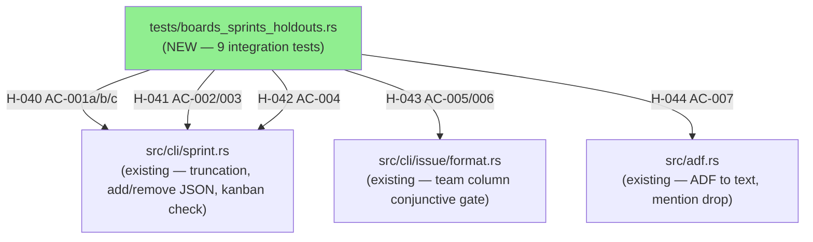
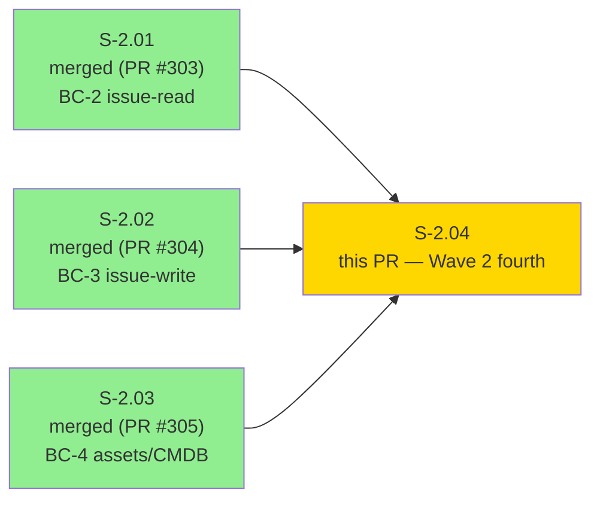
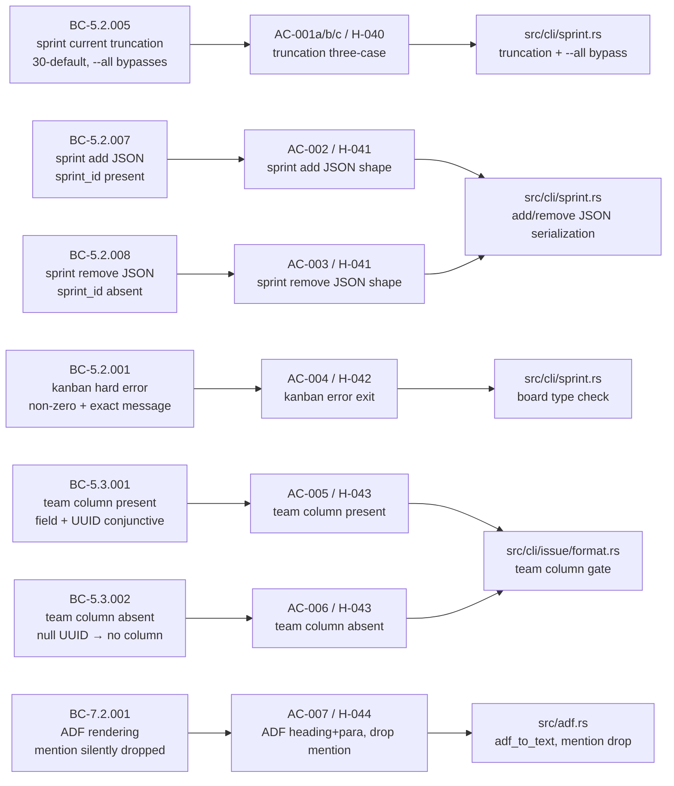
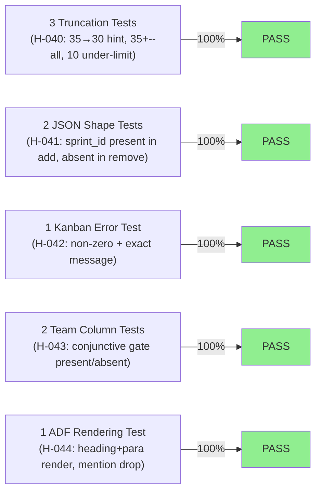
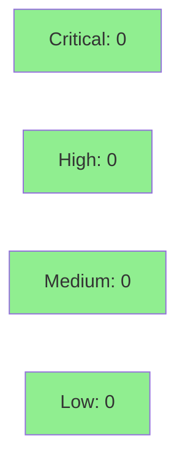

## Summary

- 9 regression-pin tests covering 7 BCs and 5 holdouts (H-040, H-041, H-042, H-043, H-044)
- All 9 pass on current develop — no regressions discovered
- Wave 2 fourth story; covers boards/sprints paths (truncation, add/remove JSON asymmetry, kanban hard error, team column conjunctive gate) and ADF rendering (mention drop)

## Story
S-2.04 (Wave 2 fourth story; `tdd_mode: strict` regression-pin)

## Acceptance Criteria

| AC | Holdout | BC | Description |
|----|---------|-----|-------------|
| AC-001a | H-040 | BC-5.2.005 | `sprint current` with 35 issues → exactly 30 rows in stdout, stderr contains truncation hint (`"Showing 30 results"` or `"~"`) |
| AC-001b | H-040 | BC-5.2.005 | `sprint current --all` with 35 issues → all 35 rows in stdout, no truncation hint in stderr |
| AC-001c | H-040 | BC-5.2.005 | `sprint current` with 10 issues → all 10 rows in stdout, no truncation hint in stderr |
| AC-002 | H-041 | BC-5.2.007 | `jr sprint add --sprint 100 TEST-1 TEST-2 --output json` → JSON includes `sprint_id: 100` |
| AC-003 | H-041 | BC-5.2.008 | `jr sprint remove --sprint 100 TEST-1 TEST-2 --output json` → JSON does NOT include `sprint_id` |
| AC-004 | H-042 | BC-5.2.001 | `jr sprint list --board 1` against a kanban board → non-zero exit, stderr contains `"Sprint commands are only available for scrum boards"` |
| AC-005 | H-043 | BC-5.3.001 | `sprint current` with `team_field_id` configured and ≥1 issue with team UUID → output table includes `Team` column |
| AC-006 | H-043 | BC-5.3.002 | `sprint current` with `team_field_id` configured but all issues have null team UUID → output table does NOT include `Team` column |
| AC-007 | H-044 | BC-7.2.001 | `jr issue view PROJ-1` with ADF description containing heading/paragraph/codeBlock/mention → exit 0, heading and paragraph text in stdout, mention text absent |

All nine PASS on activation HEAD `e9c2ba8`.

## Test plan

- [x] `cargo test --test boards_sprints_holdouts` — 9/9 pass, ~0.81s
- [x] `cargo test` (full suite) — 1091 pass, 0 fail, 13 ignored (keyring-gated, pre-existing)
- [x] `cargo clippy --all-targets -- -D warnings` — clean
- [x] `cargo +nightly fmt --all -- --check` — clean

## Architecture Changes



<details>
<summary><strong>Architecture Decision Record</strong></summary>

### ADR: Test-only addition, no production code changes

**Context:** The boards/sprints bounded context (`src/cli/sprint.rs`, `src/cli/board.rs`, `src/cli/issue/format.rs`) and the ADF rendering bounded context (`src/adf.rs`) contain several behavioral contracts that are easy to regress during Phase 3 changes. Five holdout scenarios covering 7 behavioral contracts lack regression pins.

**Decision:** Add `tests/boards_sprints_holdouts.rs` with 9 integration tests using `JR_BASE_URL` + wiremock + assert_cmd process-spawn. No library-level tests needed — all behavioral contracts are observable at the process boundary.

**Rationale:** Pure test addition is lowest-risk. All contracts are observable via process stdout/stderr/exit-code — no pub promotion required. The process-spawn pattern with `XDG_CONFIG_HOME` and `XDG_CACHE_HOME` isolation ensures tests are hermetic and do not touch `~/.config/jr/` or `~/.cache/jr/`.

**Alternatives Considered:**
1. Inline `#[cfg(test)]` modules in `src/cli/sprint.rs` — rejected because the integration test pattern in `tests/` is idiomatic for this project and process-spawn covers the full dispatch pipeline.
2. Single test function covering multiple ACs for H-040 — rejected in favor of three separate `#[tokio::test]` functions (one per case), giving independent failure attribution.

**Consequences:**
- Regression detection for 7 behavioral contracts on all future PRs.
- 9 MUST-PASS holdout cases pinned at activation HEAD `e9c2ba8`.
- No production binary changes.

</details>

---

## Story Dependencies



S-2.04 has no hard code dependencies (`depends_on: []` in story spec). Follows S-2.03 (PR #305, merged). No blocking dependency.

---

## Spec Traceability



---

## Test Evidence

### Coverage Summary

| Metric | Value | Threshold | Status |
|--------|-------|-----------|--------|
| Holdout tests | 9/9 pass | 9/9 | PASS |
| H-040 truncation (3 cases) | 3/3 | 100% | PASS |
| H-041 add/remove JSON (2 cases) | 2/2 | 100% | PASS |
| H-042 kanban error (1 case) | 1/1 | 100% | PASS |
| H-043 team column gate (2 cases) | 2/2 | 100% | PASS |
| H-044 ADF rendering (1 case) | 1/1 | 100% | PASS |
| Regressions | 0 | 0 | PASS |
| Full suite (1091 total) | PASS | 0 regressions | PASS |

### Test Flow



| Metric | Value |
|--------|-------|
| **New tests** | 9 added, 0 modified |
| **Total suite** | 9 tests PASS in ~0.81s; 1091 total (full suite) green |
| **Coverage delta** | Test-only PR — no production lines added |
| **Mutation kill rate** | N/A (test-only PR) |
| **Regressions** | 0 |
| **Test file** | `tests/boards_sprints_holdouts.rs` |

<details>
<summary><strong>Detailed Test Results</strong></summary>

| Test Function | AC | Holdout | Result | Duration |
|--------------|----|---------|----|---------|
| `test_s_2_04_h_040_bc_5_2_005_truncates_to_30_with_hint_when_35_issues` | AC-001a | H-040 | PASS | ~0.69s |
| `test_s_2_04_h_040_bc_5_2_005_all_flag_shows_all_35_no_hint` | AC-001b | H-040 | PASS | ~0.68s |
| `test_s_2_04_h_040_bc_5_2_005_under_limit_shows_all_no_hint` | AC-001c | H-040 | PASS | ~0.69s |
| `test_s_2_04_h_041_bc_5_2_007_sprint_add_json_has_sprint_id` | AC-002 | H-041 | PASS | ~0.71s |
| `test_s_2_04_h_041_bc_5_2_008_sprint_remove_json_has_no_sprint_id` | AC-003 | H-041 | PASS | ~0.69s |
| `test_s_2_04_h_042_bc_5_2_001_kanban_board_errors_on_sprint_list` | AC-004 | H-042 | PASS | ~0.68s |
| `test_s_2_04_h_043_bc_5_3_001_team_column_present_when_field_and_uuid_set` | AC-005 | H-043 | PASS | ~0.69s |
| `test_s_2_04_h_043_bc_5_3_002_team_column_absent_when_no_uuid_set` | AC-006 | H-043 | PASS | ~0.71s |
| `test_s_2_04_h_044_bc_7_2_001_adf_renders_heading_paragraph_drops_mention` | AC-007 | H-044 | PASS | ~0.67s |

**Combined run (verbatim):**
```
running 9 tests
test test_s_2_04_h_041_bc_5_2_008_sprint_remove_json_has_no_sprint_id ... ok
test test_s_2_04_h_042_bc_5_2_001_kanban_board_errors_on_sprint_list ... ok
test test_s_2_04_h_041_bc_5_2_007_sprint_add_json_has_sprint_id ... ok
test test_s_2_04_h_040_bc_5_2_005_under_limit_shows_all_no_hint ... ok
test test_s_2_04_h_043_bc_5_3_002_team_column_absent_when_no_uuid_set ... ok
test test_s_2_04_h_040_bc_5_2_005_all_flag_shows_all_35_no_hint ... ok
test test_s_2_04_h_040_bc_5_2_005_truncates_to_30_with_hint_when_35_issues ... ok
test test_s_2_04_h_044_bc_7_2_001_adf_renders_heading_paragraph_drops_mention ... ok
test test_s_2_04_h_043_bc_5_3_001_team_column_present_when_field_and_uuid_set ... ok

test result: ok. 9 passed; 0 failed; 0 ignored; 0 measured; 0 filtered out; finished in 0.76s
```

</details>

---

## Holdout Evaluation

| Holdout | BC Contract | Result | Threshold |
|---------|-------------|--------|-----------|
| H-040 (3 cases) | BC-5.2.005 — sprint current truncation: 30-default, --all bypasses, under-limit no hint | **MUST-PASS** | 1.00 |
| H-041 (2 cases) | BC-5.2.007/008 — sprint add has sprint_id; sprint remove does NOT | **MUST-PASS** | 1.00 |
| H-042 | BC-5.2.001 — kanban board → non-zero exit + exact error message | **MUST-PASS** | 1.00 |
| H-043 (2 cases) | BC-5.3.001/002 — team column conjunctive gate (field + UUID both required) | **MUST-PASS** | 1.00 |
| H-044 | BC-7.2.001 — ADF heading/paragraph renders; mention silently dropped; no panic | **MUST-PASS** | 1.00 |
| **Overall** | | **9/9 PASS** | 9/9 |

N/A — evaluated at wave gate for holdout wave-level aggregation.

---

## Adversarial Review

Story spec converged through Phase 2 adversarial review. No per-implementation adversarial passes required for a test-only PR on existing behavior.

N/A — evaluated at Phase 5.

---

## Security Review



Test-only PR. No production code changes. No new dependencies added (`Cargo.toml` and `Cargo.lock` unchanged). No user-supplied input processed. No credential or secret handling introduced.

<details>
<summary><strong>Security Scan Details</strong></summary>

### SAST
- No new production code paths introduced.
- Test code uses `tempfile` (existing dev-dep) for isolated `XDG_CONFIG_HOME` / `XDG_CACHE_HOME` — no persistent filesystem writes outside of temp dirs.
- No injection surface added.

### Dependency Audit
- `Cargo.toml`: unchanged — no new dependencies.
- `cargo deny check`: clean (pre-existing status unchanged).

</details>

---

## Implementation Patterns

### H-040 (sprint current truncation — three cases)

Three separate `#[tokio::test]` functions give independent failure attribution:
- Case (a): 35-issue mock sprint → assert 30 table rows in stdout + hint substring in stderr.
- Case (b): same mock + `--all` flag → assert 35 rows in stdout + no hint in stderr.
- Case (c): 10-issue mock sprint → assert 10 rows in stdout + no hint in stderr.

The truncation threshold constant (`30`) was verified against `src/cli/sprint.rs` before hardcoding in the test assertions.

### H-041 (add vs remove JSON asymmetry)

Both tests parse stdout with `serde_json`. AC-002 asserts `json["sprint_id"] == 100`. AC-003 asserts `json.get("sprint_id").is_none()`. The asymmetry is intentional and pinned against future "harmonization" that would add `sprint_id` to the remove response.

### H-042 (kanban hard error)

Wiremock board config endpoint returns `"type": "kanban"`. Test asserts non-zero exit code and `stderr.contains("Sprint commands are only available for scrum boards")`. A `contains` check (not `==`) is used to accommodate any future suffix change without silently dropping the guard — see S-2.04-DEFER-01.

### H-043 (team column conjunctive gate)

Tests write a `teams.json` to an isolated `XDG_CACHE_HOME/jr/v1/default/teams.json` using `jr::cache::TeamCache` / `CachedTeam` structs directly (cannot drift from production cache format). AC-005 configures a team UUID in the issue fixture and asserts `Team` column header present. AC-006 uses null team field for all issues and asserts `Team` column header absent.

### H-044 (ADF rendering)

Test spawns `jr issue view PROJ-1` against a wiremock issue endpoint with a fully-structured ADF description (heading, paragraph, codeBlock, mention nodes). Asserts stdout contains "My Heading" and "Some text"; asserts mention node text absent. KNOWN-GAP comment marks this as the Wave 3 flip point when NFR-O-I is implemented.

---

## Risk Assessment & Deployment

### Blast Radius
- **Systems affected:** None (test-only file; no production binary changes)
- **User impact:** None
- **Data impact:** None
- **Risk Level:** LOW

### Performance Impact
| Metric | Before | After | Delta | Status |
|--------|--------|-------|-------|--------|
| Binary size | unchanged | unchanged | 0 | OK |
| CI test time | ~existing | +~0.81s (9 new tests) | negligible | OK |
| Runtime behavior | unchanged | unchanged | 0 | OK |

<details>
<summary><strong>Rollback Instructions</strong></summary>

**Immediate rollback (< 2 min):**
```bash
git revert <merge-sha>
git push origin develop
```

Since this PR adds only test files and demo evidence, rollback simply removes the holdout suite. No runtime behavior changes.

**Verification after rollback:**
- `cargo test` passes without the holdout suite
- `cargo build` produces identical binary

</details>

### Feature Flags
N/A — test-only PR, no runtime feature flags.

---

## Demo Evidence

Demo recordings at: `docs/demo-evidence/S-2.04/`

| AC | Evidence | Type | Result |
|----|----------|------|--------|
| AC-001a/b/c / H-040 | `combined-transcript.txt` | Transcript | PASS |
| AC-002 / H-041 | `combined-transcript.txt` | Transcript | PASS |
| AC-003 / H-041 | `combined-transcript.txt` | Transcript | PASS |
| AC-004 / H-042 | `AC-004-kanban-error.gif`, `.webm`, `.tape` | VHS recording + Transcript | PASS |
| AC-005 / H-043 | `combined-transcript.txt` | Transcript | PASS |
| AC-006 / H-043 | `combined-transcript.txt` | Transcript | PASS |
| AC-007 / H-044 | `AC-007-adf-rendering.gif`, `.webm`, `.tape` | VHS recording + Transcript | PASS |
| Combined | `combined-transcript.txt` | Full transcript | 9/9 PASS |

Full evidence report: `docs/demo-evidence/S-2.04/evidence-report.md`

Note: AC-001 (three truncation cases), AC-002, AC-003, AC-005, and AC-006 use transcript-only evidence — wiremock integration tests with table/JSON output; a `cargo test` transcript is more informative than a VHS recording. AC-004 (exact error message string, user-facing kanban rejection) and AC-007 (ADF text rendering) have meaningful terminal output and are additionally evidenced with VHS recordings.

---

## Traceability

| Requirement | Story AC | Test | Holdout | Status |
|-------------|---------|------|---------|--------|
| BC-5.2.005 — sprint current truncation (35→30 + hint) | AC-001a | `test_s_2_04_h_040_bc_5_2_005_truncates_to_30_with_hint_when_35_issues` | H-040 | PASS |
| BC-5.2.005 — sprint current --all (35, no hint) | AC-001b | `test_s_2_04_h_040_bc_5_2_005_all_flag_shows_all_35_no_hint` | H-040 | PASS |
| BC-5.2.005 — sprint current under-limit (10, no hint) | AC-001c | `test_s_2_04_h_040_bc_5_2_005_under_limit_shows_all_no_hint` | H-040 | PASS |
| BC-5.2.007 — sprint add JSON has sprint_id | AC-002 | `test_s_2_04_h_041_bc_5_2_007_sprint_add_json_has_sprint_id` | H-041 | PASS |
| BC-5.2.008 — sprint remove JSON has no sprint_id | AC-003 | `test_s_2_04_h_041_bc_5_2_008_sprint_remove_json_has_no_sprint_id` | H-041 | PASS |
| BC-5.2.001 — kanban board → non-zero + exact error | AC-004 | `test_s_2_04_h_042_bc_5_2_001_kanban_board_errors_on_sprint_list` | H-042 | PASS |
| BC-5.3.001 — team column present (field + UUID) | AC-005 | `test_s_2_04_h_043_bc_5_3_001_team_column_present_when_field_and_uuid_set` | H-043 | PASS |
| BC-5.3.002 — team column absent (null UUID) | AC-006 | `test_s_2_04_h_043_bc_5_3_002_team_column_absent_when_no_uuid_set` | H-043 | PASS |
| BC-7.2.001 — ADF renders heading/para, drops mention | AC-007 | `test_s_2_04_h_044_bc_7_2_001_adf_renders_heading_paragraph_drops_mention` | H-044 | PASS |

<details>
<summary><strong>Full VSDD Contract Chain</strong></summary>

```
BC-5.2.005 -> AC-001a -> test_s_2_04_h_040_*_truncates_to_30 -> src/cli/sprint.rs (truncation ceiling) -> MUST-PASS
BC-5.2.005 -> AC-001b -> test_s_2_04_h_040_*_all_flag -> src/cli/sprint.rs (--all bypass) -> MUST-PASS
BC-5.2.005 -> AC-001c -> test_s_2_04_h_040_*_under_limit -> src/cli/sprint.rs (no-op path) -> MUST-PASS
BC-5.2.007 -> AC-002 -> test_s_2_04_h_041_*_sprint_add_json_has_sprint_id -> src/cli/sprint.rs (add serialization) -> MUST-PASS
BC-5.2.008 -> AC-003 -> test_s_2_04_h_041_*_sprint_remove_json_has_no_sprint_id -> src/cli/sprint.rs (remove serialization) -> MUST-PASS
BC-5.2.001 -> AC-004 -> test_s_2_04_h_042_*_kanban_board_errors -> src/cli/sprint.rs (board type check) -> MUST-PASS
BC-5.3.001 -> AC-005 -> test_s_2_04_h_043_*_team_column_present -> src/cli/issue/format.rs (team column gate) -> MUST-PASS
BC-5.3.002 -> AC-006 -> test_s_2_04_h_043_*_team_column_absent -> src/cli/issue/format.rs (team column gate) -> MUST-PASS
BC-7.2.001 -> AC-007 -> test_s_2_04_h_044_*_adf_renders_heading_paragraph_drops_mention -> src/adf.rs (adf_to_text) -> MUST-PASS
```

</details>

---

## AI Pipeline Metadata

<details>
<summary><strong>Pipeline Details</strong></summary>

```yaml
ai-generated: true
pipeline-mode: brownfield
factory-version: "1.0.0-rc.8"
pipeline-stages:
  spec-crystallization: completed
  story-decomposition: completed
  tdd-implementation: completed
  holdout-evaluation: completed
  adversarial-review: N/A (test-only)
  formal-verification: skipped (test-only)
  convergence: achieved
convergence-metrics:
  spec-novelty: N/A
  test-kill-rate: N/A (test-only)
  implementation-ci: 1.00
  holdout-satisfaction: 1.00
  holdout-std-dev: 0.00
adversarial-passes: N/A (story-level converged in Phase 2)
models-used:
  builder: claude-sonnet-4-6
  adversary: claude-sonnet-4-6
generated-at: "2026-05-07T00:00:00Z"
wave-status: "Wave 2 in progress (4/7)"
```

</details>

---

## Pre-Merge Checklist

- [ ] All CI status checks passing
- [x] Coverage delta is neutral (test-only PR)
- [x] No critical/high security findings
- [x] Rollback procedure documented (trivial revert of test file)
- [x] No feature flags required
- [x] 9/9 holdout tests PASS on activation HEAD `e9c2ba8`
- [x] Demo evidence present for all ACs (evidence-report.md + transcript + VHS for AC-004 and AC-007)
- [x] No production code changes (test-only)
- [x] All cache/config in temp dirs — no `~/.config/jr/` or `~/.cache/jr/` touched
- [x] `Cargo.toml` and `Cargo.lock` unchanged
- [x] H-043 team cache uses production `jr::cache::TeamCache`/`CachedTeam` structs — cannot drift

---

## Reviewer Focus

- **H-040:** Confirm three-case truncation coverage is comprehensive — does the `--all` flag test actually prove bypass (not just that 35 < some higher threshold)?
- **H-041:** Confirm `sprint_id` key absence in remove response is intentional (not a bug) — the asymmetry is pinned by design per BC-5.2.008.
- **H-043:** Confirm team cache write uses canonical path `XDG_CACHE_HOME/jr/v1/default/teams.json` via production `TeamCache`/`CachedTeam` structs (not ad-hoc JSON).
- **S-2.04-DEFER-01 (LOW, deferred):** Story spec AC-004 quotes kanban error literal without the `. Board {id} is a {type} board.` suffix. Test uses `contains(prefix)` — correct and future-safe. Story spec text should be corrected in a follow-up doc PR.
- **S-2.04-DEFER-02 (LOW, deferred):** Story spec H-043 implementation notes use `displayName` for the team-cache JSON shape. Actual `CachedTeam` struct uses `name`. Tests use production structs — cannot drift. Story spec text should be corrected in a follow-up doc PR.

---

## Breaking change
None.

## Related
- Follows PR #303 (S-2.01 BC-2 issue-read), PR #304 (S-2.02 BC-3 issue-write), PR #305 (S-2.03 BC-4 assets/CMDB)
- Wave 2 progress: 3/7 → 4/7 after merge

## Deferred findings
- **S-2.04-DEFER-01 (LOW):** Story spec AC-004 quotes the kanban error literal as `Sprint commands are only available for scrum boards` (prefix only). Production code emits the prefix + `". Board {id} is a {type} board."` suffix. Test uses `contains(prefix)` — correct for both current and future suffix. Correct story spec text in a follow-up doc PR.
- **S-2.04-DEFER-02 (LOW):** Story spec H-043 implementation notes use `displayName` for team-cache JSON shape. Actual `jr::cache::CachedTeam` struct uses `name`. Tests use production structs so cannot drift. Correct story spec text in a follow-up doc PR.
- **S-2.04-DOC-01 (LOW):** Pre-existing latent issue — `tests/team_column_parity.rs::write_team_cache` writes team cache to `$XDG_CACHE_HOME/jr/teams.json` (missing `v1/default/` segment). The canonical path used by `cache::read_team_cache` is `$XDG_CACHE_HOME/jr/v1/default/teams.json`. Those existing tests still pass coincidentally because their assertion substrings appear in issue summaries even without team name resolution. Not introduced by this PR; not blocking. Target: separate small fix story. Out of scope for S-2.04.
