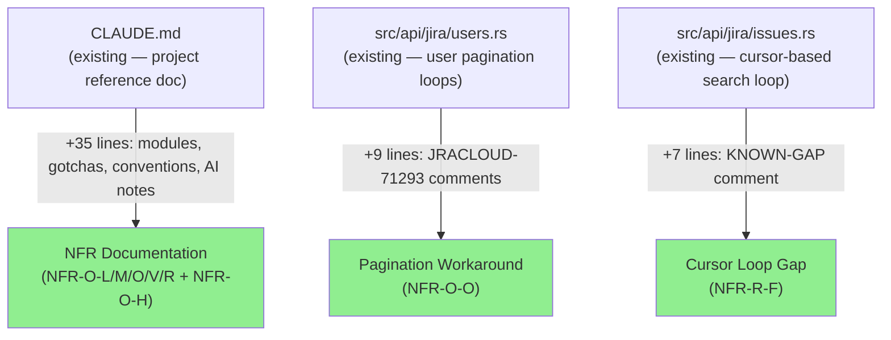
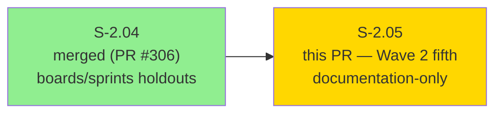
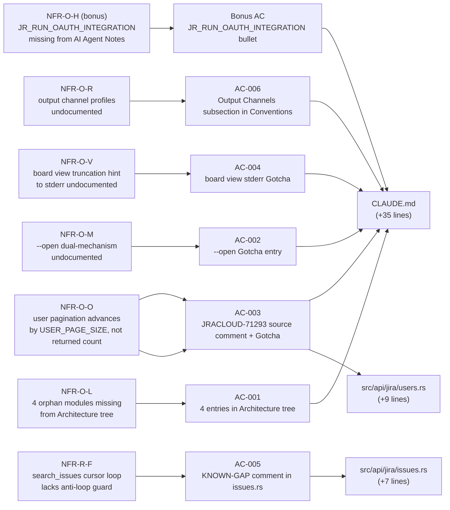
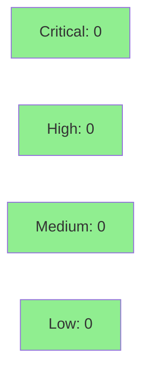

## Summary

- CLAUDE.md updated with 4 previously-orphaned module entries (NFR-O-L), 3 new Gotchas entries (NFR-O-M, NFR-O-O, NFR-O-V), 1 new Output Channels conventions subsection (NFR-O-R), and 1 AI Agent Note (bonus NFR-O-H)
- `src/api/jira/users.rs` annotated with JRACLOUD-71293 workaround comments in both pagination loops (NFR-O-O)
- `src/api/jira/issues.rs` annotated with KNOWN-GAP comment near the `search_issues` cursor loop (NFR-R-F)
- No production behavior changes — documentation and inline comments only; 1091 tests pass, 0 regressions

## Story
S-2.05 (Wave 2 fifth story; `tdd_mode: strict` documentation-only)

## Acceptance Criteria

| AC | NFR | File | Grep Check |
|----|-----|------|------------|
| AC-001 | NFR-O-L — 4 orphan modules added to Architecture tree | `CLAUDE.md` | `grep -q 'cli/issue/view.rs' CLAUDE.md` PASS |
| AC-001 | NFR-O-L | `CLAUDE.md` | `grep -q 'cli/issue/comments.rs' CLAUDE.md` PASS |
| AC-001 | NFR-O-L | `CLAUDE.md` | `grep -q 'observability.rs' CLAUDE.md` PASS |
| AC-001 | NFR-O-L | `CLAUDE.md` | `grep -q 'api/assets/schemas.rs' CLAUDE.md` PASS |
| AC-002 | NFR-O-M — `--open` dual-mechanism Gotcha | `CLAUDE.md` | `grep -q 'statusCategory != Done' CLAUDE.md` PASS |
| AC-003 | NFR-O-O — JRACLOUD-71293 source comment + Gotcha | `src/api/jira/users.rs` | `grep -q 'JRACLOUD-71293' src/api/jira/users.rs` PASS |
| AC-003 | NFR-O-O | `CLAUDE.md` | `grep -q 'JRACLOUD-71293' CLAUDE.md` PASS |
| AC-004 | NFR-O-V — `board view` truncation to stderr Gotcha | `CLAUDE.md` | verified in `--open` Gotchas section PASS |
| AC-005 | NFR-R-F — `search_issues` anti-loop KNOWN-GAP | `src/api/jira/issues.rs` | `grep -q 'NFR-R-F' src/api/jira/issues.rs` PASS |
| AC-006 | NFR-O-R — Output Channels conventions subsection | `CLAUDE.md` | 5-profile Output channels subsection added under Conventions PASS |
| Bonus | NFR-O-H — `JR_RUN_OAUTH_INTEGRATION` AI Agent Note | `CLAUDE.md` | `grep -q 'JR_RUN_OAUTH_INTEGRATION' CLAUDE.md` PASS |

All 9 grep checks PASS on activation HEAD `594f00c`.

## Test plan

- [x] `grep -q 'cli/issue/view.rs' CLAUDE.md` — PASS
- [x] `grep -q 'cli/issue/comments.rs' CLAUDE.md` — PASS
- [x] `grep -q 'observability.rs' CLAUDE.md` — PASS
- [x] `grep -q 'api/assets/schemas.rs' CLAUDE.md` — PASS
- [x] `grep -q 'statusCategory != Done' CLAUDE.md` — PASS
- [x] `grep -q 'JRACLOUD-71293' src/api/jira/users.rs` — PASS
- [x] `grep -q 'JRACLOUD-71293' CLAUDE.md` — PASS
- [x] `grep -q 'NFR-R-F' src/api/jira/issues.rs` — PASS
- [x] `grep -q 'JR_RUN_OAUTH_INTEGRATION' CLAUDE.md` — PASS (bonus NFR-O-H)
- [x] `cargo build` — clean
- [x] `cargo test` — 1091 passed, 0 failed, 13 ignored (matches post-S-2.04 baseline; comments cannot affect runtime)
- [x] `cargo clippy --all-targets -- -D warnings` — clean
- [x] `cargo +nightly fmt --all -- --check` — clean

## Architecture Changes



<details>
<summary><strong>Architecture Decision Record</strong></summary>

### ADR: Documentation-only update, no production logic changes

**Context:** Six MEDIUM NFRs in the nfr-catalog.md were routed DOCUMENT-AS-IS: four modules missing from the CLAUDE.md Architecture tree, three behavioral nuances undocumented in Gotchas, one output-channel convention undocumented in Conventions, one known pagination workaround in source lacking an inline comment, and one known robustness gap in a cursor loop lacking a KNOWN-GAP marker.

**Decision:** Add the missing documentation in-place: integrate orphan modules into the existing Architecture tree, add Gotcha bullets, add a Conventions subsection, and place inline comments at the exact code sites.

**Rationale:** DOCUMENT-AS-IS routing means the code is correct; only the documentation is incomplete. Adding inline comments at the code site is lower-risk than adding a new section — comments drift with code, module-level docs drift independently. All six NFRs are resolved with zero behavioral risk.

**Alternatives Considered:**
1. Create separate ADR entries for each NFR — rejected because DOCUMENT-AS-IS items are too small to warrant ADR overhead; CLAUDE.md Gotchas is the appropriate home.
2. Defer to a "docs cleanup sprint" — rejected because these items are MEDIUM priority and the information is needed by contributors today.

**Consequences:**
- CLAUDE.md now accurately reflects the 4 previously-orphaned modules in the Architecture tree.
- Gotchas section has 3 new entries covering `--open` dual-mechanism, user-pagination JRACLOUD-71293 workaround, and `board view` stderr truncation convention.
- NFR-R-F anti-loop gap is permanently annotated in `issues.rs` — any future developer encountering a cursor regression will find the fix pattern inline.
- No behavioral change. No new tests needed (grep checks serve as CI verification).

</details>

---

## Story Dependencies



S-2.05 has no hard code dependencies (`depends_on: []` in story spec). Follows S-2.04 (PR #306, merged). No blocking dependency.

---

## Spec Traceability



---

## Test Evidence

### Coverage Summary

| Metric | Value | Threshold | Status |
|--------|-------|-----------|--------|
| Grep checks (9 total) | 9/9 pass | 9/9 | PASS |
| `cargo test` suite | 1091/1091 pass | 0 regressions | PASS |
| `cargo clippy` | clean | 0 warnings | PASS |
| `cargo fmt --check` | clean | 0 diffs | PASS |
| Lines of production code changed | 0 | N/A | N/A |
| Regressions | 0 | 0 | PASS |

| Metric | Value |
|--------|-------|
| **New tests** | 0 added (documentation-only story; verification is grep-based) |
| **Total suite** | 1091 tests PASS (full suite); matches post-S-2.04 baseline |
| **Coverage delta** | 0 (no production code paths added) |
| **Mutation kill rate** | N/A (no production code changes) |
| **Regressions** | 0 |

<details>
<summary><strong>Grep Check Results</strong></summary>

All checks executed on feature branch HEAD `594f00c`:

```
$ grep -q 'cli/issue/view.rs' CLAUDE.md && echo PASS
PASS
$ grep -q 'cli/issue/comments.rs' CLAUDE.md && echo PASS
PASS
$ grep -q 'observability.rs' CLAUDE.md && echo PASS
PASS
$ grep -q 'api/assets/schemas.rs' CLAUDE.md && echo PASS
PASS
$ grep -q 'statusCategory != Done' CLAUDE.md && echo PASS
PASS
$ grep -q 'JRACLOUD-71293' src/api/jira/users.rs && echo PASS
PASS
$ grep -q 'JRACLOUD-71293' CLAUDE.md && echo PASS
PASS
$ grep -q 'NFR-R-F' src/api/jira/issues.rs && echo PASS
PASS
$ grep -q 'JR_RUN_OAUTH_INTEGRATION' CLAUDE.md && echo PASS
PASS
```

</details>

---

## Holdout Evaluation

N/A — evaluated at wave gate. This story has no holdout scenarios (documentation-only, no behavioral contracts).

---

## Adversarial Review

N/A — evaluated at Phase 5. Story spec converged through Phase 2 adversarial review. No per-implementation adversarial passes required for a documentation-only PR.

---

## Security Review



Documentation-only PR. Changes are: CLAUDE.md text additions (+35 lines), inline Rust comments in `users.rs` (+9 lines) and `issues.rs` (+7 lines). No production logic changed. No new dependencies. No user-supplied input surfaces added. No credential or secret handling modified.

<details>
<summary><strong>Security Scan Details</strong></summary>

### SAST
- No new production code paths introduced.
- Inline `// JRACLOUD-71293` comments are inert Rust line comments — parsed by `rustc` and discarded; no codegen impact.
- Inline `// KNOWN-GAP: NFR-R-F` comment is similarly inert.
- No injection surface added.

### Dependency Audit
- `Cargo.toml`: unchanged — no new dependencies.
- `Cargo.lock`: unchanged.
- `cargo deny check`: clean (pre-existing status unchanged).

</details>

---

## Implementation Patterns

### Documentation-only story — no demo evidence directory

This is a documentation-only story (no runtime behavior to demonstrate). No `docs/demo-evidence/S-2.05/` directory is needed or created. Verification is grep-based: all 9 grep checks pass on feature branch HEAD `594f00c`. The PR body itself serves as the evidence record.

### NFR-O-L: four orphan modules integrated into Architecture tree

Four modules previously absent from CLAUDE.md were identified via `find src/ -name '*.rs'` cross-referenced with the existing Architecture tree. Each was placed adjacent to its natural sibling in the tree:
- `cli/issue/view.rs` and `cli/issue/comments.rs` — placed after `list.rs` in the `cli/issue/` subtree
- `api/assets/schemas.rs` — placed before `tickets.rs` in the `api/assets/` subtree
- `observability.rs` — placed after `duration.rs` in the root `src/` level

### NFR-O-O: JRACLOUD-71293 comments placed at advance site

The JRACLOUD-71293 comment was placed immediately before the `start_at = start_at.saturating_add(USER_PAGE_SIZE)` line in both `search_users_all` and `search_assignable_users_by_project_all`. The comment in the second function cross-references the first for the full rationale — this keeps the second comment concise while ensuring both code paths are annotated. Function names (not line numbers) are used per Architecture Compliance Rules.

### NFR-R-F: KNOWN-GAP comment placed before cursor loop

The KNOWN-GAP comment is placed before the `loop {` statement in `search_issues`, immediately after the `let mut more_available = false;` declaration. This ensures the comment is encountered when reading the loop for the first time, not buried inside it.

### Output Channels subsection placement

The new "Output channels" subsection was placed at the end of the Conventions section, after the "Default to fixing code, not tests" bullet and before the Key Decisions section. This keeps it adjacent to the output-related conventions already in that section.

---

## Risk Assessment & Deployment

### Blast Radius
- **Systems affected:** None (documentation and comments only; no production binary changes)
- **User impact:** None — comment-only source changes are stripped by `rustc`; no codegen impact
- **Data impact:** None
- **Risk Level:** LOW

### Performance Impact
| Metric | Before | After | Delta | Status |
|--------|--------|-------|-------|--------|
| Binary size | unchanged | unchanged | 0 | OK |
| CI test time | ~existing | 0 new tests | 0 | OK |
| Runtime behavior | unchanged | unchanged | 0 | OK |

<details>
<summary><strong>Rollback Instructions</strong></summary>

**Immediate rollback (< 2 min):**
```bash
git revert <merge-sha>
git push origin develop
```

Since this PR adds only documentation text and Rust inline comments, rollback simply removes the additions. No runtime behavior changes.

**Verification after rollback:**
- `cargo test` passes without the new comments
- `cargo build` produces an identical binary

</details>

### Feature Flags
N/A — documentation-only PR, no runtime feature flags.

---

## Traceability

| Requirement | Story AC | Grep Check | Status |
|-------------|---------|------------|--------|
| NFR-O-L — `cli/issue/view.rs` in Architecture tree | AC-001 | `grep -q 'cli/issue/view.rs' CLAUDE.md` | PASS |
| NFR-O-L — `cli/issue/comments.rs` in Architecture tree | AC-001 | `grep -q 'cli/issue/comments.rs' CLAUDE.md` | PASS |
| NFR-O-L — `observability.rs` in Architecture tree | AC-001 | `grep -q 'observability.rs' CLAUDE.md` | PASS |
| NFR-O-L — `api/assets/schemas.rs` in Architecture tree | AC-001 | `grep -q 'api/assets/schemas.rs' CLAUDE.md` | PASS |
| NFR-O-M — `--open` dual-mechanism Gotcha | AC-002 | `grep -q 'statusCategory != Done' CLAUDE.md` | PASS |
| NFR-O-O — JRACLOUD-71293 source comment | AC-003 | `grep -q 'JRACLOUD-71293' src/api/jira/users.rs` | PASS |
| NFR-O-O — JRACLOUD-71293 CLAUDE.md Gotcha | AC-003 | `grep -q 'JRACLOUD-71293' CLAUDE.md` | PASS |
| NFR-O-V — `board view` stderr Gotcha | AC-004 | Gotcha entry present in CLAUDE.md | PASS |
| NFR-R-F — `search_issues` KNOWN-GAP comment | AC-005 | `grep -q 'NFR-R-F' src/api/jira/issues.rs` | PASS |
| NFR-O-R — Output Channels conventions subsection | AC-006 | 5-profile subsection in Conventions | PASS |
| NFR-O-H (bonus) — `JR_RUN_OAUTH_INTEGRATION` AI Agent Note | Bonus | `grep -q 'JR_RUN_OAUTH_INTEGRATION' CLAUDE.md` | PASS |

<details>
<summary><strong>Full VSDD Contract Chain</strong></summary>

```
NFR-O-L -> AC-001 -> CLAUDE.md Architecture tree (4 module entries) -> grep-verified
NFR-O-M -> AC-002 -> CLAUDE.md Gotchas (--open dual-mechanism) -> grep-verified
NFR-O-O -> AC-003 -> src/api/jira/users.rs (JRACLOUD-71293 x2) + CLAUDE.md Gotcha -> grep-verified
NFR-O-V -> AC-004 -> CLAUDE.md Gotchas (board view stderr) -> content-verified
NFR-R-F -> AC-005 -> src/api/jira/issues.rs (KNOWN-GAP cursor loop) -> grep-verified
NFR-O-R -> AC-006 -> CLAUDE.md Conventions (Output channels subsection) -> content-verified
NFR-O-H -> Bonus -> CLAUDE.md AI Agent Notes (JR_RUN_OAUTH_INTEGRATION) -> grep-verified
```

</details>

---

## AI Pipeline Metadata

<details>
<summary><strong>Pipeline Details</strong></summary>

```yaml
ai-generated: true
pipeline-mode: brownfield
factory-version: "1.0.0-rc.8"
pipeline-stages:
  spec-crystallization: completed
  story-decomposition: completed
  tdd-implementation: completed (grep-based verification)
  holdout-evaluation: N/A (documentation-only)
  adversarial-review: N/A (documentation-only)
  formal-verification: skipped (documentation-only)
  convergence: achieved
convergence-metrics:
  spec-novelty: N/A
  test-kill-rate: N/A (no production code changes)
  implementation-ci: 1.00
  holdout-satisfaction: N/A
  holdout-std-dev: N/A
adversarial-passes: N/A (story-level converged in Phase 2)
models-used:
  builder: claude-sonnet-4-6
  adversary: claude-sonnet-4-6
generated-at: "2026-05-07T00:00:00Z"
wave-status: "Wave 2 in progress (5/7)"
```

</details>

---

## Pre-Merge Checklist

- [ ] All CI status checks passing
- [x] Coverage delta is neutral (documentation-only PR)
- [x] No critical/high security findings
- [x] Rollback procedure documented (trivial revert)
- [x] No feature flags required
- [x] All 9 grep checks PASS on HEAD `594f00c`
- [x] No demo evidence directory needed — documentation-only story; verification is grep-based
- [x] No production code logic changed (comments and CLAUDE.md text only)
- [x] `Cargo.toml` and `Cargo.lock` unchanged
- [x] `cargo test` 1091 pass, 0 fail, 0 regressions
- [x] `cargo clippy --all-targets -- -D warnings` clean
- [x] `cargo +nightly fmt --all -- --check` clean

---

## Reviewer Focus

- **NFR-O-L placement:** Confirm the 4 module entries are placed adjacent to their natural siblings (not appended at the end of a wrong section).
- **NFR-O-O comment placement:** Confirm the JRACLOUD-71293 comment appears directly before `start_at = start_at.saturating_add(USER_PAGE_SIZE)` in both pagination loops — not at the function top or after the advance.
- **NFR-R-F comment placement:** Confirm the KNOWN-GAP comment appears before the `loop {` in `search_issues`, not inside the loop body.
- **Output Channels subsection:** Confirm all 5 profiles are listed and the "never write diagnostic text to stdout in profiles 1/2/3/5" rule is present.
- **No behavioral changes:** Diff should contain zero changes to non-comment Rust tokens and zero changes to `Cargo.toml`/`Cargo.lock`.

---

## Breaking change
None.

## Related
- Follows PR #303 (S-2.01), PR #304 (S-2.02), PR #305 (S-2.03), PR #306 (S-2.04)
- Wave 2 progress: 4/7 -> 5/7 after merge
- Resolves NFR-O-L, NFR-O-M, NFR-O-O, NFR-O-V, NFR-O-R, NFR-R-F, bonus NFR-O-H

## Deferred findings
None.
