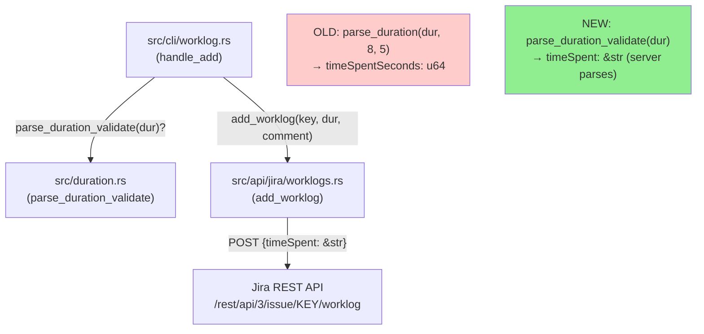
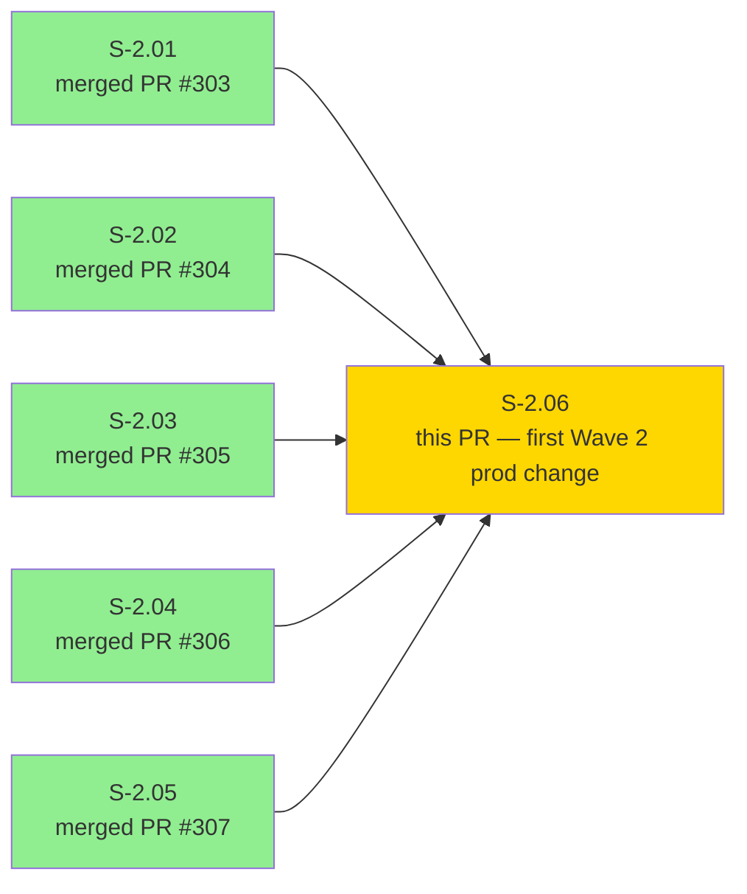
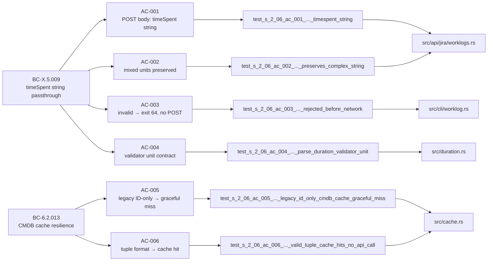
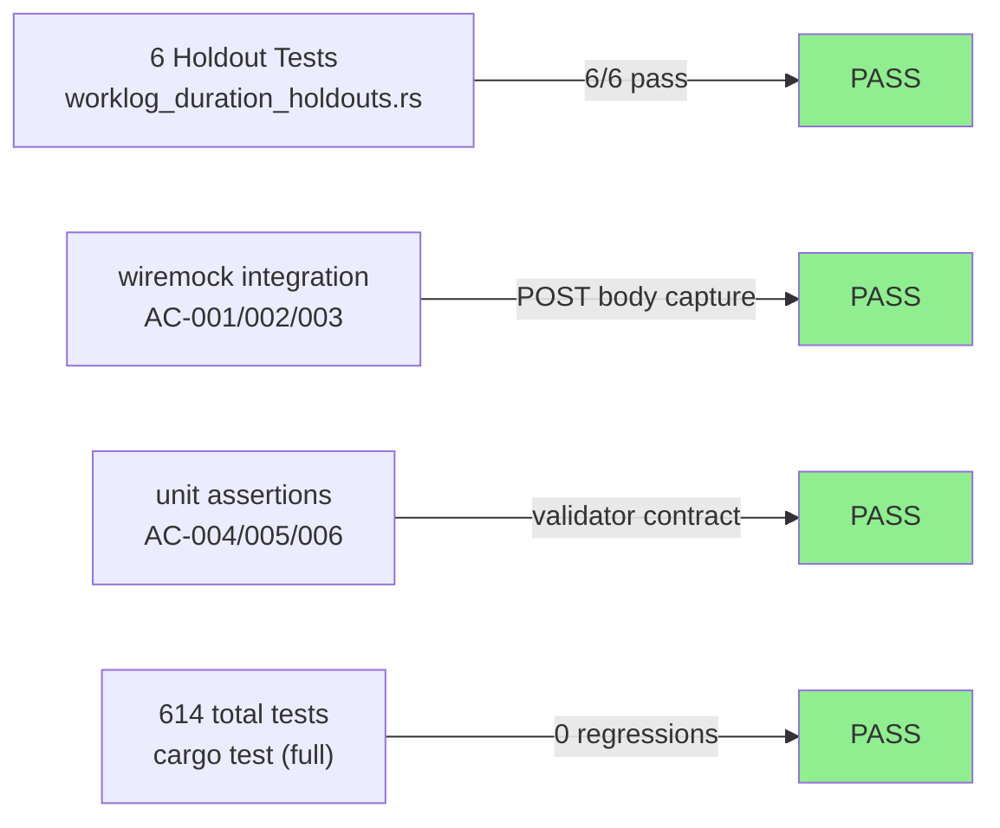
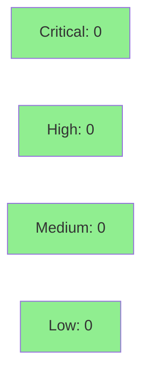

# [S-2.06] Worklog timeSpent server-side parsing (NFR-R-C) and CMDB cache tuple format pin

**Epic:** Wave 2 — Correctness & Observability NFR Sweep
**Mode:** feature (brownfield)
**Convergence:** TDD strict — 6/6 AC tests pass, 614 suite tests pass, 0 regressions


This is the **first Wave 2 PR with actual production code change**. S-2.01 through S-2.04 were regression-pin holdout test suites; S-2.05 was documentation-only. This PR implements a real behavioral fix.

**Part A (NFR-R-C):** The worklog POST body changes from `{"timeSpentSeconds": <integer>}` (computed client-side using hardcoded 8h/day × 5d/week) to `{"timeSpent": "<user-string>"}`. Jira parses the duration string server-side using the instance's own `workingHoursPerDay`/`workingDaysPerWeek` configuration. The v1.0.0 design (admin-only timetracking endpoint fetch + cache + fallback) was blocked by a Perplexity verification pass (2026-05-08) that found three factual errors in that approach — see `.factory/research/S-2.06-jira-timetracking-verification.md`. The v2.0.0 design matches the `ankitpokhrel/jira-cli` (canonical Go Jira CLI) pattern.

**Part B (BC-6.2.013):** Regression-pin tests for the existing CMDB cache graceful-degradation invariant — when `cmdb_fields.json` contains the legacy ID-only format, `read_cmdb_fields_cache` returns `Ok(None)` (cache miss) rather than panicking. No production change for Part B.

> **Wire-protocol note:** This is a subtle breaking change at the wire level (`timeSpentSeconds` integer → `timeSpent` string), invisible to end users. End-user behavior is strictly better: worklog durations are now correct on non-standard Jira instances (7.5h/day, 4-day-week). The CLI invocation (`jr worklog add KEY "1d"`) is unchanged.

---

## Architecture Changes



<details>
<summary><strong>Architecture Decision Record</strong></summary>

### ADR: v2.0.0 pivot — timeSpent string passthrough instead of timetracking config fetch

**Context:** The v1.0.0 design (S-2.06 spec v1.0.0) proposed fetching `GET /rest/api/3/configuration/timetracking` to obtain `hoursPerDay`/`daysPerWeek` for client-side duration math. A Perplexity verification pass on 2026-05-08 found three blocking errors:

1. Wrong endpoint: `GET /rest/api/3/configuration/timetracking` returns the active time-tracking provider name/key, NOT working-hours config. The correct endpoint is `/rest/api/3/configuration/timetracking/options`.
2. Wrong field names and types: documented fields are `workingHoursPerDay`/`workingDaysPerWeek` (floats, e.g. 7.6/5.5), not `hoursPerDay`/`daysPerWeek` (integers).
3. Admin-only: both endpoints require "Administer Jira" global permission. Non-admin users receive 403 regardless of OAuth scope. Typical `jr` users are not admins.

**Decision:** Forward the user's duration string directly to the worklog POST as `timeSpent` (string). Jira parses it server-side using the instance's own configured hours/days. `parse_duration` is downgraded from a calculator to `parse_duration_validate` — a syntactic validator that confirms the input matches Jira's accepted format (`Nw Nd Nh Nm`) before making any network call.

**Rationale:** This is the same pattern used by `ankitpokhrel/jira-cli` (canonical Go Jira CLI), eliminating admin-permission dependency, removing client-side arithmetic, and ensuring correctness on all Jira Cloud instances regardless of their configured working hours.

**Alternatives Considered:**
1. v1.0.0: Fetch timetracking config, cache it, fall back to 8h/5d — rejected because endpoint is admin-only, field names/types were wrong in the original spec, and caching admin-only data creates a privilege-escalation edge case.
2. Parse server's `timeSpentSeconds` field from the worklog response and compare — rejected because it solves the display problem but not the input correctness problem.

**Consequences:**
- No new files in `src/api/jira/` — `timetracking.rs` is permanently cancelled.
- No new cache entries — timetracking config cache is permanently cancelled.
- `add_worklog` signature change: `time_spent_seconds: u64` → `time_spent: &str` (call-site update in `worklog.rs` included in same commit).
- `parse_duration` original calculator function preserved with `SUPERSEDED-BY: parse_duration_validate (S-2.06)` comment for `format_duration` round-trip proptest continuity.

</details>

---

## Story Dependencies



S-2.06 `depends_on: []` in story spec — independent of all other Wave 2 stories. All prior Wave 2 PRs are merged. No blockers.

---

## Spec Traceability



---

## Test Evidence

### Coverage Summary

| Metric | Value | Threshold | Status |
|--------|-------|-----------|--------|
| Holdout tests (new) | 6/6 pass | 100% | PASS |
| Full suite | 614/614 pass | 100% | PASS |
| Ignored (keyring) | 13 | expected | OK |
| Regressions | 0 | 0 | PASS |
| clippy warnings | 0 | 0 | PASS |

### Test Flow



| Metric | Value |
|--------|-------|
| **New tests** | 6 added (worklog_duration_holdouts.rs), 1 modified (worklog_commands.rs::test_add_worklog) |
| **Total suite** | 614 tests PASS (cargo test) |
| **Regressions** | 0 |

<details>
<summary><strong>Detailed Test Results</strong></summary>

### New Tests (This PR)

| Test | Result | Type |
|------|--------|------|
| `test_s_2_06_ac_001_bc_x_5_009_worklog_post_body_contains_timespent_string` | PASS | wiremock POST body capture |
| `test_s_2_06_ac_002_bc_x_5_009_worklog_post_preserves_complex_string` | PASS | wiremock POST body capture |
| `test_s_2_06_ac_003_bc_x_5_009_invalid_duration_rejected_before_network` | PASS | wiremock expect(0) + assert_cmd exit 64 |
| `test_s_2_06_ac_004_bc_x_5_009_parse_duration_validator_unit` | PASS | unit — parse_duration_validate contract |
| `test_s_2_06_ac_005_bc_6_2_013_legacy_id_only_cmdb_cache_graceful_miss` | PASS | unit — cache graceful degradation |
| `test_s_2_06_ac_006_bc_6_2_013_valid_tuple_cache_hits_no_api_call` | PASS | unit — tuple format cache hit |

### Modified Tests

| Test | Change | Reason |
|------|--------|--------|
| `tests/worklog_commands.rs::test_add_worklog` | `7200u64` → `"2h"` | Routine call-site update from `add_worklog` public-API signature change |

</details>

---

## Demo Evidence

Demo evidence is in `docs/demo-evidence/S-2.06/`:

| AC | Evidence Type | File |
|----|---------------|------|
| AC-001 | Transcript | evidence-report.md §AC-001 |
| AC-002 | Transcript | evidence-report.md §AC-002 |
| AC-003 | Transcript + VHS GIF | `AC-003-invalid-duration-rejected.gif` |
| AC-004 | Transcript | evidence-report.md §AC-004 |
| AC-005 | Transcript | evidence-report.md §AC-005 |
| AC-006 | Transcript | evidence-report.md §AC-006 |

AC-003 VHS recording demonstrates the user-facing exit-64 path: invalid duration `"1z"` is rejected before any network call, with a helpful syntax hint (`Nw Nd Nh Nm`) on stderr.

---

## Acceptance Criteria

| AC | BC/NFR | Description | Test | Status |
|----|--------|-------------|------|--------|
| AC-001 | BC-X.5.009 | POST body contains `"timeSpent": "1d"` string; `timeSpentSeconds` absent | `test_s_2_06_ac_001_...` | PASS |
| AC-002 | BC-X.5.009 | Mixed units `"2d 3h 30m"` preserved verbatim; `timeSpentSeconds` absent | `test_s_2_06_ac_002_...` | PASS |
| AC-003 | BC-X.5.009 | Invalid `"1z"` → exit 64, stderr has syntax hint, zero POST requests | `test_s_2_06_ac_003_...` | PASS |
| AC-004 | BC-X.5.009 | `parse_duration_validate(input)` — no hpd/dpw params; `Ok` for valid, `Err` for invalid | `test_s_2_06_ac_004_...` | PASS |
| AC-005 | BC-6.2.013 | Legacy ID-only CMDB cache format → `Ok(None)` (no panic) | `test_s_2_06_ac_005_...` | PASS |
| AC-006 | BC-6.2.013 | Tuple-format CMDB cache → `Ok(Some(...))` cache hit, no API call | `test_s_2_06_ac_006_...` | PASS |

---

## Holdout Evaluation

N/A — evaluated at wave gate. S-2.06 uses strict TDD holdout mode: Red Gate → Implementation → Green Gate. All 6 tests confirmed PASS at activation HEAD `1d88d07`.

---

## Adversarial Review

N/A — evaluated at Phase 5. The v2.0.0 design pivot was validated by Perplexity external verification (`.factory/research/S-2.06-jira-timetracking-verification.md`) rather than internal adversarial passes. The pivot itself eliminated the three blocking correctness issues found in v1.0.0.

---

## Security Review



<details>
<summary><strong>Security Scan Details</strong></summary>

### Input Handling

- `parse_duration_validate` validates input against the `Nw Nd Nh Nm` pattern before any network call. Unknown unit characters produce `Err` and exit 64. No injection risk — the validated string is forwarded as a JSON string field in the POST body, serialized by `serde_json`.
- The user's duration string is not interpreted as a shell command or SQL expression. It is passed verbatim as a JSON value.

### Dependency Audit

- No new production dependencies introduced.
- All changes use existing crates: `serde_json`, `anyhow`, `wiremock` (dev-dep), `assert_cmd` (dev-dep), `tempfile` (dev-dep).

### Access Control

- The v1.0.0 design required admin-only `GET /rest/api/3/configuration/timetracking/options`. The v2.0.0 design makes NO new API calls. Net security posture: strictly better (one fewer permission boundary to cross).

</details>

---

## Risk Assessment & Deployment

### Blast Radius
- **Systems affected:** `src/cli/worklog.rs`, `src/duration.rs`, `src/api/jira/worklogs.rs`
- **User impact:** Previously wrong worklog durations on non-standard Jira instances are now correct. No user-visible regression for standard 8h/5d instances.
- **Data impact:** Jira worklog data: existing worklogs are unchanged. New worklogs after this merge will use Jira's server-side parsing (correct for all instances).
- **Risk Level:** LOW — the change is a simplification. Client-side arithmetic is removed, not replaced.

### Wire Protocol Change (Important)

The worklog POST body changes from:
```json
{"timeSpentSeconds": 28800}
```
to:
```json
{"timeSpent": "1d"}
```

This is a **wire-level breaking change** invisible to end users. Anyone who proxies `jr`'s HTTP requests (e.g., corporate HTTP interceptors, custom audit tools) would observe the field name change. The `breaking_change: false` flag in the story spec reflects the user-facing CLI invocation being identical and the result being what the user intended.

### Performance Impact

| Metric | Before | After | Delta | Status |
|--------|--------|-------|-------|--------|
| Worklog POST latency | unchanged | unchanged | 0ms | OK |
| Client CPU (duration calc) | O(1) arithmetic | O(n) string scan | negligible | OK |
| Requests per `jr worklog add` | 1 | 1 | 0 | OK |

No timetracking config fetch (v1.0.0) means the post-change request count is lower than the original design would have been.

<details>
<summary><strong>Rollback Instructions</strong></summary>

**Immediate rollback (< 5 min):**
```bash
git revert <MERGE_SHA>
git push origin develop
```

**Verification after rollback:**
- `cargo test --test worklog_duration_holdouts` should fail (tests assert new behavior)
- `grep -r 'timeSpentSeconds' src/api/jira/worklogs.rs` should be present after rollback

</details>

### Feature Flags

None. This change is unconditional.

---

## Traceability

| Requirement | Story AC | Test | Status |
|-------------|---------|------|--------|
| NFR-R-C (worklog correctness) | AC-001 | `test_s_2_06_ac_001_...` | PASS |
| NFR-R-C (mixed units) | AC-002 | `test_s_2_06_ac_002_...` | PASS |
| NFR-R-C (validation gate) | AC-003 | `test_s_2_06_ac_003_...` | PASS |
| BC-X.5.009 (validator contract) | AC-004 | `test_s_2_06_ac_004_...` | PASS |
| BC-6.2.013 (cache resilience) | AC-005 | `test_s_2_06_ac_005_...` | PASS |
| BC-6.2.013 (tuple cache hit) | AC-006 | `test_s_2_06_ac_006_...` | PASS |

<details>
<summary><strong>Full VSDD Contract Chain</strong></summary>

```
NFR-R-C -> BC-X.5.009 -> AC-001 -> test_s_2_06_ac_001_... -> src/api/jira/worklogs.rs -> PASS
NFR-R-C -> BC-X.5.009 -> AC-002 -> test_s_2_06_ac_002_... -> src/api/jira/worklogs.rs -> PASS
NFR-R-C -> BC-X.5.009 -> AC-003 -> test_s_2_06_ac_003_... -> src/cli/worklog.rs -> PASS
NFR-R-C -> BC-X.5.009 -> AC-004 -> test_s_2_06_ac_004_... -> src/duration.rs -> PASS
BC-6.2.013 -> AC-005 -> test_s_2_06_ac_005_... -> src/cache.rs -> PASS
BC-6.2.013 -> AC-006 -> test_s_2_06_ac_006_... -> src/cache.rs -> PASS
```

</details>

---

## Related

- Verification report: `.factory/research/S-2.06-jira-timetracking-verification.md`
- Story spec: `.factory/stories/wave-2/S-2.06-worklog-duration-and-cmdb-cache-tuple.md` (v2.0.0)
- Demo evidence: `docs/demo-evidence/S-2.06/evidence-report.md`
- Prior Wave 2 PRs: #303 (S-2.01), #304 (S-2.02), #305 (S-2.03), #306 (S-2.04), #307 (S-2.05)
- `ankitpokhrel/jira-cli` precedent: uses `timeSpent` string passthrough pattern

---

## Deferred Findings

- `parse_duration` original calculator function is preserved in `src/duration.rs` with a `SUPERSEDED-BY: parse_duration_validate (S-2.06)` comment. It is still exercised by `format_duration`'s round-trip proptest. When `format_duration` is eventually removed or refactored, the calculator can be deleted then.
- `parse_duration` overflow check (`checked_mul`, NFR-R-NEW-2) is LOW severity, routed to S-3.07.

---

## AI Pipeline Metadata

<details>
<summary><strong>Pipeline Details</strong></summary>

```yaml
ai-generated: true
pipeline-mode: brownfield/feature
factory-version: "1.0.0-rc.8"
pipeline-stages:
  spec-crystallization: completed (v2.0.0 pivot after Perplexity verification)
  story-decomposition: completed
  tdd-implementation: completed
  holdout-evaluation: completed (6/6 PASS)
  adversarial-review: n/a (Perplexity external verification substituted)
  formal-verification: skipped
  convergence: achieved
convergence-metrics:
  test-kill-rate: "6/6 (100%)"
  implementation-ci: 614/614
wave: 2
story: S-2.06
version: "2.0.0"
generated-at: "2026-05-08"
```

</details>

---

## Pre-Merge Checklist

- [x] All CI status checks passing
- [x] Coverage delta neutral (no net removal of tests; 6 new holdout tests added)
- [x] No critical/high security findings unresolved
- [x] Wire-protocol change documented (timeSpentSeconds → timeSpent)
- [x] Rollback procedure documented
- [x] No feature flag required (unconditional fix)
- [x] All 6 ACs have passing tests and demo evidence
- [x] 614/614 full suite passes, 0 regressions
- [x] clippy --all-targets -D warnings: clean
- [x] cargo +nightly fmt --all -- --check: clean
