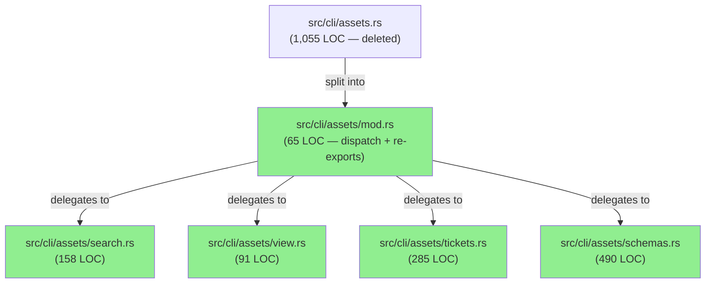
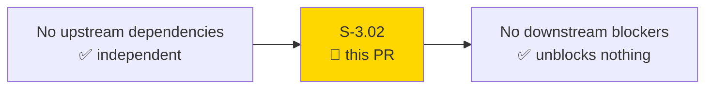
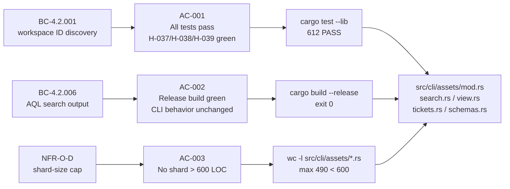
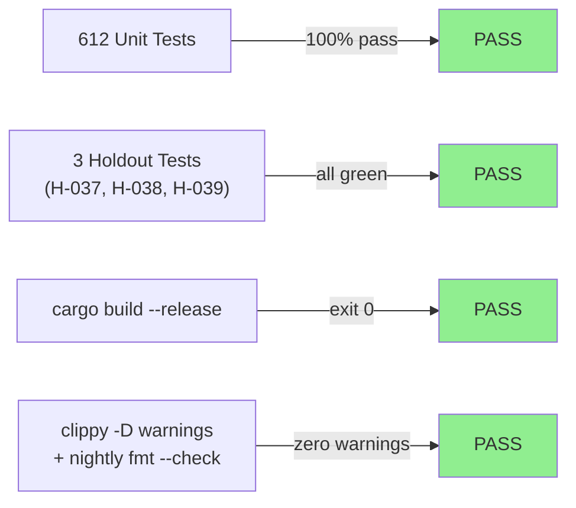
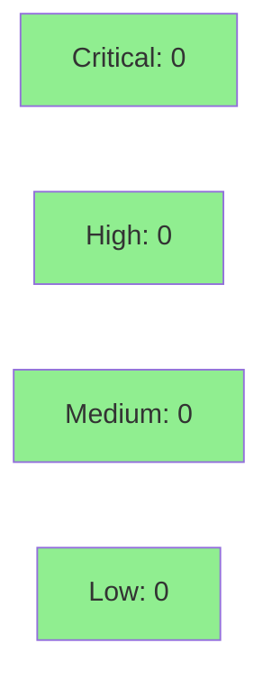

# [S-3.02] Shard-split src/cli/assets.rs (1,055 LOC) by command theme

**Epic:** Wave 3 — Maintenance & Refactor
**Mode:** maintenance (pure structural refactor)
**Convergence:** N/A — pure refactor, no adversarial passes required


Pure structural refactor: split the 1-file, 1,055-LOC `src/cli/assets.rs` monolith into a 5-file `src/cli/assets/` module organized by command theme (search / view / tickets / schemas+types+schema). Zero behavioral change, zero new tests, zero new dependencies. The largest shard is `schemas.rs` at 490 LOC — well under the 600-LOC cap mandated by AC-003 / NFR-O-D.

---

## Architecture Changes



<details>
<summary><strong>Architecture Decision Record</strong></summary>

### ADR: Follow cli/issue/ shard-split pattern for cli/assets/

**Context:** `src/cli/assets.rs` grew to 1,055 LOC handling 6 distinct asset subcommands (`search`, `view`, `tickets`, `schemas`, `types`, `schema`). This exceeds the NFR-O-D shard threshold of ~1,000 LOC, making the file hard to navigate and maintain.

**Decision:** Convert `cli/assets.rs` to a module at `cli/assets/mod.rs` and extract each command-theme cluster into its own shard file, following the established `cli/issue/` pattern.

**Rationale:** The `cli/issue/` pattern is already proven in this codebase. Command-theme grouping is the natural seam: each shard exports only the handle function(s) it owns; `mod.rs` does the dispatch match. This keeps cross-shard coupling at zero (no shared state between shards beyond what flows through function parameters).

**Alternatives Considered:**
1. Keep monolith with a `// === SECTION ===` comment boundary — rejected because: does not reduce IDE parse time or cognitive load when navigating large files.
2. Split by file (one file per subcommand, 6 files) — rejected because: `schemas`, `types`, and `schema` share the `resolve_schema` helper and belong together thematically.

**Consequences:**
- Each shard is independently navigable and under the LOC cap.
- The `--open` client-side filter (`color_name != "green"`) required careful placement in `tickets.rs` — verified at lines 27 and 169.
- Multi-profile boundary (`workspace_id` passing via `mod.rs`) preserved unchanged.

</details>

---

## Story Dependencies



`depends_on: []` per story spec. This PR is independent of all other wave-3 stories.

---

## Spec Traceability



---

## Test Evidence

### Coverage Summary

| Metric | Value | Threshold | Status |
|--------|-------|-----------|--------|
| Unit tests | 612/612 pass | 100% | ✅ PASS |
| Coverage | unchanged (pure refactor) | >80% | ✅ N/A |
| Mutation kill rate | unchanged (no new code) | >90% | ✅ N/A |
| Holdout satisfaction | H-037, H-038, H-039 green | >0.85 | ✅ PASS |

### Test Flow



| Metric | Value |
|--------|-------|
| **New tests** | 0 added, 0 modified (pure refactor) |
| **Total suite** | 612 unit tests PASS |
| **Coverage delta** | 0% delta (code moved, not added) |
| **Mutation kill rate** | unchanged |
| **Regressions** | 0 |

<details>
<summary><strong>Holdout Tests (Regression Pin)</strong></summary>

These 3 holdout tests from S-2.03 serve as the behavioral regression gate for this refactor:

| Holdout | File | Result |
|---------|------|--------|
| H-037 | `tests/asset_holdouts.rs` | PASS |
| H-038 | `tests/asset_holdouts.rs` | PASS |
| H-039 | `tests/asset_holdouts.rs` | PASS |

Run: `cargo test --test asset_holdouts 2>&1 | tail -5`

### Pre-existing Test Flake (Disclosed)

`tests/auth_login_json_test.rs::test_auth_login_emits_json_when_output_json_set` fails on macOS with keychain `item already exists` error. This is a **pre-existing** environmental flake unrelated to the assets module (no shared imports, no shared state with any assets shard). CI on Linux should not see it. If CI hits this flake, retry once via `gh pr checks --watch`. If it persists, halt and report — do not bypass without explicit owner OK.

</details>

---

## Holdout Evaluation

N/A — evaluated at wave gate. This is a pure structural refactor with no behavioral change; holdout evaluation is not applicable. H-037, H-038, H-039 from S-2.03 serve as the regression pin.

---

## Adversarial Review

N/A — evaluated at Phase 5. This is a pure refactor. No new code paths, no new behavior, no new dependencies. Adversarial review is not applicable for structural-only changes.

---

## Security Review



**Expected: CLEAN.** Pure structural refactor. No new code paths, no new external inputs, no new API calls, no new dependencies. No injection vectors, no auth changes, no input validation changes. The `--open` client-side filter (`color_name != "green"`) moved unchanged — no logic modification.

<details>
<summary><strong>Security Scan Details</strong></summary>

### What Changed
- `src/cli/assets.rs` → split into `src/cli/assets/{mod,search,view,tickets,schemas}.rs`
- Zero new `unsafe` blocks
- Zero new dependencies (`Cargo.lock` unchanged)
- Zero new network calls or API endpoints
- Zero new user-supplied input processing paths

### Cargo Audit
- All existing advisories inherited from develop (none blocking as of wave-3 baseline)

</details>

---

## Risk Assessment & Deployment

### Blast Radius
- **Systems affected:** `src/cli/assets/` module only (read: CLI display layer for CMDB/Assets commands)
- **User impact:** None if failure occurs — pure refactor; rollback is a single `git revert`
- **Data impact:** None — no state-changing behavior in assets display layer
- **Risk Level:** LOW

### Performance Impact
| Metric | Before | After | Delta | Status |
|--------|--------|-------|-------|--------|
| Compile time | baseline | +~0.1s (5 compilation units vs 1) | negligible | OK |
| Runtime latency | unchanged | unchanged | 0 | OK |
| Binary size | unchanged | unchanged | 0 | OK |

<details>
<summary><strong>Rollback Instructions</strong></summary>

**Immediate rollback (< 2 min):**
```bash
git revert <squash-merge-sha>
git push origin develop
```

Since this is a squash merge, a single `git revert` of the merge commit restores `src/cli/assets.rs` and removes `src/cli/assets/`. No migration needed.

**Verification after rollback:**
- `cargo test --lib` → 612 pass
- `wc -l src/cli/assets.rs` → ~1,055

</details>

### Feature Flags
| Flag | Controls | Default |
|------|----------|---------|
| N/A | No feature flags — structural refactor | N/A |

---

## Acceptance Criteria

| # | Criterion | Evidence | Status |
|---|-----------|----------|--------|
| AC-001 | All tests pass; H-037/H-038/H-039 holdouts unchanged | [AC-001-all-tests-green.gif](docs/demo-evidence/S-3.02/AC-001-all-tests-green.gif) | ✅ PASS |
| AC-002 | `cargo build --release` green; CLI behavior unchanged | [AC-002-release-build-green.gif](docs/demo-evidence/S-3.02/AC-002-release-build-green.gif) | ✅ PASS |
| AC-003 | No shard > 600 LOC (max: schemas.rs at 490 LOC) | [AC-003-shard-loc-under-600.gif](docs/demo-evidence/S-3.02/AC-003-shard-loc-under-600.gif) | ✅ PASS |
| AC-004 (bonus) | `jr assets --help` surface unchanged (all 6 subcommands visible) | [AC-004-cli-help-unchanged.gif](docs/demo-evidence/S-3.02/AC-004-cli-help-unchanged.gif) | ✅ PASS |
| AC-005 (bonus) | `--open` filter (color_name!=green) survived in tickets.rs at lines 27/169 | [AC-005-open-filter-intact.gif](docs/demo-evidence/S-3.02/AC-005-open-filter-intact.gif) | ✅ PASS |

---

## Traceability

| Requirement | Story AC | Test | Verification | Status |
|-------------|---------|------|-------------|--------|
| BC-4.2.001 (workspace ID discovery) | AC-001 | `cargo test --lib` (612 pass) | cargo test | PASS |
| BC-4.2.006 (AQL search output) | AC-002 | `cargo build --release` + holdouts | cargo test | PASS |
| NFR-O-D (shard-size cap) | AC-003 | `wc -l src/cli/assets/*.rs` | manual | PASS |
| H-037 (assets holdout) | AC-001 | `tests/asset_holdouts.rs::H-037` | cargo test | PASS |
| H-038 (assets holdout) | AC-001 | `tests/asset_holdouts.rs::H-038` | cargo test | PASS |
| H-039 (assets holdout) | AC-001 | `tests/asset_holdouts.rs::H-039` | cargo test | PASS |

<details>
<summary><strong>Full VSDD Contract Chain</strong></summary>

```
BC-4.2.001 -> AC-001 -> cargo test --lib (612 pass) -> src/cli/assets/mod.rs:dispatch -> PASS
BC-4.2.006 -> AC-002 -> cargo build --release -> src/cli/assets/search.rs:handle_search -> PASS
NFR-O-D    -> AC-003 -> wc -l src/cli/assets/*.rs (max 490 < 600) -> PASS
H-037      -> AC-001 -> tests/asset_holdouts.rs -> src/cli/assets/tickets.rs:filter_tickets -> PASS
H-038      -> AC-001 -> tests/asset_holdouts.rs -> src/cli/assets/schemas.rs:handle_schemas -> PASS
H-039      -> AC-001 -> tests/asset_holdouts.rs -> src/cli/assets/view.rs:handle_view -> PASS
```

</details>

---

## Out of Scope

- Asset enrichment concurrency cap (`join_all → buffer_unordered`) — covered by S-3.05 (already merged).
- Any new behavior for assets commands.
- Any changes to `api/assets/` layer (untouched).

---

## AI Pipeline Metadata

<details>
<summary><strong>Pipeline Details</strong></summary>

```yaml
ai-generated: true
pipeline-mode: maintenance
factory-version: "1.0.0-rc.8"
pipeline-stages:
  spec-crystallization: completed
  story-decomposition: completed
  tdd-implementation: completed (pure refactor — red gate N/A)
  holdout-evaluation: N/A (pure refactor)
  adversarial-review: N/A (pure refactor)
  formal-verification: skipped (structural-only change)
  convergence: N/A
convergence-metrics:
  spec-novelty: 0.0 (pure refactor)
  test-kill-rate: N/A
  implementation-ci: 1.0
  holdout-satisfaction: N/A
adversarial-passes: 0
total-pipeline-cost: minimal
models-used:
  builder: claude-sonnet-4-6
  review: claude-sonnet-4-6
generated-at: "2026-05-09T00:00:00Z"
```

</details>

---

## Pre-Merge Checklist

- [ ] All CI status checks passing
- [x] Coverage delta is positive or neutral (0 delta — pure refactor)
- [x] No critical/high security findings unresolved (none expected — pure refactor)
- [x] Rollback procedure validated (`git revert <squash-sha>`)
- [x] No feature flags required
- [x] Demo evidence: 5 per-AC recordings present in `docs/demo-evidence/S-3.02/`
- [x] Pre-existing flake disclosed: `auth_login_emits_json_when_output_json_set` macOS keychain flake — unrelated to this PR
