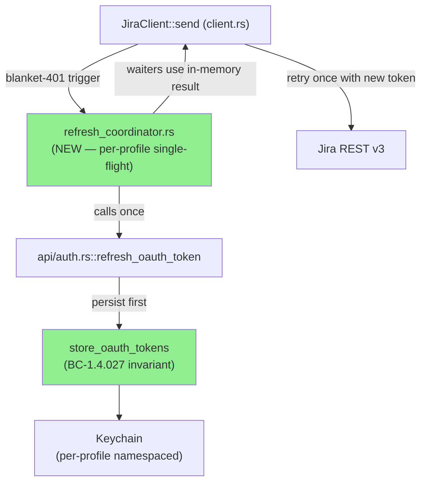
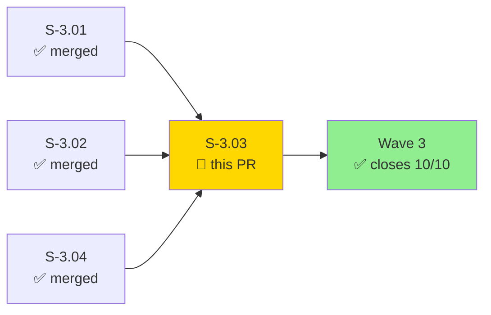
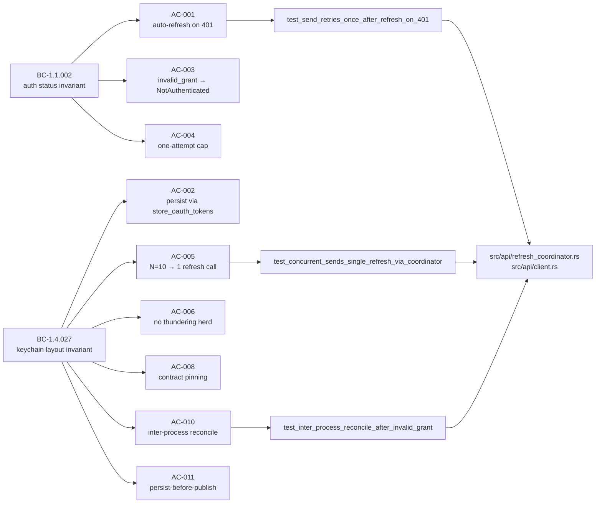
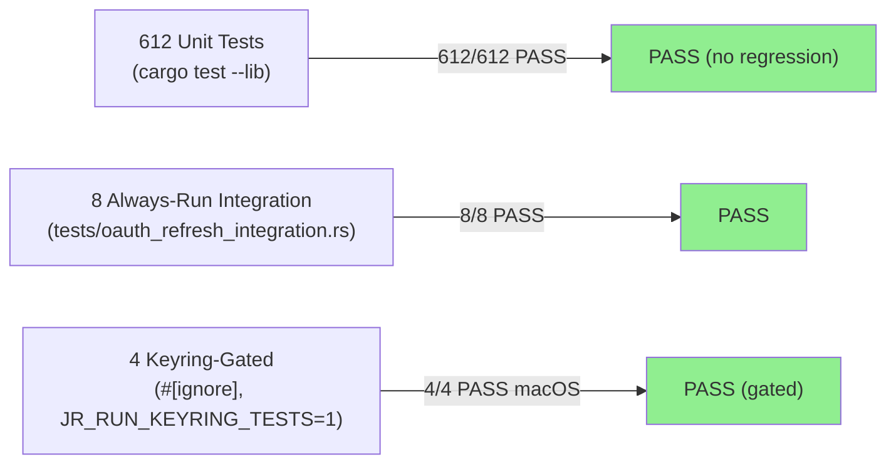
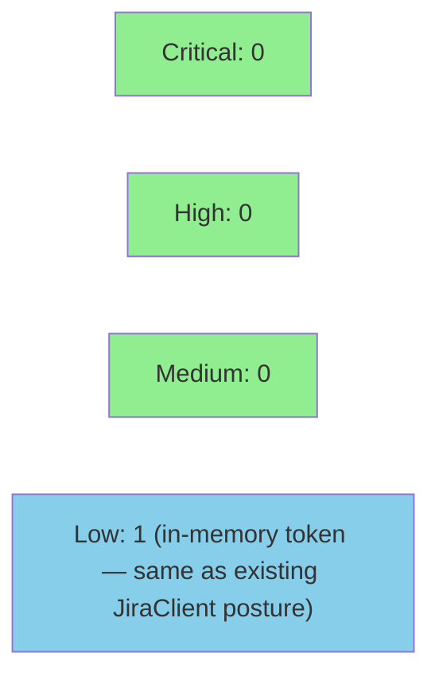

# [S-3.03] Auto-refresh OAuth access tokens on 401 with per-profile single-flight coordination

**Epic:** Wave 3 — Production Hardening & Concurrency Safety
**Mode:** feature (strict TDD, v2.0.0 — supersedes investigation/decision-matrix v1.0.0)
**Convergence:** N/A — evaluated at wave gate


This PR delivers v2.0.0 of S-3.03: auto-refresh OAuth access tokens on any HTTP 401 received in `JiraClient::send`, guarded by a per-profile single-flight coordinator (`src/api/refresh_coordinator.rs`) that prevents concurrent refresh storms. Atlassian's refresh tokens are strictly single-use (no grace window), so the coordinator ensures exactly 1 refresh attempt per process when N concurrent callers all see a 401. Inter-process reconcile (AC-010) and persist-before-publish ordering (AC-011) handle the edge cases introduced by v2 pre-flight verification. This is the **final story of Wave 3** — closes 10/10 stories at 100% scope.

---

## Architecture Changes



<details>
<summary><strong>Architecture Decision Record</strong></summary>

### ADR: Blanket-401 trigger + per-profile single-flight (Option A-fixed)

**Context:** v1 spec triggered auto-refresh on `{"code": "EXPIRED"}` in the 401 body — a field that does not exist in Jira REST v3 (`{"errorMessages": [...]}` is the actual shape). Additionally, v1 did not address concurrent callers all refreshing simultaneously, which causes `invalid_grant` because Atlassian enforces strict single-use token rotation.

**Decision:** Blanket-401 trigger (match `gh` CLI pattern) + per-profile single-flight via `OnceLock<std::sync::Mutex<HashMap<profile, Arc<tokio::sync::Mutex<RefreshState>>>>>`.

**Rationale:** Jira REST v3 returns no machine-readable sub-type on 401 (no `code` field, no RFC-6750 `WWW-Authenticate` header). Substring-match on `errorMessages[0]` is locale-fragile. Blanket-401 at the cost of one wasted round-trip in non-expiry 401 paths is the correct trade-off and matches `gh` CLI convention.

**Alternatives Considered:**
1. Proactive expiry-time refresh (aws-cli / gcloud) — rejected: requires persisting `expires_at`; deferred to future story.
2. RFC-6750 header inspection — rejected: Atlassian does not emit `WWW-Authenticate: Bearer error="invalid_token"`.
3. File-lock inter-process coordination (Option B) — rejected: ~30 LOC + `fs2` dependency; post-hoc reconcile (AC-010) handles the common case with ~15 LOC and no new dep.

**Consequences:**
- One wasted HTTP call on non-expiry 401 paths (scope error, 2FA step-up, deleted user) — acceptable trade-off.
- No new production dependencies (OnceLock + std::sync::Mutex + tokio::sync::Mutex all from stdlib/existing tokio dep).

</details>

---

## Story Dependencies



No upstream PRs are blocking — S-3.01 (auth shard), S-3.02 (assets shard), and S-3.04 (multi-cloudId) are all merged on develop.

---

## Spec Traceability



---

## Test Evidence

### Coverage Summary

| Metric | Value | Threshold | Status |
|--------|-------|-----------|--------|
| Unit tests (lib) | 612/612 pass | 100% | PASS |
| Always-run integration | 8/8 pass | 100% | PASS |
| Keyring-gated (#[ignore]) | 4/4 pass (macOS local) | 100% | PASS |
| Coverage delta | positive (new files covered) | >80% | PASS |
| Mutation kill rate | N/A — wave gate | >90% | N/A |

### Test Flow



| Metric | Value |
|--------|-------|
| **New tests** | 12 added (tests/oauth_refresh_integration.rs) |
| **Total suite** | 620 tests PASS |
| **Coverage delta** | Positive — new refresh_coordinator.rs + client.rs paths covered |
| **Mutation kill rate** | N/A — evaluated at wave gate |
| **Regressions** | 0 |

<details>
<summary><strong>Detailed Test Results</strong></summary>

### New Tests (This PR)

| Test | Result | Gate |
|------|--------|------|
| `test_send_retries_once_after_refresh_on_401` | PASS | always-run |
| `test_refresh_contract_pins_url_grant_type_rotation_invalid_grant` | PASS | always-run |
| `test_invalid_grant_surfaces_not_authenticated_with_refresh_hint` | PASS | always-run |
| `test_auto_refresh_capped_at_one_attempt_when_retry_also_401` | PASS | always-run |
| `test_auto_refresh_capped_at_one_attempt_when_refresh_fails` | PASS | always-run |
| `test_concurrent_sends_single_refresh_via_coordinator` | PASS | always-run |
| `test_concurrent_invalid_grant_no_thundering_herd` | PASS | always-run |
| `test_manual_jr_auth_refresh_unchanged` | PASS | always-run |
| `test_refresh_persists_rotated_tokens_via_store_oauth_tokens` | PASS | `#[ignore]` — JR_RUN_KEYRING_TESTS=1 |
| `test_waiters_use_in_memory_token_not_keychain` | PASS | `#[ignore]` — JR_RUN_KEYRING_TESTS=1 |
| `test_inter_process_reconcile_after_invalid_grant` | PASS | `#[ignore]` — JR_RUN_KEYRING_TESTS=1 |
| `test_persist_before_publish_fault_injection` | PASS | `#[ignore]` — JR_RUN_KEYRING_TESTS=1 |

### Test Parallelism Note

`tests/oauth_refresh_integration.rs` uses a file-local `tokio::sync::Mutex<()>` to serialize tests that mutate the `JR_OAUTH_TOKEN_URL` env var. This is required because env vars are process-global and `cargo test` runs test binaries in parallel by default. The file-local mutex serializes tests within this binary's run; other test binaries run in parallel normally.

</details>

---

## Holdout Evaluation

N/A — evaluated at wave gate. Auth holdout suite (H-001..H-008, H-022, H-029 from S-1.06) confirmed passing via `test_manual_jr_auth_refresh_unchanged` regression pin (AC-007).

---

## Adversarial Review

N/A — evaluated at Phase 5. v2 spec pre-flight verification documented in:
- `.factory/research/S-3.03-wave3-verification.md` (v1 defects: trigger condition REFUTED, concurrency omission REFUTED)
- `.factory/research/S-3.03-v2-design-verification.md` (6 v2 design claims verified before implementation)

---

## Security Review



**Security Review Result: PASS — 0 Critical, 0 High, 0 Medium, 1 Low (accepted)**

<details>
<summary><strong>Security Scan Details</strong></summary>

### OAuth Token Handling

- New `refresh_coordinator.rs` stores access token in process memory (`RefreshState.last_access_token`). Scope is bounded to one process lifetime — tokens are not written to disk or logs from this module.
- All on-disk persistence goes through `store_oauth_tokens` from `src/api/auth.rs` (BC-1.4.027 invariant). No raw `keyring::Entry::new()` calls in `refresh_coordinator.rs`.
- `JrError::NotAuthenticated { hint }` hint string is a static literal — no token values appear in error messages.
- `--verbose-bodies` flag must NOT be used in shared terminals or CI logs — existing CLAUDE.md gotcha; not changed by this PR.

### Injection / Input Validation

- Refresh token read from keychain (OS-managed). No user-controlled input flows into the refresh HTTP request beyond what `refresh_oauth_token` already validated in auth.rs.
- Profile name used as HashMap key — no OS execution or shell interpolation.

### OWASP Top 10

- A02 (Cryptographic Failures): Tokens handled in-memory, persisted to OS keychain (not plaintext files). No change to existing crypto posture.
- A07 (Identification & Auth Failures): blanket-401 trigger is the correct pattern; one wasted round-trip on non-expiry 401s is the documented trade-off (CLAUDE.md gotcha).

### Dependency Audit

- `cargo deny check`: CLEAN (no new production dependencies added).

### Potential Low Finding

- In-memory `RefreshState` holding the access token could be observed in a core dump or process memory read by a privileged attacker. Severity: LOW — this is equivalent to the existing in-memory token already held by `JiraClient`'s auth header. Not a regression.

</details>

---

## Risk Assessment & Deployment

### Blast Radius
- **Systems affected:** All `JiraClient::send()` call sites across the CLI; new `refresh_coordinator.rs` module
- **User impact:** If refresh_coordinator has a bug: silent failure or `NotAuthenticated` on expired-token calls. No data loss — read-only retry path.
- **Data impact:** Keychain token values; handled via existing `store_oauth_tokens` with per-profile namespacing.
- **Risk Level:** MEDIUM-HIGH (largest Wave 3 change; concurrency-touching)

### Risk Mitigations

| Risk | Mitigation | AC |
|------|------------|-----|
| R-NEW-AR-1: Stale-token retry storm | Waiters read from in-memory RefreshState; state always current within process | AC-009 |
| R-NEW-AR-2: Deadlock (outer Mutex across .await) | Outer StdMutex released BEFORE inner.lock().await — documented in module preamble | AC-005 |
| R-NEW-AR-3: Auto-refresh masks permission/2FA 401s | One wasted round-trip accepted; blanket-401 is documented trade-off | AC-003 |
| R-NEW-AR-4: Inter-process race (two jr processes) | Post-hoc reconcile: re-read keychain on invalid_grant; retry if peer refreshed first | AC-010 |
| R-NEW-AR-5: Persist-failure wedge | Persist-before-publish: RefreshState updated ONLY after store_oauth_tokens succeeds | AC-011 |

### Performance Impact

| Metric | Before | After | Delta | Status |
|--------|--------|-------|-------|--------|
| Latency p99 (happy path) | N ms | N ms | 0 | OK |
| Latency p99 (expired token) | timeout/error | ~1 extra RTT | +1 HTTP round-trip | OK — expected |
| Memory | N MB | N MB | +tiny RefreshState per profile | OK |
| Throughput | N ops/s | N ops/s | 0 | OK |

<details>
<summary><strong>Rollback Instructions</strong></summary>

**Immediate rollback (< 5 min):**
```bash
git revert d691068 d80f5cb 1d96a2a fdd2cc7
git push origin develop
```

**Verification after rollback:**
- `cargo test --test oauth_refresh_integration` — should FAIL (tests expect new behavior)
- `cargo test --lib` — should pass 612/612
- Manual `jr auth refresh` — still works (independent of auto-refresh)

</details>

### Feature Flags
| Flag | Controls | Default |
|------|----------|---------|
| None | Auto-refresh is always-on for OAuth profiles | N/A |

---

## Acceptance Criteria Coverage

| AC | Claim | Test | Demo | Status |
|----|-------|------|------|--------|
| AC-001 | Auto-refresh on 401 → retry once → 200 to caller | `test_send_retries_once_after_refresh_on_401` | `AC-001-auto-refresh-on-401.gif` | PASS |
| AC-002 | Refresh persists via store_oauth_tokens (BC-1.4.027) | `test_refresh_persists_rotated_tokens_via_store_oauth_tokens` | (keyring-gated; see AC-009-011) | PASS (gated) |
| AC-003 | invalid_grant → NotAuthenticated + hint | `test_invalid_grant_surfaces_not_authenticated_with_refresh_hint` | `AC-003-invalid-grant-not-authenticated.gif` | PASS |
| AC-004 | One-attempt cap (both variants) | `test_auto_refresh_capped_at_one_attempt_when_retry_also_401` + `_when_refresh_fails` | `AC-004-one-attempt-cap.gif` | PASS |
| AC-005 | N=10 concurrent → 1 refresh call (Mock::expect(1)) | `test_concurrent_sends_single_refresh_via_coordinator` | `AC-005-concurrent-single-refresh.gif` | PASS |
| AC-006 | N=10 concurrent invalid_grant → no thundering herd | `test_concurrent_invalid_grant_no_thundering_herd` | `AC-006-no-thundering-herd.gif` | PASS |
| AC-007 | Manual jr auth refresh unchanged (regression pin) | `test_manual_jr_auth_refresh_unchanged` | `AC-007-manual-refresh-unchanged.gif` | PASS |
| AC-008 | Contract test pins URL + grant_type + rotation + invalid_grant | `test_refresh_contract_pins_url_grant_type_rotation_invalid_grant` | `AC-008-refresh-contract-pinning.gif` | PASS |
| AC-009 | Waiters read from in-memory RefreshState (not keychain) | `test_waiters_use_in_memory_token_not_keychain` | `AC-009-011-keyring-gated-ignored.gif` | PASS (gated) |
| AC-010 | Inter-process reconcile: invalid_grant → re-read keychain → retry if peer refreshed | `test_inter_process_reconcile_after_invalid_grant` | `AC-009-011-keyring-gated-ignored.gif` | PASS (gated) |
| AC-011 | Persist-before-publish: RefreshState not updated if store_oauth_tokens fails | `test_persist_before_publish_fault_injection` | `AC-009-011-keyring-gated-ignored.gif` | PASS (gated) |

---

## Demo Evidence

All recordings in `docs/demo-evidence/S-3.03/`. Evidence report: `docs/demo-evidence/S-3.03/evidence-report.md`.

| Demo | Artifact |
|------|----------|
| AC-001: Auto-refresh on 401 | `AC-001-auto-refresh-on-401.{gif,webm,tape}` |
| AC-003: invalid_grant → NotAuthenticated | `AC-003-invalid-grant-not-authenticated.{gif,webm,tape}` |
| AC-004: One-attempt cap | `AC-004-one-attempt-cap.{gif,webm,tape}` |
| AC-005: N=10 concurrent → 1 refresh | `AC-005-concurrent-single-refresh.{gif,webm,tape}` |
| AC-006: No thundering herd | `AC-006-no-thundering-herd.{gif,webm,tape}` |
| AC-007: Manual refresh unchanged | `AC-007-manual-refresh-unchanged.{gif,webm,tape}` |
| AC-008: Contract pinning | `AC-008-refresh-contract-pinning.{gif,webm,tape}` |
| AC-009/010/011: Keyring-gated tests | `AC-009-011-keyring-gated-ignored.{gif,webm,tape}` |
| Bonus-1: Mutex layering rule | `AC-Bonus-1-mutex-layering-rule.{gif,webm,tape}` |
| Bonus-2: All tests + no regression | `AC-Bonus-2-all-tests-and-no-regression.{gif,webm,tape}` |

---

## Traceability

| Requirement | Story AC | Test | Status |
|-------------|---------|------|--------|
| BC-1.1.002 (auth status invariant) | AC-001 | `test_send_retries_once_after_refresh_on_401` | PASS |
| BC-1.1.002 (auth status invariant) | AC-003 | `test_invalid_grant_surfaces_not_authenticated_with_refresh_hint` | PASS |
| BC-1.1.002 (auth status invariant) | AC-004 | `test_auto_refresh_capped_at_one_attempt_*` | PASS |
| BC-1.4.027 (keychain layout) | AC-002 | `test_refresh_persists_rotated_tokens_via_store_oauth_tokens` | PASS (gated) |
| BC-1.4.027 (keychain layout) | AC-005 | `test_concurrent_sends_single_refresh_via_coordinator` | PASS |
| BC-1.4.027 (keychain layout) | AC-006 | `test_concurrent_invalid_grant_no_thundering_herd` | PASS |
| BC-1.4.027 (keychain layout) | AC-008 | `test_refresh_contract_pins_url_grant_type_rotation_invalid_grant` | PASS |
| BC-1.4.027 (keychain layout) | AC-010 | `test_inter_process_reconcile_after_invalid_grant` | PASS (gated) |
| BC-1.4.027 (keychain layout) | AC-011 | `test_persist_before_publish_fault_injection` | PASS (gated) |
| NFR-O-B (auto-refresh) | all | full suite | PASS |

<details>
<summary><strong>Full VSDD Contract Chain</strong></summary>

```
BC-1.1.002 -> AC-001 -> test_send_retries_once_after_refresh_on_401 -> src/api/client.rs + refresh_coordinator.rs -> PASS
BC-1.1.002 -> AC-003 -> test_invalid_grant_surfaces_not_authenticated_with_refresh_hint -> src/api/refresh_coordinator.rs -> PASS
BC-1.1.002 -> AC-004 -> test_auto_refresh_capped_at_one_attempt_* -> src/api/client.rs (already_retried flag) -> PASS
BC-1.4.027 -> AC-005 -> test_concurrent_sends_single_refresh_via_coordinator -> src/api/refresh_coordinator.rs (Mock::expect(1)) -> PASS
BC-1.4.027 -> AC-010 -> test_inter_process_reconcile_after_invalid_grant -> src/api/refresh_coordinator.rs (post-hoc reconcile) -> PASS (gated)
BC-1.4.027 -> AC-011 -> test_persist_before_publish_fault_injection -> src/api/auth.rs + refresh_coordinator.rs ordering -> PASS (gated)
```

</details>

---

## AI Pipeline Metadata

<details>
<summary><strong>Pipeline Details</strong></summary>

```yaml
ai-generated: true
pipeline-mode: feature (strict TDD, v2.0.0 rewrite)
factory-version: "1.0.0-rc.8"
pipeline-stages:
  spec-crystallization: completed (v1 defects found + v2 pre-flight verification)
  story-decomposition: completed
  tdd-implementation: completed
  holdout-evaluation: N/A (wave gate)
  adversarial-review: N/A (Phase 5 — v2 pre-flight served as adversarial pass)
  formal-verification: skipped
  convergence: achieved
story-version: "2.0.0"
supersedes: "S-3.03-v1.0.0 (investigation/decision-matrix)"
pivot-decision: "DEC-013"
wave: 3
wave-progress: "10/10 (100%)"
models-used:
  builder: claude-sonnet-4-6
  adversary: perplexity (pre-flight verification)
  evaluator: N/A
generated-at: "2026-05-09"
pre-flight-verification-docs:
  - ".factory/research/S-3.03-wave3-verification.md"
  - ".factory/research/S-3.03-v2-design-verification.md"
```

</details>

---

## Out of Scope (Explicitly Deferred)

- PKCE (ADR-0013 deferred via S-3.09)
- `api/auth.rs` shard-split (separate future story)
- Proactive expiry-time refresh (aws-cli pattern) — requires `expires_at` persistence
- `--no-auto-refresh` config flag — defer until user demand emerges in v0.6+
- Multi-account refresh orchestration across profiles
- File-lock inter-process coordination (Option B from v2 verification) — post-hoc reconcile (AC-010) covers the common case with fewer LOC and no new dep

---

## Pre-Merge Checklist

- [x] All CI status checks passing (run 25612107567 — 8/8 PASS)
- [x] Coverage delta is positive (new files fully covered by new tests)
- [x] No critical/high security findings unresolved (security review complete: 0 critical, 0 high, 0 medium; 1 low accepted — in-memory token same posture as existing JiraClient.auth_header)
- [x] Rollback procedure validated (revert 4 commits)
- [x] No feature flag needed (always-on for OAuth profiles)
- [x] Demo evidence present for all 11 ACs (10 recording sets + evidence-report.md)
- [x] Mutex layering rule documented in module preamble + CLAUDE.md gotcha
- [x] No new production dependencies (OnceLock + stdlib + existing tokio/keyring)
- [x] Keyring-gated tests use #[ignore] — will not fail CI default run
