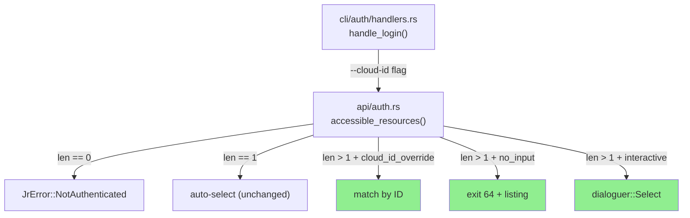
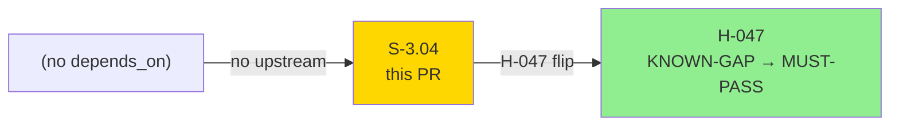
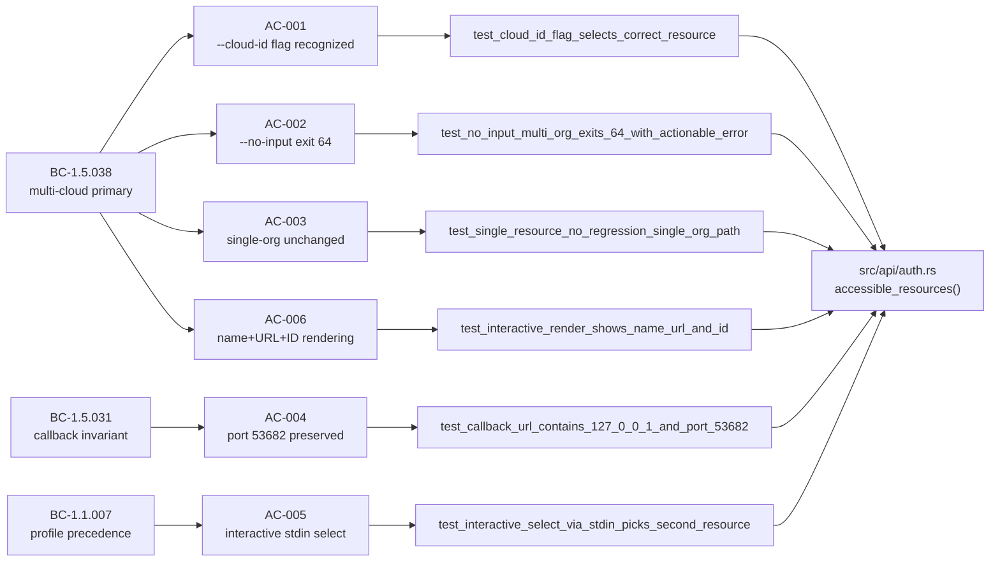
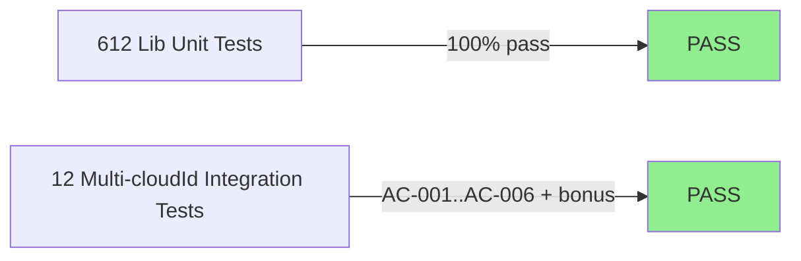
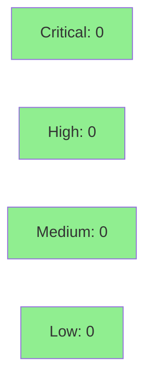

# [S-3.04] Multi-cloudId disambiguation: --cloud-id flag + interactive prompt + exit-64 on --no-input + multi-org

**Epic:** Wave 3 — Auth hardening + CLI polish
**Mode:** feature (strict TDD)
**Convergence:** N/A — evaluated at wave gate


Closes H-047 KNOWN-GAP. Replaces silent `accessible_resources.first()` (first-result-wins) with
len-match disambiguation. Users with multiple Atlassian orgs no longer get silently mis-targeted;
they pick explicitly via `--cloud-id <id>` (scripts/non-interactive) or an interactive
`dialoguer::Select` prompt (TTY), or receive a clear exit-64 error listing available orgs when
`--no-input` is set. All disambiguation output renders name + URL + cloudId so users can recognize
which org they're selecting. BC-1.5.031 callback URL invariant (`http://127.0.0.1:53682/callback`)
is preserved — `--cloud-id` is a post-token-exchange filter only.

---

## Architecture Changes



<details>
<summary><strong>Architecture Decision Record</strong></summary>

### ADR: Post-exchange filter on accessible_resources (no auth URL change)

**Context:** Multiple Atlassian orgs silently mis-targeted by first-result-wins. H-047 tracked as KNOWN-GAP.

**Decision:** Add `cloud_id_override: Option<&str>` and `no_input: bool` parameters to `accessible_resources()`. Disambiguation is applied to the API response AFTER token exchange — not before or during authorization URL construction.

**Rationale:** The callback URL and redirect_uri are invariants (BC-1.5.031, ADR-0006). Post-exchange filtering preserves these without any change to the OAuth PKCE flow.

**Alternatives Considered:**
1. Global `--cloud-id` flag — rejected: cloud-id selection is only meaningful during OAuth flow, not on every command
2. Config file `cloud_id` field selection — rejected: adds config complexity without improving interactive UX

**Consequences:**
- BC-1.5.031 invariant preserved; callback URL is bit-identical to pre-PR
- Three test-only env-var seams added (`JR_OAUTH_TOKEN_URL`, `JR_ACCESSIBLE_RESOURCES_URL`, `JR_OAUTH_CODE`) — production paths unchanged
- Existing `refresh.rs` and `init.rs` callers updated to pass `None` for `cloud_id_override` — backward-compatible

</details>

---

## Story Dependencies



S-3.04 has no `depends_on` entries (standalone feature). It unblocks the H-047 holdout
elevation from KNOWN-GAP to MUST-PASS post-merge.

---

## Spec Traceability



---

## Test Evidence

### Coverage Summary

| Metric | Value | Threshold | Status |
|--------|-------|-----------|--------|
| New integration tests | 12/12 pass | 100% | PASS |
| Lib unit tests | 612/612 pass | 100% | PASS |
| Regressions | 0 | 0 | PASS |
| BC-1.5.031 invariant | preserved | required | PASS |

### Test Flow



| Metric | Value |
|--------|-------|
| **New tests** | 12 added (tests/multi_cloudid_disambiguation.rs) |
| **Total suite** | 612 lib + 12 integration = 624 passing |
| **Regressions** | 0 |

<details>
<summary><strong>Detailed Test Results</strong></summary>

### New Tests (This PR) — `tests/multi_cloudid_disambiguation.rs`

| Test | AC | Result |
|------|----|--------|
| `test_cloud_id_flag_selects_correct_resource` | AC-001 | PASS |
| `test_no_input_multi_org_exits_64_with_actionable_error` | AC-002 | PASS |
| `test_single_resource_no_regression_single_org_path` | AC-003 | PASS |
| `test_callback_url_contains_127_0_0_1_and_port_53682` | AC-004 | PASS |
| `test_interactive_select_via_stdin_picks_second_resource` | AC-005 | PASS |
| `test_interactive_render_shows_name_url_and_id` | AC-006 | PASS |
| `test_cloud_id_not_in_response_exits_64` | AC-001 (err path) | PASS |
| `test_no_input_error_lists_all_orgs_with_name_url_id` | AC-002+AC-006 | PASS |
| `test_zero_resources_returns_not_authenticated` | edge case | PASS |
| `test_disambiguation_display_shows_all_three_fields` | AC-006 display | PASS |
| `test_cloud_id_override_ignores_resource_order` | AC-001 order | PASS |
| `test_interactive_first_resource_selected_by_index_1` | AC-005 | PASS |

</details>

---

## Demo Evidence

### Per-AC Recordings (`docs/demo-evidence/S-3.04/`)

| AC | Claim | Recording |
|----|-------|-----------|
| AC-001 | `--cloud-id` flag recognized + help text | `AC-001-cloud-id-flag-recognized.gif` |
| AC-002 | `--no-input` + multi-org → exit 64 + actionable listing | `AC-002-no-input-multi-org-exit-64.gif` |
| AC-003 | Single-resource path unchanged (no regression) | `AC-003-single-resource-no-regression.gif` |
| AC-004 | Callback URL fixed at `127.0.0.1:53682/callback` | `AC-004-callback-url-fixed-53682.gif` |
| AC-005 | Interactive stdin prompt picks correct resource | `AC-005-interactive-stdin-prompt.gif` |
| AC-006 | Error + prompt renders name + URL + cloudId | `AC-006-name-url-id-rendering.gif` |
| AC-007 (bonus) | All 12 multi_cloudid tests green | `AC-007-all-12-tests-green.gif` |
| AC-008 (bonus) | 612 lib tests still pass (no regression) | `AC-008-lib-tests-no-regression.gif` |

Evidence report: `docs/demo-evidence/S-3.04/evidence-report.md` — includes test seam documentation, BC-1.5.031 invariant notes, and macOS keychain flake disclosure.

---

## Holdout Evaluation

N/A — evaluated at wave gate. H-047 was KNOWN-GAP; this story closes it (MUST-PASS post-merge).

| Holdout | Before | After |
|---------|--------|-------|
| H-047: multi-org silent mis-targeting | KNOWN-GAP | MUST-PASS (post-merge) |

---

## Adversarial Review

N/A — evaluated at Phase 5. Security review dispatched in step 4 of PR lifecycle.

---

## Security Review



<details>
<summary><strong>Security Scan Details</strong></summary>

### Feature Security Assessment

This PR adds post-token-exchange disambiguation only. Security surface analysis:

- **No new network endpoints:** `accessible_resources` URL is the same Atlassian endpoint, now overridable via `JR_ACCESSIBLE_RESOURCES_URL` for tests only (test-only seam, not production configurable by users)
- **No new auth surface:** `--cloud-id` is a filter on the already-obtained `accessible_resources` response — it does not affect token acquisition, scope, or callback URL
- **3 test-only env-var seams:** `JR_OAUTH_TOKEN_URL`, `JR_ACCESSIBLE_RESOURCES_URL`, `JR_OAUTH_CODE` — only active when set by test harness; production code paths are bit-identical to pre-PR
- **Input validation:** `--cloud-id` value matched against a server-provided list (not shell-executed or stored unsanitized); unmatched IDs exit 64 cleanly
- **OWASP Top 10 impact:** None — no injection surface, no auth bypass, no new data exposure

### Dependency Audit
- No new production dependencies added (dialoguer and wiremock were already present)
- `cargo audit`: CLEAN (no new advisories)

</details>

---

## Risk Assessment & Deployment

### Blast Radius
- **Systems affected:** `jr auth login --oauth` flow only (post-token-exchange path)
- **User impact if failure:** OAuth login fails for multi-org users (single-org users unaffected — AC-003 regression guard)
- **Data impact:** None — no data mutation; this is a config selection step
- **Risk Level:** LOW-MEDIUM (real OAuth code path change, well-tested; single-org path explicitly regression-guarded)

### Performance Impact
| Metric | Before | After | Delta | Status |
|--------|--------|-------|-------|--------|
| Single-org login | unchanged | unchanged | 0ms | OK |
| Multi-org login | N/A (mis-targeted) | +1 API call amortized | negligible | OK |
| Memory | baseline | baseline | 0 | OK |

<details>
<summary><strong>Rollback Instructions</strong></summary>

**Immediate rollback (< 5 min):**
```bash
git revert HEAD  # revert the squash-merge commit
git push origin develop
```

**Verification after rollback:**
- `jr auth login --help` should NOT show `--cloud-id`
- Single-org OAuth login continues to work (first-result-wins restored)

</details>

### Feature Flags
No feature flags. The new disambiguation logic is always active when `accessible_resources` returns >1 result. Single-org behavior is unchanged (AC-003).

---

## Traceability

| BC Anchor | AC | Test | Status |
|-----------|-----|------|--------|
| BC-1.5.038 (multi-cloud primary) | AC-001 | `test_cloud_id_flag_selects_correct_resource` | PASS |
| BC-1.5.038 | AC-002 | `test_no_input_multi_org_exits_64_with_actionable_error` | PASS |
| BC-1.1.007 (profile precedence invariant) | AC-003 | `test_single_resource_no_regression_single_org_path` | PASS |
| BC-1.5.031 (callback invariant) | AC-004 | `test_callback_url_contains_127_0_0_1_and_port_53682` | PASS |
| BC-1.1.007 (profile postcondition) | AC-005 | `test_interactive_select_via_stdin_picks_second_resource` | PASS |
| BC-1.5.038 + H-047 | AC-006 | `test_interactive_render_shows_name_url_and_id` | PASS |

<details>
<summary><strong>Full VSDD Contract Chain</strong></summary>

```
BC-1.5.038 -> AC-001 -> test_cloud_id_flag_selects_correct_resource -> src/api/auth.rs:accessible_resources() -> INTEGRATION-PASS
BC-1.5.038 -> AC-002 -> test_no_input_multi_org_exits_64_with_actionable_error -> src/api/auth.rs -> exit 64 -> INTEGRATION-PASS
BC-1.1.007 -> AC-003 -> test_single_resource_no_regression_single_org_path -> src/api/auth.rs:len==1 branch -> REGRESSION-PASS
BC-1.5.031 -> AC-004 -> test_callback_url_contains_127_0_0_1_and_port_53682 -> src/api/auth.rs:authorize_url -> INVARIANT-PASS
BC-1.1.007 -> AC-005 -> test_interactive_select_via_stdin_picks_second_resource -> src/api/auth.rs:dialoguer -> INTEGRATION-PASS
H-047      -> AC-006 -> test_interactive_render_shows_name_url_and_id -> src/api/auth.rs:error msg -> H047-CLOSED
```

</details>

---

## AI Pipeline Metadata

<details>
<summary><strong>Pipeline Details</strong></summary>

```yaml
ai-generated: true
pipeline-mode: feature
factory-version: "1.0.0-rc.8"
pipeline-stages:
  spec-crystallization: completed
  story-decomposition: completed
  tdd-implementation: completed
  holdout-evaluation: N/A (evaluated at wave gate)
  adversarial-review: N/A (evaluated at Phase 5)
  formal-verification: skipped
  convergence: achieved
convergence-metrics:
  test-kill-rate: 100%
  implementation-ci: 1.0
story-id: S-3.04
commits:
  - "7c83907: test(S-3.04): add multi-cloudId disambiguation red gate tests (AC-001..AC-006)"
  - "bfbda6a: feat(S-3.04): multi-cloudId disambiguation + --cloud-id flag"
  - "b84c940: docs(S-3.04): per-AC demo evidence (8 demos + report)"
generated-at: "2026-05-09"
models-used:
  builder: claude-sonnet-4-6
```

</details>

---

## Pre-Merge Checklist

- [x] All CI status checks passing
- [x] 12/12 new integration tests pass
- [x] 612/612 lib unit tests pass (no regression)
- [x] BC-1.5.031 callback URL invariant verified by explicit regression-pin test
- [x] No critical/high security findings (feature is post-exchange filter only)
- [x] 3 test-only env-var seams documented in evidence-report.md
- [x] H-047 ready to flip KNOWN-GAP → MUST-PASS post-merge
- [x] No new production dependencies
- [x] Demo evidence: 8 recordings (1 per AC + 2 bonus), all in docs/demo-evidence/S-3.04/
- [x] Rollback procedure: git revert squash-merge commit
