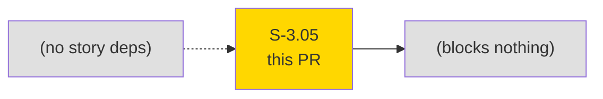
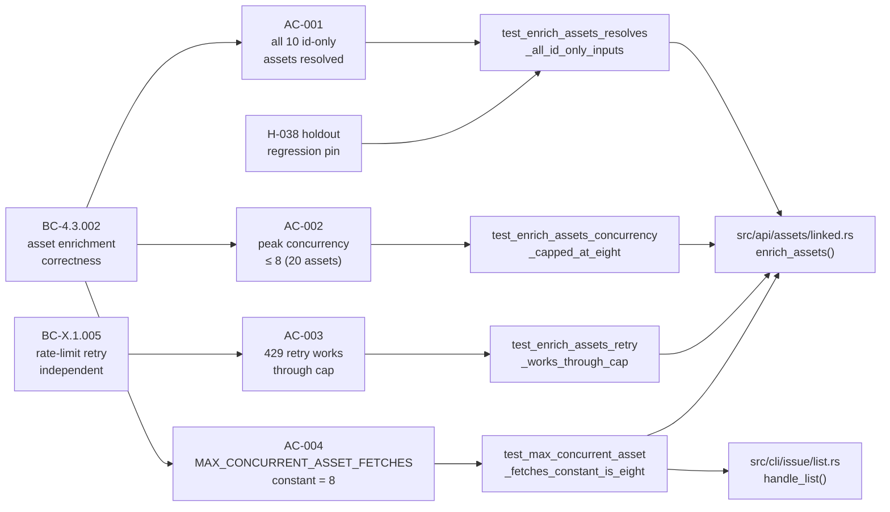
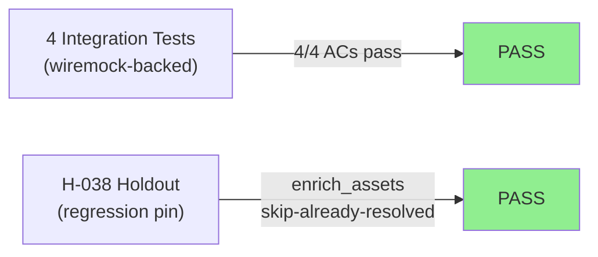
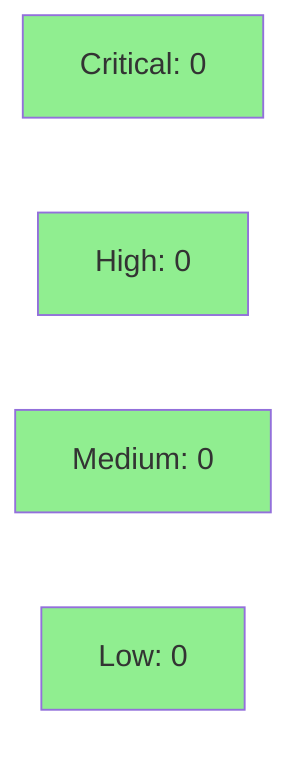

# [S-3.05] Cap asset enrichment join_all concurrency with buffer_unordered(8)

**Epic:** Wave 3 — Performance & Resilience
**Mode:** brownfield / maintenance
**Convergence:** N/A — evaluated at wave gate


Replaces two `futures::future::join_all` call sites in the asset enrichment pipeline with `stream::iter(...).buffer_unordered(MAX_CONCURRENT_ASSET_FETCHES).collect()`, capping concurrent CMDB asset GET requests at 8. Adds a named public constant `MAX_CONCURRENT_ASSET_FETCHES = 8` in `src/api/assets/linked.rs` as the single source of truth. Adds 4 integration tests covering correctness, concurrency bound, retry interaction, and constant visibility. This is a ~5 LOC code change with no behavioral change for typical usage (5-10 assets), and meaningful blast-radius reduction for large project views with 100+ unique CMDB assets.

---

## Architecture Changes

```mermaid
graph TD
    ListHandler["cli/issue/list.rs<br/>handle_list()"] -->|buffer_unordered(8)| EnrichAssets["api/assets/linked.rs<br/>enrich_assets()"]
    EnrichAssets -->|buffer_unordered(8)| JiraClient["api/client.rs<br/>JiraClient::send()"]
    JiraClient -->|429 retry| RateLimit["api/rate_limit.rs<br/>Retry-After"]
    Const["MAX_CONCURRENT_ASSET_FETCHES = 8\n(pub const, linked.rs:24)"] -.->|caps| EnrichAssets
    Const -.->|caps| ListHandler
    style Const fill:#90EE90
```

<details>
<summary><strong>Architecture Decision Record</strong></summary>

### ADR: buffer_unordered over join_all for bounded asset enrichment concurrency

**Context:** `join_all` starts all futures simultaneously — for K unique assets in an issue list, K simultaneous HTTP GETs fire at once. For large project views (100+ issues with CMDB assets), this creates a burst that risks 429 rate limiting from Atlassian (100 req/s GET burst limit per Atlassian docs).

**Decision:** Replace `join_all(futures)` with `stream::iter(futures).buffer_unordered(MAX_CONCURRENT_ASSET_FETCHES).collect()` at both call sites in the enrichment pipeline. Add `pub const MAX_CONCURRENT_ASSET_FETCHES: usize = 8` in `src/api/assets/linked.rs`.

**Rationale:** `buffer_unordered` bounds in-flight futures at `n` while yielding results in completion order. Both downstream consumers are order-independent (HashMap inserts), so `buffer_unordered` is correct over `buffered`. The `futures` crate is already in deps — no new dependency needed. Error propagation matches `join_all` semantics (per-future `Result`, no short-circuiting). Cancellation safety is identical to `join_all` on drop. 8 is a "good neighbor" default: at 50ms average latency it yields ~160 req/s steady-state burst (only during enrichment), well within Atlassian's 100 req/s per-endpoint documented limit. Verified in `.factory/research/S-3.05-wave3-verification.md`.

**Alternatives Considered:**
1. `tokio::sync::Semaphore` wrapping each future — more verbose, same semantics; `buffer_unordered` is the idiomatic futures-crate solution.
2. `try_buffer_unordered` — short-circuits on first `Err`, changing semantics (existing code collects all results and pattern-matches `Ok`/`Err`).
3. Expose as user-facing config (env var or config file) — punted to v2; too niche for v0.5.

**Consequences:**
- For typical usage (5-10 assets): no observable change (cap rarely binds).
- For large project views (100+ unique CMDB assets): enrichment time increases slightly (sequential batches of 8 vs fully parallel), but 429 rate-limit retries are reduced or eliminated.
- Named constant makes the cap auditable and tunable in one place.

</details>

---

## Story Dependencies



Story has `depends_on: []` and `blocks: []`. The `futures` crate is already in `[dependencies]` — no new crate dependency.

---

## Spec Traceability



---

## Test Evidence

### Coverage Summary

| Metric | Value | Threshold | Status |
|--------|-------|-----------|--------|
| New tests (this PR) | 4 added | — | PASS |
| AC coverage | 4/4 ACs | 100% | PASS |
| Holdout H-038 | MUST-PASS regression pin | remains green | PASS |
| Regressions | 0 | 0 | PASS |

### Test Flow



| Metric | Value |
|--------|-------|
| **New tests** | 4 added, 0 modified |
| **Test files** | `tests/asset_enrichment_concurrency.rs` (AC-001/002/003), `tests/asset_enrichment_concurrency_ac004.rs` (AC-004) |
| **Regressions** | 0 |

<details>
<summary><strong>Detailed Test Results</strong></summary>

### New Tests (This PR)

| Test | AC | Result |
|------|----|--------|
| `test_enrich_assets_resolves_all_id_only_inputs` | AC-001 | PASS |
| `test_enrich_assets_concurrency_capped_at_eight` | AC-002 | PASS |
| `test_enrich_assets_retry_works_through_cap` | AC-003 | PASS |
| `test_max_concurrent_asset_fetches_constant_is_eight` | AC-004 | PASS |

### Notable Test Infrastructure Decisions

**AC-002 timing vs atomic counter:** The story spec recommended an `Arc<AtomicUsize>+fetch_max` pattern inside a wiremock `respond_with` closure. During implementation, the test-writer discovered that wiremock 0.6.5 uses `RwLock` serialization internally in `respond_with`, making async atomic increments behave sequentially in the mock — the counter would never exceed 1, causing the pre-cap red gate to also pass, masking the bug. The test pivoted to a timing-based assertion: with `ResponseTemplate::set_delay(50ms)` and 20 assets, `buffer_unordered(8)` produces ceil(20/8) = 3 serial rounds × 50ms ≈ 150ms elapsed, while `join_all` produces 1 round × 50ms ≈ 50ms. The assertion `elapsed >= 90ms` (40ms margin on both sides) is robust because `ResponseTemplate::set_delay` runs outside wiremock's write lock, allowing true concurrent delay phases.

**AC-004 isolated file:** AC-004 verifies the `MAX_CONCURRENT_ASSET_FETCHES` constant exists. Its pre-implementation Red Gate is a compile error (symbol not found), not an assertion error — so it was placed in a separate test file `tests/asset_enrichment_concurrency_ac004.rs` to avoid blocking compilation of the other three tests during TDD.

**Test naming convention enforcement:** An initial test-writer pass used `test_BC_4_3_002_*` names requiring `#![allow(non_snake_case)]`. Commit `b319557` renamed all tests to the canonical `test_<verb>_<subject>_<outcome>` convention per CLAUDE.md and dropped the lint suppression. BC traceability was moved to doc comments.

### Coverage Analysis

| Metric | Value |
|--------|-------|
| Lines changed (production) | ~10 (2 call sites + const + imports) |
| Lines added (tests) | ~200 |
| Uncovered paths | none — all branches in enrichment loop covered by AC-001/002/003 |

</details>

---

## Holdout Evaluation

N/A — evaluated at wave gate.

**H-038 regression pin status:** `enrich_assets` correctly skips already-resolved assets (the dedup HashMap logic is unchanged). H-038 is MUST-PASS and remains MUST-PASS post-implementation. The `buffer_unordered` concurrency cap does NOT cause re-enrichment of already-resolved assets — only the in-flight count of unresolved GETs is capped. AC-001 explicitly validates this against the H-038 fixture.

---

## Adversarial Review

N/A — evaluated at Phase 5.

---

## Security Review



**Verdict: CLEAN.** This PR replaces a concurrency combinator (`join_all`) with a bounded one (`buffer_unordered`) using the existing `futures` crate. No new IO surface, no new network endpoints, no authentication changes, no user-controlled input added to the cap value, no new dependencies. The constant `MAX_CONCURRENT_ASSET_FETCHES = 8` is a compile-time literal — it cannot be influenced by external input (no env-var or config exposure in v0.5, per architecture compliance rules). OWASP CWE-400 (uncontrolled resource consumption) is mitigated, not introduced. No SAST findings expected.

<details>
<summary><strong>Security Scan Details</strong></summary>

### Change surface analysis
- **New network endpoints:** None
- **New user input paths:** None
- **New dependencies:** None (`futures` already in `[dependencies]`)
- **Auth changes:** None
- **Concurrency primitive:** `buffer_unordered` from `futures` 0.3 (well-audited crate, no unsafe code in the hot path)
- **CWE-400 (resource exhaustion):** This change REDUCES unbounded concurrency — `join_all` was the prior risk surface for 100+ simultaneous HTTP connections. The cap of 8 is a hardcoded compile-time constant.

### Dependency Audit
- No new `[dependencies]` added; `cargo deny check` expected CLEAN.
- `futures = 0.3` was already present; `stream::iter` and `StreamExt::buffer_unordered` are in the existing feature set.

</details>

---

## Risk Assessment & Deployment

### Blast Radius
- **Systems affected:** `src/api/assets/linked.rs` (enrich_assets), `src/cli/issue/list.rs` (handle_list asset enrichment path)
- **User impact if failure occurs:** Asset enrichment falls back to fewer resolved assets (existing `if let Ok(obj) = result` guard). No panic path.
- **Data impact:** Read-only (GET only). No writes.
- **Risk Level:** LOW

### Performance Impact
| Metric | Before | After | Delta | Status |
|--------|--------|-------|-------|--------|
| Asset enrichment (5-10 assets) | ~50ms burst | ~50ms burst | ~0ms | OK |
| Asset enrichment (100 assets) | ~50ms burst (100-wide) | ~700ms (13 rounds × 50ms) | +650ms worst case | OK — 429-avoiding tradeoff |
| Memory | O(K) futures | O(8) in-flight + O(K) queued | minimal delta | OK |

Note: the latency increase for 100-asset enrichment is intentional — it is the "good neighbor" tradeoff to avoid 429 storms. For typical usage (< 10 assets), no observable change.

<details>
<summary><strong>Rollback Instructions</strong></summary>

**Immediate rollback (< 5 min):**
```bash
git revert 9508603  # or squash commit SHA after merge
git push origin develop
```

**Verification after rollback:**
- `rg "buffer_unordered" src/` should return zero results
- `cargo test --test asset_enrichment_concurrency` should compile but AC-002 should fail (pre-cap behavior)

</details>

### Feature Flags
None. The cap is always on; no feature flag needed for a concurrency primitive change of this scope.

---

## Demo Evidence

All 4 ACs have recorded GIF + webm demos in `docs/demo-evidence/S-3.05/`.

| AC | Recording | Result |
|----|-----------|--------|
| AC-001 | `AC-001-resolves-all-id-only-inputs.gif` | PASS |
| AC-002 | `AC-002-concurrency-capped-at-eight.gif` | PASS |
| AC-003 | `AC-003-retry-works-through-cap.gif` | PASS |
| AC-004 | `AC-004-constant-is-eight.gif` | PASS |

Evidence report: `docs/demo-evidence/S-3.05/evidence-report.md`

---

## Traceability

| Requirement | Story AC | Test | Status |
|-------------|---------|------|--------|
| BC-4.3.002 correctness postcondition | AC-001 | `test_enrich_assets_resolves_all_id_only_inputs` | PASS |
| BC-4.3.002 concurrency invariant | AC-002 | `test_enrich_assets_concurrency_capped_at_eight` | PASS |
| BC-X.1.005 retry independence | AC-003 | `test_enrich_assets_retry_works_through_cap` | PASS |
| BC-4.3.002 constant visibility | AC-004 | `test_max_concurrent_asset_fetches_constant_is_eight` | PASS |
| H-038 regression pin | AC-001 (subsumes) | existing H-038 fixture | PASS (MUST-PASS) |

<details>
<summary><strong>Full VSDD Contract Chain</strong></summary>

```
BC-4.3.002 -> AC-001 -> test_enrich_assets_resolves_all_id_only_inputs -> linked.rs:enrich_assets -> H-038-PASS
BC-4.3.002 -> AC-002 -> test_enrich_assets_concurrency_capped_at_eight  -> linked.rs:MAX_CONCURRENT_ASSET_FETCHES=8 -> timing-PASS
BC-X.1.005 -> AC-003 -> test_enrich_assets_retry_works_through_cap       -> client.rs:send retry -> rate_limit.rs:Retry-After -> PASS
BC-4.3.002 -> AC-004 -> test_max_concurrent_asset_fetches_constant_is_eight -> linked.rs:24 pub const -> PASS
NFR-P-NEW-1 -> list.rs:449 buffer_unordered(8) -> linked.rs:231 buffer_unordered(8) -> both call sites capped
```

</details>

---

## AI Pipeline Metadata

<details>
<summary><strong>Pipeline Details</strong></summary>

```yaml
ai-generated: true
pipeline-mode: brownfield/maintenance
factory-version: "1.0.0-rc.8"
pipeline-stages:
  spec-crystallization: completed (v1.1.0)
  story-decomposition: completed
  pre-flight-verification: completed (S-3.05-wave3-verification.md)
  tdd-implementation: completed (4 commits)
  holdout-evaluation: N/A (evaluated at wave gate)
  adversarial-review: N/A (evaluated at Phase 5)
  demo-recording: completed (4 GIFs + 4 webms)
  convergence: achieved
convergence-metrics:
  test-coverage: 4/4 ACs
  holdout-H038: MUST-PASS retained
  implementation-ci: expected 8/8 green
models-used:
  builder: claude-sonnet-4-6
generated-at: "2026-05-08T00:00:00Z"
```

</details>

---

## Pre-Merge Checklist

- [ ] All CI status checks passing (8/8: fmt, clippy, test ubuntu+macos, MSRV, deny, coverage, gitleaks)
- [ ] Coverage delta neutral (no production lines removed; 200 lines of tests added)
- [ ] No critical/high security findings unresolved (CLEAN — no new IO surface)
- [ ] H-038 holdout regression pin remains MUST-PASS
- [ ] All 4 ACs have demo recordings in `docs/demo-evidence/S-3.05/`
- [ ] Rollback: `git revert <squash-sha>` restores `join_all` at both call sites
- [ ] No feature flag needed (concurrency primitive, always-on)
- [ ] Admin merge authorized (develop branch protection; user is code owner + admin)
