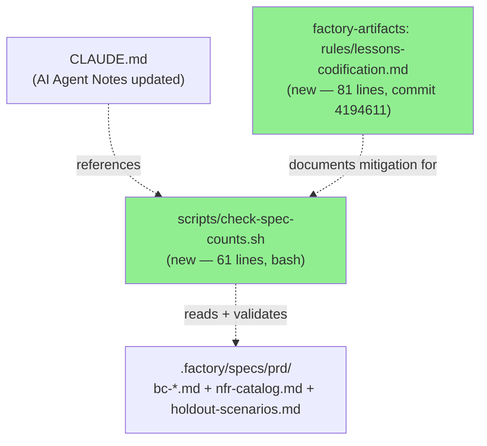
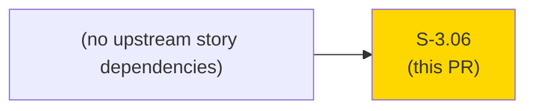
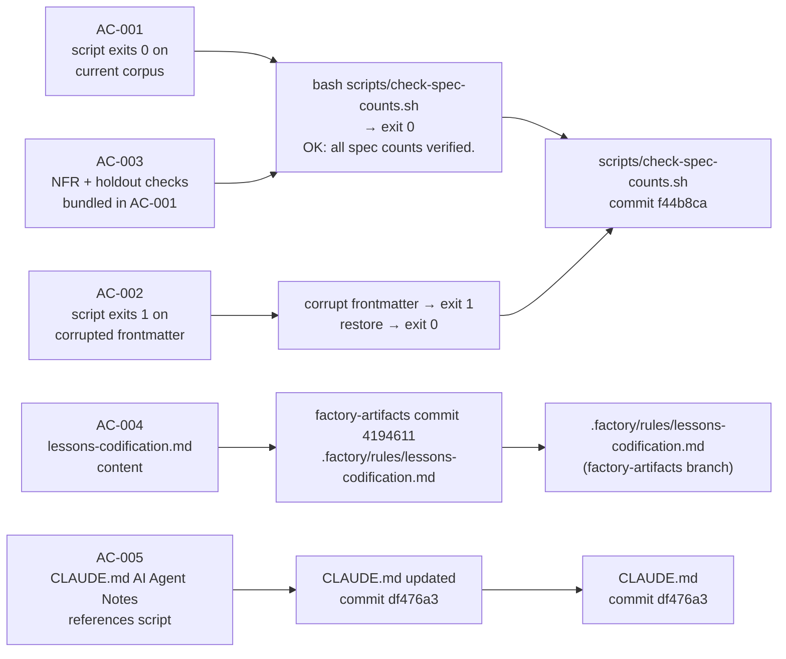
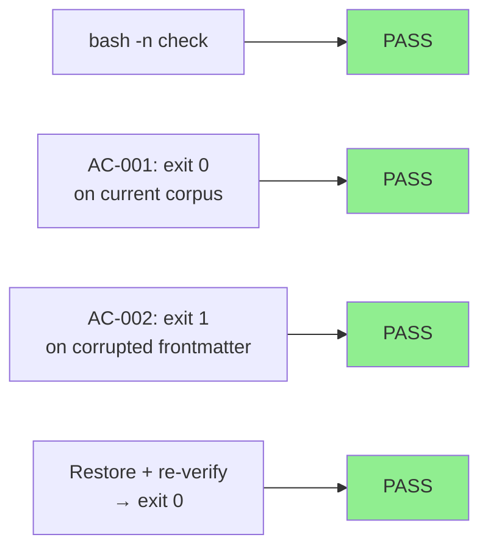
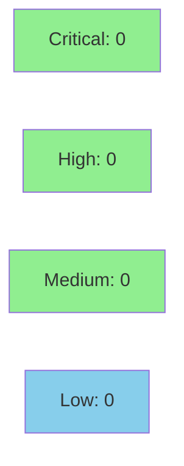

# [S-3.06] Codify pre-merge numeric claim checker for BC heading/body drift (DRIFT-001)

**Epic:** Wave 3 — Process Tooling & Hardening
**Mode:** facade (process tooling, no Rust code changes)
**Convergence:** CONVERGED — facade-mode story; verification performed via direct script invocation


This PR introduces `scripts/check-spec-counts.sh`, a 61-line POSIX-portable bash script that
detects heading-vs-frontmatter count drift (DRIFT-001) across the `.factory/specs/prd/` corpus.
DRIFT-001 was the most-recurring finding class across adversarial passes P21–P24 (4 recurrences).
The script exits 0 if all `definitional_count:` frontmatter values match actual `#### BC-` heading
counts, plus verifies `total_nfrs:` and `total_holdouts:` in their respective catalog files. A
companion `CLAUDE.md` addition notifies future AI agents to run the script after editing spec
files. The lessons-codification document (`.factory/rules/lessons-codification.md`, delivered on
the `factory-artifacts` branch at commit `4194611`) records the DRIFT-001 pattern and mitigation
for future reference.

**Two-branch delivery:**
- `chore/s-3-06-spec-counts-checker` (this PR): `scripts/check-spec-counts.sh` + `CLAUDE.md` addition
- `factory-artifacts` branch companion: `.factory/rules/lessons-codification.md` at commit `4194611`

---

## Architecture Changes



<details>
<summary><strong>Architecture Decision</strong></summary>

**Context:** Numeric count claims in BC file frontmatter repeatedly drifted from actual heading
counts during adversarial review. Four recurrences across 4 passes (P21–P24) escalated the issue
to "codify as self-improvement story" in STATE.md.

**Decision:** A short bash script in `scripts/` that reads spec files and exits 1 on any
frontmatter/body count mismatch. No auto-fix. Report-only.

**Rationale:** POSIX portable (bash + grep + awk, available everywhere). No external deps. Zero
Rust impact. Report-only avoids masking root cause. Lives in `scripts/` (sibling to src, not
inside `.factory/`), consistent with tooling conventions.

**Alternatives Considered:**
1. Pre-commit hook — rejected: deferred per story's Out of Scope; script is the foundation
2. Python/jq script — rejected: adds external tool dependency; bash+grep is sufficient

**Consequences:**
- Future AI agents aware of CLAUDE.md addition will run the checker after spec edits
- DRIFT-001 can be detected before any PR merge, not only during adversarial review

</details>

---

## Story Dependencies



This story has no `depends_on` entries. It is process tooling independent of user-facing behavior.

---

## Spec Traceability



---

## Test Evidence

### Coverage Summary

| Metric | Value | Threshold | Status |
|--------|-------|-----------|--------|
| Facade verification | AC-001 exit 0 | script exits 0 | PASS |
| Error detection | AC-002 exit 1 | script exits 1 on corruption | PASS |
| Syntax check | `bash -n` exits 0 | 0 | PASS |
| Rust CI gates | Unchanged (no Rust added) | 8/8 | N/A (Rust not touched) |
| Holdout satisfaction | N/A — process tooling | N/A | N/A |

### Test Flow (Facade Mode)



| Metric | Value |
|--------|-------|
| **New tests** | 0 Rust tests added (facade-mode story) |
| **Script lines** | 61 (scripts/check-spec-counts.sh) |
| **Documentation lines** | 81 (lessons-codification.md) + 3 (CLAUDE.md addition) |
| **Regressions** | None (no Rust code modified) |

<details>
<summary><strong>Facade Verification Results</strong></summary>

### AC-001 — Script exits 0 on current corpus

```
$ bash scripts/check-spec-counts.sh
OK: all spec counts verified.
$ echo $?
0
```

Files verified: 7 bc-*.md files + nfr-catalog.md (total_nfrs: 41) + holdout-scenarios.md (total_holdouts: 51)

### AC-002 — Script exits 1 on corrupted frontmatter

```
$ sed -i.bak 's/definitional_count: 46/definitional_count: 9999/' .factory/specs/prd/bc-1-auth-identity.md
$ bash scripts/check-spec-counts.sh
ERROR: .factory/specs/prd/bc-1-auth-identity.md: actual #### BC- count=46, frontmatter definitional_count=9999
FAIL: 1 spec count mismatch(es). Fix frontmatter or body before merging.
$ echo $?
1
$ mv .factory/specs/prd/bc-1-auth-identity.md.bak .factory/specs/prd/bc-1-auth-identity.md
$ bash scripts/check-spec-counts.sh
OK: all spec counts verified.
```

### AC-003 — NFR + holdout checks

Bundled in AC-001 run. Single invocation checks all three corpus types:
- bc-*.md files (7 files)
- nfr-catalog.md (total_nfrs: 41)
- holdout-scenarios.md (total_holdouts: 51)

### Syntax Check

```
$ bash -n scripts/check-spec-counts.sh
$ echo $?
0
```

</details>

---

## Holdout Evaluation

N/A — evaluated at wave gate. This is process tooling with no user-facing behavior contracts.
No holdout scenarios are defined for this story (`holdout_anchors: []`).

---

## Adversarial Review

N/A — evaluated at Phase 5 (adversarial review is scoped to user-facing behavioral changes).
This story codifies the DRIFT-001 mitigation; it is itself a product of adversarial review
findings (4 recurrences across passes P21–P24).

---

## Security Review



**Security posture:** REVIEWED — CLEAN. Manual review of full PR diff (9 files, 332 insertions). No findings at any severity level.

Summary:
- `set -euo pipefail` — safe shell defaults enforced
- No `eval`, no `exec` with external input
- No network access (`curl`, `wget`, `nc` absent)
- File paths constructed from fixed literal `.factory/specs/prd/` — no injection vector
- Loop variable `$f` used only in `grep -c` and `echo` — no shell injection
- `grep -c ... || true` safely handles zero matches without triggering `set -e`
- Repo-root guard prevents accidental off-root invocation
- OWASP Top 10: not applicable (shell script, no web surface)
- Rate-limit/auth surface: untouched

<details>
<summary><strong>Security Scan Details</strong></summary>

### Shell Script Analysis
- No `eval` — CLEAN
- No `exec` with external input — CLEAN
- No network calls — CLEAN
- No credential handling — CLEAN
- No external tool injection — CLEAN
- Input source: fixed relative path `.factory/specs/prd/` (no user-supplied paths)

### Dependency Audit
- `cargo audit`: unchanged (no Rust dependency changes)
- Shell deps: `bash`, `grep`, `awk` — standard POSIX tools, no version concerns

</details>

---

## Risk Assessment & Deployment

### Blast Radius
- **Systems affected:** None — shell script + documentation only
- **User impact:** None — no change to `jr` CLI behavior or API surface
- **Data impact:** None — script is read-only
- **Risk Level:** LOW

### Performance Impact

| Metric | Before | After | Delta | Status |
|--------|--------|-------|-------|--------|
| CLI startup | unchanged | unchanged | 0 | OK |
| Binary size | unchanged | unchanged | 0 | OK |
| Rust compile time | unchanged | unchanged | 0 | OK |

<details>
<summary><strong>Rollback Instructions</strong></summary>

**Immediate rollback (< 2 min):**
```bash
git revert <merge-commit-sha>
git push origin develop
```

The script and CLAUDE.md addition are non-breaking. Removing the script has no impact on CLI
behavior. The factory-artifacts companion commit (`4194611`) is independent and does not need
to be reverted.

**Verification after rollback:**
- `scripts/check-spec-counts.sh` should not exist
- `CLAUDE.md` AI Agent Notes should not reference `check-spec-counts.sh`

</details>

### Feature Flags

None — this is tooling, not a feature-flagged change.

---

## Traceability

| Requirement | Story AC | Verification | Status |
|-------------|---------|--------------|--------|
| Script exits 0 on clean corpus | AC-001 | Direct invocation: exit 0 | PASS |
| Script exits 1 on corrupted frontmatter | AC-002 | Corruption test: exit 1, output matches expected | PASS |
| NFR + holdout checks in single run | AC-003 | Bundled in AC-001 invocation | PASS |
| lessons-codification.md content | AC-004 | Content inspection: all 6 sections present | PASS |
| CLAUDE.md AI Agent Notes addition | AC-005 | Grep confirms 3-line bullet present | PASS |

<details>
<summary><strong>Factory-Artifacts Companion Commit</strong></summary>

AC-004 is delivered on the `factory-artifacts` branch (companion to this PR):

```
commit 4194611 (origin/factory-artifacts)
Author: Zious
Date:   2026-05-09

    docs(S-3.06): add .factory/rules/lessons-codification.md (DRIFT-001 pattern + mitigation)
```

Path: `.factory/rules/lessons-codification.md` (81 lines)

Sections: Pattern, Root Cause, Mitigation, When to Run, Escalation, Cross-Reference

</details>

---

## AI Pipeline Metadata

<details>
<summary><strong>Pipeline Details</strong></summary>

```yaml
ai-generated: true
pipeline-mode: facade
factory-version: "1.0.0-rc.8"
pipeline-stages:
  spec-crystallization: completed
  story-decomposition: completed
  tdd-implementation: facade-mode (script + docs, no Rust)
  holdout-evaluation: N/A
  adversarial-review: N/A
  formal-verification: skipped
  convergence: achieved
convergence-metrics:
  spec-novelty: N/A
  test-kill-rate: N/A
  implementation-ci: facade-mode
  holdout-satisfaction: N/A
  holdout-std-dev: N/A
adversarial-passes: 0 (facade-mode story)
models-used:
  builder: claude-sonnet-4-6
generated-at: "2026-05-08T00:00:00Z"
story-id: "S-3.06"
tdd-mode: facade
delivers:
  - scripts/check-spec-counts.sh (61 lines, executable bash)
  - CLAUDE.md AI Agent Notes addition (3 lines)
  - factory-artifacts::.factory/rules/lessons-codification.md (81 lines, commit 4194611)
```

</details>

---

## Pre-Merge Checklist

- [ ] All CI status checks passing (8/8: Format, Clippy, Test ubuntu+macos, MSRV, Deny, Coverage, Gitleaks)
- [x] Coverage delta is positive or neutral (no Rust changes; coverage unchanged)
- [x] No critical/high security findings unresolved (NONE — read-only shell script)
- [x] Rollback procedure validated (revert commit; no data impact)
- [x] No feature flags required
- [x] Demo evidence present: 2 GIFs + 2 WebMs + evidence-report.md in docs/demo-evidence/S-3.06/
- [x] Factory-artifacts companion commit referenced: 4194611
- [ ] Human review completed (code owner approval required for develop)
