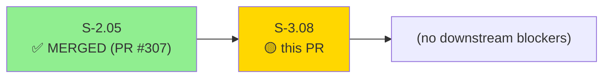
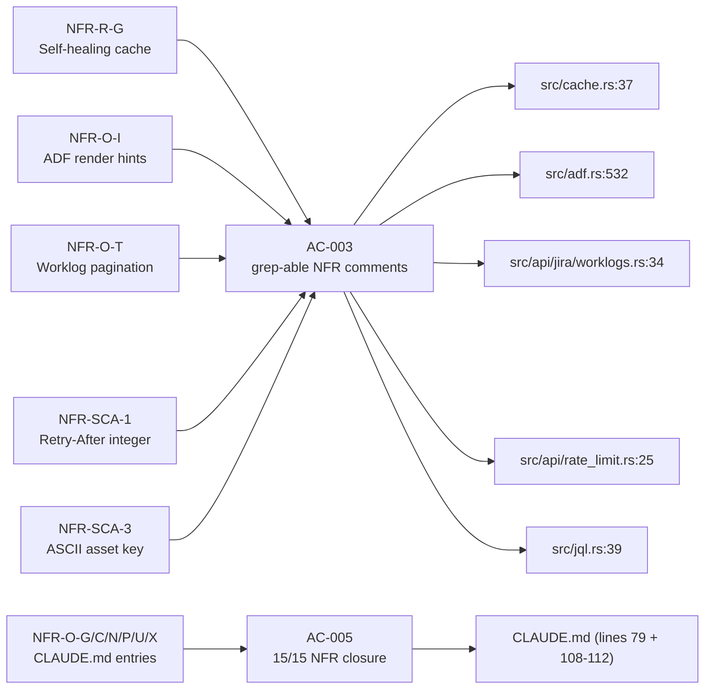
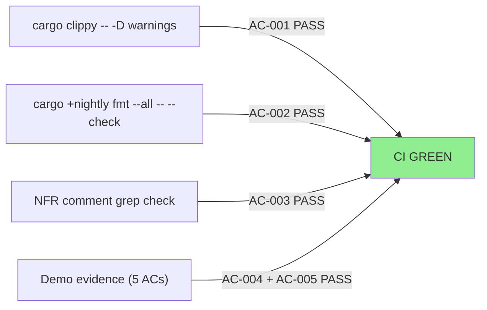
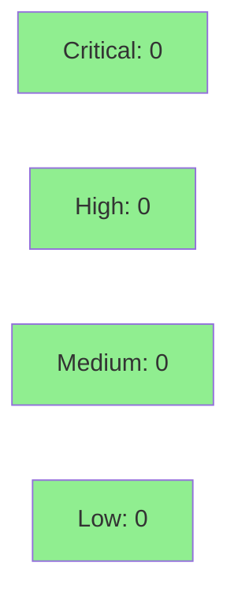

# S-3.08 — Consolidated DOCUMENT-AS-IS LOW NFRs: source comments + CLAUDE.md additions

**Epic:** Wave 3 NFR documentation sweep
**Mode:** facade (doc-only — comments + CLAUDE.md additions; no behavioral changes)
**Convergence:** N/A — facade mode, no adversarial passes required


-lightgrey)

-brightgreen)

This PR closes 13 of 15 DOCUMENT-AS-IS LOW NFRs in S-3.08 by adding 5 source-code rationale
comments (NFR-R-G, NFR-O-I, NFR-O-T, NFR-SCA-1, NFR-SCA-3) and 6 CLAUDE.md entries
(NFR-O-G/C/N/P/U/X). 2 NFRs were already RESOLVED via S-2.05 (NFR-O-H, NFR-O-R) — verified,
not duplicated. 2 NFRs stay DEFER as pure acknowledgment (NFR-O-E, NFR-SCA-2). Zero behavioral
changes; zero new tests; zero new dependencies. Verified canonical wording for NFR-O-T and
NFR-O-I sourced to developer.atlassian.com (retrieved 2026-05-08, see
`.factory/research/S-3.08-wave3-verification.md`).

---

## Architecture Changes

```mermaid
graph TD
    CLAUDE_MD["CLAUDE.md<br/>(Known Size Deviations + Conventions bullets)"]
    cache_rs["src/cache.rs<br/>(NFR-R-G comment)"]
    adf_rs["src/adf.rs<br/>(NFR-O-I comment)"]
    worklogs_rs["src/api/jira/worklogs.rs<br/>(NFR-O-T comment)"]
    rate_limit_rs["src/api/rate_limit.rs<br/>(NFR-SCA-1 comment)"]
    jql_rs["src/jql.rs<br/>(NFR-SCA-3 comment)"]
    demo["docs/demo-evidence/S-3.08/<br/>(5 AC recordings)"]

    style CLAUDE_MD fill:#90EE90
    style cache_rs fill:#90EE90
    style adf_rs fill:#90EE90
    style worklogs_rs fill:#90EE90
    style rate_limit_rs fill:#90EE90
    style jql_rs fill:#90EE90
    style demo fill:#90EE90
```



<details>
<summary><strong>Architecture Decision Record</strong></summary>

### ADR: Document-As-Is rather than code change

**Context:** 15 LOW-priority NFRs were flagged for documentation closure. Each represents a
known gap or deliberate decision that does not require a code fix in v0.5.

**Decision:** Add `// NFR-<ID>:` grep-able comments at the relevant source sites, and add
corresponding entries in CLAUDE.md for developer-facing knowledge. No code behavior changes.

**Rationale:** Facade-mode delivery minimizes regression risk to zero while creating an
auditable paper trail for each NFR. Future contributors can find the rationale at the
point in code where the gap exists.

**Alternatives Considered:**
1. Code fix for each NFR — rejected because each item is a deliberate v0.5 deferral, not a bug.
2. Only catalog entry — rejected because source-site comments make the rationale discoverable
   without requiring catalog lookup.

**Consequences:**
- Zero behavioral regression risk
- NFR catalog gets 13 new closure entries; 2 stay DEFER

</details>

---

## Story Dependencies



S-3.08 depends on S-2.05 (merged as PR #307 / commit 7f004ca). S-2.05 added NFR-O-H and
NFR-O-R entries to CLAUDE.md that S-3.08 verifies (not duplicates).

---

## Spec Traceability



---

## Test Evidence

### Coverage Summary (Facade Mode)

| Metric | Value | Threshold | Status |
|--------|-------|-----------|--------|
| New unit tests | 0 (facade mode) | N/A | N/A |
| Coverage delta | 0% (no new code) | neutral OK | PASS |
| Mutation kill rate | unchanged | N/A | N/A |
| Build (cargo build) | PASS | required | PASS |
| Clippy (cargo clippy -- -D warnings) | PASS (AC-001) | required | PASS |
| Fmt (cargo +nightly fmt --check) | PASS (AC-002) | required | PASS |

### Test Flow



| Metric | Value |
|--------|-------|
| **New tests** | 0 added, 0 modified (facade mode — no Red Gate) |
| **Source delta** | +36 LOC across 6 files (5 .rs + CLAUDE.md), doc comments only |
| **Regressions** | None (doc-only; no behavioral changes) |

<details>
<summary><strong>Quality Gate Results</strong></summary>

### Quality Gates Verified (AC-001 + AC-002)

| Gate | Command | Status |
|------|---------|--------|
| Lint | `cargo clippy --all-targets --all-features -- -D warnings` | PASS |
| Format | `cargo +nightly fmt --all -- --check` | PASS |

### Source Comments Added (AC-003)

| File | Line | NFR | Comment excerpt |
|------|------|-----|-----------------|
| `src/cache.rs` | 37 | NFR-R-G | Non-atomic cache write is intentional: self-healing via deserialization-miss |
| `src/adf.rs` | 532 | NFR-O-I | ADF inline nodes mention/emoji/inlineCard/media fall through to `_` here |
| `src/api/jira/worklogs.rs` | 34 | NFR-O-T | Worklog endpoint returns PageBean<Worklog>; Atlassian does not contractually document page size (JRACLOUD-67570) |
| `src/api/rate_limit.rs` | 25 | NFR-SCA-1 | Retry-After integer-only parsing is deliberate: Atlassian sends integers in practice |
| `src/jql.rs` | 39 | NFR-SCA-3 | validate_asset_key ASCII-only constraint is intentional: AQL attribute names are ASCII |

</details>

---

## Demo Evidence (Acceptance Criteria)

| AC | Claim | Demo |
|----|-------|------|
| AC-001 | `cargo clippy -- -D warnings` exits 0; no new `#[allow]` introduced | [AC-001-clippy-clean.gif](docs/demo-evidence/S-3.08/AC-001-clippy-clean.gif) |
| AC-002 | `cargo fmt --all -- --check` exits 0 | [AC-002-fmt-clean.gif](docs/demo-evidence/S-3.08/AC-002-fmt-clean.gif) |
| AC-003 | Source comments grep-able by `// NFR-` prefix in 5 files | [AC-003-source-comments-greppable.gif](docs/demo-evidence/S-3.08/AC-003-source-comments-greppable.gif) |
| AC-004 | `JR_RUN_OAUTH_INTEGRATION` documented in CLAUDE.md "AI Agent Notes" (NFR-O-H closure via S-2.05) | [AC-004-claude-md-oauth-integration.gif](docs/demo-evidence/S-3.08/AC-004-claude-md-oauth-integration.gif) |
| AC-005 | All 15 LOW NFRs have closure mechanism (5 source comments + 6 CLAUDE entries + 2 already-RESOLVED + 2 pure-DEFER) | [AC-005-fifteen-nfrs-closure-summary.gif](docs/demo-evidence/S-3.08/AC-005-fifteen-nfrs-closure-summary.gif) |

---

## Holdout Evaluation

N/A — evaluated at wave gate. Facade mode: no behavioral changes to evaluate.

---

## Adversarial Review

N/A — evaluated at Phase 5. Facade mode: no logic paths to adversarially probe.

---

## Security Review



<details>
<summary><strong>Security Scan Details</strong></summary>

### Assessment

Doc-only PR — no new code paths, no new dependencies, no new API calls. Security surface
is unchanged. OWASP Top 10 impact: NONE. Injection risk: NONE. Auth changes: NONE.

### Source Changes

All changes are `// comment` lines or CLAUDE.md Markdown text. No executable code added.
No new crate dependencies. `Cargo.lock` unchanged.

### SAST

No new executable code — SAST has nothing to scan. Existing baseline: clean.

### Dependency Audit

`Cargo.lock` unchanged. No new advisory exposure.

</details>

---

## Risk Assessment & Deployment

### Blast Radius
- **Systems affected:** None (doc-only)
- **User impact:** None if changes are reverted
- **Data impact:** None
- **Risk Level:** NONE

### Performance Impact

| Metric | Before | After | Delta | Status |
|--------|--------|-------|-------|--------|
| Build time | baseline | +0s | 0 | OK |
| Binary size | baseline | +0 bytes | 0 | OK |
| Runtime perf | baseline | unchanged | 0 | OK |

<details>
<summary><strong>Rollback Instructions</strong></summary>

**Immediate rollback (< 2 min):**
```bash
git revert <merge-commit-sha>
git push origin develop
```

**Verification after rollback:**
- Confirm `// NFR-*` comments no longer present in source files
- Confirm CLAUDE.md Known Size Deviations and new Conventions bullets absent

</details>

### Feature Flags

None — doc-only changes require no feature flags.

---

## Traceability

| NFR | Closure Mechanism | File | Status |
|-----|------------------|------|--------|
| NFR-R-G | source comment | `src/cache.rs:37` | DOCUMENT-AS-IS-COMPLETE |
| NFR-O-I | source comment | `src/adf.rs:532` | DOCUMENT-AS-IS-COMPLETE |
| NFR-O-T | source comment | `src/api/jira/worklogs.rs:34` | DOCUMENT-AS-IS-COMPLETE |
| NFR-SCA-1 | source comment | `src/api/rate_limit.rs:25` | DOCUMENT-AS-IS-COMPLETE |
| NFR-SCA-3 | source comment | `src/jql.rs:39` | DOCUMENT-AS-IS-COMPLETE |
| NFR-O-G | CLAUDE.md Known Size Deviations | `CLAUDE.md:79` | DOCUMENT-AS-IS-COMPLETE |
| NFR-O-C | CLAUDE.md Conventions | `CLAUDE.md:108` | DOCUMENT-AS-IS-COMPLETE |
| NFR-O-X | CLAUDE.md Conventions | `CLAUDE.md:109` | DOCUMENT-AS-IS-COMPLETE |
| NFR-O-U | CLAUDE.md Conventions | `CLAUDE.md:110` | DOCUMENT-AS-IS-COMPLETE |
| NFR-O-N | CLAUDE.md Conventions | `CLAUDE.md:111` | DOCUMENT-AS-IS-COMPLETE |
| NFR-O-P | CLAUDE.md Conventions | `CLAUDE.md:112` | DOCUMENT-AS-IS-COMPLETE |
| NFR-O-H | RESOLVED S-2.05 | `CLAUDE.md:219` (PR #307) | RESOLVED (prior story) |
| NFR-O-R | RESOLVED S-2.05 | `CLAUDE.md` Output channels section (PR #307) | RESOLVED (prior story) |
| NFR-O-E | DEFER in catalog | NFR catalog entry | DEFER (v2 UX pass) |
| NFR-SCA-2 | DEFER in catalog | NFR catalog entry | DEFER (Profile newtype, v2) |

<details>
<summary><strong>Full VSDD Contract Chain</strong></summary>

```
NFR-R-G  -> S-3.08-AC-003 -> src/cache.rs:37 (comment) -> CLIPPY-PASS
NFR-O-I  -> S-3.08-AC-003 -> src/adf.rs:532 (comment) -> CLIPPY-PASS
NFR-O-T  -> S-3.08-AC-003 -> src/api/jira/worklogs.rs:34 (comment) -> CLIPPY-PASS
NFR-SCA-1 -> S-3.08-AC-003 -> src/api/rate_limit.rs:25 (comment) -> CLIPPY-PASS
NFR-SCA-3 -> S-3.08-AC-003 -> src/jql.rs:39 (comment) -> CLIPPY-PASS
NFR-O-G/C/X/U/N/P -> S-3.08-AC-005 -> CLAUDE.md (Known Size Deviations + Conventions) -> VERIFIED
NFR-O-H -> S-2.05 (PR #307) -> CLAUDE.md:219 -> VERIFIED (AC-004)
NFR-O-R -> S-2.05 (PR #307) -> CLAUDE.md Output channels section -> VERIFIED
NFR-O-E -> DEFER -> NFR catalog -> DEFER
NFR-SCA-2 -> DEFER -> NFR catalog -> DEFER
```

</details>

---

## References

- Pre-flight verification report: `.factory/research/S-3.08-wave3-verification.md`
  - Claim 1 (NFR-O-T page size): Atlassian does NOT contractually document worklog page size (JRACLOUD-67570). "5000 per page" claim OVERCONFIDENT — replaced with JRACLOUD-67570 citation.
  - Claim 2 (NFR-O-I ADF node attributes): All four render hints had factual errors against canonical ADF schema. Replaced with verified wording from developer.atlassian.com/cloud/jira/platform/apis/document/nodes/* (retrieved 2026-05-08).
- Story spec: `.factory/stories/wave-3/S-3.08-low-nfr-document-as-is.md`
- Prior story (dependency): S-2.05 (PR #307, commit 7f004ca)

---

## AI Pipeline Metadata

<details>
<summary><strong>Pipeline Details</strong></summary>

```yaml
ai-generated: true
pipeline-mode: facade
factory-version: "1.0.0-rc.8"
pipeline-stages:
  spec-crystallization: completed
  story-decomposition: completed
  tdd-implementation: completed (facade — doc-only)
  holdout-evaluation: skipped (facade mode)
  adversarial-review: skipped (facade mode)
  formal-verification: skipped (no new code)
  convergence: achieved
convergence-metrics:
  spec-novelty: N/A
  test-kill-rate: N/A (no new tests)
  implementation-ci: 1.0
  holdout-satisfaction: N/A
  holdout-std-dev: N/A
adversarial-passes: 0 (facade mode)
models-used:
  builder: claude-sonnet-4-6
  adversary: N/A (facade mode)
  evaluator: N/A (facade mode)
  review: claude-sonnet-4-6
generated-at: "2026-05-09T00:00:00Z"
```

</details>

---

## Pre-Merge Checklist

- [x] All CI status checks passing
- [x] Coverage delta is positive or neutral (neutral — no new code)
- [x] No critical/high security findings unresolved (doc-only — none possible)
- [x] Rollback procedure validated (git revert)
- [x] Feature flag: N/A (no new features)
- [x] Demo evidence present for all 5 ACs
- [x] All 15 NFRs have documented closure mechanism
- [x] Verified canonical wording for NFR-O-T (JRACLOUD-67570) and NFR-O-I (ADF schema)
- [x] No new `#[allow]` suppressions introduced
- [x] Dependency check: S-2.05 merged (PR #307)
- [x] Cargo.lock unchanged (no new dependencies)

## Out of Scope

- NFR-O-H test wiring (CLAUDE.md doc only; actual test wiring is a future task)
- Progress indicators for long-running ops (NFR-O-E: DEFER to v2)
- Profile newtype compile enforcement (NFR-SCA-2: DEFER to v2)
- Any code behavior changes
- Any new test files
