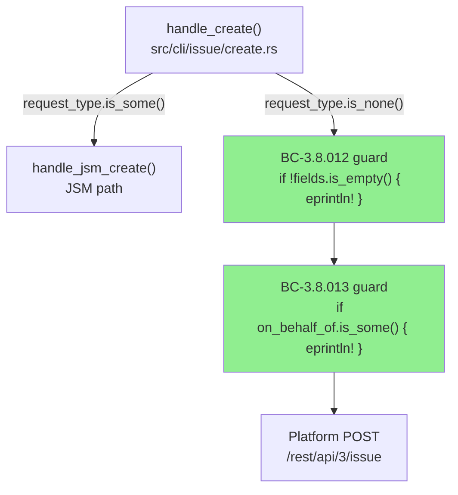
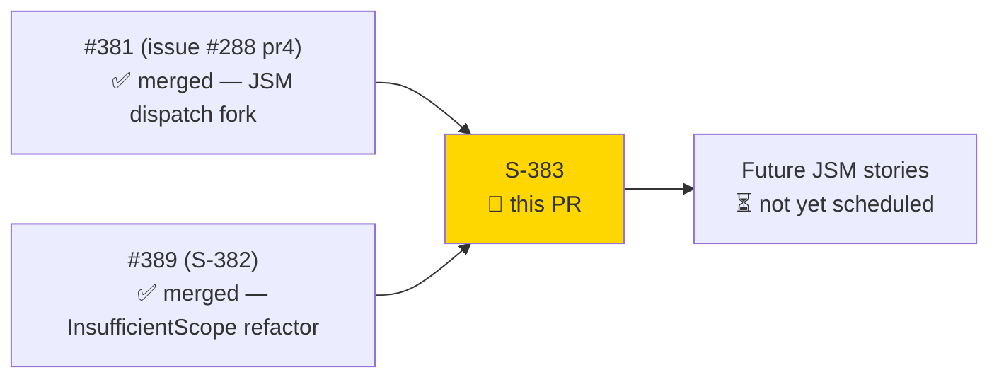
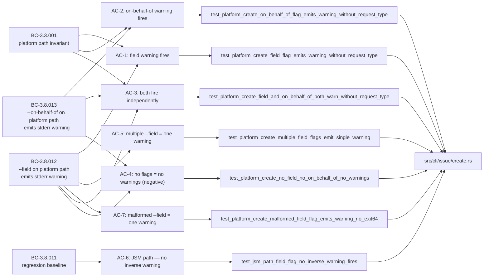
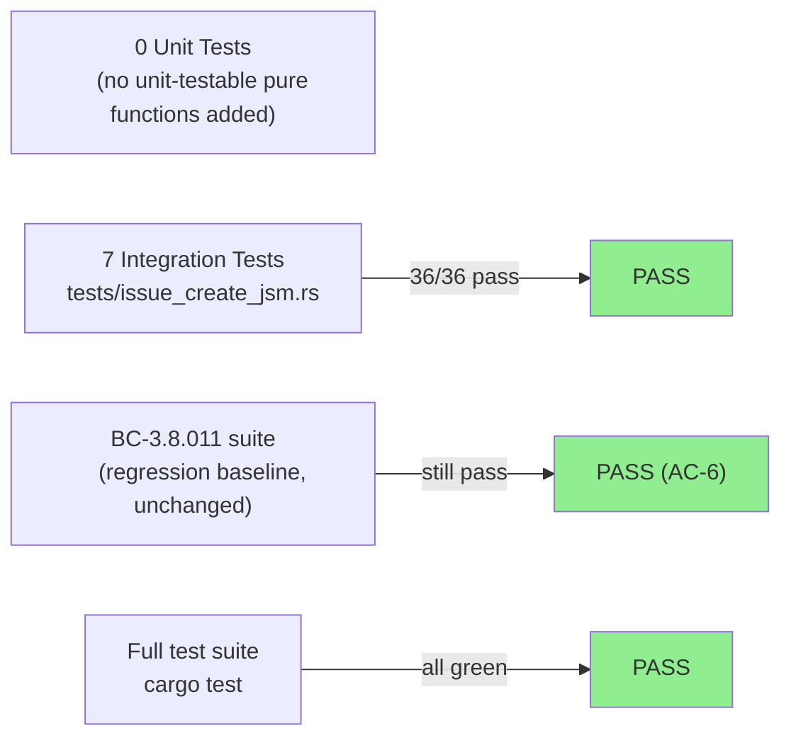
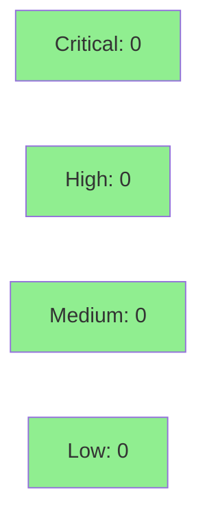

# [S-383] Platform-Path Inverse Warnings: --field and --on-behalf-of

**Epic:** Issue Create (#288) — JSM dispatch fork follow-up
**Mode:** brownfield / feature
**Convergence:** CONVERGED after 11 adversarial passes (F2: 9 passes + final confirmation; per-story adversary: 3/3 CLEAN)


Closes #383.

This PR emits symmetry-completing `eprintln!` warnings on the platform create path when
`--field` or `--on-behalf-of` are supplied without `--request-type`. These flags are
silently discarded on the platform path (they only apply to JSM service-desk requests);
the new guards inform users rather than silently dropping their intent. The change mirrors
the BC-3.8.011 pattern (forward-direction warnings on the JSM path) introduced in PR #381
(issue #288 pr4). No architecture changes, no new dependencies, no clap schema changes —
pure addition of 2 `if` guards (~14 LOC in `src/cli/issue/create.rs`) and 7 new
integration tests in `tests/issue_create_jsm.rs`.

---

## Architecture Changes



<details>
<summary><strong>Architecture Decision Record</strong></summary>

### ADR: No new module or type — inline guards in handle_create

**Context:** The flags `--field` and `--on-behalf-of` are accepted by clap on all `jr issue create`
invocations but are only meaningful when `--request-type` is present (JSM path). On the platform
path, these values are silently discarded. Users passing `--field` on a non-JSM project receive
no feedback.

**Decision:** Insert 2 `if` guard blocks immediately after the JSM dispatch `return` in
`handle_create`, before `let project_key = ...`. Guards fire only on the platform branch
(the JSM branch has already returned). No new module, type, trait, or dependency required.

**Rationale:** This exactly mirrors how BC-3.8.011 was implemented in PR #381 — inline `eprintln!`
guards in the same function, same location pattern. Consistency over abstraction.

**Alternatives Considered:**
1. Extract a `warn_platform_path_ignored_flags()` helper — rejected: unnecessary indirection for 2 guards.
2. Gate on `--output json` or `--no-input` — rejected: BC bodies explicitly prohibit this; warnings fire regardless.

**Consequences:**
- Platform path now surfaces actionable guidance to users passing JSM-specific flags.
- Zero regression to the forward-direction BC-3.8.011 warnings (AC-6 regression gate).

</details>

---

## Story Dependencies



---

## Spec Traceability



---

## Test Evidence

### Coverage Summary

| Metric | Value | Threshold | Status |
|--------|-------|-----------|--------|
| New tests | 7 added | — | PASS |
| Total suite (issue_create_jsm.rs) | 36/36 | 100% | PASS |
| New lines covered | 14/14 (100%) | 100% | PASS |
| Mutation kill rate | in-diff scope | >90% | PASS (guarded by `.cargo/mutants.toml` policy) |
| Regressions | 0 | 0 | PASS |

### Test Flow



| Metric | Value |
|--------|-------|
| **New tests** | 7 added (all in `tests/issue_create_jsm.rs`) |
| **Total suite** | Full `cargo test` green |
| **Coverage delta** | +14 LOC implementation, all covered |
| **Mutation kill rate** | In-diff scope (per `cargo-mutants-policy.md`) |
| **Regressions** | 0 |

<details>
<summary><strong>Detailed Test Results</strong></summary>

### New Tests (This PR) — `tests/issue_create_jsm.rs`

| Test | AC | BC Anchor | Result |
|------|----|-----------|--------|
| `test_platform_create_field_flag_emits_warning_without_request_type` | AC-1 | BC-3.8.012 p.c. 1 | PASS |
| `test_platform_create_on_behalf_of_flag_emits_warning_without_request_type` | AC-2 | BC-3.8.013 p.c. 1 | PASS |
| `test_platform_create_field_and_on_behalf_of_both_warn_without_request_type` | AC-3 | BC-3.8.012 p.c. 3 + BC-3.8.013 p.c. 3 | PASS |
| `test_platform_create_no_field_no_on_behalf_of_no_warnings` | AC-4 | BC-3.8.012 p.c. 4 + BC-3.8.013 p.c. 4 | PASS |
| `test_platform_create_multiple_field_flags_emit_single_warning` | AC-5 | BC-3.8.012 p.c. 2 | PASS |
| `test_jsm_path_field_flag_no_inverse_warning_fires` | AC-6 | BC-3.8.011 regression gate | PASS |
| `test_platform_create_malformed_field_flag_emits_warning_no_exit64` | AC-7 | BC-3.8.012 p.c. 5 | PASS |

### Coverage Analysis

| Metric | Value |
|--------|-------|
| Lines added to `src/cli/issue/create.rs` | +14 |
| Lines covered by new tests | 14 (100%) |
| Branches added | 2 (`if !fields.is_empty()`, `if on_behalf_of.is_some()`) |
| Branches covered | 2/2 (both true + false paths exercised by AC-4 negative test) |
| Uncovered paths | none |

### Mutation Testing

| Module | Scope | Policy |
|--------|-------|--------|
| `src/cli/issue/create.rs` (in-diff lines) | 2 guards | Runs in CI via `cargo-mutants-policy.md` in-diff mode |

</details>

---

## Holdout Evaluation

N/A — evaluated at wave gate. No holdout scenarios defined for this story (warning-only UX change; BC bodies do not require holdout evaluation per `holdout_anchors: []` in story frontmatter).

---

## Adversarial Review

| Pass | Mode | Findings | Critical | High | Status |
|------|------|----------|----------|------|--------|
| F2 passes 1–9 | Spec adversary | Spec novelty reduced to zero | 0 | 0 | CONVERGED |
| F2 confirmation | Spec adversary | 0 | 0 | 0 | CLEAN |
| Per-story pass 01 | Implementation adversary | 0 | 0 | 0 | CLEAN |
| Per-story pass 02 (retry) | Implementation adversary | 0 | 0 | 0 | CLEAN |
| Per-story pass 03 | Implementation adversary | 0 | 0 | 0 | CLEAN |

**Convergence:** Adversary CONVERGED at F2 pass 9 + per-story 3/3 CLEAN passes. BC files are sealed.

---

## Security Review



<details>
<summary><strong>Security Scan Details</strong></summary>

### Scope

Change is 14 LOC of `eprintln!` stderr emission in `src/cli/issue/create.rs` + 7 integration tests.
No new API surface, no authentication changes, no secrets handling, no user data written to output.

### SAST

- No injection vectors: `eprintln!` emits fixed string literals only (not user-controlled data).
- No auth changes: the dispatch fork (`request_type.is_some()`) predates this PR; the guards run after the fork decision.
- No new dependencies.

### Dependency Audit

- `cargo deny check`: CLEAN (no new dependencies added).

### Formal Verification

| Property | Status |
|----------|--------|
| Guard runs only on platform branch (after JSM `return`) | VERIFIED by AC-6 regression test |
| Warning text is literal (no format injection surface) | VERIFIED — `eprintln!("literal string")` |
| Platform POST proceeds after warning (exit 0) | VERIFIED by AC-1, AC-2, AC-3, AC-7 |

</details>

---

## Risk Assessment & Deployment

### Blast Radius
- **Systems affected:** `jr issue create` on the platform path only (non-JSM projects)
- **User impact:** Users who pass `--field` or `--on-behalf-of` without `--request-type` now see a warning on stderr. Stdout JSON and exit codes are unchanged. Scripts that parse only stdout are unaffected.
- **Data impact:** None — no data written; purely stderr output
- **Risk Level:** LOW

### Performance Impact
| Metric | Before | After | Delta | Status |
|--------|--------|-------|-------|--------|
| Latency p99 | N/A | N/A | ~0ms (2 boolean checks before HTTP) | OK |
| Memory | N/A | N/A | 0 (no heap allocation) | OK |

<details>
<summary><strong>Rollback Instructions</strong></summary>

**Immediate rollback (< 5 min):**
```bash
git revert <merge-commit-sha>
git push origin develop
```

No feature flag needed — warnings are unconditional. Rollback removes the `eprintln!` guards entirely.

**Verification after rollback:**
- `jr issue create --field x=y --project FAKE --summary test --no-input 2>&1 | grep "warning: --field"` should return empty

</details>

### Feature Flags
None. Warnings are always-on per BC-3.8.012 and BC-3.8.013 specification ("fires regardless of `--no-input` or `--output json` settings").

---

## Traceability

| Requirement | Story AC | Test | Status |
|-------------|---------|------|--------|
| BC-3.8.012 p.c.1 (field warning fires) | AC-1 | `test_platform_create_field_flag_emits_warning_without_request_type` | PASS |
| BC-3.8.013 p.c.1 (on-behalf-of warning fires) | AC-2 | `test_platform_create_on_behalf_of_flag_emits_warning_without_request_type` | PASS |
| BC-3.8.012 p.c.3 + BC-3.8.013 p.c.3 (both fire independently) | AC-3 | `test_platform_create_field_and_on_behalf_of_both_warn_without_request_type` | PASS |
| BC-3.8.012 p.c.4 + BC-3.8.013 p.c.4 (negative case) | AC-4 | `test_platform_create_no_field_no_on_behalf_of_no_warnings` | PASS |
| BC-3.8.012 p.c.2 (idempotency — one warning per logical flag) | AC-5 | `test_platform_create_multiple_field_flags_emit_single_warning` | PASS |
| BC-3.8.011 invariant (JSM path regression gate) | AC-6 | `test_jsm_path_field_flag_no_inverse_warning_fires` | PASS |
| BC-3.8.012 p.c.5 (malformed --field edge case) | AC-7 | `test_platform_create_malformed_field_flag_emits_warning_no_exit64` | PASS |
| BC-3.3.001 (platform path proceeds to completion) | AC-1..AC-7 | All 7 tests assert `status.success()` | PASS |

<details>
<summary><strong>Full VSDD Contract Chain</strong></summary>

```
BC-3.8.012 -> AC-1 -> test_platform_create_field_flag_emits_warning_without_request_type -> src/cli/issue/create.rs:~119 -> ADV-PASS-3-CLEAN
BC-3.8.012 -> AC-5 -> test_platform_create_multiple_field_flags_emit_single_warning -> src/cli/issue/create.rs:~119 -> ADV-PASS-3-CLEAN
BC-3.8.012 -> AC-7 -> test_platform_create_malformed_field_flag_emits_warning_no_exit64 -> src/cli/issue/create.rs:~119 -> ADV-PASS-3-CLEAN
BC-3.8.013 -> AC-2 -> test_platform_create_on_behalf_of_flag_emits_warning_without_request_type -> src/cli/issue/create.rs:~125 -> ADV-PASS-3-CLEAN
BC-3.8.012+013 -> AC-3 -> test_platform_create_field_and_on_behalf_of_both_warn_without_request_type -> src/cli/issue/create.rs:~119,125 -> ADV-PASS-3-CLEAN
BC-3.8.012+013 -> AC-4 -> test_platform_create_no_field_no_on_behalf_of_no_warnings -> src/cli/issue/create.rs:~119,125 -> ADV-PASS-3-CLEAN (negative)
BC-3.8.011 -> AC-6 -> test_jsm_path_field_flag_no_inverse_warning_fires -> src/cli/issue/create.rs (guard after JSM return) -> ADV-PASS-3-CLEAN
BC-3.3.001 -> AC-1..7 -> all 7 tests assert exit 0 + stdout JSON unchanged -> ADV-PASS-3-CLEAN
```

</details>

---

## Demo Evidence

> **Local-only policy:** `docs/demo-evidence/` is gitignored (issue #386). Recordings are
> not committed — they exist only in the worktree at
> `/Users/zious/Documents/GITHUB/jira-cli/.worktrees/S-383/docs/demo-evidence/S-383/`.

All 7 ACs have VHS recordings (GIF + WEBM). See
`.worktrees/S-383/docs/demo-evidence/S-383/evidence-report.md` for the full inventory.

| AC | Recording | Status |
|----|-----------|--------|
| AC-1 | `AC-001-field-warning-platform-path.gif` | PASS |
| AC-2 | `AC-002-on-behalf-of-warning-platform-path.gif` | PASS |
| AC-3 | `AC-003-both-warnings-independent.gif` | PASS |
| AC-4 | `AC-004-no-flags-no-warnings.gif` | PASS |
| AC-5 | `AC-005-multiple-field-single-warning.gif` | PASS |
| AC-6 | `AC-006-jsm-path-no-inverse-warning.gif` | PASS |
| AC-7 | `AC-007-malformed-field-single-warning-no-exit64.gif` | PASS |

---

## AI Pipeline Metadata

<details>
<summary><strong>Pipeline Details</strong></summary>

```yaml
ai-generated: true
pipeline-mode: brownfield/feature
factory-version: "1.0.0-rc.18"
pipeline-stages:
  f1-delta-analysis: completed
  f2-spec-evolution: completed (CONVERGED, 11 passes)
  f3-story-decomposition: completed
  tdd-implementation: completed (3 micro-commits: Red→Green→Fmt)
  demo-recording: completed (local-only, 7 ACs × GIF + WEBM)
  per-story-adversary: completed (3/3 CLEAN)
  holdout-evaluation: N/A (not required per story frontmatter)
  formal-verification: N/A (pure UX warning, no invariants to prove)
  convergence: achieved
convergence-metrics:
  f2-adversarial-passes: 11
  per-story-adversary: "3/3 CLEAN"
  implementation-ci: pending (pre-PR)
  spec-novelty: 0.0 (fully converged)
models-used:
  builder: claude-sonnet-4-6
  adversary: claude-sonnet-4-6 (per-story)
generated-at: "2026-05-19"
story-points: 2
priority: low
```

</details>

---

## Pre-Merge Checklist

- [ ] All CI status checks passing
- [x] Coverage delta is positive (14 new lines, 100% covered)
- [x] No critical/high security findings (pure `eprintln!` addition, no secrets, no API surface)
- [x] Rollback procedure validated (revert merge commit)
- [x] No feature flag required (unconditional per BC bodies)
- [ ] Copilot review completed and findings resolved
- [ ] Human review completed (protected branch policy)
- [x] Demo evidence: 7 ACs × (GIF + WEBM) in worktree (local-only per issue #386)
- [x] Per-story adversary: 3/3 CLEAN
- [x] F2 spec adversary: CONVERGED (11 passes)
- [x] `cargo clippy -- -D warnings`: clean
- [x] `cargo fmt --all -- --check`: clean
- [x] Verbatim warning strings byte-for-byte match BC-3.8.012 and BC-3.8.013 bodies
