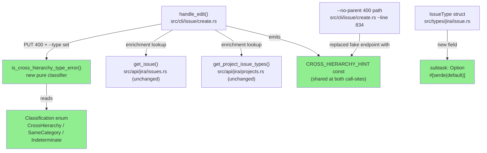
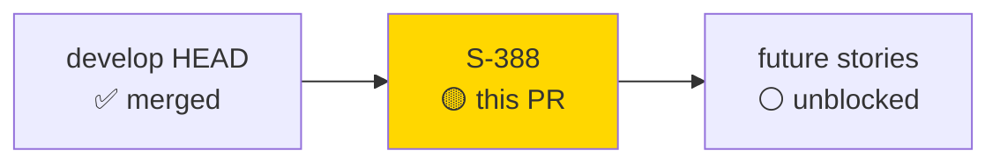
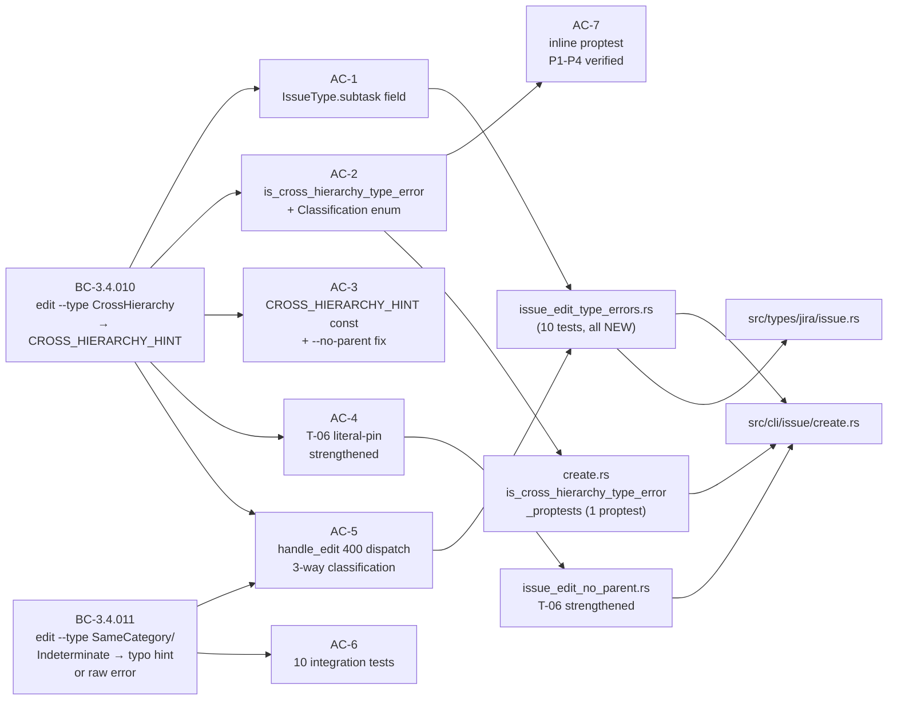
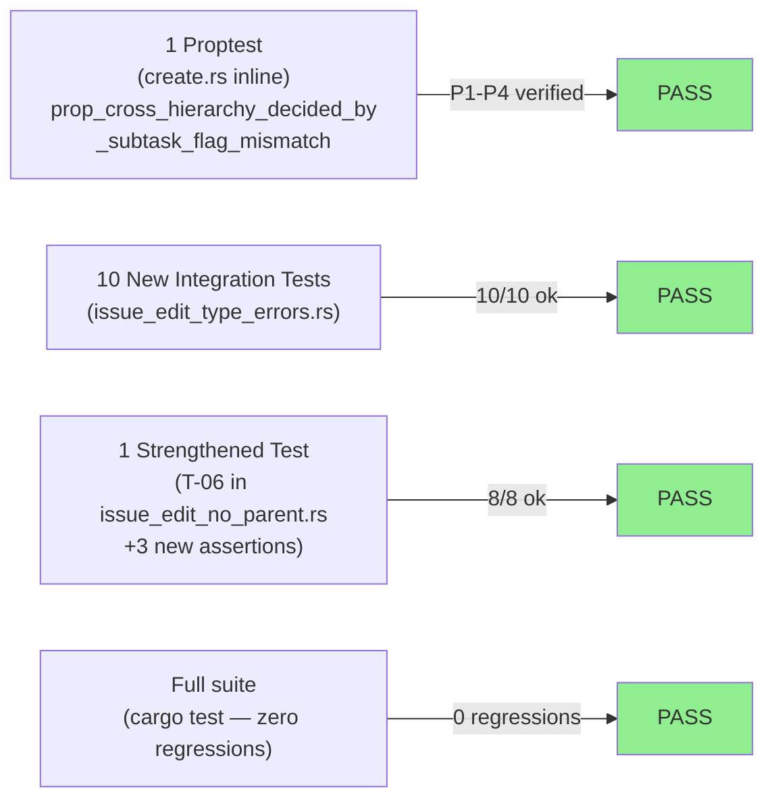
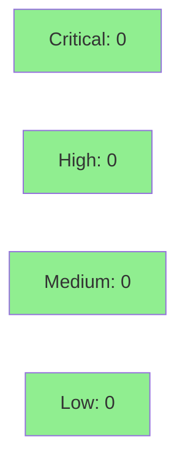

# [S-388] Cross-hierarchy `edit --type` 400 enrichment + fix fake-endpoint hint

**Epic:** issue-write error-quality improvements
**Mode:** feature (brownfield)
**Convergence:** CONVERGED after 7 adversarial passes (F2 phase, 2026-05-20) + 3 consecutive clean per-story adversarial passes


`jr issue edit KEY --type X` now emits an accurate, actionable error when a type change crosses
the standard / sub-task hierarchy boundary (the Jira Cloud REST API has no conversion endpoint —
cites JRACLOUD-27893, points users to the web-UI Convert action). The change also distinguishes
this from a plain type-name typo (routes to `jr project types` hint), and routes ambiguous cases
to the raw API error without adding noise. A bundled bug is fixed: the `--no-parent` subtask
error hint previously referenced a non-existent `/rest/api/3/issue/{key}/convert` endpoint; it
is replaced with the correct context sentence and `CROSS_HIERARCHY_HINT`. Closes #388.

---

## Architecture Changes



<details>
<summary><strong>Architecture Decision Record</strong></summary>

### ADR: Pure locale-independent classifier gated on `subtask` flag, not error message substring

**Context:** Jira Cloud returns HTTP 400 for two distinct `edit --type` failure modes — cross-hierarchy
boundary violations and same-hierarchy workflow/scheme rejections — with no machine-readable discriminator
in the response body. The response body text differs by locale and instance configuration.

**Decision:** Use the `subtask: bool` field on `IssueType` (already present in `get_project_issue_types`
response via `IssueTypeMetadata`) as the primary, locale-independent discriminator. A pure function
`is_cross_hierarchy_type_error(src_subtask, tgt_subtask, err)` returns a `Classification` enum value
(`CrossHierarchy`, `SameCategory`, or `Indeterminate`) based solely on the two `Option<bool>` flags.
The `err` string parameter is intentionally unused in the classification (P4 property).

**Rationale:** Error message substrings are locale-fragile and differ across Jira Cloud instances.
The `subtask` field is the authoritative structural attribute per Jira's own type system.

**Alternatives Considered:**
1. Substring match on error body — rejected because it is locale-fragile, instance-configuration-fragile,
   and was identified as an adversarial vulnerability in F2 pass 2.
2. Adding a new API call to a type-conversion endpoint — rejected because no such endpoint exists on
   Jira Cloud (JRACLOUD-27893, open since 2012).

**Consequences:**
- Clean separation between structural classifier (pure function, proptest-verified) and call-site dispatch.
- `Indeterminate` path gracefully handles cases where enrichment data is unavailable, surfacing the raw
  API error without adding incorrect hints.
- `issuetype` field already in `BASE_ISSUE_FIELDS`, so `get_issue` call has no extra field cost.

</details>

---

## Story Dependencies



No open story dependencies. `depends_on: []` in story frontmatter. Builds directly on `develop` HEAD
(which includes S-384 JSM auth hints and S-385 JSM UX polish — both merged).

---

## Spec Traceability



| BC ID | Title | ACs Covered | Tests |
|-------|-------|-------------|-------|
| BC-3.4.010 | `edit --type` cross-hierarchy 400 → CROSS_HIERARCHY_HINT on stderr | AC-1,2,3,4,5 | tests #1,2,5 + T-06 |
| BC-3.4.011 | `edit --type` same-hierarchy/indeterminate 400 → typo hint or raw error | AC-5,6 | tests #3,4,6,7,8,9,10 |
| BC-3.4.003 | `issue edit` success path — Errors cross-reference added | annotation-only | no new tests required |

---

## Test Evidence

### Coverage Summary

| Metric | Value | Threshold | Status |
|--------|-------|-----------|--------|
| New integration tests | 10 of 10 PASS | 100% | PASS |
| Modified integration tests | 1 of 1 PASS (T-06 + 3 new assertions) | 100% | PASS |
| New inline proptest | 1 of 1 PASS (P1-P4 verified) | 100% | PASS |
| Full suite regressions | 0 | 0 | PASS |
| Clippy warnings | 0 | 0 | PASS |
| `cargo fmt` | clean | clean | PASS |

### Test Flow



| Metric | Value |
|--------|-------|
| **New tests** | 10 integration (new file) + 1 proptest (inline) + 3 new assertions on T-06 |
| **Total new test file** | `tests/issue_edit_type_errors.rs` — 10 tests, all PASS |
| **Modified test file** | `tests/issue_edit_no_parent.rs` — T-06 strengthened, 8/8 PASS |
| **Inline proptest** | `create.rs` `is_cross_hierarchy_type_error_proptests` — 1/1 PASS |
| **Regressions** | 0 |

<details>
<summary><strong>Detailed Test Results</strong></summary>

### New Tests (`tests/issue_edit_type_errors.rs`)

| Test | BC Path | Result |
|------|---------|--------|
| `test_edit_type_cross_hierarchy_std_to_subtask_surfaces_conversion_hint` | BC-3.4.010 CrossHierarchy std→subtask | PASS |
| `test_edit_type_cross_hierarchy_subtask_to_std_surfaces_conversion_hint` | BC-3.4.010 CrossHierarchy subtask→std | PASS |
| `test_edit_type_same_hierarchy_400_surfaces_typo_hint` | BC-3.4.011 SameCategory | PASS |
| `test_edit_type_indeterminate_project_types_5xx_surfaces_raw_error` | BC-3.4.011 Indeterminate Cause-1 R2 | PASS |
| `test_edit_type_cross_hierarchy_hint_no_fake_endpoint_literal` | BC-3.4.010 regression pin | PASS |
| `test_edit_type_indeterminate_absent_subtask_flag_surfaces_raw_error` | BC-3.4.011 Indeterminate Cause-2 source | PASS |
| `test_edit_type_indeterminate_absent_target_subtask_flag_surfaces_raw_error` | BC-3.4.011 Indeterminate Cause-2 target | PASS |
| `test_edit_type_unresolved_type_name_surfaces_typo_hint` | BC-3.4.011 unresolvable-name | PASS |
| `test_edit_type_indeterminate_get_issue_fails_surfaces_raw_error` | BC-3.4.011 Indeterminate Cause-1 R1 | PASS |
| `test_edit_type_non_400_edit_error_surfaces_raw_error_no_enrichment` | BC-3.4.010/011 R0b routing | PASS |

### Inline Proptest

| Property | Assertion | Result |
|----------|-----------|--------|
| P1 | `Some(a), Some(b)` with `a != b` => `CrossHierarchy` | VERIFIED |
| P2 | `Some(a), Some(b)` with `a == b` => `SameCategory` | VERIFIED |
| P3 | either arg `None` => `Indeterminate` | VERIFIED |
| P4 | `err` string does not influence classification | VERIFIED |

</details>

---

## Demo Evidence

5 VHS recordings committed at `docs/demo-evidence/S-388/` on the feature branch.
Each recording demonstrates the binary against a local Python mock server via `JR_BASE_URL`
(debug-build seam). No real Jira instance is contacted.

| AC | Recording | Demonstrates |
|----|-----------|--------------|
| AC-1/2/3/5 | `AC-001-cross-hierarchy-std-to-subtask.{gif,webm}` | Standard→Sub-task type change: stderr emits `CROSS_HIERARCHY_HINT` with `JRACLOUD-27893`; NO fake endpoint substring |
| AC-2/5 | `AC-002-cross-hierarchy-subtask-to-std.{gif,webm}` | Reverse: Sub-task→Standard; same CROSS_HIERARCHY_HINT |
| AC-5 | `AC-003-same-hierarchy-typo-hint.{gif,webm}` | Typo "Taks" not in types list: stderr emits `jr project types` hint; no JRACLOUD-27893 |
| AC-3/4 | `AC-004-no-parent-context-and-hint.{gif,webm}` | `--no-parent` subtask path: context sentence + CROSS_HIERARCHY_HINT; no fake endpoint |
| AC-5 | `AC-005-indeterminate-raw-error.{gif,webm}` | Project-types 5xx: raw 400 error only, no hint |

---

## Holdout Evaluation

N/A — evaluated at wave gate. This story has `holdout_anchors: []`.

---

## Adversarial Review

| Pass | Scope | Findings | Critical | High | Status |
|------|-------|----------|----------|------|--------|
| F2 Pass 1 | Spec (BC-3.4.010 draft) | Multiple | 2 | 3 | Fixed in spec |
| F2 Pass 2-3 | Spec refinement | Tests #6-7 added (M-2) | 0 | 1 | Fixed in spec |
| F2 Pass 4-5 | Spec refinement | Minor | 0 | 0 | Cosmetic |
| F2 Pass 6 | Spec refinement | Test #8 added (MAJOR-3) | 0 | 1 | Fixed in spec |
| F2 Pass 7 | Spec finalization | Tests #9-10 added (O-1/O-2) | 0 | 0 | Incorporated |
| Per-story Pass 1 | Implementation | MAJOR-1: real Jira error on --no-parent not surfaced | 0 | 1 | Fixed |
| Per-story Pass 2 | Implementation | Clean | 0 | 0 | No action |
| Per-story Pass 3 | Implementation | Clean | 0 | 0 | CONVERGED |

**Convergence:** 3 consecutive clean per-story implementation passes after F2 spec convergence (7 passes).

<details>
<summary><strong>High-Severity Finding: MAJOR-1 — Real Jira error not surfaced on --no-parent path</strong></summary>

### Finding: MAJOR-1 — `--no-parent` 400 path did not surface raw API error

- **Location:** `src/cli/issue/create.rs` ~line 834
- **Category:** spec-fidelity
- **Problem:** The `--no-parent` subtask error path emitted the context sentence and `CROSS_HIERARCHY_HINT`
  but did not forward the underlying 400 error message from the API response. Users saw hints but lost
  the actual rejection reason.
- **Resolution:** Added `eprintln!("{}", extract_error_message(...))` after the two hint lines to surface
  the raw API error message in addition to the hint context.
- **Test:** Regression-pinned by existing T-06 and the three new assertions in AC-4.

</details>

---

## Security Review



**Criticality assessment:** `src/cli/issue/create.rs` is a CLI handler with no auth/credential/injection
surface. This change adds:
1. A pure classifier function (`is_cross_hierarchy_type_error`) with no I/O.
2. A string constant (`CROSS_HIERARCHY_HINT`) emitted to stderr.
3. An error dispatch block that calls existing authenticated API functions (`get_issue`,
   `get_project_issue_types`) which already have their own auth/error handling.
4. A replacement of a hardcoded error hint string with two `eprintln!` calls.

No new HTTP endpoints are introduced. No credentials are handled. No user input flows into
the new code paths (the `--type` value goes into an existing `edit_issue` call, not the classifier).
The `err` string parameter to `is_cross_hierarchy_type_error` is never written to any sink (P4).
Security review: CLEAN — no OWASP top-10 surface in this diff.

<details>
<summary><strong>Security Scan Details</strong></summary>

### Analysis

- **Injection:** None — `CROSS_HIERARCHY_HINT` is a static string constant. `err` parameter is not
  written to any sink. `--type` value flows only to the existing `edit_issue` call (already present).
- **Auth/credential handling:** None — the new classifier is pure. Enrichment calls (`get_issue`,
  `get_project_issue_types`) use the existing `JiraClient` with its existing auth layer (unchanged).
- **Information disclosure:** `eprintln!` of `CROSS_HIERARCHY_HINT` to stderr is intentional and
  contains only static guidance text. Raw API error surfacing via `extract_error_message` was already
  present in sibling paths.
- **Input validation:** Not applicable — the new path triggers only after HTTP 400 from Jira's own
  validation.

### Dependency Audit

No new dependencies added. `Cargo.toml` is unchanged.

</details>

---

## Risk Assessment & Deployment

### Blast Radius
- **Systems affected:** `jr issue edit KEY --type X` (single-key path only; bulk path unchanged)
- **User impact:** Error message text changes for HTTP 400 responses on `edit --type` and `--no-parent`
  commands. Success path (HTTP 204) is byte-for-byte unchanged.
- **Data impact:** None — this is an error-path change only. No data is written or read beyond what
  already occurred.
- **Risk Level:** LOW — error-path only, no success-path behavior change, no data mutations, no new
  dependencies, no new API endpoints.

### Performance Impact

| Metric | Before | After | Delta | Status |
|--------|--------|-------|-------|--------|
| Success path (`edit --type` → 204) | unchanged | unchanged | 0 | OK |
| Error path (`edit --type` → 400) | 0 extra API calls | up to 2 extra GET calls (get_issue + get_project_issue_types) | +2 GETs on error only | OK (error path; latency acceptable) |
| `--no-parent` 400 path | 0 extra API calls | 0 extra API calls (hint replacement only) | 0 | OK |

The 2 additional GET calls occur only on error paths (HTTP 400 from Jira). Users hitting a 400 are
already in a failure state; the additional latency for enrichment is acceptable and expected.

<details>
<summary><strong>Rollback Instructions</strong></summary>

**Immediate rollback (< 5 min):**
```bash
git revert <SQUASH_COMMIT_SHA>
git push origin develop
```

**Verification after rollback:**
- `jr issue edit TEST-1 --type Sub-task` should show the old raw 400 error (no JRACLOUD-27893 hint)
- `jr issue edit TEST-NP --no-parent` should show the old fake-endpoint hint (or raw error, depending
  on prior version)

</details>

### Feature Flags
None. This change is unconditional on the error path. No flags required.

---

## Traceability

| Requirement | Story AC | Test | Verification | Status |
|-------------|---------|------|-------------|--------|
| BC-3.4.010: CrossHierarchy → CROSS_HIERARCHY_HINT | AC-1,2,3,5 | `test_edit_type_cross_hierarchy_std_to_subtask_surfaces_conversion_hint` | proptest P1 | PASS |
| BC-3.4.010: CrossHierarchy subtask→std | AC-5 | `test_edit_type_cross_hierarchy_subtask_to_std_surfaces_conversion_hint` | proptest P1 | PASS |
| BC-3.4.010: no fake endpoint on any path | AC-3,4 | `test_edit_type_cross_hierarchy_hint_no_fake_endpoint_literal`, T-06 | negative assert | PASS |
| BC-3.4.010: --no-parent context sentence + hint | AC-3,4 | T-06 (3 new assertions) | literal pin | PASS |
| BC-3.4.011: SameCategory → typo hint | AC-5 | `test_edit_type_same_hierarchy_400_surfaces_typo_hint` | N/A | PASS |
| BC-3.4.011: Indeterminate (project-types 5xx) → raw error | AC-5,6 | `test_edit_type_indeterminate_project_types_5xx_surfaces_raw_error` | N/A | PASS |
| BC-3.4.011: Indeterminate (absent src subtask) → raw error | AC-6 | `test_edit_type_indeterminate_absent_subtask_flag_surfaces_raw_error` | N/A | PASS |
| BC-3.4.011: Indeterminate (absent tgt subtask) → raw error | AC-6 | `test_edit_type_indeterminate_absent_target_subtask_flag_surfaces_raw_error` | N/A | PASS |
| BC-3.4.011: Unresolvable type name → typo hint | AC-5,6 | `test_edit_type_unresolved_type_name_surfaces_typo_hint` | N/A | PASS |
| BC-3.4.011: Indeterminate (get_issue fails) → raw error | AC-5,6 | `test_edit_type_indeterminate_get_issue_fails_surfaces_raw_error` | N/A | PASS |
| BC-3.4.010/011: Non-400 error → no enrichment | AC-5,6 | `test_edit_type_non_400_edit_error_surfaces_raw_error_no_enrichment` | N/A | PASS |
| BC-3.4.010: err arg does not affect classification | AC-2,7 | `prop_cross_hierarchy_decided_by_subtask_flag_mismatch` (P4) | proptest | PASS |

<details>
<summary><strong>Full VSDD Contract Chain</strong></summary>

```
BC-3.4.010 -> AC-2 (is_cross_hierarchy_type_error) -> prop_cross_hierarchy_decided_by_subtask_flag_mismatch -> src/cli/issue/create.rs -> F2-ADV-CONVERGED -> proptest-P1-P4-VERIFIED
BC-3.4.010 -> AC-5 (handle_edit dispatch) -> test_edit_type_cross_hierarchy_std_to_subtask_surfaces_conversion_hint -> src/cli/issue/create.rs -> F2-ADV-CONVERGED -> INTEGRATION-PASS
BC-3.4.010 -> AC-3,4 (--no-parent fix) -> T-06 + 3 assertions -> src/cli/issue/create.rs ~line 834 -> PER-STORY-ADV-MAJOR-1-FIXED -> INTEGRATION-PASS
BC-3.4.011 -> AC-5 (SameCategory/Indeterminate) -> test_edit_type_same_hierarchy_400_surfaces_typo_hint -> src/cli/issue/create.rs -> F2-ADV-CONVERGED -> INTEGRATION-PASS
BC-3.4.011 -> AC-6 (Indeterminate paths, tests #4,6,7,8,9,10) -> tests/issue_edit_type_errors.rs -> F2-ADV-CONVERGED -> INTEGRATION-PASS
```

</details>

---

## AI Pipeline Metadata

<details>
<summary><strong>Pipeline Details</strong></summary>

```yaml
ai-generated: true
pipeline-mode: feature (brownfield F-delta)
factory-version: "1.0.0-rc.18"
pipeline-stages:
  spec-crystallization: completed (F1 delta analysis)
  spec-evolution: completed (F2 PRD delta, 7 adversarial passes, CONVERGED 2026-05-20)
  story-decomposition: completed (F3, S-388)
  tdd-implementation: completed (F4, 8 commits)
  per-story-adversarial: completed (3 passes, CONVERGED)
  demo-recording: completed (5 VHS scenarios)
  holdout-evaluation: N/A (holdout_anchors empty)
  formal-verification: proptest P1-P4 verified
  convergence: achieved
convergence-metrics:
  spec-adversarial-passes: 7
  per-story-adversarial-passes: 3
  test-count-new: 11 (10 integration + 1 proptest)
  test-count-modified: 1 (T-06 + 3 assertions)
  regressions: 0
adversarial-passes: 7 (spec) + 3 (implementation)
models-used:
  builder: claude-sonnet-4-6
  adversary: claude-sonnet-4-6
generated-at: "2026-05-21T00:00:00Z"
```

</details>

---

## Pre-Merge Checklist

- [ ] All CI status checks passing
- [x] 10 new integration tests pass (issue_edit_type_errors.rs)
- [x] 1 strengthened test passes (T-06 in issue_edit_no_parent.rs)
- [x] Inline proptest passes (P1-P4 verified)
- [x] Full suite: 0 regressions
- [x] cargo clippy -- -D warnings: clean
- [x] cargo fmt --all -- --check: clean
- [x] No critical/high security findings
- [x] Blast radius: LOW (error path only, no success-path change)
- [x] No new dependencies
- [x] Demo evidence committed (5 VHS scenarios, all 7 ACs covered)
- [x] BC-3.4.010 and BC-3.4.011 traced end-to-end
- [x] Per-story adversarial review: 3/3 CLEAN
- [ ] Human review completed (develop branch requires code-owner approval; admins can bypass)
