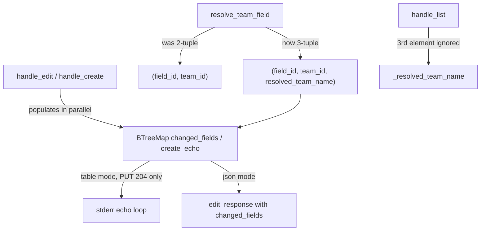
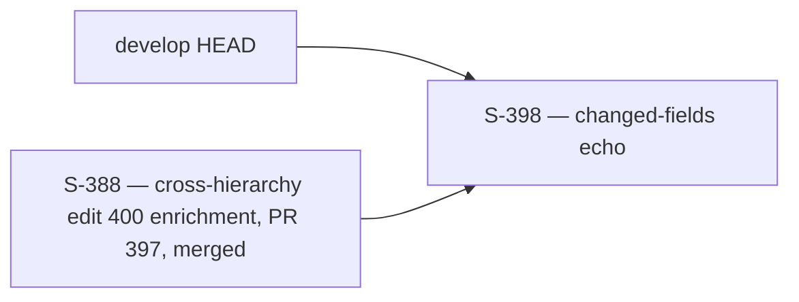
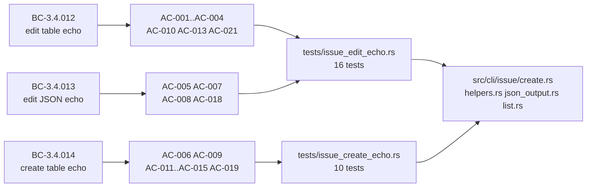

## Summary

`jr issue edit` and `jr issue create` now echo the changed/set fields on success (closes #398).

**Table mode:** prints one `  field → value` line per field to stderr (alphabetical order via `BTreeMap`; resolved team display name; `(updated)` marker for description; `(cleared)` for `--no-parent`/`--no-points`).

**JSON mode:** `jr issue edit --output json` gains a `changed_fields` object in the response body. Description carries the raw user-supplied input string (not the `(updated)` marker) — deliberate asymmetry documented in CLAUDE.md Gotchas.

**Example:**
```
$ jr issue edit FOO-123 --summary "New title" --priority High --team "Platform Core"
Updated FOO-123
  priority → High
  summary → New title
  team → Platform Core
```

```json
// jr issue edit FOO-123 --summary "New title" --output json
{
  "changed_fields": { "summary": "New title" },
  "key": "FOO-123",
  "updated": true
}
```

---

## Architecture Changes



**Changed files:**

| File | Change |
|------|--------|
| `src/cli/issue/create.rs` | `changed_fields` BTreeMap in `handle_edit`; `create_echo` BTreeMap in `handle_create`; echo loops; `edit_response` call update; `_display_name` → `display_name` rebind; `BTreeMap` import; `HashMap` removed |
| `src/cli/issue/helpers.rs` | `resolve_team_field` return type `(String,String)` → `(String,String,String)`; team display name as 3rd element across all 5 return paths |
| `src/cli/issue/json_output.rs` | `edit_response` signature extended to accept `&BTreeMap<String,String>`; new unit test; snapshot regenerated |
| `src/cli/issue/list.rs` | `handle_list` closure 2-tuple → 3-tuple destructure (`_resolved_team_name`) |
| `CLAUDE.md` | Description-echo-asymmetry Gotcha entry (pinned verbatim per AC-016) |
| `CHANGELOG.md` | User-visible changelog entry |
| `tests/issue_edit_echo.rs` | 16 new integration tests (AC-001..AC-021) |
| `tests/issue_create_echo.rs` | 10 new integration tests (AC-006..AC-019) |

**Diff stats:** 9 files changed, +2025 / -16 lines.

---

## Story Dependencies



No open story dependencies. `depends_on: []` — builds directly on `develop` HEAD.

---

## Spec Traceability



| BC ID | Title | ACs | Tests |
|-------|-------|-----|-------|
| BC-3.4.012 | `issue edit` table-mode echo | AC-001..004, AC-010, AC-013, AC-021 | tests/issue_edit_echo.rs (11 tests) |
| BC-3.4.013 | `issue edit` JSON-mode echo | AC-005, AC-007, AC-008, AC-018 | tests/issue_edit_echo.rs (5 tests) + json_output.rs unit tests |
| BC-3.4.014 | `issue create` table-mode echo | AC-006, AC-009, AC-011..015, AC-019 | tests/issue_create_echo.rs (10 tests) |

**Source:** `.factory/phase-f2-spec-evolution/prd-delta-398.md` (CONVERGED 2026-05-21).

---

## Test Evidence

| Suite | Tests | Result |
|-------|-------|--------|
| `tests/issue_edit_echo.rs` | 16 integration tests | All pass |
| `tests/issue_create_echo.rs` | 10 integration tests | All pass |
| `src/cli/issue/json_output.rs` unit tests | `test_edit` (modified) + `test_edit_response_empty_changed_fields` (new) | All pass |
| Full regression (`cargo test`) | All existing tests (inc. `issue_commands.rs`, `issue_write_holdouts.rs`, `issue_create_jsm.rs`) | All pass |
| `cargo clippy -- -D warnings` | Zero warnings | Clean |
| `cargo fmt --all -- --check` | Format check | Clean |
| `scripts/check-spec-counts.sh` | BC count guard | Exit 0 |
| `scripts/check-bc-cumulative-counts.sh` | BC cumulative guard | Exit 0 |
| `scripts/check-bc-no-numeric-test-counts.sh` | BC trace/source guard | Exit 0 |

**Total new tests:** 27 (16 edit echo + 10 create echo + 1 unit test for `edit_response` empty map)

**Coverage areas:**
- Happy path: table-mode echo for edit (AC-001..004) and create (AC-006, AC-009, AC-011)
- JSON-mode echo for edit (AC-005, AC-007, AC-008)
- Negative guards: dry-run (AC-010), bulk path (AC-013), JSM path (AC-014), PUT error suppression (AC-021)
- Edge cases: empty string `--summary ""` (EC-3.4.012-12, EC-3.4.013-10), assignee echo (AC-012), unresolvable team exits 64 (AC-019)

---

## Demo Evidence

7 VHS recordings at `docs/demo-evidence/S-398/` in the feature branch (local-only, gitignored per project convention).

| Demo | Recording | ACs Covered |
|------|-----------|-------------|
| Demo 1 — edit table-mode echo: summary + priority | `AC-001-edit-table-echo.gif` | AC-001 |
| Demo 2 — resolved team display name | `AC-002-team-resolved-name.gif` | AC-002 |
| Demo 3 — description `(updated)` marker | `AC-003-description-marker.gif` | AC-003 |
| Demo 4 — `(cleared)` markers for `--no-points` and `--no-parent` | `AC-004-cleared-markers.gif` | AC-004 |
| Demo 5 — JSON mode: `changed_fields` BTreeMap | `AC-005-edit-json-mode.gif` | AC-005, AC-007, AC-008 |
| Demo 6 — create: all-fields echo alphabetical | `AC-006-create-all-fields.gif` | AC-006, AC-009, AC-011 |
| Demo 7 — error path: PUT 400 → no echo fires | `AC-007-error-no-echo.gif` | AC-021 |

All 21 ACs are covered: 7 by VHS recordings + 14 by integration tests (negative guards and edge cases not demonstrable by VHS).

---

## Holdout Evaluation

N/A — evaluated at wave gate.

---

## Adversarial Review

Per-story adversarial review converged: 3 consecutive CLEAN passes (F4 phase, 2026-05-21). No blocking findings remained at convergence. BC files are sealed (F2 CONVERGED 2026-05-21).

---

## Security Review

No new network calls, no new authentication paths, no new user-controlled inputs that reach external systems. Changes are entirely in the CLI success-path output layer:

- `changed_fields` / `create_echo` are populated from already-validated user flag values (the same values that were sent to the Jira API); no new parsing of API responses.
- `resolve_team_field` 3-tuple extension adds a display name field; the display name comes from the cached team list (fetched from the Jira API under existing auth). No new injection surface.
- No new SQL/AQL/JQL construction.
- No new file I/O.
- No new dependencies.

Security classification: LOW risk. No OWASP Top 10 concerns.

---

## Risk Assessment

| Dimension | Assessment |
|-----------|-----------|
| Blast radius | LOW — additive stderr output on success paths only; no change to stdout, exit codes, or API calls |
| Performance impact | NEGLIGIBLE — `BTreeMap` iteration over ≤10 keys is O(n log n) per-call, immeasurably small vs. network round-trips |
| Breaking change | NO — `issue edit` and `issue create` table-mode gain additional stderr lines (additive); JSON output gains a new `changed_fields` key (additive, `updated:true` retained); `resolve_team_field` is an internal refactor with no public API change |
| Rollback | Simple — revert one squash commit; all changes are isolated to 5 source files + 2 test files |

---

## AI Pipeline Metadata

| Field | Value |
|-------|-------|
| Pipeline mode | VSDD Feature Mode (F1-F4) |
| Phase completed | F4 — delta convergence, 3/3 adversarial clean |
| Story points | 5 |
| Estimated effort | medium |
| Module criticality | HIGH (`src/cli/issue/create.rs` — core edit/create success path) |

---

## Pre-Merge Checklist

- [x] All 21 ACs verified (27 tests, demo recordings)
- [x] `cargo test` — full suite green (regression baseline: `issue_commands.rs`, `issue_write_holdouts.rs`, `issue_create_jsm.rs` all unchanged)
- [x] `cargo clippy -- -D warnings` — zero warnings
- [x] `cargo fmt --all -- --check` — clean
- [x] `cargo build --release` — succeeds (release build clean)
- [x] `scripts/check-spec-counts.sh` — exit 0
- [x] `scripts/check-bc-cumulative-counts.sh` — exit 0
- [x] `scripts/check-bc-no-numeric-test-counts.sh` — exit 0
- [x] CLAUDE.md Gotcha entry present byte-for-byte (AC-016)
- [x] Per-story adversarial review: 3/3 CLEAN
- [x] Demo evidence: 7 recordings, all ACs covered
- [x] No dependency PRs outstanding (`depends_on: []`)
- [ ] Security review — see Security Review section above (clean)
- [ ] PR review convergence — pending
- [ ] CI checks passing — pending
