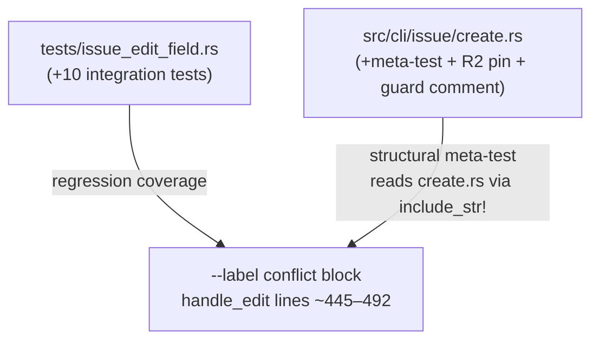
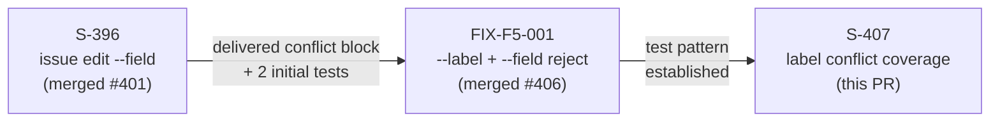
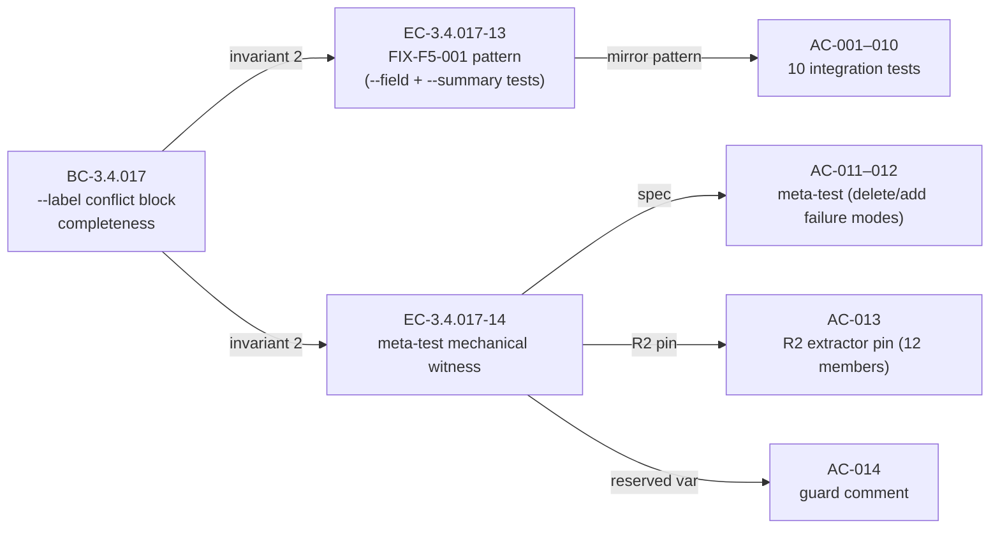

## Summary

Completes `--label` conflict-block regression coverage from 2/12 to 12/12 tests and adds a structural meta-test that mechanically enforces block completeness. No production behavior changes.

**Closes #407** — `test-hardening: --label conflict block coverage + structural meta-test`

---

## Architecture Changes

No production architecture changes. All additions are in `#[cfg(test)]` blocks or `tests/`.

**Production change footprint:** 5 lines — one guard comment at `src/cli/issue/create.rs:445-449`.

---

## Story Dependencies

`depends_on: [S-396]` — S-396 created `tests/issue_edit_field.rs` and the `--label` conflict block. S-407 extends coverage to 12/12.

---

## Spec Traceability

| Story ID | BC | AC | Test | Implementation |
|----------|----|----|------|----------------|
| S-407 | BC-3.4.017 invariant 2 | AC-001–016 | `tests/issue_edit_field.rs` (10 integration) + `src/cli/issue/create.rs` (2 unit) | guard comment + `#[cfg(test)]` block |

---

## Test Evidence

| Suite | Tests | Result |
|-------|-------|--------|
| `cargo test --test issue_edit_field` | 55 total (was 43 from S-396+2) | All pass (pre-push CI green) |
| `cargo test --lib` (meta-test + R2 pin) | meta-test + R2 pin | Pass |
| `cargo clippy -- -D warnings` | 0 warnings | Pass |
| `bash scripts/check-spec-counts.sh` | no count changes | Exit 0 |
| `bash scripts/check-bc-cumulative-counts.sh` | no count changes | Exit 0 |

**New tests added (12 total):**

| # | Test | Location | Type |
|---|------|----------|------|
| 1 | `test_label_plus_priority_rejected_with_exit_64_no_http` | `tests/issue_edit_field.rs` | integration |
| 2 | `test_label_plus_type_rejected_with_exit_64_no_http` | `tests/issue_edit_field.rs` | integration |
| 3 | `test_label_plus_team_rejected_with_exit_64_no_http` | `tests/issue_edit_field.rs` | integration |
| 4 | `test_label_plus_points_rejected_with_exit_64_no_http` | `tests/issue_edit_field.rs` | integration |
| 5 | `test_label_plus_no_points_rejected_with_exit_64_no_http` | `tests/issue_edit_field.rs` | integration |
| 6 | `test_label_plus_parent_rejected_with_exit_64_no_http` | `tests/issue_edit_field.rs` | integration |
| 7 | `test_label_plus_no_parent_rejected_with_exit_64_no_http` | `tests/issue_edit_field.rs` | integration |
| 8 | `test_label_plus_description_rejected_with_exit_64_no_http` | `tests/issue_edit_field.rs` | integration |
| 9 | `test_label_plus_description_stdin_rejected_with_exit_64_no_http` | `tests/issue_edit_field.rs` | integration |
| 10 | `test_label_plus_markdown_rejected_with_exit_64_no_http` | `tests/issue_edit_field.rs` | integration |
| 11 | `test_label_conflict_block_lists_every_relevant_flag` | `src/cli/issue/create.rs` | unit (meta-test) |
| 12 | `test_label_conflict_block_extractor_pin_12_members` | `src/cli/issue/create.rs` | unit (R2 pin) |

**Test pattern per integration test:** `Mock::given(any()).expect(0)` catch-all (zero HTTP permitted) + `jr issue edit TEST-1 --label add:x --<flag> [value]` + exit 64 + two separate stderr assertions (`"--label cannot be combined with"` and `"--<flag>"`).

**Meta-test strategy:** reads live source via `include_str!("create.rs")`, extracts every `conflicting.push("--<flag>")` literal via line scan, builds `BTreeSet<String>` from `(BULK_SUPPORTED \ {"label"}) ∪ REJECTED_IN_BULK` with `issue_type → "--type"` explicit rename, asserts set equality. Any deletion or missing addition causes test failure.

---

## Demo Evidence

N/A — test-only delivery. No user-visible behavior change was introduced; there is no behavior to demo.

The structural meta-test itself (`test_label_conflict_block_lists_every_relevant_flag`) is the deliverable: it would catch any future regression where the `--label` conflict block becomes desynchronized from `BULK_SUPPORTED`/`REJECTED_IN_BULK`.

---

## Holdout Evaluation

N/A — evaluated at wave gate. This story has `holdout_anchors: []`.

---

## Adversarial Review

Per-story adversarial review: 3 consecutive CLEAN passes (convergence at pass 3). All findings from prior passes resolved before push.

Spec adversarial review: 4 passes, converged at passes 2/3/4 (no new issues raised in passes 2, 3, or 4).

---

## Security Review

No new attack surface. This PR adds:
- 10 integration tests that exercise pre-existing guards (they invoke the binary in a subprocess against a local wiremock server)
- 2 unit tests that read the source file at compile time (`include_str!`)
- 1 guard comment

No new API endpoints, no new input parsing paths, no new HTTP clients, no new authentication logic. Security disposition: **N/A — no security-relevant surface.**

---

## Risk Assessment

| Dimension | Assessment |
|-----------|------------|
| Blast radius | Minimal — test-only + 5-line guard comment |
| Performance impact | None — no production code path changed |
| Breaking change | No |
| Rollback complexity | Trivial — revert is safe at any point |

---

## AI Pipeline Metadata

| Field | Value |
|-------|-------|
| Pipeline mode | Feature factory (vsdd-factory) |
| Story points | 1 |
| Intent | test-hardening |
| Feature type | test-only |
| Convergence | 3/3 CLEAN (per-story adversary), 4-pass spec adversary |
| Model | claude-sonnet-4-6 |

---

## Pre-Merge Checklist

- [x] PR description matches actual diff
- [x] All 16 ACs covered (10 integration + meta-test + R2 pin + guard comment + AC-015 + AC-016)
- [x] Demo evidence: N/A (test-only, documented above)
- [x] Traceability chain complete: BC-3.4.017 → EC-3.4.017-14 → AC-001–016 → tests
- [x] No new BCs / VPs introduced
- [x] `cargo test` full suite green
- [x] `cargo clippy -- -D warnings`: 0 warnings
- [x] No `#[allow]` suppressions added
- [x] Per-story adversarial convergence: 3/3 CLEAN
- [x] Security review: N/A (no security-relevant surface)
- [ ] CI green (10/10 checks)
- [ ] Copilot review completed
- [ ] Human merge authorization received
