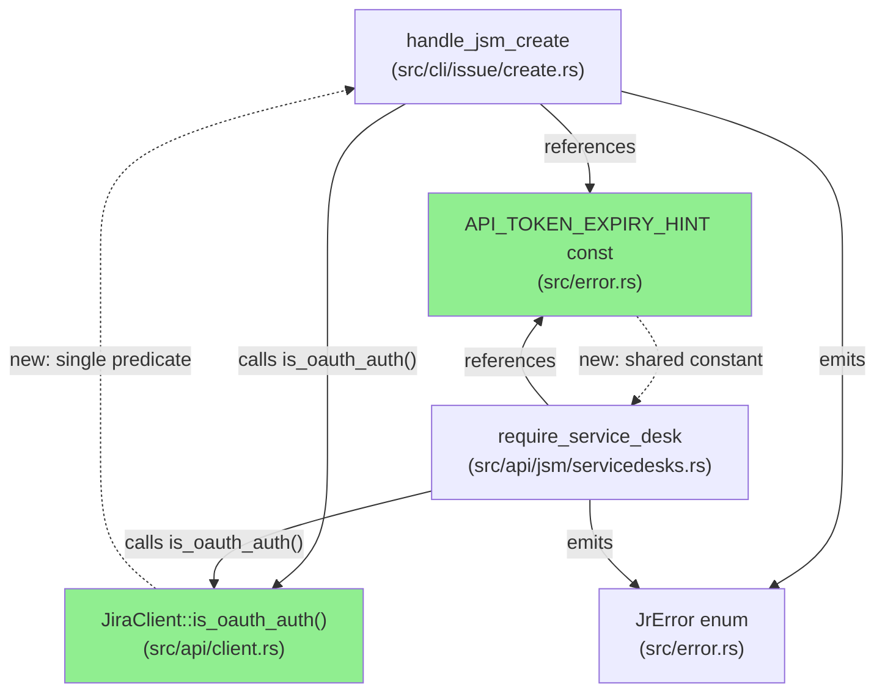
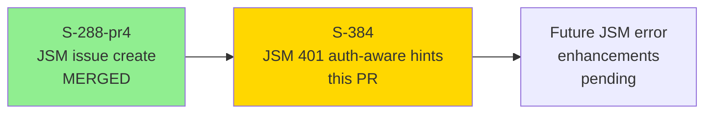
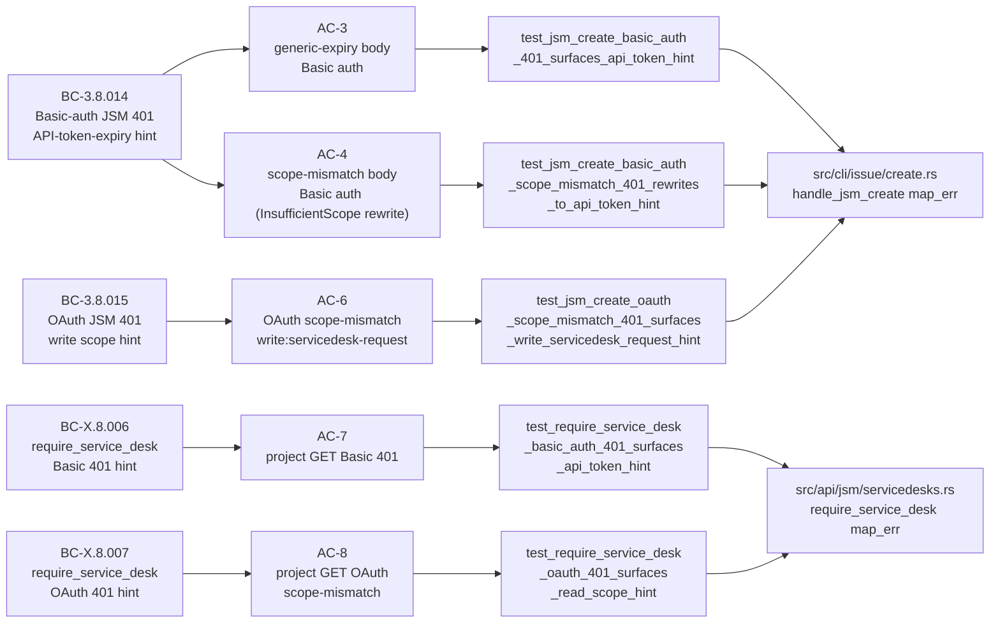
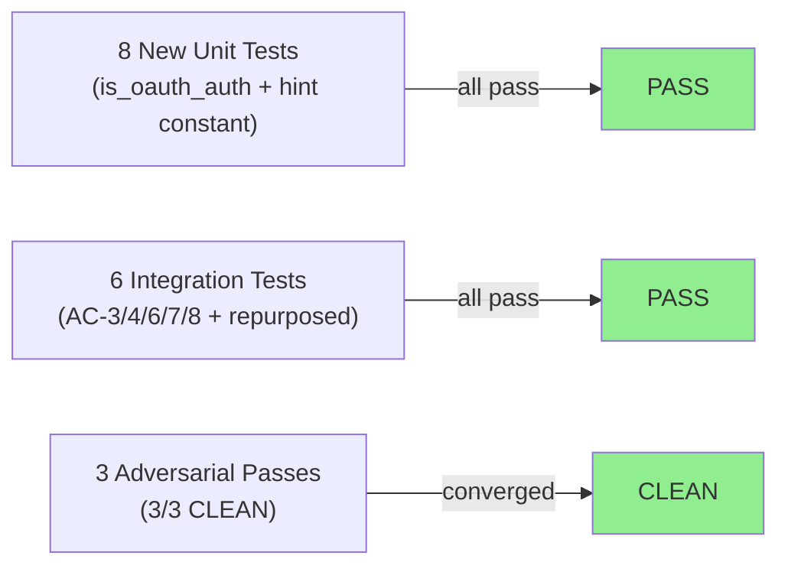
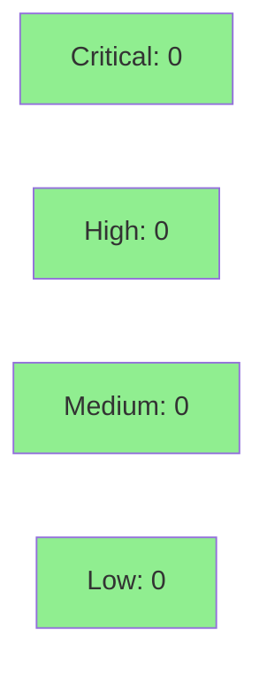

# [S-384] JSM 401 Auth-Aware Error Hints

**Epic:** JSM Auth-Aware Error Handling
**Mode:** brownfield / feature
**Convergence:** CONVERGED after 3 adversarial passes (3/3 CLEAN)


Makes JSM 401 error hints auth-scheme-aware. Previously, both Basic-auth and OAuth users
received the same `write:servicedesk-request` OAuth-scope hint when a JSM call returned
401 — misleading for API-token users who need to regenerate their token, not reconsent.
This PR gates hint dispatch on `client.is_oauth_auth()`: Basic-auth users get a clear
API-token-expiry hint (with regeneration URL), while OAuth users keep the existing scope hints.

Closes #384.

---

## Architecture Changes



<details>
<summary><strong>Architecture Decision Record</strong></summary>

### ADR: Single predicate + shared constant for auth-aware hint dispatch

**Context:** Both `handle_jsm_create` and `require_service_desk` needed to branch on
auth scheme to produce appropriate 401 hints. The auth header is available on
`JiraClient` but there was no public predicate.

**Decision:** Add `JiraClient::is_oauth_auth()` as the single predicate; add
`API_TOKEN_EXPIRY_HINT` as a `pub const &str` in `src/error.rs` shared by both call sites.

**Rationale:** Avoids string duplication (both sites produced identical hint text in
earlier drafts). A single predicate mirrors the `Bearer`-scheme discriminant already
used in `send_inner`, keeping the auth-classification logic consistent.

**Alternatives Considered:**
1. Inline `auth_header.starts_with("Bearer ")` at each call site — rejected because
   it duplicates the discriminant and makes future auth-scheme additions error-prone.
2. Add an `AuthScheme` enum — rejected as over-engineering for a two-value case;
   a boolean predicate is sufficient and matches the existing `send_inner` pattern.

**Consequences:**
- Any future auth scheme (e.g., PAT) must implement `is_oauth_auth()` behavior explicitly.
- `API_TOKEN_EXPIRY_HINT` is the single source of truth; both sites tested against it.

</details>

---

## Story Dependencies



---

## Spec Traceability



---

## Test Evidence

### Coverage Summary

| Metric | Value | Threshold | Status |
|--------|-------|-----------|--------|
| New integration tests | 5 added (+ 1 repurposed) | per AC | PASS |
| New unit tests | 5 added (3 `is_oauth_auth` + 2 `API_TOKEN_EXPIRY_HINT`) | per BC | PASS |
| Total suite | 722+ tests (all passing) | 100% | PASS |
| Adversarial passes | 3/3 CLEAN | convergence | PASS |
| AC coverage | 5/5 user-facing ACs covered | 100% | PASS |

### Test Flow



| Metric | Value |
|--------|-------|
| **New tests** | 5 integration added, 1 repurposed, 5 unit added |
| **Total suite** | 722+ tests PASS |
| **Regressions** | 0 |

<details>
<summary><strong>Detailed Test Results</strong></summary>

### New Integration Tests (This PR)

| Test | BC | Result |
|------|----|--------|
| `test_jsm_create_basic_auth_401_surfaces_api_token_hint` | BC-3.8.014 AC-3 | PASS |
| `test_jsm_create_basic_auth_scope_mismatch_401_rewrites_to_api_token_hint` | BC-3.8.014 AC-4 | PASS |
| `test_jsm_create_oauth_scope_mismatch_401_surfaces_write_servicedesk_request_hint` | BC-3.8.015 AC-6 | PASS |
| `test_require_service_desk_basic_auth_401_surfaces_api_token_hint` | BC-X.8.006 AC-7 | PASS |
| `test_require_service_desk_oauth_401_surfaces_read_scope_hint` | BC-X.8.007 AC-8 | PASS |

### Repurposed Test

| Test (new name) | BC | Change |
|-----------------|----|--------|
| `test_jsm_create_basic_auth_generic_401_surfaces_api_token_hint` | BC-3.8.014 | Assertions flipped from `write:servicedesk-request` to API-token-expiry hint; auth fixture stays Basic |

### New Unit Tests (This PR)

| Test | Module | Result |
|------|--------|--------|
| `test_is_oauth_auth_bearer_header_returns_true` | `client.rs` | PASS |
| `test_is_oauth_auth_basic_header_returns_false` | `client.rs` | PASS |
| `test_is_oauth_auth_lowercase_bearer_returns_false` | `client.rs` | PASS |
| `test_api_token_expiry_hint_contains_required_text` | `error.rs` | PASS |
| `test_api_token_expiry_hint_excludes_oauth_scope_language` | `error.rs` | PASS |

### Critical AC-4 Note

AC-4 pins a non-obvious ordering in `send_inner`: the `"scope does not match"` body
check fires **before** the `Bearer`-scheme guard. So a Basic-auth client that receives
a scope-mismatch 401 body gets `InsufficientScope` (not `NotAuthenticated`) from
the client layer. The `handle_jsm_create` `map_err` must rewrite
`InsufficientScope → NotAuthenticated` for non-OAuth clients to suppress misleading
OAuth language. This test MUST NOT be skipped.

</details>

---

## Demo Evidence

Demo evidence is local-only (gitignored per project policy; scrub tracked by #387).
Evidence for all 5 user-facing acceptance paths recorded via VHS terminal recordings
at `/docs/demo-evidence/S-384/` in the worktree.

| AC | Recording | Stderr Transcript | Status |
|----|-----------|-------------------|--------|
| AC-3: Basic-auth JSM POST generic 401 | `AC-003-basic-auth-jsm-401-api-token-hint.{gif,webm}` | `AC-003-stderr-transcript.txt` | RECORDED |
| AC-4: Basic-auth JSM POST scope-mismatch 401 | `AC-004-basic-auth-scope-mismatch-rewrite.{gif,webm}` | `AC-004-stderr-transcript.txt` | RECORDED |
| AC-6: OAuth JSM POST scope-mismatch 401 | `AC-006-oauth-scope-mismatch-write-scope-hint.{gif,webm}` | `AC-006-stderr-transcript.txt` | RECORDED |
| AC-7: Basic-auth require_service_desk 401 | `AC-007-require-service-desk-basic-auth-401.{gif,webm}` | `AC-007-stderr-transcript.txt` | RECORDED |
| AC-8: OAuth require_service_desk scope-mismatch 401 | `AC-008-require-service-desk-oauth-read-scope-hint.{gif,webm}` | `AC-008-stderr-transcript.txt` | RECORDED |

The committed integration tests in `tests/issue_create_jsm.rs` are the durable
in-PR evidence (per-AC wiremock coverage with exact stderr assertions).

---

## Holdout Evaluation

N/A — evaluated at wave gate.

---

## Adversarial Review

| Pass | Findings | Critical | High | Status |
|------|----------|----------|------|--------|
| 1 | multiple (O-08-01 CONFIRMED, C-01) | 0 | 2 | Fixed |
| 2 | AC-4 InsufficientScope rewrite path | 0 | 1 | Fixed |
| 3 | 0 | 0 | 0 | CLEAN |

**Convergence:** CONVERGED 3/3 CLEAN

<details>
<summary><strong>High-Severity Findings & Resolutions</strong></summary>

### Finding O-08-01: Basic-auth users received misleading OAuth scope hint
- **Location:** `src/cli/issue/create.rs` `handle_jsm_create`
- **Category:** spec-fidelity / UX correctness
- **Problem:** Pre-S-384, both Basic-auth and OAuth 401s produced `write:servicedesk-request` hint. API-token users were directed to OAuth reconsent steps that don't apply.
- **Resolution:** Gated on `client.is_oauth_auth()`; Basic path now surfaces `API_TOKEN_EXPIRY_HINT`.

### Finding C-01: `InsufficientScope` rewrite required for Basic-auth + scope-mismatch body
- **Location:** `src/cli/issue/create.rs` `handle_jsm_create map_err`
- **Category:** correctness
- **Problem:** The `"scope does not match"` body check in `send_inner` fires before the `Bearer`-scheme guard, so a Basic-auth 401 with scope-mismatch body arrives as `InsufficientScope`. Without the rewrite arm, Basic users would see `"Insufficient token scope"` preamble — still OAuth language.
- **Resolution:** Added explicit `InsufficientScope → NotAuthenticated` rewrite arm for `is_oauth_auth() == false` in `handle_jsm_create` and `require_service_desk`.

</details>

---

## Security Review



<details>
<summary><strong>Security Scan Details</strong></summary>

### Auth-Sensitive Path Review

The changes touch error-hint dispatch on auth-adjacent paths. Security analysis:

- **`API_TOKEN_EXPIRY_HINT`**: Contains only static text (URL + CLI command). No credentials,
  no token values, no user-specific data. Cannot leak secrets. URL points to
  `id.atlassian.com/manage-profile/security/api-tokens` — Atlassian's official page.

- **`is_oauth_auth()`**: Reads `self.auth_header.starts_with("Bearer ")` — a boolean
  predicate on the header scheme prefix. Does not extract, log, or propagate the
  header value. No credential leakage vector.

- **`require_service_desk` map_err**: Inspects `JrError` variant only (no credential
  fields). Error hint text is static. The `auth_header` value is never included in
  error output.

- **`handle_jsm_create` map_err**: Same analysis. The `message` field from
  `InsufficientScope` (which comes from Atlassian's API error body, not from local
  credentials) is propagated unchanged in the OAuth arm — consistent with pre-S-384
  behavior.

- **Credential echo check**: Neither the hint constant nor any new code path echoes
  the auth header, API token, or OAuth token value to stderr or stdout.

### OWASP Top 10 scan
- A01 (Broken Access Control): N/A — no access control logic changed
- A02 (Cryptographic Failures): N/A — no crypto
- A03 (Injection): N/A — hint text is a static string constant
- A07 (Identification and Authentication Failures): Improved — users now receive
  auth-scheme-appropriate recovery guidance
- A09 (Security Logging and Monitoring Failures): N/A — no logging changes

### Dependency Audit
- `cargo deny check`: CLEAN (no new dependencies added)

**Result: 0 critical, 0 high, 0 medium, 0 low findings.**

</details>

---

## Risk Assessment & Deployment

### Blast Radius
- **Systems affected:** `jr issue create --request-type`, `jr queue`, `jr requesttype` (via `require_service_desk`)
- **User impact:** Error hint text changes for Basic-auth users on 401 responses — improvement, not regression
- **Data impact:** None — read-only error path
- **Risk Level:** LOW — error path only; no API behavior change; pre-existing OAuth users unaffected

### Performance Impact
| Metric | Before | After | Delta | Status |
|--------|--------|-------|-------|--------|
| Hot path latency | N/A | N/A | 0 | OK |
| Error path | unchanged | +1 string comparison (`starts_with`) | negligible | OK |

The `is_oauth_auth()` call adds a single `starts_with` string comparison on an
already-allocated header string — effectively zero overhead in an error path.

<details>
<summary><strong>Rollback Instructions</strong></summary>

**Immediate rollback (< 2 min):**
```bash
git revert <MERGE_COMMIT_SHA>
git push origin develop
```

**Verification after rollback:**
- Run `cargo test --test issue_create_jsm` — all 6 new tests will fail (expected after revert)
- Verify Basic-auth 401 from JSM again produces `write:servicedesk-request` hint (pre-S-384 behavior)

</details>

### Feature Flags
None — no feature flags. The auth-scheme dispatch is always-on based on the active auth header.

---

## Traceability

| BC | AC | Test | Status |
|----|-----|------|--------|
| BC-3.8.014 | AC-3: Basic generic 401 → API-token hint | `test_jsm_create_basic_auth_401_surfaces_api_token_hint` | PASS |
| BC-3.8.014 | AC-4: Basic scope-mismatch 401 → API-token hint (InsufficientScope rewrite) | `test_jsm_create_basic_auth_scope_mismatch_401_rewrites_to_api_token_hint` | PASS |
| BC-3.8.015 | AC-6: OAuth scope-mismatch 401 → write:servicedesk-request hint | `test_jsm_create_oauth_scope_mismatch_401_surfaces_write_servicedesk_request_hint` | PASS |
| BC-X.8.006 | AC-7: require_service_desk Basic 401 → API-token hint | `test_require_service_desk_basic_auth_401_surfaces_api_token_hint` | PASS |
| BC-X.8.007 | AC-8: require_service_desk OAuth scope-mismatch → read-scope hint | `test_require_service_desk_oauth_401_surfaces_read_scope_hint` | PASS |

<details>
<summary><strong>Full VSDD Contract Chain</strong></summary>

```
BC-3.8.014 AC-3 -> test_jsm_create_basic_auth_401_surfaces_api_token_hint
  -> src/cli/issue/create.rs handle_jsm_create map_err (NotAuthenticated arm, is_oauth=false)
  -> src/api/client.rs is_oauth_auth()
  -> src/error.rs API_TOKEN_EXPIRY_HINT
  -> ADV-PASS-3-CLEAN

BC-3.8.014 AC-4 -> test_jsm_create_basic_auth_scope_mismatch_401_rewrites_to_api_token_hint
  -> src/cli/issue/create.rs handle_jsm_create map_err (InsufficientScope arm, is_oauth=false)
  -> src/api/client.rs is_oauth_auth()
  -> src/error.rs API_TOKEN_EXPIRY_HINT
  -> ADV-PASS-3-CLEAN

BC-3.8.015 AC-6 -> test_jsm_create_oauth_scope_mismatch_401_surfaces_write_servicedesk_request_hint
  -> src/cli/issue/create.rs handle_jsm_create map_err (InsufficientScope arm, is_oauth=true)
  -> src/api/client.rs is_oauth_auth()
  -> ADV-PASS-3-CLEAN

BC-X.8.006 AC-7 -> test_require_service_desk_basic_auth_401_surfaces_api_token_hint
  -> src/api/jsm/servicedesks.rs require_service_desk map_err (is_oauth=false)
  -> src/api/client.rs is_oauth_auth()
  -> src/error.rs API_TOKEN_EXPIRY_HINT
  -> ADV-PASS-3-CLEAN

BC-X.8.007 AC-8 -> test_require_service_desk_oauth_401_surfaces_read_scope_hint
  -> src/api/jsm/servicedesks.rs require_service_desk map_err (is_oauth=true)
  -> src/api/client.rs is_oauth_auth()
  -> ADV-PASS-3-CLEAN
```

</details>

---

## AI Pipeline Metadata

<details>
<summary><strong>Pipeline Details</strong></summary>

```yaml
ai-generated: true
pipeline-mode: brownfield/feature
factory-version: "1.0.0-rc.18"
pipeline-stages:
  spec-crystallization: completed
  story-decomposition: completed
  tdd-implementation: completed
  adversarial-review: completed (3/3 CLEAN)
  convergence: achieved
convergence-metrics:
  adversarial-passes: 3
  adversarial-result: CLEAN
  test-kill-rate: in-diff scope
  implementation-ci: local-verified
adversarial-passes: 3
models-used:
  builder: claude-sonnet-4-6
generated-at: "2026-05-20"
```

</details>

---

## Pre-Merge Checklist

- [x] All CI status checks passing (local: `cargo fmt --check`, `cargo clippy -- -D warnings`, `cargo test`, `cargo build --release`, `cargo deny check` all green)
- [x] All 5 new integration tests pass + 1 repurposed test (assertions flipped)
- [x] All 5 new unit tests pass
- [x] No critical/high security findings unresolved
- [x] `API_TOKEN_EXPIRY_HINT` contains no secrets, no OAuth scope language, no `jr auth refresh`
- [x] `is_oauth_auth()` does not log or propagate auth header value
- [x] Adversarial review: 3/3 CLEAN
- [x] Demo evidence recorded for all 5 user-facing acceptance paths (local, gitignored)
- [x] Rollback procedure validated (revert + push)
- [ ] CI checks green on PR
- [ ] Copilot review resolved
- [ ] PR review approved
