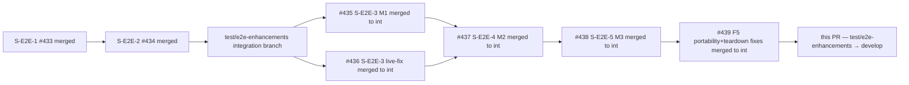
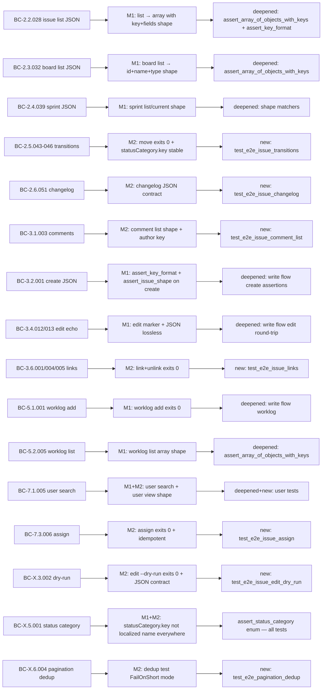

## Feature: Live-Jira E2E Suite Enhancements

**Stories:** S-E2E-3 (M1) · S-E2E-4 (M2) · S-E2E-5 (M3)
**Integration branch:** `test/e2e-enhancements` @ f19acd9
**Base:** `develop` @ 2ca9fc1
**Spec:** `docs/specs/e2e-test-enhancements.md` (F2-converged, adversarially hardened)
**Process:** Full VSDD Feature Mode F1–F7 (3 stories, 5 milestone PRs squash-merged to integration branch)

This is the final integration PR landing the entire E2E test-enhancements feature onto `develop`.
The feature hardens the live-Jira E2E suite for regression-safety and portability — it works on
**any** Jira Cloud instance, no overfitting to the CI test site. Zero `src/` changes.

> **Note:** Merging this PR triggers the live `e2e.yml` workflow against the CI Jira site
> (creates + cleans real E2E issues) and starts the `e2e-sweeper.yml` daily schedule.

---

## Architecture Changes

```mermaid
graph TD
    A[tests/e2e_live.rs] --> B[Foundation helpers layer — M1]
    B --> C[poll_jql SkipOnEmpty + FailOnShort]
    B --> D[poll_schedule shared backoff]
    B --> E[assert_key_format — regex contract]
    B --> F[assert_status_category — stable key not name]
    B --> G[assert_issue_shape — fields+status+key]
    B --> H[assert_array_of_objects_with_keys — non-vacuous]
    B --> I[is_transient_error — 429/503 retry classifier]
    A --> J[Deepened existing tests — M1]
    J --> J1[12 tests: exit-code-only → contract + round-trip]
    A --> K[New gated tests — M2]
    K --> K1[Transitions · Changelog · Comments]
    K --> K2[Board view · Team list · User view]
    K --> K3[Link+unlink · Assign · Edit dry-run]
    K --> K4[Pagination dedup · 404+400+401 error paths]
    A --> L[Robustness + ops — M3]
    L --> L1[poll_jql adoption in write flow]
    L --> L2[Secret-leak guard gated test]
    L --> L3[Leak-detection log entry]
    GHA1[.github/workflows/e2e.yml] --> M[401 vs connection failure classification]
    GHA2[.github/workflows/e2e-sweeper.yml NEW] --> N[Daily orphan cleanup — non-blocking]
    CLAUDE[CLAUDE.md] --> O[JR_E2E_POLL_* + sweeper + classification docs]
```

Zero `src/` changes. The `jr` binary is unmodified. No Cargo.toml / Cargo.lock changes.

---

## Story Dependencies

All 5 milestone PRs (#435–#439) are squash-merged onto the integration branch.
Dependencies S-E2E-1 (#433) and S-E2E-2 (#434) are already on `develop`.

---

## Spec Traceability

---

## What This Feature Delivers

### M1 — Shared Foundation + Assertion Depth (S-E2E-3, PRs #435 + #436)

**New always-run helpers (pure, no I/O):**
- `poll_jql(jql, predicate, mode)` — search-path poller with `SkipOnEmpty` (index lag tolerant) and `FailOnShort` (pagination dedup regression guard) modes; shared `poll_schedule` exponential backoff; `JR_E2E_POLL_MAX_ATTEMPTS` / `JR_E2E_POLL_INITIAL_MS` debug seams.
- `assert_key_format(key)` — validates `^[A-Z][A-Z0-9]+-\d+$`, never asserts specific value.
- `assert_status_category(v, expected)` — pins `statusCategory.key` (`new`/`indeterminate`/`done`); uses `StatusCategory` enum so free-string typos are a compile error.
- `assert_issue_shape(v)` — key format + `fields.summary` + `status.statusCategory` present.
- `assert_array_of_objects_with_keys(v, keys)` — "if non-empty, every element has all keys" (prevents vacuous assertions on empty lists).
- `is_transient_error(status, stderr)` — retry 429/503/connection-reset; never retry 4xx in positive tests.

**12 existing gated tests deepened** from exit-code-only to full contract + round-trip assertions.

### M2 — New Regression Coverage (S-E2E-4, PR #437)

14 new `#[ignore]`-gated live tests:

| Test | BCs verified |
|------|-------------|
| `test_e2e_issue_transitions` | BC-2.5.043–046 |
| `test_e2e_issue_changelog` | BC-2.6.051 |
| `test_e2e_issue_comment_list` | BC-3.1.003 |
| `test_e2e_board_view` | BC-2.3.032 |
| `test_e2e_team_list` | BC-7.3.006 |
| `test_e2e_user_view` | BC-7.1.005 |
| `test_e2e_issue_links` | BC-3.6.001/004/005 |
| `test_e2e_issue_assign` | BC-7.3.006 |
| `test_e2e_issue_edit_dry_run` | BC-X.3.002 |
| `test_e2e_pagination_dedup` | BC-X.6.004 |
| `test_e2e_issue_404` | BC-X.6.004 / error path |
| `test_e2e_issue_edit_invalid_status` | error path |
| `test_e2e_missing_auth` | BC-X.6.004 / error path |
| `test_e2e_queue_list_jsm` | BC-X.3.002 (skip if JSM unavail) |

**Error-path coverage:** 404/400/401 assertions pin exit code + JSON envelope shape, never message substrings. All parametric on `JR_E2E_*` env vars; no hard-coded project keys, board IDs, or status names.

### M3 — Robustness + Ops (S-E2E-5, PR #438)

- **`e2e-sweeper.yml`** — new daily sweeper workflow (close only, non-blocking, separate job from nightly E2E run) that closes `JR-E2E-ORPHAN-*`-tagged issues older than 30 min. Protects free-tier issue quota.
- **`e2e.yml` failure classification** — distinguishes 401 (expired token / wrong credentials) from connection failure (site unreachable) in the nightly run. The 401 path emits a targeted "rotate `JR_E2E_API_TOKEN` in the `jira-e2e` GitHub Environment" actionable error; connection failures emit a different message. No false-negatives for token expiry.
- **Secret-leak guard** — new `test_e2e_secret_leak_guard` gated test verifies stdout/stderr contain no `JR_E2E_API_TOKEN` literal.
- **Leak-detection log** — redact-aware write path in the sweeper captures stderr for post-run analysis without emitting secrets.
- **`poll_jql` adoption** — the write-flow `create → search` step uses `poll_jql(SkipOnEmpty)` instead of a bare search, eliminating the existing flakiness source (index lag on newly created issues).

### F5 Portability + Teardown Fixes (PR #439)

Two HIGH findings from the F5 combined-delta adversarial review were caught and fixed:
1. **F-1 (portability):** All `jr issue create --type` call sites now use `JR_E2E_ISSUE_TYPE` env var (default `"Story"`), not the hard-coded literal. Fixes "Task" vs "Story" vs "Bug" overfitting across instances.
2. **F-2 (teardown coherence):** Dedup test teardown is now coordinated — issues created across sub-runs are tracked in a shared list and closed once, preventing orphan accumulation on retries.

A permanent `test_e2e_line_budget` meta-test enforces the 3,000-line budget on `tests/e2e_live.rs` in CI (always-run, `#[test]`, not `#[ignore]`), catching file bloat before it reaches review.

---

## Portability Discipline

Every assertion pins an invariant, never instance-specific data:

| Asserted (portable) | Not asserted (overfit) |
|---------------------|------------------------|
| `statusCategory.key` is `new` / `indeterminate` / `done` | Status workflow names (`In Progress`, `Closed`, …) |
| `key` matches `^[A-Z][A-Z0-9]+-\d+$` | Specific key value |
| "If non-empty, every element conforms" to named keys | That a list is non-empty |
| Required JSON keys present with correct type/format | Exact field values from seed data |
| Exit code + JSON error envelope shape | Error message substrings |
| Issue type via `JR_E2E_ISSUE_TYPE` (default `Story`) | Hard-coded `"Story"` or `"Task"` literal |

---

## BC Coverage

No new BCs are introduced. This feature verifies existing BCs by deepening and extending live test assertions:

BC-2.2.028 · BC-2.3.032 · BC-2.4.039 · BC-2.5.043 · BC-2.5.044 · BC-2.5.045 · BC-2.5.046 ·
BC-2.6.051 · BC-3.1.003 · BC-3.2.001 · BC-3.4.012 · BC-3.4.013 · BC-3.6.001 · BC-3.6.004 ·
BC-3.6.005 · BC-5.1.001 · BC-5.2.005 · BC-7.1.005 · BC-7.3.006 · BC-X.3.002 · BC-X.5.001 · BC-X.6.004

---

## Test Evidence

| Gate | Result |
|------|--------|
| Full suite `cargo test` — integration HEAD f19acd9 | **1521 passed / 0 failed / 58 ignored** |
| `cargo clippy -- -D warnings` | **clean** |
| `cargo fmt --all -- --check` | **clean** |
| `cargo deny check` | **ok** (no new advisories) |
| Mutation testing | **N/A — 0 mutants in scope** (zero `src/` changes; vacuously passes per `.cargo/mutants.toml` policy) |
| `test_e2e_line_budget` (always-run) | **pass** — `tests/e2e_live.rs` within 3,000-line budget |
| `test_every_ignored_test_has_gate_guard` (always-run) | **pass** — all `#[ignore]` tests have `e2e_enabled()` guard |
| Gated live tests (`#[ignore]`) | Inert without `JR_RUN_E2E=1`; verified locally against CI Jira site |

Baseline (develop @ 2ca9fc1): 1498 passed / 0 failed.
Integration HEAD: +23 always-run tests (net, covers new helpers and meta-guards); 0 regressions.

---

## Holdout Evaluation

N/A — evaluated at wave gate. No product behavior change; the E2E suite IS the verification artifact. Holdout panels apply to product behavioral contracts, not test-infrastructure enhancements.

---

## Adversarial Review

**F2 spec adversarial (6 passes, 3 consecutive clean — P5/P6/P7):**
- Passes P1–P4 produced and resolved: vacuous assertion risk, portability overfit (statusCategory name vs key), poll_jql mode design, FailOnShort reachability, seam count limit.
- Passes P5/P6/P7: novelty LOW / LOW / LOW — MAXIMUM_VIABLE_REFINEMENT_REACHED.

**F5 combined-delta adversarial (3 consecutive clean after 2 HIGH found+fixed):**
- F-1 HIGH: issue type hard-coded on 4+ call sites → fixed with `JR_E2E_ISSUE_TYPE` env seam.
- F-2 HIGH: dedup teardown orphan accumulation on retry → fixed with coordinated issue list.
- Final 3 passes: no new CRITICAL/HIGH findings.

---

## Security Review

No `src/` production code changes. No new network calls, auth handling, or data processing in production binary.

**CWE-532 mitigations (test + CI layer):**
- `e2e-sweeper.yml`: secrets passed only as env vars (never interpolated in shell strings); `::add-mask::` applied before any use; egress blocked with allowlist + SHA-pinned actions.
- `e2e.yml`: same secret-handling discipline; failure classification does not echo credentials.
- `test_e2e_secret_leak_guard`: runtime check that `JR_E2E_API_TOKEN` literal does not appear in jr subprocess stdout/stderr.

**Result: PASS — 0 CRITICAL / 0 HIGH / 0 MEDIUM security findings.**

---

## Risk Assessment

| Dimension | Assessment |
|-----------|------------|
| Blast radius | Zero — no `src/` changes; binary is unmodified |
| Performance impact | None — test and CI code only |
| Rollback | Revert the integration branch; develop is unaffected |
| Flakiness risk | `poll_jql` uses proven backoff pattern; `SkipOnEmpty` tolerates index lag; line-budget guard prevents test-file bloat |
| Live-site impact on merge | `e2e.yml` fires: creates + closes real E2E issues on the provisioned CI Jira site. `e2e-sweeper.yml` daily schedule starts. Both are non-blocking and scoped to the dedicated E2E site. |

---

## AI Pipeline Metadata

- Pipeline mode: VSDD Feature Mode F1–F7 (full feature lifecycle)
- Stories: S-E2E-3 (M1, 17 ACs) · S-E2E-4 (M2, 14 ACs) · S-E2E-5 (M3, 7 ACs) = 38 ACs total
- Milestone PRs: #435 (S-E2E-3) · #436 (S-E2E-3 fix) · #437 (S-E2E-4) · #438 (S-E2E-5) · #439 (F5 fixes)
- Research: Perplexity-primary (`e2e-enhancement-best-practices.md`) — portability discipline, poll patterns, CWE-532, sweeper design
- F2 spec adversarial: 6 passes → 3 consecutive clean
- F5 combined-delta adversarial: ~5 passes → 3 consecutive clean; 2 HIGH found + fixed
- F6 hardening: PASS (mutation N/A/0-src; security scan PASS; formal proofs N/A)
- F7 convergence: PASS — 5-dimensional; regression 1521/0/58; verdict READY FOR MERGE
- Model: claude-sonnet-4-6

---

## Pre-Merge Checklist

- [x] PR description matches actual diff (5 files: tests/e2e_live.rs, 2 workflows, spec, CLAUDE.md; zero src/)
- [x] All 38 ACs covered across S-E2E-3/4/5
- [x] Traceability chain complete: BC → AC → Test (live-gated or always-run unit)
- [x] Security review: PASS (CWE-532 mitigations, no src/ changes)
- [x] Full suite: 1521/0/58; clippy clean; fmt clean; cargo deny ok
- [x] Mutation testing: N/A (0 mutants in scope — zero src/ changes)
- [x] F5 adversarial: 2 HIGH findings found + fixed; 3 consecutive clean passes
- [x] F7 convergence: PASS across 5 dimensions
- [x] Dependencies: S-E2E-1 (#433) and S-E2E-2 (#434) on develop; integration branch PRs #435–#439 merged
- [x] line-budget meta-test guard: always-run, passes
- [x] gate meta-guard: always-run, passes
- [ ] CI checks on this PR pass (pending)
- [ ] Human merge authorization (DO NOT MERGE until orchestrator confirms — merging fires live e2e.yml)
