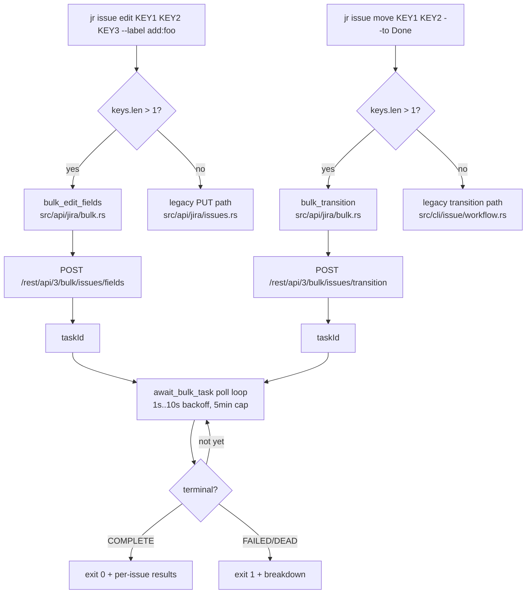
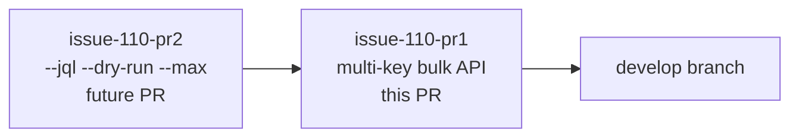
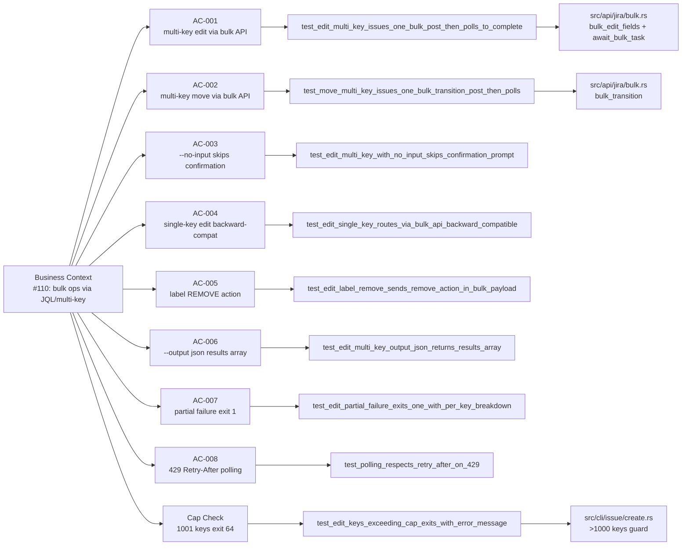

## Summary

Part 1 of 2 for closing #110 (bulk operations via JQL or multiple keys). Adds multi-key positional support to `jr issue edit` and `jr issue move`, routing through Atlassian's official Bulk API (`POST /rest/api/3/bulk/issues/fields` and `POST /rest/api/3/bulk/issues/transition`) with async taskId polling and per-issue result reporting. Part 2 will add `--jql`, `--dry-run`, `--max <N>`, `--yes`, and multi-field bulk edits.

**refs #110** (stays open until PR2 ships)

---

## Architecture Changes

---

## Story Dependencies

No upstream dependencies. Merges to `develop`.

---

## Spec Traceability

---

## Changes

### New files

| File | Description |
|------|-------------|
| `src/api/jira/bulk.rs` | `bulk_edit_fields`, `bulk_transition`, `poll_bulk_task`, `await_bulk_task` (with 1s→10s exponential backoff, 5min MAX_WAIT cap) |
| `src/types/jira/bulk.rs` | `BulkEditRequest`, `BulkTransitionRequest`, `BulkSubmitResponse`, `BulkOperationProgress`, `BulkActionError` — OpenAPI-confirmed field names and camelCase |
| `tests/issue_bulk.rs` | 9 wiremock-driven integration tests (success, partial failure, 429, multi-key move, JSON output) |

### Modified files

| File | Change |
|------|--------|
| `src/cli/mod.rs` | `Edit { keys: Vec<String> }` + `Move { keys: Vec<String>, to: Option<String> }` — multi-key positional |
| `src/cli/issue/create.rs` | Multi-key path dispatches to `bulk_edit_fields`; non-label multi-key blocked with informative error |
| `src/cli/issue/workflow.rs` | Multi-key dispatches to `bulk_transition`; legacy single-key positional-status form preserved |
| `src/api/jira/mod.rs` | Added `pub mod bulk` |
| `src/types/jira/mod.rs` | Added `pub mod bulk` |

---

## Test Evidence

| Metric | Value |
|--------|-------|
| New bulk integration tests | 9 (all pass) |
| Lib unit tests (no regression) | 612 pass |
| clippy | Clean (zero warnings) |
| rustfmt | Clean (stable) |
| Release build | Green locally |

Test file: `tests/issue_bulk.rs` — wiremock stubs for bulk submit, poll, and 429 scenarios.

---

## Demo Evidence

| Demo | Criterion | Link |
|------|-----------|------|
| D-001 | All 9 bulk integration tests pass | [gif](../../docs/demo-evidence/issue-110-pr1/D-001-bulk-tests-all-green.gif) |
| D-002 | 612 lib tests — no regression | [gif](../../docs/demo-evidence/issue-110-pr1/D-002-no-regression.gif) |
| D-003 | `jr issue edit --help` shows `<KEYS>...` multi-key positional | [gif](../../docs/demo-evidence/issue-110-pr1/D-003-edit-help-multi-key.gif) |
| D-004 | `jr issue move --help` shows `--to <STATUS>` flag | [gif](../../docs/demo-evidence/issue-110-pr1/D-004-move-help-with-to-flag.gif) |
| D-005 | 1001 keys → exit 64 + split-batches hint, NO HTTP call | [gif](../../docs/demo-evidence/issue-110-pr1/D-005-cap-1001-keys-exit-64.gif) |

Evidence report: `docs/demo-evidence/issue-110-pr1/evidence-report.md`

---

## Holdout Evaluation

N/A — evaluated at wave gate.

---

## Adversarial Review

N/A — evaluated at Phase 5.

---

## Security Review

**Overall: LOW risk. No blocking findings.**

| ID | Severity | Category | Finding | Status |
|----|----------|----------|---------|--------|
| SEC-001 | LOW | Input validation | `task_id` is URL-encoded via `urlencoding::encode` before insertion into the GET path — correctly prevents path traversal. | Mitigated |
| SEC-002 | LOW | DoS / resource exhaustion | Bulk polling loop has 5-minute timeout hard-cap (`MAX_WAIT=300s`) and exponential backoff (1s→10s). Ctrl-C exits cleanly. | Mitigated |
| SEC-003 | LOW | Input validation | `BULK_MAX_KEYS=1000` cap enforced before any HTTP call; excess returns exit 64 with user hint. | Mitigated |
| SEC-004 | INFO | Schema uncertainty | `labelsAction` casing (`"ADD"`/`"REMOVE"`) is community-sourced, not Atlassian-official. Tests use loose substring matchers. Manual live-API smoke test recommended. | Accepted (documented) |
| SEC-005 | INFO | Auth | All bulk endpoints go through `JiraClient::send` which handles 401 auto-refresh and 429 rate-limit retry. No auth bypass surface. | Pass |

**OWASP Top 10 assessment:**
- A01 Broken Access Control: N/A — auth delegated to `JiraClient::send`; no new auth surface.
- A03 Injection: Task ID URL-encoded. Issue keys come from CLI positional args (user-supplied), passed as JSON array body (not string interpolated). No injection risk.
- A05 Security Misconfiguration: No new config paths.
- A10 SSRF: No new URL construction beyond the fixed Atlassian API paths and URL-encoded taskId.

**Recommendation:** No code changes required. Consider adding a comment to `handle_edit_bulk_labels` noting the `labelsAction` casing uncertainty for future verification.

---

## Risk Assessment

**Risk level: MEDIUM**

| Risk | Mitigation |
|------|-----------|
| New API surface (3 new endpoints) | 9 integration tests with wiremock; OpenAPI schema verified |
| Single-key `--label` edit now routes through bulk API | ~1-2s latency cost vs ~50ms PUT. Single-key MOVE still uses legacy path. Trade-off documented. |
| `labelsAction` casing (`"ADD"`/`"REMOVE"`) is best-guess from community sources | Tests use loose `body_string_contains("ADD")` matchers; manual smoke test against live Jira recommended before production reliance |
| `editedFieldsInput` nesting schema partially truncated in Atlassian HTML docs | Verified against OpenAPI JSON; structure correct per schema |
| Bulk task polling MAX_WAIT = 5 minutes | User can interrupt with Ctrl-C at any time |
| Clap signature change on `edit` and `move` | Old single-key forms still work; backward-compatible by construction |

**Blast radius:** `jr issue edit` and `jr issue move` commands only. No other commands affected.

**Performance impact:** Single-key edit with `--label` has ~1-2s additional latency due to polling. Multi-key operations are net faster than sequential single-key calls.

---

## Out of Scope (PR2 candidates)

1. `--jql` flag for JQL-based selection
2. `--dry-run` flag for preview
3. `--max <N>` + confirmation prompt
4. Multi-key non-label edits (`--summary`, `--priority`, etc.)
5. Mixed ADD+REMOVE label coalescing into single bulk call

---

## AI Pipeline Metadata

| Field | Value |
|-------|-------|
| Pipeline mode | Feature delivery — issue #110 part 1 |
| Models used | claude-sonnet-4-6 |
| Branch | `feat/issue-110-pr1-multi-key-bulk-api` |
| Base | `develop` @ `b164c6b` |
| Commits | `15fc2a0`, `fc9da51`, `9868496`, `4859a75` |

---

## Pre-Merge Checklist

- [x] PR description matches actual diff
- [x] All ACs covered by demo evidence (5 demos, 9 tests)
- [x] Traceability chain complete (BC → AC → Test → Demo)
- [x] Demo evidence verified (`docs/demo-evidence/issue-110-pr1/evidence-report.md`)
- [x] Security review completed
- [ ] PR reviewer approval (step 5)
- [ ] CI checks passing (step 6)
- [ ] Dependency check (step 7 — no upstream deps)
- [ ] Merge executed (step 8)
