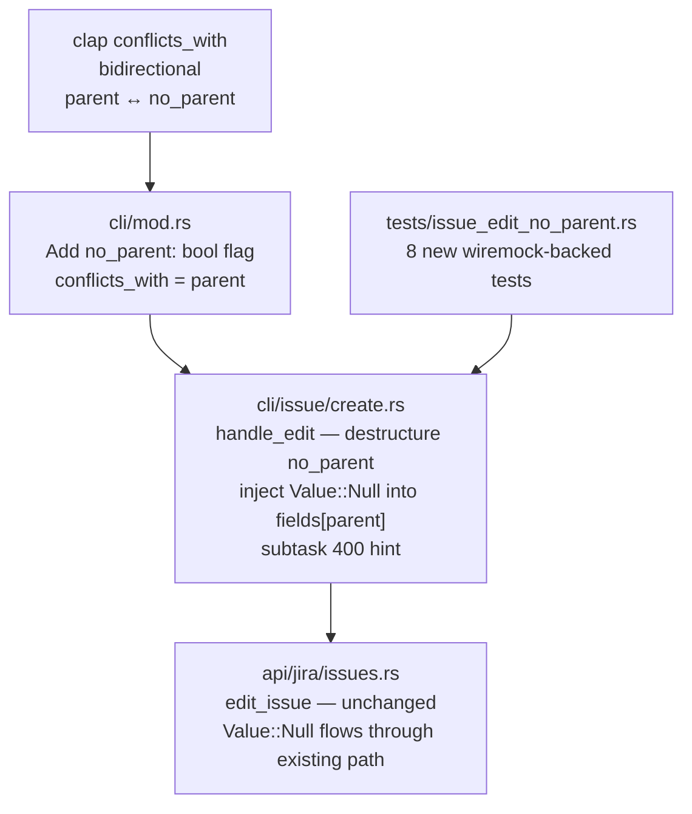
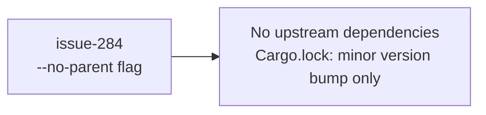
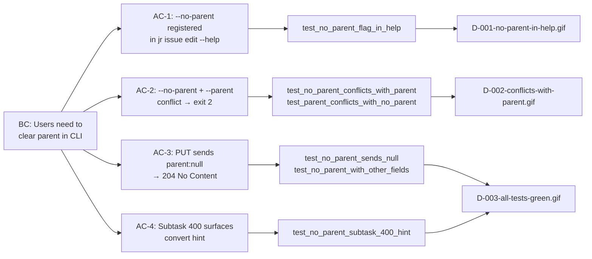

## Summary

Closes #284. Adds `jr issue edit --no-parent` to clear an issue's parent (mirrors the existing `--no-points` precedent). Replaces the documented workaround `jr api /rest/api/3/issue/{key} -X put -d '{"fields":{"parent":null}}'` with first-class CLI ergonomics.

**Closes:** #284

## Architecture Changes

## Story Dependencies

## Spec Traceability

## Changes

| File | Change |
|------|--------|
| `src/cli/mod.rs` | Add `no_parent: bool` to `Edit` variant; bidirectional `conflicts_with` between `parent` and `no_parent` |
| `src/cli/issue/create.rs` | Destructure `no_parent` in `handle_edit`; inject `serde_json::Value::Null` into `fields["parent"]` when set; update "no fields specified" bail message; subtask 400 detection with convert hint |
| `tests/issue_edit_no_parent.rs` | NEW — 8 wiremock-backed integration tests covering help text, JSON null body, mutual exclusion, subtask hint, multi-field combo, and `--output json` success |

## Demo Evidence

| Demo | Claim | Artifact |
|------|-------|----------|
| D-001 | `--no-parent` registered with helpful description | [D-001-no-parent-in-help.gif](../../docs/demo-evidence/issue-284/D-001-no-parent-in-help.gif) |
| D-002 | `--no-parent` + `--parent` conflict yields exit 2 with "cannot be used with" message | [D-002-conflicts-with-parent.gif](../../docs/demo-evidence/issue-284/D-002-conflicts-with-parent.gif) |
| D-003 | All 8 new tests green | [D-003-all-tests-green.gif](../../docs/demo-evidence/issue-284/D-003-all-tests-green.gif) |
| D-004 | No regression on 612 lib tests | [D-004-no-regression.gif](../../docs/demo-evidence/issue-284/D-004-no-regression.gif) |

## Test Evidence

| Metric | Value |
|--------|-------|
| New integration tests | 8 / 8 passed |
| Lib unit tests | 612 / 612 passed (no regression) |
| Clippy | Zero warnings (zero-warnings policy) |
| Stable rustfmt | Clean |
| Nightly rustfmt | Clean |
| Release build | Green |

## Security Review

No new auth surface, no new dependencies, no network endpoints added. This PR adds a single CLI flag that passes `Value::Null` through the existing `edit_issue` API path. Security review: NONE required (flag-only change within existing authenticated API call).

## Risk Assessment

**Blast radius:** LOW. Single new boolean flag with bidirectional `conflicts_with`. Existing `--parent` behavior is unchanged (regression-pinned via existing tests). The `serde_json::Value::Null` path flows through the existing `edit_issue` function without struct changes.

**Performance impact:** NONE. No new API calls, no new cache reads, no new async paths.

**Breaking changes:** NONE. Additive flag only.

## Out of Scope

Subtask conversion (`POST /rest/api/3/issue/{key}/convert`) — separate future story. This PR only detects subtask attempts and surfaces a human-readable hint pointing the user to the conversion endpoint.

## Pre-existing Known Flake

`tests/auth_login_json_test.rs::test_auth_login_emits_json_when_output_json_set` — macOS keychain `item already exists` error. Pre-existing, unrelated to this PR. CI Linux is not expected to reproduce this.

## Research Backing

`.factory/research/issue-284-no-parent-flag.md` — Perplexity-verified claims:
- PUT with `parent: null` returns 204 (verified)
- Subtask parent clear fails 400 (verified)
- Legacy Epic Link replaced by parent field in Feb 2024 (verified)

## AI Pipeline Metadata

| Field | Value |
|-------|-------|
| Pipeline mode | Feature delta (issue-284) |
| Models used | claude-sonnet-4-6 |
| Branch | `feat/issue-284-no-parent-flag` |
| Base SHA | `ff00061` |
| Commits | 3 (test-writer → implementer → demos) |

## Pre-Merge Checklist

- [x] PR description matches actual diff
- [x] All 4 ACs covered by demo evidence (1 recording per AC minimum)
- [x] Traceability chain complete (BC → AC → Test → Demo)
- [x] 8 new integration tests pass
- [x] 612 lib tests preserved (no regression)
- [x] Clippy clean (zero warnings)
- [x] `cargo fmt --all -- --check` passes
- [x] Release build green
- [x] Security review: no new attack surface
- [x] No upstream story dependencies to wait for
- [ ] CI checks green (populated in step 6)
- [ ] Squash-merged (populated in step 8)
