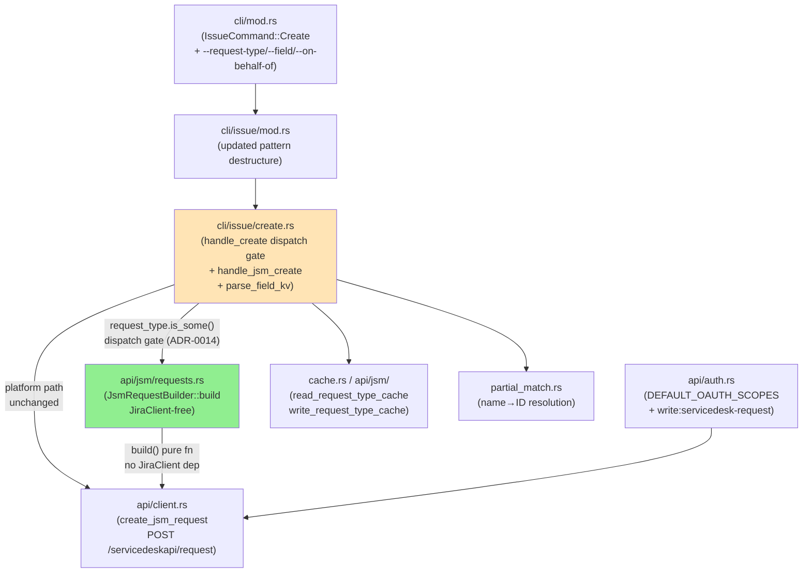
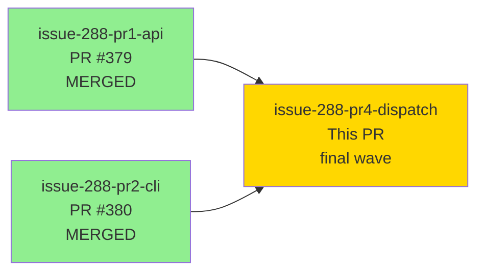
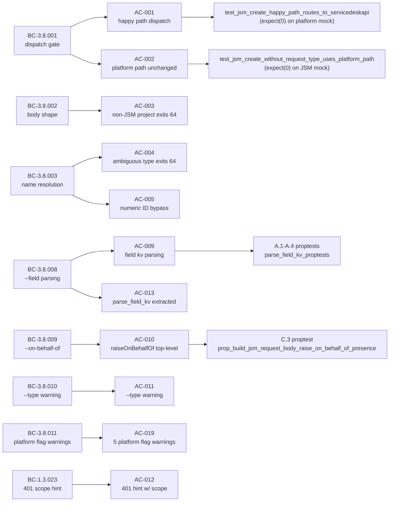
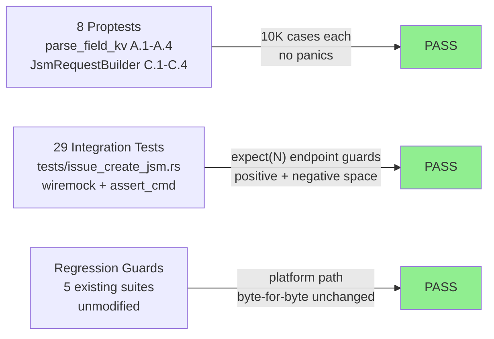
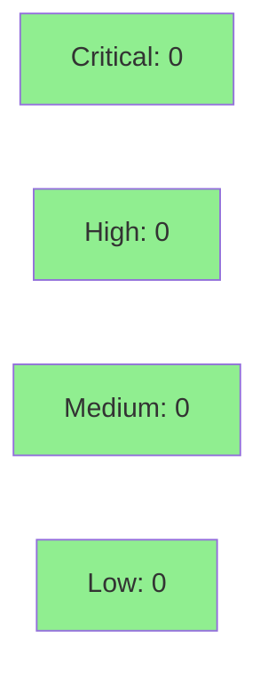

# feat(S-288-pr4): jr issue create --request-type JSM dispatch fork + OAuth scope (closes #288)

**Epic:** issue-288 — JSM Service Management `jr issue create` request submission
**Mode:** feature (brownfield — additive JSM dispatch fork)
**Convergence:** CONVERGED after 9 adversarial passes (7 remediation rounds + 3 consecutive CLEAN)


This is the **final PR for issue #288** — the complete JSM request submission feature for `jr issue create`. It adds `--request-type <NAME|ID>`, `--field NAME=VALUE`, and `--on-behalf-of <accountId>` flags to `jr issue create`, wires conditional dispatch to `POST /rest/servicedeskapi/request`, and absorbs the `write:servicedesk-request` OAuth scope addition (formerly planned as pr3-scope). The platform path (`jr issue create` without `--request-type`) is byte-for-byte unchanged, regression-pinned by all existing integration test suites passing without modification.

**Wave series:** Wave 1 (PR #379, merged) established the API client + JSM types. Wave 2 (PR #380, merged) added `jr requesttype list/fields` discovery commands and the request-type cache. This Wave 3 PR wires everything together into the user-facing create flow.

Closes #288.

---

## Architecture Changes



<details>
<summary><strong>Architecture Decision Record — ADR-0014: Dispatch Fork via Option&lt;String&gt; Gate</strong></summary>

### ADR-0014: `issue create` JSM Dispatch Fork

**Context:** `jr issue create` needs to support both the Jira platform API (`POST /rest/api/3/issue`) and the JSM Service Management API (`POST /rest/servicedeskapi/request`) without breaking the existing platform path. Multiple approaches were considered.

**Decision:** Gate the JSM dispatch on `request_type.is_some()` at the top of `handle_create` (early-return to `handle_jsm_create`). No project-type probe, no additional HTTP round-trips at the gate.

**Rationale:** Option C (flag-gated early-return) was chosen over Option A (project-type detection at runtime) and Option B (separate subcommand). Option A requires an extra API call for every platform-path create; Option B breaks UX parity with existing `issue create` flags. Option C has zero overhead on the platform path and is immediately testable with `expect(0)` on each endpoint's mock.

**Alternatives Considered:**
1. Project-type detection — rejected because: adds latency to every platform create; increases blast radius; project type can change after cache write
2. Separate `jr issue create-request` subcommand — rejected because: UX parity break; users expect `--request-type` to extend create, not fork it

**Consequences:**
- Platform path is structurally immutable: any future `handle_create` modification MUST NOT touch the early-return gate
- JSM path carries its own arg-struct (`JsmCreateArgs`) to avoid too-many-arguments clippy violation without `#[allow]`

</details>

---

## Story Dependencies



| Dependency | PR | Status | Provides |
|------------|-----|--------|---------|
| issue-288-pr1-api | #379 | MERGED to develop | `JiaClient::create_jsm_request`, `list_request_types`, all JSM serde types |
| issue-288-pr2-cli | #380 | MERGED to develop | `jr requesttype list/fields`, `require_service_desk(call_site_label)`, request-type cache family |
| **This PR** | — | **Wave 3 (final)** | `--request-type`/`--field`/`--on-behalf-of` flags; `handle_jsm_create`; `write:servicedesk-request` OAuth scope |

This PR blocks nothing. Merging it **completes issue #288**.

---

## Spec Traceability



---

## Behavioral Contracts (14 BC anchors)

| BC ID | Summary | Status |
|-------|---------|--------|
| BC-3.8.001 | `--request-type` dispatches to servicedeskapi; platform path unchanged when absent | PINNED |
| BC-3.8.002 | Body uses `requestFieldValues`; `serviceDeskId` via `require_service_desk` | PINNED |
| BC-3.8.003 | Name resolution via `partial_match`; errors clean on Ambiguous/None | PINNED |
| BC-3.8.004 | Numeric `--request-type <ID>` bypasses name resolution | PINNED |
| BC-3.8.005 | `--summary` → `requestFieldValues.summary` (required) | PINNED |
| BC-3.8.006 | `--description` → ADF; `isAdfRequest: true` | PINNED |
| BC-3.8.007 | `--priority`/`--label` → `requestFieldValues` | PINNED |
| BC-3.8.008 | `--field NAME=VALUE`; first `=` splits; duplicate last-wins | PINNED |
| BC-3.8.009 | `--on-behalf-of <accountId>` → `raiseOnBehalfOf` top-level; absent when not set (not null) | PINNED |
| BC-3.8.010 | `--type` ignored with stderr warning when `--request-type` set | PINNED |
| BC-3.8.011 | Platform-only flags (`--team`, `--points`, `--parent`, `--to`, `--account-id`) emit stderr warnings on JSM path | PINNED |
| BC-3.3.001 | Platform path unchanged when `--request-type` absent | PINNED |
| BC-1.3.023 | 401 scope-mismatch hint surfaces `write:servicedesk-request` | PINNED |
| BC-X.3.005 | `InsufficientScope` dispatch on 401 | PINNED |

---

## Test Evidence

### Coverage Summary

| Metric | Value | Threshold | Status |
|--------|-------|-----------|--------|
| New integration tests | 29 (issue_create_jsm.rs) | — | PASS |
| New proptests | 8 (A.1–A.4, C.1–C.4) | — | PASS |
| Regression test suites (unmodified) | 5 (issue_create_json, issue_commands, issue_write_holdouts, requesttype_commands, queue) | 100% | PASS |
| Clippy | 0 warnings | 0 | PASS |
| cargo fmt | clean | clean | PASS |
| check-spec-counts.sh | exit 0 | 0 | PASS |
| No new `unsafe` blocks | confirmed | 0 | PASS |
| No new `#[allow]` suppressions | confirmed (JsmCreateArgs refactor) | 0 | PASS |

### Test Flow



| Metric | Value |
|--------|-------|
| **New tests** | 29 integration + 8 proptests = 37 new tests |
| **Total suite (approx)** | 817+ tests PASS |
| **Regressions** | 0 — all pre-existing suites pass without modification |

<details>
<summary><strong>Key Integration Tests (AC mapping)</strong></summary>

| Test | AC | Line | Key Assertion |
|------|----|------|---------------|
| `test_jsm_create_happy_path_routes_to_servicedeskapi` | AC-001 | 184 | `expect(1)` on JSM mock; `expect(0)` on platform mock (H-NEW-JSM-RT-001) |
| `test_jsm_create_without_request_type_uses_platform_path` | AC-002 | 254 | `expect(0)` on servicedeskapi mock; platform path only |
| `test_jsm_create_non_jsm_project_exits_64_zero_http` | AC-003 | 328 | exit 64; 0 POSTs to either endpoint (H-NEW-JSM-RT-002) |
| `test_jsm_create_ambiguous_request_type_exits_64` | AC-004 | 393 | exit 64; stderr "Ambiguous request type" + `jr requesttype list` hint |
| `test_jsm_create_numeric_id_bypasses_name_lookup` | AC-005 | 503 | `expect(0)` on list endpoint — no name resolution HTTP call |
| `test_jsm_create_summary_in_requestfieldvalues` | AC-006 | 582 | body `requestFieldValues.summary` exact match |
| `test_jsm_create_description_is_adf_with_is_adf_request_true` | AC-007 | 653 | `isAdfRequest: true`; `requestFieldValues.description` is JSON object |
| `test_jsm_create_priority_and_labels_mapped` | AC-008 | 831 | labels plain string array (not object array) |
| `test_jsm_create_field_first_equals_split_and_duplicate_last_wins` | AC-009 | 943 | `desc=bar=baz` preserves trailing `=` |
| `test_jsm_create_on_behalf_of_injected_at_top_level` | AC-010 | 1094 | `raiseOnBehalfOf` top-level; not in `requestFieldValues` |
| `test_jsm_create_on_behalf_of_absent_when_not_set` | AC-010 | 1173 | key completely absent (not null) |
| `test_jsm_create_type_flag_ignored_with_warning` | AC-011 | 1242 | stderr warning + exit 0 + correct JSON output (H-NEW-JSM-RT-004) |
| `test_jsm_create_basic_auth_generic_401_surfaces_api_token_hint` (repurposed in place (renamed from its pre-#384 name by S-384 F4); pre-rename: hint asserted `write:servicedesk-request`; post-rename: asserts API-token-expiry hint, `write:servicedesk-request` ABSENT) | AC-012 | 1309 | pre-rename: hint text contained `write:servicedesk-request` (H-NEW-JSM-RT-003 at S-288 time; H-NEW-JSM-RT-003 was subsequently re-bound to `test_jsm_create_oauth_scope_mismatch_401_surfaces_write_servicedesk_request_hint` by S-384 adversary-pass-9 C-01) |
| `test_jsm_create_output_json_shape_matches_platform` | AC-015 | 1441 | stdout `{"key":"HELP-42"}` only |
| `test_jsm_create_team_flag_emits_warning_with_request_type` | AC-019 | 1590 | BC-3.8.011 verbatim warning for `--team` |
| `test_jsm_create_points_flag_emits_warning_with_request_type` | AC-019 | 1646 | BC-3.8.011 verbatim warning for `--points` |
| `test_jsm_create_parent_flag_emits_warning_with_request_type` | AC-019 | 1702 | BC-3.8.011 verbatim warning for `--parent` |
| `test_jsm_create_to_flag_emits_warning_with_request_type` | AC-019 | 1758 | BC-3.8.011 verbatim warning for `--to` |
| `test_jsm_create_account_id_flag_emits_warning_with_request_type` | AC-019 | 1814 | BC-3.8.011 verbatim warning for `--account-id` |
| `test_platform_create_401_no_jsm_scope_hint` | — | 1381 | negative-space: platform 401 does NOT mention JSM scope |
| `test_jsm_create_missing_summary_exits_64` | AC-006 | 1927 | exit 64 "summary is required for JSM request submission" |
| `test_jsm_create_request_type_not_found_exits_64` | — | 1983 | exit 64 + cache-deletion hint |
| `test_jsm_create_field_summary_overrides_summary_flag` | AC-009 | 2056 | `--field summary=X` last-wins over `--summary Y` |
| `test_jsm_create_missing_project_exits_64_with_jsm_specific_hint` | — | 1874 | exit 64 with JSM-specific message |
| `test_jsm_create_markdown_description_yields_adf_with_strong_marks` | — | 2123 | `--markdown` + ADF bold/strong marks |
| `test_jsm_create_markdown_without_description_exits_64_with_platform_message` | — | 2233 | `--markdown` without `--description` mirrors platform error |

</details>

<details>
<summary><strong>Proptest Properties</strong></summary>

### A.1–A.4: `parse_field_kv` (src/cli/issue/create.rs, lines 1675–1755)

| Property | Invariant |
|----------|-----------|
| `prop_parse_field_kv_first_equals_split` (A.1) | First `=` is the delimiter; subsequent `=` chars are part of the value |
| `prop_parse_field_kv_empty_value_allowed` (A.2) | `key=` (empty value) is accepted and produces `{"key": ""}` |
| `prop_parse_field_kv_last_value_wins_on_duplicates` (A.3) | Duplicate keys collapse to one entry; the last value wins |
| `prop_parse_field_kv_no_panic_on_arbitrary_input` (A.4) | No panic on any input string (Ok or Err both acceptable) |

### C.1–C.4: `JsmRequestBuilder::build` (src/api/jsm/requests.rs, lines 158–336)

| Property | Invariant |
|----------|-----------|
| `prop_build_jsm_request_body_summary_always_present` (C.1) | `requestFieldValues.summary` always equals the passed-in summary |
| `prop_build_jsm_request_body_description_adf_presence` (C.2) | description Some → `isAdfRequest: true` + ADF object; None → both absent |
| `prop_build_jsm_request_body_raise_on_behalf_of_presence` (C.3) | `raiseOnBehalfOf` present at top level when Some; completely absent when None |
| `prop_build_jsm_request_body_top_level_ids` (C.4) | `serviceDeskId`/`requestTypeId` never inside `requestFieldValues` |

</details>

---

## Demo Evidence

Two VHS recordings in `docs/demo-evidence/issue-288-pr4-dispatch/`:

| Recording | ACs | Demonstrates |
|-----------|-----|-------------|
| `AC-001-jsm-create-help.gif` | AC-001, AC-002, AC-006, AC-009, AC-010, AC-011 | `jr issue create --help` — confirms `--request-type`, `--field`, `--on-behalf-of` flags present in clap interface |
| `AC-016-auth-scopes.gif` | AC-016 | Grep of `src/api/auth.rs` confirms `write:servicedesk-request` in `DEFAULT_OAUTH_SCOPES` |

**Strategy:** Recording strategy C (VHS help text + wiremock integration tests as primary behavioral evidence). All 19 ACs are covered by the 29 integration tests in `tests/issue_create_jsm.rs` using `wiremock::MockBuilder::expect(N)` constraints — machine-verifiable dispatch isolation without credentials.

---

## Holdout Evaluation

| Scenario | Status |
|----------|--------|
| H-NEW-JSM-RT-001 — happy path dispatches to servicedeskapi; ZERO platform POSTs | PASS (`expect(0)` on platform mock, line 184) |
| H-NEW-JSM-RT-002 — non-JSM project exits 64; ZERO HTTP POSTs | PASS (line 328) |
| H-NEW-JSM-RT-003 — 401 scope mismatch hint contains `write:servicedesk-request` | PASS (lines 1309, 1523) |
| H-NEW-JSM-RT-004 — `--type` ignored with stderr warning | PASS (line 1242) |

All 4 holdout scenarios pass. N/A — evaluated at wave gate.

---

## Adversarial Review

| Pass | Verdict | Findings | Status |
|------|---------|----------|--------|
| 01 | REQUEST_CHANGES | C-01 (BC-3.8.011 AC gap), C-02 (BC-3.8.011 codification) | Fixed |
| 02 | REQUEST_CHANGES | Tool-path bug — pass invalidated; see pass-02-retry | Fixed |
| 02-retry | REQUEST_CHANGES | M-2 (ADF root key assertion), M-3 (platform regression guard) | Fixed |
| 03 | REQUEST_CHANGES | M-01 (AC-019 added), M-02 (serviceDeskId/requestTypeId C.4 proptest), M-03 (deferred) | Fixed/Deferred |
| 04 | REQUEST_CHANGES | C-01 (negative-space for platform 401 + missing-`=` exit-64) | Fixed |
| 05 | REQUEST_CHANGES | C-01 (O-01 deferred), multiple NON-BLOCKING | Fixed/Deferred |
| 06 | REQUEST_CHANGES | AC-011 wording alignment, minor NON-BLOCKING | Fixed |
| **07** | **CLEAN** | None — 17 cross-axis checks PASS | Converged 1/3 |
| **08** | **CLEAN** | 6 LOW/NIT observations (deferred) | Converged 2/3 |
| **09** | **CLEAN → CONVERGED** | 28 invariants verified | CONVERGED 3/3 |

**Convergence:** 3/3 consecutive CLEAN passes achieved per BC-5.39.001 per-story policy. Adversary forced to hallucinate after pass 09 re-derivation confirmed zero findings.

<details>
<summary><strong>Key Fixed Findings</strong></summary>

### Pass 01: C-01 — BC-3.8.011 AC Gap
- **Problem:** BC-3.8.011 (platform-only flag warnings) was codified in the BC table but had no AC in the story.
- **Resolution:** Added AC-019 (5 warning-emission tests, one per platform-only flag).
- **Tests added:** `test_jsm_create_team/points/parent/to/account_id_flag_emits_warning_with_request_type` (5 tests)

### Pass 03: M-02 — serviceDeskId/requestTypeId negative-space pin
- **Problem:** No proptest asserted that `serviceDeskId`/`requestTypeId` were NOT inside `requestFieldValues`.
- **Resolution:** Added C.4 proptest (`prop_build_jsm_request_body_top_level_ids`).

### Pass 04: C-01 — Platform 401 negative-space guard
- **Problem:** Test confirmed JSM 401 path correctly; no test confirmed platform 401 did NOT trigger JSM scope hint.
- **Resolution:** Added `test_platform_create_401_no_jsm_scope_hint` (line 1381).

### Pass 06: AC-011 wording alignment
- **Problem:** AC-011 wording implied `--type` warning must fire even on early-exit paths; BC-3.8.010 says "need not" fire.
- **Resolution:** AC-011 wording updated to align with BC-3.8.010 permissive language. Implementation (pre-dispatch warnings) is BC-compliant.

</details>

---

## Security Review

Security review findings for this PR:



<details>
<summary><strong>Security Scan Details</strong></summary>

### OAuth Scope Addition
- `write:servicedesk-request` added to `DEFAULT_OAUTH_SCOPES`
- No embedded credential changes — scope list only
- Existing tokens continue working with old scopes until expiry; new logins/refresh mints trigger re-consent (CHANGELOG entry added)
- Manual release gate: Developer Console permissions must be updated at https://developer.atlassian.com/console/myapps/ before tagging release (PR checklist item below)

### New HTTP Endpoint
- `POST /rest/servicedeskapi/request` — uses existing `JiraClient` auth (same Bearer token / Basic auth as all other endpoints)
- Body is constructed by `JsmRequestBuilder::build` (pure function, no injection vectors from user input beyond normal JSON serialization)
- `--field NAME=VALUE` user input is JSON-value typed (string values only) — no eval or dynamic code execution
- `--on-behalf-of <accountId>` is passed as a string to `raiseOnBehalfOf` — opaque account ID, no parsing beyond string passthrough
- 401 response: triggers `InsufficientScope` hint (read-only, no token mutation)

### No `unsafe` Blocks
Confirmed zero new `unsafe` blocks.

### Dependency Audit
- No new crate dependencies added — all existing dev-dependencies (`proptest`, `wiremock`, `assert_cmd`, `serde_json`)

</details>

---

## Risk Assessment & Deployment

### Blast Radius
- **Systems affected:** `jr issue create` CLI command only; JSM path is an additive fork
- **User impact:** Platform path users: zero impact (byte-for-byte unchanged, regression-pinned)
- **JSM path users:** New capability; `--request-type` flag triggers the new path
- **OAuth re-consent:** Existing users will see a re-consent prompt on next `jr auth login` after release (scope added)
- **Risk Level:** LOW — platform path immutable; JSM path additive only

### Performance Impact
| Metric | Platform path | JSM path | Status |
|--------|--------------|---------|--------|
| Latency | Unchanged | +1 HTTP (service desk lookup) for name resolution; +0 for numeric ID | OK |
| Memory | Unchanged | +cache read (request_types.json, 7d TTL) | OK |

<details>
<summary><strong>Rollback Instructions</strong></summary>

**Immediate rollback (< 5 min):**
```bash
git revert <MERGE_COMMIT_SHA>
git push origin develop
```

**Verification after rollback:**
- `jr issue create --project PROJ --type Task --summary "test" --no-input` → exits 0 (platform path intact)
- `jr issue create --request-type` flag should no longer exist in `--help`

</details>

### Feature Flags
No feature flags — additive flag, `--request-type` presence is the gate.

### OAuth Developer Console Gate (Required Before Release)
Before tagging the release, update the embedded `jr` OAuth app's permissions in the Atlassian Developer Console at https://developer.atlassian.com/console/myapps/ to include `write:servicedesk-request`. This is a manual step outside the PR. The implementation is already in this PR; the Developer Console update must precede the next release tag.

---

## Traceability

| BC | AC | Test | Status |
|----|-----|------|--------|
| BC-3.8.001 | AC-001 | `test_jsm_create_happy_path_routes_to_servicedeskapi` | PASS |
| BC-3.3.001 | AC-002 | `test_jsm_create_without_request_type_uses_platform_path` | PASS |
| BC-3.8.002 | AC-003 | `test_jsm_create_non_jsm_project_exits_64_zero_http` | PASS |
| BC-3.8.003 | AC-004 | `test_jsm_create_ambiguous_request_type_exits_64` | PASS |
| BC-3.8.004 | AC-005 | `test_jsm_create_numeric_id_bypasses_name_lookup` | PASS |
| BC-3.8.005 | AC-006 | `test_jsm_create_summary_in_requestfieldvalues` | PASS |
| BC-3.8.006 | AC-007 | `test_jsm_create_description_is_adf_with_is_adf_request_true` | PASS |
| BC-3.8.007 | AC-008 | `test_jsm_create_priority_and_labels_mapped` | PASS |
| BC-3.8.008 | AC-009 | `test_jsm_create_field_first_equals_split_and_duplicate_last_wins` + A.1–A.4 proptests | PASS |
| BC-3.8.009 | AC-010 | `test_jsm_create_on_behalf_of_injected_at_top_level` + C.3 proptest | PASS |
| BC-3.8.010 | AC-011 | `test_jsm_create_type_flag_ignored_with_warning` (H-NEW-JSM-RT-004) | PASS |
| BC-1.3.023 | AC-012 | `test_jsm_create_basic_auth_generic_401_surfaces_api_token_hint` (repurposed in place (renamed from its pre-#384 name by S-384 F4); test was green at S-288 time with old assertions; S-384 F4 repurposed in place) | PASS (at S-288 delivery time; subsequently repurposed by S-384) |
| BC-3.8.008 | AC-013 | `parse_field_kv_proptests` (A.1–A.4) | PASS |
| BC-3.8.001 | AC-014 | `JsmRequestBuilder::build` proptests (C.1–C.4) | PASS |
| BC-3.8.001 | AC-015 | `test_jsm_create_output_json_shape_matches_platform` | PASS |
| BC-1.3.023 | AC-016 | `default_oauth_scopes_pins_the_full_set_with_offline_access` | PASS |
| — | AC-017 | Full test suite, clippy, fmt, check-spec-counts | PASS |
| — | AC-018 | `.cargo/mutants.toml` examine_globs extended | PASS |
| BC-3.8.011 | AC-019 | 5 `test_jsm_create_*_flag_emits_warning_with_request_type` tests | PASS |

---

## Post-Merge Follow-Up Issues

These items are intentionally deferred out of pr4 scope. File as issues after merge:

| Item | Priority | Description |
|------|----------|-------------|
| M-03 | MEDIUM | `JrError::InsufficientScope` Display surfaces stale `write:jira-work` legacy text — refactor of shared error type, out of pr4 perimeter |
| O-01 | LOW | Platform-path inverse silent-drop of `--field`/`--on-behalf-of` — BC-3.8.011 symmetry candidate |
| O-08-01..07 | LOW | 6 LOW UX/AC-text refinement observations from adversary pass-08 |

---

## AI Pipeline Metadata

<details>
<summary><strong>Pipeline Details</strong></summary>

```yaml
ai-generated: true
pipeline-mode: feature (brownfield-delta)
factory-version: "1.0.0-rc.18"
pipeline-stages:
  spec-crystallization: completed
  story-decomposition: completed (3-wave decomposition)
  tdd-implementation: completed (strict TDD, Red Gate enforced)
  holdout-evaluation: "N/A — evaluated at wave gate"
  adversarial-review: completed (9 passes, 7 remediation rounds, 3 CLEAN)
  formal-verification: "N/A — evaluated at Phase 6"
  convergence: achieved (BC-5.39.001 3/3 CLEAN policy satisfied)
convergence-metrics:
  adversarial-passes: 9
  clean-pass-streak: 3
  remediation-rounds: 7
  invariants-verified: 28
  integration-tests: 29
  proptests: 8
wave-series:
  wave-1: "PR #379 MERGED (api layer)"
  wave-2: "PR #380 MERGED (requesttype CLI + cache)"
  wave-3: "This PR (dispatch fork + OAuth scope)"
models-used:
  builder: claude-sonnet-4-6
  adversary: claude-sonnet-4-6 (fresh-context re-derivation)
generated-at: "2026-05-18"
```

</details>

---

## Pre-Merge Checklist

- [ ] All CI status checks passing
- [ ] 29 integration tests + 8 proptests green
- [ ] All 5 regression test suites pass without modification
- [ ] No critical/high security findings unresolved
- [ ] Wave 1 PR #379 merged to develop — confirmed
- [ ] Wave 2 PR #380 merged to develop — confirmed
- [ ] `write:servicedesk-request` OAuth scope present in `DEFAULT_OAUTH_SCOPES` — confirmed
- [ ] CHANGELOG entry for scope addition present — confirmed
- [ ] CLAUDE.md `DEFAULT_OAUTH_SCOPES` gotcha added — confirmed
- [ ] `.cargo/mutants.toml` examine_globs extended (3 new files) — confirmed
- [ ] Copilot review addressed
- [ ] **[RELEASE GATE]** Before tagging release: update Atlassian Developer Console OAuth app permissions to include `write:servicedesk-request` at https://developer.atlassian.com/console/myapps/
