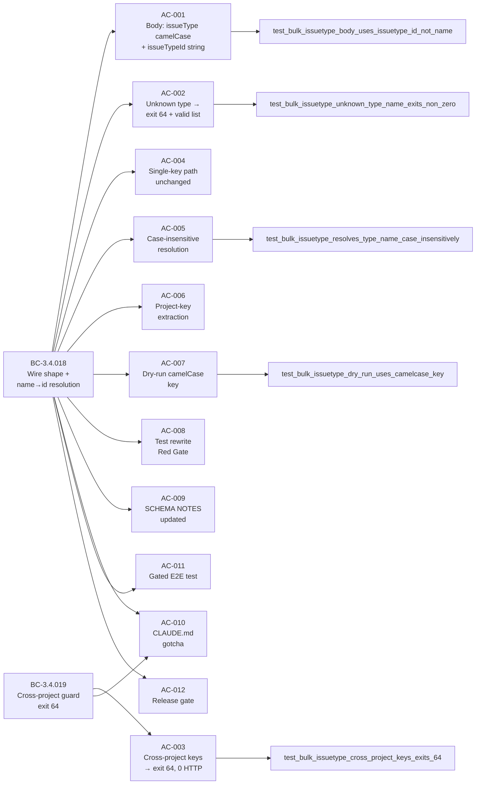
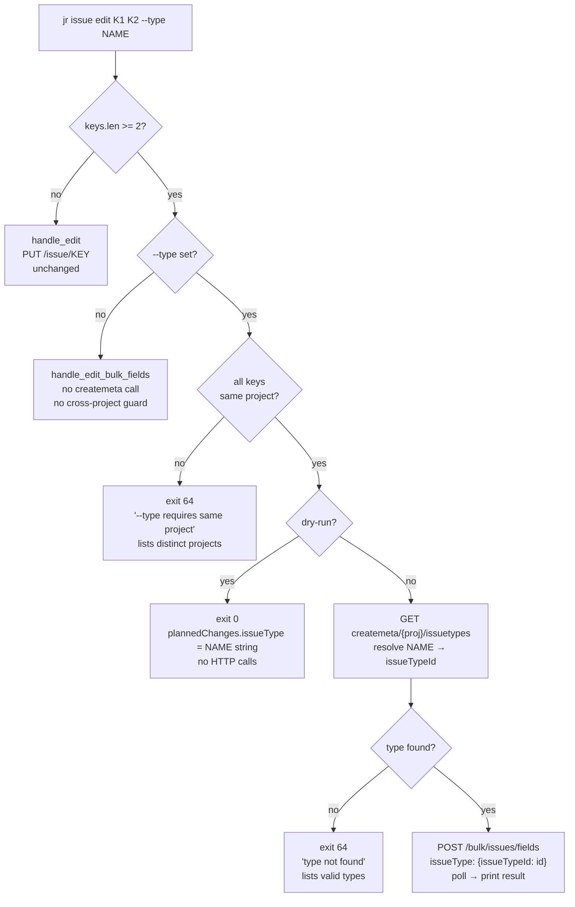
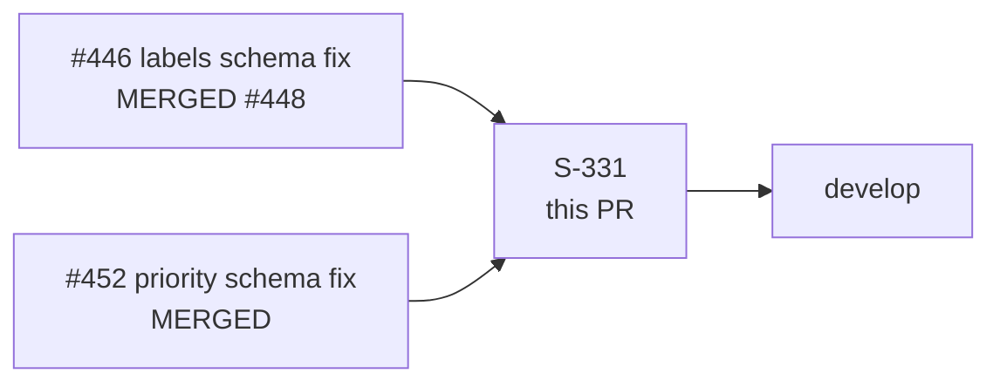

## Summary

Fixes the last unverified bulk-edit field shape from issue #331, completing the three-part schema-correction series (priority in #452, labels in #448/#446, issueType here).

Multi-key `jr issue edit KEY1 KEY2 --type <NAME>` now sends the **Atlassian-verified** bulk payload shape:

- `selectedActions`: `["issuetype"]` (lowercase — already correct, unchanged)
- `editedFieldsInput["issueType"]` (camelCase key — was broken lowercase `"issuetype"`)
- value: `{"issueTypeId": "<string-id>"}` — was broken `{"name": "<type-name>"}`
- name→id resolution via `GET /rest/api/3/issue/createmeta/{proj}/issuetypes` (project-scoped)
- cross-project guard: keys spanning >1 project exit 64 before any API call

The single-key `--type` path (`PUT /rest/api/3/issue/{key}`) is byte-for-byte unchanged.

## Motivation

The pre-fix shape would 400 or silently no-op on real Jira Cloud. The camelCase/lowercase asymmetry between `selectedActions` (`"issuetype"`) and `editedFieldsInput` key (`"issueType"`) is intentional per the verified Atlassian Bulk Operations FAQ — these intentionally differ. Unlike priority (global IDs, one call anywhere), issueType IDs are project-scoped; a single `issueTypeId` cannot correctly target issues across projects, hence the cross-project exit-64 guard.

## Behavioral-Contract Traceability



## Control-Flow Diagram (new guard + resolver path)



## Schema Rationale

Source: verbatim Atlassian Bulk Operations FAQ (fetched 2026-06-01, two independent calls). Research file: `.factory/research/issue-331-issuetype-bulk-schema.md`.

The verified Atlassian FAQ shows all three field types coexisting in one `editedFieldsInput`:

```json
{
    "selectedActions": ["labels", "issuetype", "priority"],
    "editedFieldsInput": {
        "labelsFields": [{"fieldId": "labels", "labels": [{"name": "Hello"}], "bulkEditMultiSelectFieldOption": "ADD"}],
        "issueType": {"issueTypeId": "10013"},
        "priority": {"priorityId": "1"}
    }
}
```

This confirms:
- `labels` → `labelsFields` array container (PR #448/#446 — live-Jira proven)
- `priority` → `editedFieldsInput["priority"]` direct object with `priorityId` string (PR #452 — live-Jira proven first try)
- `issueType` → `editedFieldsInput["issueType"]` direct object with `issueTypeId` string (this PR — mirrors priority pattern exactly)

**The camelCase/lowercase asymmetry is intentional and documented:** `selectedActions` uses lowercase system field ids (`"issuetype"`, `"priority"`) while `editedFieldsInput` uses camelCase bean names (`"issueType"`, `"priority"`). For priority these happen to match (`"priority"` == `"priority"`); for issueType they differ (`"issuetype"` vs `"issueType"`).

## Demo Evidence

```
Demo 1 — cross-project guard (BC-3.4.019), exit 64:
  $ jr issue edit FOO-1 BAR-2 --type Bug --no-input
  Error: --type requires all issues to be in the same project; the provided keys span
  2 distinct projects: BAR, FOO. Issue-type IDs differ per project, so a single bulk
  edit cannot target all of them — split the keys by project and run separate
  `jr issue edit` commands.   (exit 64)

Demo 2 — guard fires before dry-run short-circuit (EC-3.4.019-5), exit 64:
  $ jr issue edit FOO-1 BAR-2 --type Bug --dry-run --output json --no-input
  {"code":64,"error":"--type requires all issues to be in the same project; ...
  split the keys by project ..."}   (exit 64)

Demo 3 — same-project dry-run emits camelCase issueType (BC-3.4.018 inv 5), exit 0:
  $ jr issue edit FOO-1 FOO-2 --type Bug --dry-run --output json --no-input
  {"dryRun": true, "issues": ["FOO-1","FOO-2"], "plannedChanges": {"issueType": "Bug"}}
  (exit 0)
```

Note: binary GIF/WebM recordings exist in `.factory/code-delivery/issue-331/demo/` but are not committed to develop per issue #387 (avoid git-blob bloat).

## Test Evidence

### Wiremock Integration Tests (`tests/issue_bulk_pr2.rs`)

| Test | BC / AC | What is pinned |
|------|---------|----------------|
| `test_multi_key_type_update_body_uses_issue_type_id` (REWRITE of old inverted test) | BC-3.4.018 AC-008 | Body has `"issueType"` (camelCase key) + `"issueTypeId"` value; `"issuetype"` in selectedActions; no `"name"` in value position |
| `test_bulk_issuetype_body_uses_issuetype_id_not_name` (NEW) | BC-3.4.018 AC-001 | Full body-shape pin: createmeta mock → resolution → camelCase key + string id in POST body |
| `test_bulk_issuetype_cross_project_keys_exits_64` (NEW) | BC-3.4.019 AC-003 | FOO-1 + BAR-2 with `--type` → exit 64, `"--type"` + `"FOO"` + `"BAR"` in stderr, zero HTTP calls |
| `test_bulk_issuetype_cross_project_dry_run_exits_64` (NEW) | BC-3.4.019 EC-3.4.019-5 | Guard fires before dry-run short-circuit |
| `test_bulk_issuetype_unknown_type_name_exits_non_zero` (NEW) | BC-3.4.018 AC-002 | `--type Nonexistent` → exit 64, lists valid types, no bulk POST |
| `test_bulk_issuetype_resolves_type_name_case_insensitively` (NEW) | BC-3.4.018 AC-005 | `--type bug` (lowercase) resolves to `Bug` → correct `issueTypeId` |
| `test_bulk_issuetype_dry_run_uses_camelcase_key` (NEW) | BC-3.4.018 AC-007 | Dry-run `plannedChanges` uses `"issueType"` camelCase key |
| `test_bulk_issuetype_pagination` (NEW) | BC-3.4.018 | Createmeta returning multiple pages (`isLast: false` then `isLast: true`) resolves type from page 2 |
| `test_bulk_summary_cross_project_keys_does_not_trip_type_guard` (NEW) | BC-3.4.019 EC-3.4.019-4 | Cross-project `--summary` edit succeeds (exit 0, 1 bulk POST) — guard is `--type`-gated only |

### Unit Tests (`src/cli/issue/create.rs` inline `#[cfg(test)]`)

| Test | What is verified |
|------|-----------------|
| `test_project_key_extraction_*` (8 tests) | `project_key_from_issue_key` returns correct project prefix for normal keys, multi-digit project, long key, no-hyphen, trailing-hyphen, empty string |

### Mutation Results

- **Scope:** PR-diff scope (`src/cli/issue/create.rs`, `src/types/jira/bulk.rs`)
- **Generated:** 12 mutants
- **Killed:** 11 (91.7%) — meets ≥ 90% project target
- **Survived:** 1 — Mutant A (`> 1` → `>= 1` on `effective_keys.len()` in outer guard short-circuit). **Justified equivalent mutant:** the body with a single key always dedups to 1 project, so the inner `project_keys.len() > 1` guard never fires — observable behavior is identical.
- **Blocking mutant B resolved:** `&&` → `||` was killed by `test_bulk_summary_cross_project_keys_does_not_trip_type_guard` (commit `723ccd7`).

### Full Regression

- `cargo test`: **1568 passed / 0 failed / 67 ignored** (gated E2E, keychain, OAuth-integration suites — inert without env vars)
- `cargo clippy -- -D warnings`: PASS (zero warnings)
- `cargo fmt --check`: PASS
- `cargo deny check`: PASS (advisories ok, bans ok, licenses ok, sources ok)

### Adversarial Review (F5)

3 consecutive clean passes (P5/P6/P7) after addressing 7 total findings across 2 blocked passes:

| Pass | Lens | Findings | Fix |
|------|------|----------|-----|
| P1 | Standard adversarial | 1 CRITICAL (dry-run guard missing) + 3 INFORMATIONAL | `affc33a` |
| P2 | Standard re-review | 0 | — |
| P3 | Regression/spec alignment | 0 | — |
| P4 | Test-efficacy / mutation-gap | 3 HIGH/MEDIUM | `ee3dbeb` |
| P5 | Standard re-review | 0 | — (streak 1) |
| P6 | BC traceability | 0 | — (streak 2) |
| P7 | Regression + integration | 0 | — (streak 3) |

**Converged at P7 (3 consecutive clean).**

## Live-Validation Note

A gated live-Jira E2E test `test_e2e_issue_edit_issuetype_multikey_bulk_roundtrip` is included in `tests/e2e_live.rs` behind `JR_RUN_E2E=1` + `#[ignore]` + early-return guard. The test clean-skips unless `JR_E2E_ISSUE_TYPE_ALT` is set in the `jira-e2e` GitHub Environment AND the E2E project has a second issue type.

**CI follow-up required:** configure `JR_E2E_ISSUE_TYPE_ALT` in the `jira-e2e` GitHub Environment to enable live validation of the project-scoped issueTypeId resolution (the one aspect of this fix with no existing codebase precedent — priority was global, issueType is project-scoped). Until then, the wiremock tests provide body-shape coverage and the live probe runs as part of the nightly `e2e.yml` workflow.

## Security Review

No security findings. The delta:
- Adds no new input surfaces beyond the existing `--type` flag (already validated by CLI parsing)
- The type name is resolved against a server-returned allowlist (`createmeta` response) before use — no injection surface
- The `issueTypeId` value is a server-provided opaque string, never user-constructed
- No new secrets, tokens, or credentials handling
- No unsafe code (`grep "unsafe" src/cli/issue/create.rs src/api/jira/issues.rs src/types/jira/bulk.rs` → no matches)

## Risk Assessment

| Dimension | Assessment |
|-----------|-----------|
| Blast radius | Low — multi-key `--type` path only; single-key path byte-for-byte unchanged |
| Performance | Adds one `GET /rest/api/3/issue/createmeta/{proj}/issuetypes` call per invocation (no cache, matches priority precedent) |
| Regression risk | Low — MEDIUM story classification; existing BC-3.4.003/010/011 tests pass unmodified |
| API compatibility | High confidence — shape from verbatim Atlassian FAQ + priority precedent (live-Jira proven) |

## Files Changed

| File | Change |
|------|--------|
| `src/cli/issue/create.rs` | `handle_edit_bulk_fields`: fix key (`issuetype`→`issueType`), fix value (`{"name":t}`→`{"issueTypeId": resolved_id}`); add `project_key_from_issue_key` helper; add cross-project guard; add resolver call; fix dry-run key casing; remove `"best-guess"` comment qualifiers |
| `src/api/jira/issues.rs` | Add `pub(crate) async fn get_issue_types_for_project` with offset-pagination loop |
| `src/types/jira/bulk.rs` | SCHEMA NOTES: remove `"best-guess"`/`"unverified"`/`"pending #331"` qualifiers; document confirmed shape |
| `tests/issue_bulk_pr2.rs` | Rewrite old inverted test; add 8 new tests (wire shape, cross-project, unknown-type, case-insensitive, dry-run, pagination, guard-scope) |
| `tests/e2e_live.rs` | Add gated E2E test (JR_RUN_E2E + JR_E2E_ISSUE_TYPE_ALT) |
| `tests/e2e_cli_surface_guard.rs` | Update SURFACE table for new E2E invocations |
| `CLAUDE.md` | Add `--type` multi-key bulk gotcha; add `JR_E2E_ISSUE_TYPE_ALT` to E2E env-var list |

## Pre-Merge Checklist

- [x] PR description matches actual diff
- [x] All ACs covered by tests (12/12 AC coverage, see traceability table)
- [x] Traceability chain complete: BC-3.4.018 → AC-001..012 → Tests → Implementation
- [x] Mutation testing: 91.7% (11/12, 1 equivalent mutant documented)
- [x] Full regression: 1568/0 passed/failed
- [x] `cargo clippy -- -D warnings`: PASS
- [x] `cargo fmt --check`: PASS
- [x] `cargo deny check`: PASS
- [x] No unsafe code
- [x] No lint suppression annotations
- [x] 3 consecutive clean adversarial passes (F5)
- [x] F6 hardening: PASS (all gates)
- [x] Branch: `fix/issue-331-issuetype-bulk` → `develop` (NOT main)
- [x] No new Cargo dependencies
- [x] Single-key path regression-verified untouched
- [ ] Live E2E (`JR_E2E_ISSUE_TYPE_ALT`): pending CI env config (CI follow-up)

## Story Dependencies



S-331 depends_on: [] (direct deps #446/#452 already merged to develop).

## Commits

| SHA | Message |
|-----|---------|
| `3cff3c7` | fix(bulk): issueType bulk wire schema — camelCase key, issueTypeId value, cross-project guard (S-331) |
| `affc33a` | fix(bulk): S-331 F5 adversarial review fixes — dry-run guard, pagination, surface pin |
| `ee3dbeb` | test(bulk): S-331 F5-pass4 — close three mutation-surviving coverage gaps |
| `723ccd7` | test(bulk): F6-BLOCK-001 kill mutant B — cross-project guard && vs `\|\|` (EC-3.4.019-4) |
