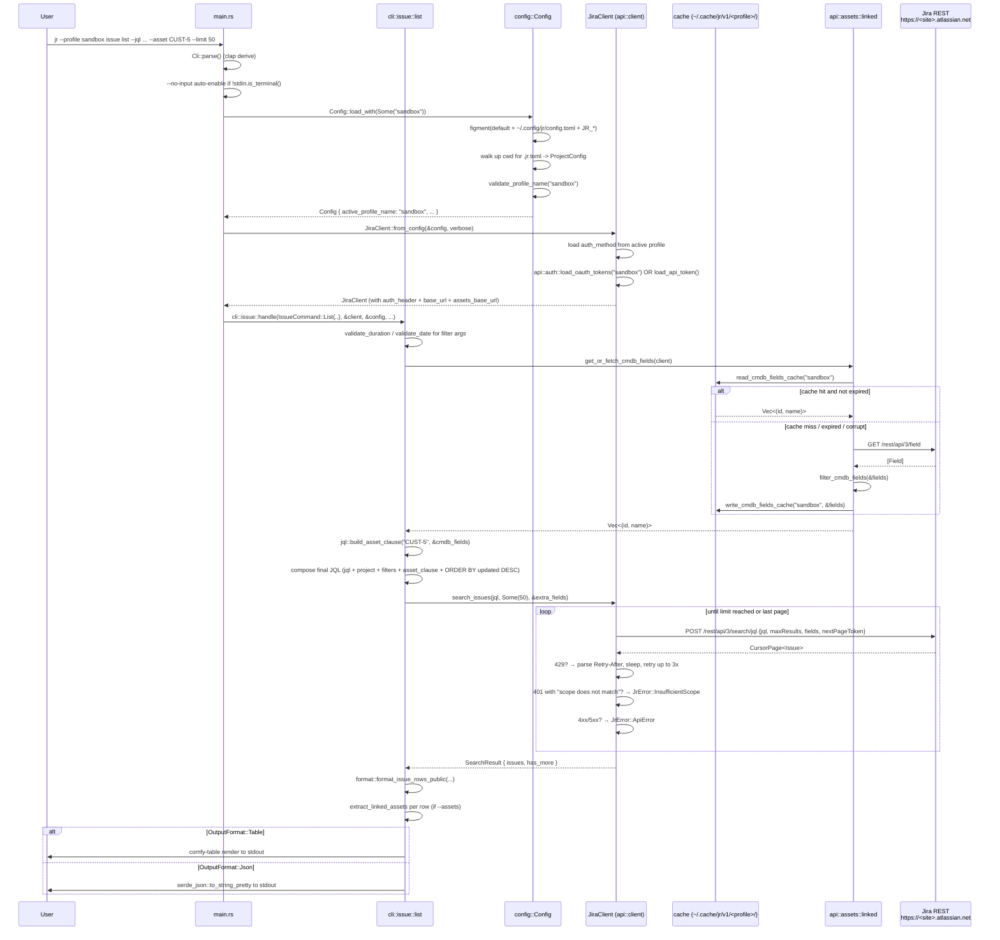

# Pass 1: Architecture — jira-cli (jr)

Snapshot SHA: `dea166471e22eff55974d7675593469b37048c5f` (v0.5.0-dev.7)
Source root: `/Users/zious/Documents/GITHUB/jira-cli/.reference/jira-cli/`
Analysis date: 2026-05-04
Builds on: `jira-cli-pass-0-inventory.md`

> Pass 1 is descriptive (where the layers/modules are) AND interpretive (what the architecture implies about correctness, evolution, and risk). Every claim about a `use` / `mod` relationship is grounded in lines I read; CLAUDE.md is treated as a hypothesis whose deviations are called out explicitly.

---

## 1. Layer & Module Boundaries

The crate is a single binary (`jr`) + library (`jr` lib). `lib.rs` exposes the public surface for integration tests. The architecture is a clean 5-layer thin-client (verified against `lib.rs`, `src/main.rs`, and the `mod.rs` files in `api/`, `cli/`, `types/`).

### 1a. Layer map

| Layer | Modules / files | Public surface | I/O? |
|---|---|---|---|
| **L0 Process / runtime** | `src/main.rs` (268 LOC) | `fn main()` | tokio runtime, signals (`ctrl_c`), env (`NO_COLOR`), stdin TTY probe, `process::exit` |
| **L1 CLI surface** | `src/cli/mod.rs` (772) — `Cli`, `Command`, all `*Command` enums, `OutputFormat`, `resolve_effective_limit`, `DEFAULT_LIMIT` | `pub struct Cli`, `pub enum Command/IssueCommand/AssetsCommand/AuthCommand/...`, all `#[arg]`-decorated fields | None (clap derive only) |
| **L2 Command handlers** | `src/cli/{api,assets,auth,board,init,issue,project,queue,sprint,team,user,worklog}.rs` + `src/cli/issue/{assets,changelog,comments,create,format,helpers,json_output,links,list,view,workflow}.rs` (12 + 11 modules) | Per module: `pub async fn handle(...)` or family of `handle_*`. `cli::issue::format` re-exports `format_issue_row`, `format_issue_rows_public`, `format_points`, `issue_table_headers`. | I/O via `JiraClient`, dialoguer prompts, stdin/stdout, `crate::cache`, `crate::config` |
| **L3 API client** | `src/api/client.rs` (490) — `JiraClient`. `src/api/auth.rs` (1397) — OAuth + keychain + token refresh. `src/api/auth_embedded.rs` — XOR'd embedded credentials. `src/api/pagination.rs` — `OffsetPage`, `CursorPage`, `ServiceDeskPage`, `AssetsPage`. `src/api/rate_limit.rs` — `RateLimitInfo`. | `JiraClient::from_config`, `JiraClient::new_for_test`, all `pub async fn get/post/put/delete*`, `extract_error_message`, `oauth_login`, `refresh_oauth_token`, `embedded_oauth_app`, `OAuthAppSource`, `RedirectUriStrategyRequest`, `EMBEDDED_CALLBACK_PORT = 53682` | reqwest HTTP, OS keychain (`keyring` crate), `tokio::net::TcpListener` (OAuth callback), browser launch via `open` crate, OS CSPRNG (`/dev/urandom` / `BCryptGenRandom`) |
| **L4 Resource APIs** | `src/api/jira/{boards,fields,issues,links,projects,resolutions,sprints,statuses,teams,users,worklogs}.rs` (11 files, 1,457 LOC). `src/api/jsm/{queues,servicedesks}.rs` (2 files, 214 LOC). `src/api/assets/{linked,objects,schemas,tickets,workspace}.rs` (5 files, 920 LOC) | `impl JiraClient { pub async fn ... }` blocks adding resource methods (e.g. `search_issues`, `get_org_metadata`, `list_teams`, `find_cmdb_fields`). Free functions for cache-feeding helpers (`get_or_fetch_workspace_id`, `get_or_fetch_cmdb_fields`, `extract_linked_assets*`, `cmdb_field_ids`). | All HTTP via `JiraClient`. `assets/workspace.rs` and `assets/linked.rs` also touch the cache via `crate::cache` (see Pass 0 gotcha — multi-profile boundary) |
| **L5 Types** | `src/types/{jira,jsm,assets}/*.rs` + `src/types/mod.rs` (3 LOC) | Pure serde structs (`Issue`, `Board`, `Sprint`, `User`, `TeamEntry`, `LinkedAsset`, `AssetObject`, `Queue`, `ServiceDesk`, etc.) and a small handful of helper enums | None (pure data) |
| **L6 Utilities (cross-cutting)** | `src/{adf,cache,config,duration,error,jql,output,partial_match,observability}.rs` | `adf`: text/markdown ↔ ADF. `cache`: per-profile XDG paths + reader/writer pairs. `config`: figment-merged `Config` with profile resolution. `duration`: worklog parser. `error`: `JrError` + `exit_code()`. `jql`: escape, validate, `build_asset_clause`. `output`: `render_table`, `render_json`, `print_output`, `print_success/warning/error`. `partial_match`: case-insensitive matcher with `MatchResult` enum. `observability`: `pub(crate) fn log_parse_failure_once` | `cache` and `config` touch the file system; everything else is pure |

### 1b. Purity boundary

The codebase has a clear if implicit purity split:

- **Pure (no I/O, no globals):** `adf`, `duration`, `error`, `jql`, `output`, `partial_match`, `observability` (one `AtomicBool` is used as a per-call-site once-flag, but `log_parse_failure_once` itself is otherwise pure), `api::pagination`, `api::rate_limit`, all of `types/*`, the helper functions in `api::jira::fields` (`filter_story_points_fields`, `filter_cmdb_fields`), `api::auth_embedded::{decode, build_embedded_app}`, `config::{resolve_active_profile_name, validate_profile_name, migrate_legacy_global}`, `api::client::extract_error_message`, `cli::resolve_effective_limit`.
- **I/O bound (file system, network, keychain, env, signals):** `main.rs`, all `cli::*::handle*`, `api::client::JiraClient` methods, all of `api::auth` (keychain via `keyring::Entry`, network for OAuth, listener bind), `api::auth_embedded::embedded_oauth_app` (initialized once via `OnceLock`), `cache::{read_*,write_*,clear_*}`, `config::Config::{load,load_with,load_lenient*,save_global,find_project_config}`, all `api::*` resource impls (HTTP), `api::assets::workspace::get_or_fetch_workspace_id` and `api::assets::linked::get_or_fetch_cmdb_fields` (HTTP + cache).

The split is tested-friendly: pure functions have inline `#[cfg(test)] mod tests` (50 such modules per Pass 0), and I/O is funneled through `JiraClient` which is mockable via `JR_BASE_URL` (wiremock) + `JR_AUTH_HEADER` (mock auth) at the env-var seam. The dual env-var seam is unusual — most projects with figment/dependency-injection would inject a Client trait — but it's pragmatic and the integration test count (324) suggests it works.

### 1c. Library / binary split

`lib.rs` (12 LOC):
```
pub mod adf;
pub mod api;
pub mod cache;
pub mod cli;
pub mod config;
pub mod duration;
pub mod error;
pub mod jql;
pub(crate) mod observability;
pub mod output;
pub mod partial_match;
pub mod types;
```

Notable: `observability` is `pub(crate)` — it is intentionally NOT part of the integration-test-visible public API. Everything else is public so integration tests in `tests/` can `use jr::cli::issue::handle;` etc. directly. This is a substantive deviation from CLAUDE.md, which describes `lib.rs` as just "Crate root (re-exports for integration tests)" without flagging `observability` as the lone `pub(crate)` exception.

---

## 2. Component Relationships (Mermaid)

Verified by reading the actual `use` statements at the top of each file (see citations below the diagram).

```mermaid
graph TD
    main["main.rs (L0)"] -->|"use jr::api, jr::cli, jr::config, jr::error, jr::output"| cli_mod["cli::* (L2)"]
    main --> cli_mod
    main --> config["config (L6)"]
    main --> error["error (L6)"]
    main --> output["output (L6)"]
    main --> api_client["api::client::JiraClient (L3)"]

    cli_mod --> api_client
    cli_mod --> config
    cli_mod --> error
    cli_mod --> output
    cli_mod --> cache["cache (L6)"]
    cli_mod --> adf["adf (L6)"]
    cli_mod --> jql["jql (L6)"]
    cli_mod --> partial_match["partial_match (L6)"]
    cli_mod --> duration["duration (L6)"]

    cli_auth["cli::auth"] --> api_auth["api::auth (L3)"]
    cli_auth --> api_auth_embedded["api::auth_embedded (L3)"]

    cli_assets["cli::assets"] --> assets_objects["api::assets::objects"]
    cli_assets --> assets_workspace["api::assets::workspace"]
    cli_issue_assets["cli::issue::assets"] --> assets_linked["api::assets::linked"]
    cli_issue_list["cli::issue::list"] --> assets_linked
    cli_issue_list --> jql

    api_client --> api_auth
    api_client --> api_rate_limit["api::rate_limit (L3)"]
    api_client --> error
    api_client --> config

    api_auth --> api_auth_embedded
    api_auth --> keychain[("OS Keychain<br/>via keyring crate")]:::external
    api_auth --> network[("auth.atlassian.com<br/>(OAuth IdP)")]:::external
    api_auth --> listener[("127.0.0.1:53682<br/>callback listener<br/>(or :0 dynamic)")]:::external
    api_auth_embedded --> outdir[("$OUT_DIR/embedded_oauth.rs<br/>(generated by build.rs)")]:::external

    api_jira["api::jira::* (boards, fields, issues, links,<br/>projects, resolutions, sprints, statuses,<br/>teams, users, worklogs)"] --> api_client
    api_jira --> types_jira["types::jira::*"]
    api_jira --> api_pagination["api::pagination (L3)"]

    api_jsm["api::jsm::* (queues, servicedesks)"] --> api_client
    api_jsm --> types_jsm["types::jsm::*"]
    api_jsm --> api_pagination

    api_assets["api::assets::* (linked, objects,<br/>schemas, tickets, workspace)"] --> api_client
    api_assets --> types_assets["types::assets::*"]
    api_assets --> api_pagination
    api_assets --> cache

    cache --> fs1[("~/.cache/jr/v1/&lt;profile&gt;/<br/>(XDG_CACHE_HOME)")]:::external
    config --> fs2[("~/.config/jr/config.toml<br/>+ &lt;repo&gt;/.jr.toml")]:::external
    config --> figment_lib["figment crate"]:::libcrate

    api_client --> reqwest_lib["reqwest (rustls-tls)"]:::libcrate
    api_client --> network2[("https://&lt;site&gt;.atlassian.net/<br/>or https://api.atlassian.com/<br/>ex/jira/&lt;cloud_id&gt;/")]:::external

    classDef external fill:#fef3c7,stroke:#b45309,stroke-width:1px;
    classDef libcrate fill:#e0f2fe,stroke:#0369a1,stroke-width:1px;
```



### 2a. Use-statement evidence (sample)

Citations below are all from files I read; line numbers are from the snapshot SHA above.

- `main.rs:1-7` — `use jr::api; use jr::cli; use jr::cli::Cli; use jr::config; use jr::error; use jr::output;`
- `cli/mod.rs:1-12` — `pub mod {api,assets,auth,board,init,issue,project,queue,sprint,team,user,worklog};`
- `cli/issue/mod.rs:1-11` — submodules; line 17-19 `use crate::api::client::JiraClient; use crate::cli::{IssueCommand, OutputFormat}; use crate::config::Config;`
- `api/client.rs:1-8` — `use crate::api::rate_limit::RateLimitInfo; use crate::config::Config; use crate::error::JrError;` and reqwest types. Line 71 — `crate::api::auth::load_oauth_tokens(&config.active_profile_name)`. Line 76 — `crate::api::auth::load_api_token()`.
- `api/auth.rs:705` — `let (client_id, client_secret, source) = resolve_refresh_app_credentials()?;` — confirms `refresh_oauth_token` resolves credentials internally (matches CLAUDE.md gotcha).
- `api/auth.rs:800` — `if let Some(app) = crate::api::auth_embedded::embedded_oauth_app()` — confirms `auth.rs` calls into `auth_embedded` for the embedded fallback.
- `api/auth_embedded.rs:17` — `include!(concat!(env!("OUT_DIR"), "/embedded_oauth.rs"))` — confirms build.rs codegen path.
- `api/assets/linked.rs:6-9` — `use crate::api::assets::workspace::get_or_fetch_workspace_id; use crate::api::client::JiraClient; use crate::cache; use crate::types::assets::LinkedAsset;`
- `api/assets/workspace.rs:4-7` — `use crate::api::client::JiraClient; use crate::api::pagination::ServiceDeskPage; use crate::cache; use crate::error::JrError;`
- `api/jira/teams.rs:3-6` — `use crate::api::client::JiraClient; use crate::types::jira::{...};`
- `api/jira/issues.rs:1-3` — `use crate::api::client::JiraClient; use crate::api::pagination::{CursorPage, OffsetPage}; use crate::types::jira::{Comment, CreateIssueResponse, Issue, TransitionsResponse};`
- `cli/issue/list.rs:1-17` — touches `crate::api::assets::linked`, `crate::api::client::JiraClient`, `crate::cli::{IssueCommand, OutputFormat, resolve_effective_limit}`, `crate::config::Config`, `crate::error::JrError`, `crate::output`, `crate::types::assets::LinkedAsset`, `crate::api::jira::projects::IssueTypeWithStatuses`, `crate::partial_match`. Calls `crate::jql::strip_order_by`, `crate::jql::escape_value`, `crate::jql::validate_duration`, `crate::jql::validate_date`.
- `cli/auth.rs:1-8` — `use crate::api::auth; use crate::api::auth_embedded::{OAuthAppSource, embedded_oauth_app}; use crate::config::{Config, global_config_path}; use crate::error::JrError; use crate::output;`

The dependency direction is clean: nothing in L4 (resource APIs) imports anything from L2 (CLI handlers); nothing in L3 imports from L2; nothing in `types/` imports from anywhere except other type modules. The graph is acyclic by construction — verified by sampling the `use` lines above.

---

## 3. Cross-cutting Concerns

### 3a. Error handling (`src/error.rs:1-49`)

A single `enum JrError` with 10 variants (verified read). Exit-code mapping (`exit_code()`):

| Variant | Exit code | When |
|---|---:|---|
| `NotAuthenticated` | 2 | 401 from Jira |
| `InsufficientScope { message }` | 2 | 401 with body matching "scope does not match" (issue #185 — granular tokens reject POST) |
| `ConfigError(String)` | 78 | Missing config / profile unconfigured |
| `UserError(String)` | 64 | Bad CLI input (unknown profile, ambiguous match, empty selection) |
| `Interrupted` | 130 | Reserved for Ctrl+C-style flows |
| `Internal(String)` | 1 | "Should never happen" — invariant violations (handler must prefix message with "Internal error:") |
| `NetworkError(String)` | 1 | reqwest reachability failure (DNS, connect) |
| `ApiError { status, message }` | 1 | Any 4xx/5xx not specialized into the above |
| `Http(reqwest::Error)`, `Io`, `Json` | 1 | `#[from]` transparent |

Convention (verified in main.rs:27-51): handler returns `anyhow::Result<()>`. main.rs walks `e.chain()` looking for a `JrError` to extract the exit code; if no `JrError` is found, exits 1. JSON output mode wraps the error string in `{"error": ..., "code": ...}`. Exit code 130 is also used by main.rs for direct Ctrl+C (the `Interrupted` variant exists but isn't reached in practice — main.rs prints "Interrupted" and `process::exit(130)` directly from the `tokio::select!` arm).

### 3b. Output formatting (`src/output.rs:1-76`)

Two sinks: comfy-table table (UTF8_FULL_CONDENSED preset, dynamic content arrangement) and `serde_json::to_string_pretty`. `print_output(format, headers, rows, json_data)` is the unified call shape — every handler builds parallel "rows for table" and "serializable struct for JSON" representations. `print_success / print_warning / print_error` go to stderr (so `--output json` stays clean on stdout). No structured logging crate; `colored` is opt-out via `--no-color` or `NO_COLOR` env (`main.rs:13`).

ADF ↔ text/markdown rendering is delegated to `src/adf.rs` (1,826 LOC, the second-largest source file), which sits as an L6 utility. `--markdown` flags on `create` / `edit` / `comment` route through it.

### 3c. Logging / observability (`src/observability.rs:1-39`, 39 LOC verified)

This is intentionally tiny. The single function `log_parse_failure_once(flag: &AtomicBool, site: &str, iso: &str, verbose: bool)` is the entire observability surface. The module docstring is explicit: *"Intentionally tiny: the project has no tracing/log crate, and a single `--verbose`-gated `eprintln!` is the established pattern (see `src/api/client.rs` for HTTP-request logging). Expand to a real tracing layer when there is cross-subsystem need."*

The pattern in practice:

- `JiraClient::send` (`api/client.rs:197-204`) prints `[verbose] {METHOD} {URL}` and request body when `--verbose` is set.
- Rate-limit retries (`api/client.rs:220-225`, `294-300`) log `[verbose] Rate limited (429). Retrying in {N}s (attempt M/3)`.
- Date / changelog parsers use `log_parse_failure_once` with a function-local `static AtomicBool` so each parser fires at most one verbose line per run. (Search `log_parse_failure_once` confirms call-sites in `cli/issue/changelog.rs` and `cli/issue/format.rs`.)
- `dbg!` and `tracing::*` are nowhere — no log crate dependency.

This is a thoughtful choice for a CLI: every `[verbose]` line goes to stderr, never pollutes JSON output on stdout, and there's no log filter / level system to misconfigure. Trade-off: no structured telemetry, no production-grade observability for the (theoretical) case of users debugging in the wild — they only have `--verbose` and `eprintln!`.

### 3d. Auth / multi-profile (`src/api/auth.rs:1-300`, `src/cli/auth.rs:1-60`, `src/api/auth_embedded.rs:1-250`, `src/config.rs:90-335`)

Three sources of credentials, with precedence flag > env > config > "default":

1. **Active-profile resolution** (`config.rs:95-110`): `--profile NAME` flag (threaded as a parameter, NOT an env-var seam — see ADR-0006 / `Config::load_with`) > `JR_PROFILE` env > `default_profile` config field > literal `"default"`. main.rs passes this in as `cli.profile.as_deref()`.
2. **Keychain layout** (`api/auth.rs:18-32`):
   - **Shared (account-level, NOT namespaced):** `email`, `api-token`, `oauth_client_id`, `oauth_client_secret`. These live under flat keys.
   - **Per-profile (cloudId-scoped, namespaced):** `<profile>:oauth-access-token`, `<profile>:oauth-refresh-token`.
   - **Legacy (read-only, default-only):** `oauth-access-token`, `oauth-refresh-token` — pre-multi-profile flat keys, lazy-migrated to namespaced on first read for `"default"` profile only (`api/auth.rs:111-169`). Non-default profiles never inherit legacy keys; that would silently cross-pollinate credentials across distinct Jira sites (verified in code comment + the `_ =>` partial-state branch, which still scopes legacy fallback to `"default"`).
3. **OAuth credential resolution** is split into two distinct chains (`api/auth.rs:781-812`):
   - **Login-side resolver** (in `cli/auth.rs::login_oauth`): flag → env → keychain → embedded → prompt.
   - **Refresh-side resolver** (`resolve_refresh_app_credentials`): keychain → embedded only. Flag and env are deliberately omitted because the refresh grant must use the same app that issued the refresh token.
4. **Embedded OAuth app** (`api/auth_embedded.rs`): XOR-obfuscated `client_id`/`client_secret` baked in at build time by `build.rs` reading `JR_BUILD_OAUTH_CLIENT_ID`/`_SECRET`. Decoded once via `OnceLock`. `Debug` impl redacts `client_secret`. `embedded_oauth_app_present()` is a cheap presence check that does NOT decode (defense in depth — `jr auth status` should not pull plaintext into the heap).
5. **Fixed callback port 53682** (`api/auth.rs:384`): only used for the embedded app, registered exactly in Atlassian Developer Console as `http://127.0.0.1:53682/callback`. Atlassian validates `redirect_uri` by exact string match (no RFC 8252 normalization — confirmed in code comment referencing `JRACLOUD-92180`). BYO sources keep the historical dynamic-port behavior (`localhost:0`).

### 3e. Rate limit + retry (`src/api/client.rs:184-253`, `265-320`, `src/api/rate_limit.rs:1-30`)

- `MAX_RETRIES = 3`, `DEFAULT_RETRY_SECS = 1` (verified at `client.rs:11-14`).
- On 429, parse `Retry-After` header (seconds, integer only — no HTTP-date support per `rate_limit.rs:17-18`). Sleep and retry up to 3 times.
- `X-RateLimit-Remaining` is parsed but currently only stored for diagnostic use, not enforced.
- After exhausting retries, a `warning: rate limited by Jira — gave up after 3 retries.` line goes to stderr.
- Two send paths: `send()` parses non-2xx into `JrError`. `send_raw()` returns the raw `Response` regardless of status (used by `cli::api::handle_api`, the `jr api` raw passthrough).
- The `try_clone()` of `RequestBuilder` returns `Some` for any non-streaming body — the codebase uses only JSON or no-body, so the `expect("request should be cloneable (JSON body)")` panic is unreachable in practice (verified `client.rs:191-193`).

### 3f. Pagination (`src/api/pagination.rs:1-165`)

Four pagination shapes, all in one module:

| Type | Strategy | Used by | Field shape |
|---|---|---|---|
| `OffsetPage<T>` | offset (`startAt` + `maxResults` + `total`) | Most Jira REST v3 endpoints (boards, sprints, worklogs, comments, search results when not using `/search/jql`) | Items live under `values` / `issues` / `worklogs` / `comments` — `items()` returns whichever is populated, in priority order |
| `CursorPage<T>` | cursor (`nextPageToken`) | `/rest/api/3/search/jql` ONLY | Used in `api/jira/issues.rs:70` |
| `ServiceDeskPage<T>` | offset, JSM shape (`size`/`start`/`limit`/`isLastPage`) | `/rest/servicedeskapi/*` (workspace discovery, queues, queue issues) | `is_last_page` boolean instead of computed from offsets |
| `AssetsPage<T>` | offset, Assets shape (`startAt`/`maxResults`/`total`/`isLast`) | Assets/CMDB `POST /object/aql` | `isLast` may be a bool OR a string — custom `deserialize_bool_or_string` (lines 118-128) handles both |

Three pagination shapes for one product line is friction (API inconsistency across Jira teams); the choice to keep them as distinct generic types rather than collapsing into one is an honest architectural decision — collapsing would require lossy field hiding.

### 3g. Cancellation (`src/main.rs:74, 261-267`)

The whole dispatch body is wrapped in a `tokio::select!`:
```rust
tokio::select! {
    result = main_task => result,
    _ = tokio::signal::ctrl_c() => {
        eprintln!("\nInterrupted");
        std::process::exit(130);
    }
}
```

This is **abrupt cancellation by process exit**, not graceful shutdown:

- In-flight reqwest requests are not awaited — the listener TCP connection drops when the process exits.
- A 429 retry sleep (`tokio::time::sleep(...)`) is interrupted cleanly because the future is dropped when `select!` chooses the ctrl-c arm.
- The OAuth callback listener (a `tokio::net::TcpListener` accepting a single connection) is also dropped abruptly — the user gets a "browser tab can't connect" if they're mid-flow.
- No state is flushed: cache writes that haven't completed are lost (acceptable — every cache reader handles "missing/corrupt" as cache-miss, and TTL is 7 days).

This is fine for a CLI but worth noting as an architectural choice — there is no `Drop`-based cleanup or explicit cancellation tokens.

### 3h. ADF translation (`src/adf.rs`, 1,826 LOC — second-largest file)

I did not read this file in full, but Pass 0 captured its purpose. Public surface (per Pass 0 + `lib.rs`): `text→ADF`, `markdown→ADF` (via `pulldown-cmark`), `ADF→text`. Used by issue create/edit (`--description-stdin` + `--markdown`), comment commands, and the issue view renderer. Sized like a small DSL — non-trivial to test, hence the inline `#[cfg(test)]` modules in Pass 0's count.

### 3i. JQL composition (`src/jql.rs:1-100`)

Verified read of escape/validate/build helpers:

- `escape_value(s)` — backslashes first, then double-quotes (order-sensitive; reversed order would re-escape and leave a quote exposed — code comment makes this explicit).
- `validate_duration(s)` — `<digits><unit>` with units `y/M/w/d/h/m`. Case-sensitive (`M` = months, `m` = minutes). Combined units like `4w2d` rejected.
- `validate_asset_key(key)` — must match `<alphanumeric>-<digits>` (e.g., CUST-5, SRV-42, ITSM-123).
- `build_asset_clause(asset_key, cmdb_fields)` — emits `"<field_name>" IN aqlFunction("Key = \"<asset_key>\"")`. When multiple CMDB fields exist, OR them inside a parenthesized clause. **Field NAME (human-readable), not `customfield_NNNNN`** — confirmed gotcha from CLAUDE.md, and this is enforced at the API boundary.
- Higher in the file (not shown in my read window): `strip_order_by`, `validate_date` — both called from `cli/issue/list.rs`.
- Property tests on JQL exist (`proptest-regressions/jql.txt` per Pass 0) — the brittle escaping logic has fuzz coverage.

### 3j. Cache (`src/cache.rs:1-150`, 899 LOC)

- Root: `$XDG_CACHE_HOME/jr` or `~/.cache/jr` (verified `cache.rs:64-73`).
- Per-profile dir: `<root>/v1/<profile>/` — versioned root lets future schema bumps orphan stale files cleanly (CLAUDE.md gotcha confirmed at `cache.rs:75-78`).
- TTL: `CACHE_TTL_DAYS = 7` for all whole-file caches.
- Reader policy (`read_cache`): `NotFound` → `Ok(None)`; deserialization failure → `eprintln!("warning: cache file ... unreadable; will refetch")` + `Ok(None)`; expired → `Ok(None)`. Other I/O errors propagate.
- Cache categories (read across the file plus `api::assets::*` callers): `teams.json`, `project_meta.json`, `workspace.json` (Assets workspace ID), `cmdb_fields.json` (`(id, name)` tuples — Pass 0 noted this as a format-change point), `object_type_attrs.json`, `resolutions.json`. All gate on `Expiring::fetched_at`.
- **Multi-profile boundary** (Pass 0 + CLAUDE.md gotcha): every reader/writer takes `profile: &str` as the first arg. `JiraClient` carries `profile_name: String` (set in `from_config` at `client.rs:105`) and exposes `profile_name()` as the canonical accessor for L4 modules that have a `&JiraClient` but no `&Config`.
- `clear_profile_cache(profile)` — used by `jr auth remove` to wipe per-profile cache cleanly. No-op if the directory doesn't exist.

### 3k. Config layering (`src/config.rs:189-335`)

- Three sources merged via figment: built-in `GlobalConfig::default()` < `~/.config/jr/config.toml` < `JR_*` env vars (prefix-matched).
- Plus a separate per-project layer: `.jr.toml` discovered by walking up from cwd (`find_project_config`, lines 337-348). Holds only `project` (key) and `board_id`. NOT merged into `GlobalConfig` — kept as a separate `ProjectConfig` field.
- `JR_BASE_URL` env (`config.rs:351-353` and `client.rs:37-65`) is a special seam used only by tests / power users to point all HTTP at a wiremock instance. When set, the active profile's URL is bypassed entirely.
- **Legacy migration** (`config.rs:142-178`, `220-264`): single-profile `[instance]` + `[fields]` shape gets folded into `[profiles.default]` on first load. Save uses a file-only baseline (NO env overlay) so transient `JR_*` vars can't leak into the migrated `config.toml`.
- **Profile name validation** (`config.rs:113-140`): `[A-Za-z0-9_-]{1,64}`, blocks Windows-reserved names (CON, NUL, AUX, PRN, COM1-9, LPT1-9). Validated at the config boundary because the resolved name flows into cache paths and keyring keys; a bad value (e.g. `foo:bar`, `../../etc/passwd`) would break those.
- `Config::load_lenient_with` skips the active-profile-existence check; used only by `jr auth login` (which legitimately creates the target profile on demand).

---

## 4. Data flow diagrams

### 4a. `jr issue list --jql "..." --asset CUST-5 --limit 50`



Verified against: `main.rs:182-196`, `cli/issue/list.rs:1-115`, `api/jira/issues.rs:42-95`, `api/client.rs:184-253`, `api/assets/linked.rs:11-21`, `cache.rs:16-43`.

### 4b. `jr auth login --oauth` (embedded OAuth app)

```mermaid
sequenceDiagram
    participant User
    participant Main as main.rs
    participant CLIAuth as cli::auth
    participant Resolver as resolve_credential / resolver chain
    participant Embedded as api::auth_embedded
    participant Auth as api::auth (oauth_login)
    participant Listener as TcpListener<br/>127.0.0.1:53682
    participant Browser
    participant Atlassian as auth.atlassian.com<br/>+ api.atlassian.com
    participant Keychain as OS Keychain<br/>(jr-jira-cli)

    User->>Main: jr auth login --oauth --profile work
    Main->>CLIAuth: handle_login(LoginArgs { profile: "work", oauth: true, ... })
    CLIAuth->>Resolver: resolve client_id (flag → JR_OAUTH_CLIENT_ID env → keychain → embedded → prompt)
    Resolver->>Embedded: embedded_oauth_app_present()
    Embedded->>Embedded: read EMBEDDED_ID/SECRET_XOR/SECRET_KEY from $OUT_DIR/embedded_oauth.rs
    Note over Embedded: build.rs generated these from<br/>JR_BUILD_OAUTH_CLIENT_ID/_SECRET<br/>+ random 32-byte XOR key
    Embedded-->>Resolver: present? yes/no
    alt embedded path
        Resolver->>Embedded: embedded_oauth_app() (lazy OnceLock decode)
        Embedded->>Embedded: decode(SECRET_XOR, SECRET_KEY) → plaintext
        Embedded-->>Resolver: EmbeddedOAuthApp { client_id, client_secret }
        Resolver-->>CLIAuth: (client_id, client_secret, OAuthAppSource::Embedded)
        Note over CLIAuth: → use Fixed(53682) strategy
    else BYO path
        Resolver-->>CLIAuth: (client_id, client_secret, OAuthAppSource::{Flag,Env,Keychain,Prompt})
        Note over CLIAuth: → use Dynamic (port :0) strategy
    end
    CLIAuth->>Auth: oauth_login(profile, client_id, client_secret, scopes, RedirectUriStrategyRequest)
    Auth->>Auth: strategy.bind() → ResolvedRedirect (atomic; no TOCTOU)
    Auth->>Listener: bind 127.0.0.1:53682 (or :0 dynamic)
    Auth->>Auth: generate_state() → 32 bytes from OsRng → 64 hex chars
    Auth->>Auth: build_authorize_url(client_id, scopes, redirect_uri, state)<br/>(uniform percent-encoding via urlencoding::encode)
    Auth->>Browser: open::that(auth_url)
    Browser->>Atlassian: GET /authorize?client_id=...&scope=...&redirect_uri=...&state=...
    Atlassian->>User: consent screen
    User->>Atlassian: approve
    Atlassian->>Browser: 302 → http://127.0.0.1:53682/callback?code=...&state=...
    Browser->>Listener: GET /callback?code=...&state=...
    Listener-->>Auth: stream
    Auth->>Auth: extract_query_param(request, "code"/"state")
    Auth->>Auth: state == returned_state? else bail "CSRF"
    Auth->>Browser: 200 OK "Authorization successful!"
    Auth->>Atlassian: POST /oauth/token<br/>{grant_type: authorization_code, client_id, client_secret, code, redirect_uri}
    Atlassian-->>Auth: { access_token, refresh_token }
    Auth->>Atlassian: GET /oauth/token/accessible-resources (Bearer access_token)
    Atlassian-->>Auth: [{ id: cloudId, url, name }]
    Auth->>Keychain: store_oauth_tokens("work", access, refresh)<br/>→ "work:oauth-access-token" + "work:oauth-refresh-token"
    Keychain-->>Auth: ok (or partial-state error → surface to user)
    Auth-->>CLIAuth: OAuthResult { cloud_id, site_url, site_name }
    CLIAuth->>CLIAuth: write profile to ~/.config/jr/config.toml<br/>{ url, auth_method: "oauth", cloud_id }
    CLIAuth->>User: "Logged in to <site_name>"
```

Verified against: `cli/mod.rs:188-218` (LoginArgs shape), `cli/auth.rs:1-60` (resolve_credential), `api/auth.rs:374-530` (RedirectUriStrategy), `api/auth.rs:545-690` (oauth_login), `api/auth_embedded.rs:1-250` (full file).

### 4c. `jr issue view FOO-123` with linked-asset enrichment, OR `jr assets search`

```mermaid
sequenceDiagram
    participant User
    participant CLI as cli::issue::view OR cli::assets
    participant Linked as api::assets::linked
    participant Workspace as api::assets::workspace
    participant Cache as cache (per-profile)
    participant Cli as JiraClient
    participant Jira as Jira REST
    participant AssetsAPI as Assets/CMDB API<br/>(api.atlassian.com/ex/jira/<cloud_id>/jsm/assets)

    User->>CLI: jr issue view FOO-123  (or  jr assets search "objectType = Client")
    Note over CLI: For issue view path, the issue is fetched first via api::jira::issues; here we focus on the asset-related branch.

    CLI->>Workspace: get_or_fetch_workspace_id(client)
    Workspace->>Cache: read_workspace_cache(profile)
    alt cache hit
        Cache-->>Workspace: workspace_id
    else miss / expired
        Workspace->>Jira: GET /rest/servicedeskapi/assets/workspace
        Note over Jira,Workspace: Note: instance_url, NOT base_url<br/>(get_from_instance, since this lives on the Jira instance,<br/>not the api.atlassian.com OAuth proxy)
        Jira-->>Workspace: ServiceDeskPage<WorkspaceEntry>
        alt 404 / 403
            Workspace-->>CLI: JrError::UserError "Assets not available on this Jira site (requires JSM Premium/Enterprise)"
        end
        Workspace->>Cache: write_workspace_cache(profile, &workspace_id)
    end
    Workspace-->>CLI: workspace_id

    alt issue-view path with linked-asset enrichment
        CLI->>Linked: get_or_fetch_cmdb_fields(client) (cached, see flow 4a)
        CLI->>Linked: extract_linked_assets_per_field(&issue.extra, &cmdb_fields)
        Linked-->>CLI: Vec<(field_name, Vec<LinkedAsset>)>
        loop each LinkedAsset (per displayed field)
            CLI->>Cli: client.get_assets(workspace_id, "object/{key}")
            Cli->>AssetsAPI: GET /jsm/assets/workspace/<wid>/v1/object/<key>
            AssetsAPI-->>Cli: AssetObject (with attributes)
            Cli-->>CLI: enriched asset
        end
    else assets-search path
        CLI->>CLI: build AQL query (escape, validate, etc.)
        CLI->>Cli: client.post_assets(workspace_id, "object/aql", &body)
        Cli->>AssetsAPI: POST /jsm/assets/workspace/<wid>/v1/object/aql {qlQuery, ...}
        AssetsAPI-->>Cli: AssetsPage<AssetObject>
        Note over Cli,AssetsAPI: AssetsPage::is_last may be bool OR string;<br/>deserialize_bool_or_string handles both.
        Cli-->>CLI: AssetsPage<AssetObject>
        loop until is_last or limit
            CLI->>Cli: next page (startAt += maxResults)
        end
    end
    CLI->>User: render (table headers from object attributes, JSON via serde)
```

Verified against: `api/assets/workspace.rs:1-58`, `api/assets/linked.rs:1-115`, `cli/assets.rs:1-40`, `api/client.rs:382-428` (get_assets/post_assets), `api/pagination.rs:118-165` (AssetsPage).

---

## 5. Deployment topology

- **Single static binary** named `jr`. No daemon, no helper processes, no IPC.
- **Persistent state on disk:**
  - `~/.config/jr/config.toml` — global config: `default_profile` + `[profiles.<name>]` map + `[defaults]`. Per-project `.jr.toml` (`project`, `board_id`) discovered by walking up from cwd.
  - `~/.cache/jr/v1/<profile>/*.json` — versioned per-profile cache (teams, project_meta, workspace, cmdb_fields, object_type_attrs, resolutions). 7-day TTL. Survives upgrades; invalidated by bumping `v1/` to `v2/`.
- **OS keychain entries:** Service name `jr-jira-cli` (overrideable via `JR_SERVICE_NAME` env, primarily for tests). Backends: macOS Keychain (`apple-native` feature), Linux Secret Service (`linux-native` feature), Windows Credential Manager (per `keyring` 3 default). Keys layout in §3d above.
- **Network egress (outbound HTTPS):**
  - `https://<site>.atlassian.net/rest/api/3/*` — Jira Core REST v3 (issues, projects, users, fields, statuses, links, worklogs, comments, transitions).
  - `https://<site>.atlassian.net/rest/agile/1.0/*` — Agile REST (boards, sprints).
  - `https://<site>.atlassian.net/rest/servicedeskapi/*` — JSM REST (queues, service desks, asset workspace discovery).
  - `https://<site>.atlassian.net/gateway/api/graphql` — GraphQL hostNames query (org/cloud ID discovery, ADR-0005).
  - `https://<site>.atlassian.net/gateway/api/public/teams/v1/*` — Teams API.
  - `https://api.atlassian.com/ex/jira/<cloud_id>/*` — OAuth-proxied API (when `auth_method: oauth` is set on the profile).
  - `https://api.atlassian.com/ex/jira/<cloud_id>/jsm/assets/workspace/<wid>/v1/*` — Assets/CMDB API.
  - `https://auth.atlassian.com/authorize`, `https://auth.atlassian.com/oauth/token`, `https://api.atlassian.com/oauth/token/accessible-resources` — OAuth IdP and resource discovery.
- **Network ingress (inbound TCP):** ONLY during `jr auth login --oauth`. Either:
  - Embedded app: bound listener on `127.0.0.1:53682` (literal IPv4, never `localhost`).
  - BYO app: bound listener on `127.0.0.1:0` (ephemeral port, redirect_uri uses `localhost:<port>` for backward compatibility with existing BYO Developer Console registrations).
  Both bindings are atomic — `RedirectUriStrategyRequest::bind()` returns a `ResolvedRedirect` that *owns* the `TcpListener`, eliminating the TOCTOU window between probe and accept. Connection is single-shot (reads one HTTP request, writes one HTML response, drops).
- **Build-time inputs** (CI-only):
  - `JR_BUILD_OAUTH_CLIENT_ID` / `JR_BUILD_OAUTH_CLIENT_SECRET` — read by `build.rs` (verified at build.rs:21-29). When both present, generates a random 32-byte XOR key from OS entropy (`/dev/urandom` on Unix, `BCryptGenRandom` via direct FFI shim on Windows — no extra build-deps), XOR-obfuscates the secret, and emits `$OUT_DIR/embedded_oauth.rs` with three module-private constants. When either is missing (forks, local `cargo build`), all three emit as `None` — binary falls through to BYO/prompt path. `compile_error!` on non-unix/non-windows hosts.
- **Test-time inputs:**
  - `JR_BASE_URL` — wiremock server URL; routes ALL HTTP (including assets) at the mock.
  - `JR_AUTH_HEADER` — short-circuits keychain auth loading.
  - `JR_PROFILE` — runtime profile override (precedence: flag > env > config > "default").
  - `JR_SERVICE_NAME` — keychain service-name override (test isolation).
  - `JR_RUN_KEYRING_TESTS=1` — enables `#[ignore]`-gated keyring round-trip tests on platforms where Secret Service is available.
  - `JR_EMAIL`, `JR_API_TOKEN`, `JR_OAUTH_CLIENT_ID`, `JR_OAUTH_CLIENT_SECRET` — credential resolver env-var seams (lower priority than `--flag`, higher than `prompt`).

---

## 6. Architectural conventions inferred

These are the patterns I see repeated across multiple files. Each is grounded in concrete code.

1. **Product-namespaced API and types directories.** `api/{jira,jsm,assets}/` and `types/{jira,jsm,assets}/` are sibling directories. Adding a Confluence client would mean adding `api/confluence/` and `types/confluence/` without touching anything else. Verified by reading `api/mod.rs`, `api/jira/mod.rs`, `api/jsm/mod.rs`, `api/assets/mod.rs`, and `types/mod.rs` (3 LOC).
2. **Resource-per-file API impls.** Inside `api/jira/`, each Jira REST resource gets a single `.rs` file (`issues`, `boards`, `sprints`, `fields`, `links`, `projects`, `resolutions`, `statuses`, `teams`, `users`, `worklogs`). Each adds methods to `JiraClient` via `impl JiraClient { ... }`, so callers see a single client object. This avoids a `JiraClient` god struct having all methods declared in one place — they're literally split across 11 files plus 5 (assets) + 2 (jsm). Verified at `api/jira/issues.rs:42` and `api/jira/teams.rs:8` (both `impl JiraClient { ... }`).
3. **Types stay close to JSON.** `types/*` structs use serde rename rules where needed (`#[serde(rename_all = "camelCase")]` on pagination, custom field names like `isLastPage`). Tolerance is added explicitly when API shape varies (`AssetsPage::is_last` accepts bool OR string; `OffsetPage` items can live under `values` / `issues` / `worklogs` / `comments`).
4. **Per-feature spec docs in `docs/specs/`** (22 files per Pass 0; ADR-0004 captures this convention). Verified directory listing — examples include `multi-profile-auth.md`, `oauth-scopes-configurable.md`, `issue-changelog.md`, `assets-schema-discovery.md`, `team-field-object-shape-tolerance.md`, `list-rs-split.md`. The `list-rs-split.md` is itself notable: the project tracked the refactor of `list.rs` as a feature spec.
5. **6 ADRs, all accepted; one chained supersession.** ADR-0001 (thin client), ADR-0002 (OAuth + embedded secret — superseded), ADR-0003 (reqwest + rustls-tls), ADR-0004 (per-feature specs), ADR-0005 (GraphQL hostNames for org discovery), ADR-0006 (embedded `jr` OAuth app with XOR obfuscation — re-supersedes ADR-0002). Verified by reading `docs/adr/` directory listing.
6. **Conventional Commits + protected branch flow.** `develop` is the default; PRs merge `feature/* → develop → main`. Verified via repo `git log` (recent commits use `feat:`, `fix:`, `chore:`, `ci:`, `test:`, `docs:` prefixes; the repo CLAUDE.md memory note confirms commitizen).
7. **Three orthogonal env-var seams for testing.** `JR_BASE_URL` (HTTP), `JR_AUTH_HEADER` (auth), `JR_SERVICE_NAME` (keychain). Together they let tests isolate every external dependency without touching real infrastructure. The fact that `JR_BUILD_OAUTH_CLIENT_*` is build-time-only and `JR_OAUTH_CLIENT_*` is runtime BYO is a clean separation.
8. **`pub use` re-exports kept narrow.** `cli::issue::format` re-exports four formatters (`format_issue_row`, `format_issue_rows_public`, `format_points`, `issue_table_headers`) — the rest of `format.rs` stays private. Consistent with the no-god-module discipline.
9. **HTTP methods consistently named after the verb.** `client.get`, `client.post`, `client.put`, `client.delete`, `client.post_no_content`, `client.send_raw`, plus `get_from_instance` / `post_to_instance` / `get_assets` / `post_assets` for non-default base URLs. No `do_request` / `execute` / etc. catch-alls.
10. **Smart-constructor pattern for sensitive types.** `EmbeddedOAuthApp` has a custom `Debug` that redacts `client_secret` (`api/auth_embedded.rs:34-41`). `RedirectUriStrategy` is `Copy`, but `ResolvedRedirect` (which owns the `TcpListener`) keeps its strategy field private to prevent a future caller from moving the listener out (verified `api/auth.rs:459-477`). Closes a TOCTOU class.

---

## 7. Architectural risks / observations

Honest list, kept to substantive items. Not padded.

1. **`cli/issue/list.rs` at 1,083 LOC is grown past CLAUDE.md's stated ~970, even after the `list-rs-split.md` refactor that already pulled out `view`/`comments`.** The remaining content is the unified JQL composition, asset clause integration, status auto-inference, `--open` filtering, all four date filters, story-points + assets columns, and the limit / `--all` resolution logic. The branch density is high (boolean flags, `Option`s, mutually-exclusive flag pairs handled via clap `conflicts_with`). Continued growth here is the most likely place for an undocumented edge case to creep in. **Risk:** medium. **Mitigation:** integration tests exist (`tests/issue_commands.rs` 1,920 LOC), but the single-function entry point makes it hard to test composition rules in isolation.
2. **`cli/auth.rs` at 1,998 LOC is the largest single file in the codebase.** It hosts: API-token login, OAuth login (resolver + flow orchestration), profile lifecycle (login/switch/list/status/refresh/logout/remove), credential resolution (flag/env/keychain/prompt), and `OAuthAppSource` reporting. Many concerns, but they're cohesive — all the "set up credentials and persist them" logic. Hard to split without artificial seams. **Risk:** medium-low (cohesive); just expensive to evolve safely.
3. **`api/auth.rs` at 1,397 LOC is the second-largest.** Holds OAuth flow, redirect strategy, keychain CRUD for 4 distinct credential namespaces (shared API token, shared OAuth app creds, namespaced per-profile OAuth tokens, legacy default OAuth tokens), legacy migration on read, and refresh-side resolver. Lots of state-machine logic for keychain partial states. **Risk:** medium — legacy migration and partial-state branches are hard to unit-test exhaustively without keyring mocking; many `#[ignore]`-gated tests live here per Pass 0.
4. **332 transitive Cargo deps** (Pass 0). Notable supply-chain surface for a CLI. `cargo-deny` is wired in CI, but the `multiple-versions = "warn"` policy means dupes don't fail the build. **Risk:** medium for an OAuth-handling tool. No SBOM published.
5. **Embedded OAuth XOR obfuscation is reversible by design.** ADR-0006 and `auth_embedded.rs` module docstring are explicit: *"Obfuscation defeats automated secret scanners. Motivated reverse engineers can still extract the plaintext from a debugger; the operational mitigation is `client_secret` rotation."* Threat model is "stop GitHub bot scanners from filing tickets," NOT "prevent extraction." That's a defensible choice (browser-OAuth installed apps inherently have a known-weak threat model — see RFC 8252). **Risk:** acceptable per stated threat model. **Observation:** the per-build random key is a nice touch — even if someone XOR-decodes one binary, the next release rotates the key so any cached deobfuscation tooling breaks.
6. **Multi-profile cache leakage is a correctness bug class** (CLAUDE.md gotcha confirmed at `api/client.rs:24-28`, `cache.rs:76-78`, `api/assets/linked.rs:13`, `api/assets/workspace.rs:20`). Every cache reader/writer takes `profile: &str` first; `JiraClient` carries `profile_name`. The convention is enforced by signature, not by a phantom-typed wrapper. **Risk:** medium-low. A future API impl that uses a free function (not a `JiraClient` method) would have to remember to take `profile` — there's no compile-time fence preventing a `cache::read_*` call without it.
7. **Cancellation under Ctrl+C is abrupt.** `tokio::select!` calls `process::exit(130)` directly (`main.rs:264`). In-flight HTTP, OAuth callback listener, partial cache writes — all dropped. Acceptable for a CLI; worth noting that a 401 mid-`refresh_oauth_token` could leave keychain in a partial state (Atlassian rotated tokens, jr exits before `store_oauth_tokens` runs). The error path in `oauth_login` and `refresh_oauth_token` already surfaces partial-state messages explicitly (`api/auth.rs:675-683`, `760-768`); the Ctrl+C path does not. **Risk:** low — user-recoverable via `jr auth refresh`.
8. **`observability.rs` is intentionally 39 LOC.** No tracing crate, no log levels, no telemetry. Verbose mode is `--verbose` + `eprintln!` only. For a tool that talks to a complex external API, this constrains debugging in production. **Risk:** low (CLI), but the absence of structured logs limits AI-agent integration paths (e.g., a wrapper that wants to parse `jr` execution traces). The `expand to a real tracing layer when there is cross-subsystem need` comment leaves this as a deferred decision.
9. **Two distinct CLI dispatch paths for `Auth` subcommands.** Most subcommands flow `main.rs → cli::<cmd>::handle(command, ...)` once. `Auth` is special: main.rs unwraps `AuthCommand` and dispatches to per-variant handlers (`handle_login`, `handle_status`, `handle_switch`, etc.), composing an "effective profile" by falling back to `cli.profile` when the subcommand-level `--profile` is `None`. Reason captured in code comment (`main.rs:84-91`): *"Without this, `jr --profile sandbox auth <subcmd>` would silently drop the global flag because each handler reloads config internally and only sees the subcommand-level arg."* **Risk:** low (intentional, documented). **Observation:** this asymmetry is worth a sentence in CLAUDE.md but isn't there.
10. **`api::client::JiraClient` constructor is a `Result<Self>` that performs keychain I/O at construction time** (`api/client.rs:33-107`). Every command that goes through `JiraClient::from_config` will prompt the OS keychain on first call. On macOS, this means the user gets a "jr wants to access your keychain" prompt for each new binary install. CLAUDE.md notes the `jr auth refresh` workaround for upgrade ACL rebinding (issue #207). **Risk:** acceptable, well-documented, but inherent.

---

## 8. New deviations from CLAUDE.md (additive to Pass 0's deviations)

Pass 0 already captured: 12 issue subcommands (not 8); undocumented `observability.rs`; undocumented `cli/issue/{changelog,comments,view,json_output}.rs`; `list.rs` grew to 1,083 LOC (not ~970). Additional deviations from this pass:

1. **Top-level `Api` and `Completion` subcommands are not in CLAUDE.md.** CLAUDE.md's `cli/` block doesn't mention `api.rs`. Pass 0 listed it as MEDIUM-priority, and main.rs:248-256 confirms `Cli::Api { path, method, data, header }` dispatches to `cli::api::handle_api`. Likewise `Cli::Completion { shell }` is handled inline in main.rs (`main.rs:67-71`) — also missing from CLAUDE.md. `cli/api.rs` is 342 LOC.
2. **CLAUDE.md says `cli/issue/list.rs` contains "list + view + comments" but `view` and `comments` are now sibling files.** `cli/issue/view.rs` and `cli/issue/comments.rs` are separate modules (Pass 0 confirmed the file count). `cli/issue/mod.rs:42-46` dispatches `View` to `view::handle_view` and `Comments` to `comments::handle_comments`. CLAUDE.md's narrative reflects pre-split state.
3. **The fixed callback port constant `EMBEDDED_CALLBACK_PORT` (53682) is in `api::auth`, not `api::auth_embedded`.** CLAUDE.md's "Embedded OAuth" gotcha implies the constant lives with the embedded plumbing; verified at `api/auth.rs:384` it is in `api/auth.rs`. The split is sensible (the listener-binding logic lives in `auth.rs`, the credential plumbing in `auth_embedded.rs`), but the doc gives the wrong impression.
4. **`refresh_oauth_token` is undocumented as having no production callers.** The `pub` function exists (`api/auth.rs:704`) and is imported / tested, but the docstring (line 700) says: *"Currently has no production callers — it exists for a future 401 auto-refresh integration. `jr auth refresh` (the user-facing CLI command) uses the clear-and-relogin flow at `cli/auth.rs::refresh_credentials`, not this helper."* This is a non-trivial design choice (auth refresh is "clear + re-login", not "use refresh token") that's only stated in the source — not in CLAUDE.md or the design spec.
5. **Two `cli::api` namespaces coexist.** `crate::api::*` is the L3/L4 HTTP plumbing. `crate::cli::api::*` is the CLI handler module that hosts the `HttpMethod` value-enum AND `handle_api`. main.rs uses both (`use jr::api;` for `api::client::JiraClient`, then references `api::HttpMethod` in the Cli enum field type — which is `cli::api::HttpMethod`, since `cli/mod.rs:1` declares `pub mod api` first). Cosmetic but the namespacing is a foot-gun for new contributors.
6. **`cache::cache_root()` is `pub` but `cache_dir()` is also `pub`** (`cache.rs:64-78`). CLAUDE.md doesn't call out which cache helpers external callers (integration tests) are meant to use. Tests should typically construct paths via `cache_dir(profile)` to stay forward-compatible with the `v1/` → `v2/` versioning bump path.
7. **`extract_error_message` (`api/client.rs:448-490`) implements a 6-level precedence chain for parsing Jira error bodies.** Worth being explicit in the next CLAUDE.md update because Pass 3 (BC extraction) will depend on it: `errorMessages` array → `errors` object (field-level) → `message` → `errorMessage` (singular, JSM-only) → `<empty response body>` → raw body fallback. This shapes every error message the user sees from `JrError::ApiError`.
8. **`Config::active_profile_or_err()` returns `&ProfileConfig`, not owned** — used hot-path (`api/client.rs:46`). `active_profile()` clones to an owned `ProfileConfig` and is used cold-path. Worth documenting the convention.

---

## 9. State Checkpoint

```yaml
pass: 1
status: complete
files_examined: 24            # files actually read in full or near-full with the Read tool
files_grepped: 0              # no Grep calls were needed; reads were sufficient
mermaid_diagrams: 4           # 1 component graph + 3 sequence flows
deviations_found: 8           # additive to Pass 0's deviations
risks_identified: 10
loc_total_examined: ~7800     # cumulative LOC across the 24 files read
timestamp: 2026-05-04T00:00:00Z
next_pass: 2
inputs_consumed:
  - .factory/semport/jira-cli/jira-cli-pass-0-inventory.md
  - .reference/jira-cli/CLAUDE.md
  - .reference/jira-cli/src/main.rs
  - .reference/jira-cli/src/lib.rs
  - .reference/jira-cli/src/cli/mod.rs
  - .reference/jira-cli/src/cli/issue/mod.rs
  - .reference/jira-cli/src/cli/issue/list.rs (head, ~115 LOC)
  - .reference/jira-cli/src/cli/issue/workflow.rs (head, ~80 LOC)
  - .reference/jira-cli/src/cli/auth.rs (head, ~60 LOC)
  - .reference/jira-cli/src/cli/init.rs (head, ~50 LOC)
  - .reference/jira-cli/src/cli/assets.rs (head, ~40 LOC)
  - .reference/jira-cli/src/api/mod.rs
  - .reference/jira-cli/src/api/client.rs (full, 490 LOC)
  - .reference/jira-cli/src/api/auth.rs (read 1-200, 200-500, 500-900 = ~900 LOC of 1397)
  - .reference/jira-cli/src/api/auth_embedded.rs (full, 250 LOC)
  - .reference/jira-cli/src/api/pagination.rs (full, 374 LOC)
  - .reference/jira-cli/src/api/rate_limit.rs (full, 56 LOC)
  - .reference/jira-cli/src/api/jira/mod.rs
  - .reference/jira-cli/src/api/jira/issues.rs (head, ~100 LOC)
  - .reference/jira-cli/src/api/jira/teams.rs (full, 56 LOC)
  - .reference/jira-cli/src/api/jira/fields.rs (head, ~100 LOC)
  - .reference/jira-cli/src/api/jsm/mod.rs
  - .reference/jira-cli/src/api/assets/mod.rs
  - .reference/jira-cli/src/api/assets/workspace.rs (full, 58 LOC)
  - .reference/jira-cli/src/api/assets/linked.rs (head, ~120 LOC of 557)
  - .reference/jira-cli/src/cache.rs (head, ~150 LOC of 899)
  - .reference/jira-cli/src/config.rs (read 1-200, 200-450 = ~450 LOC of 1223)
  - .reference/jira-cli/src/error.rs (full, 137 LOC)
  - .reference/jira-cli/src/observability.rs (full, 39 LOC)
  - .reference/jira-cli/src/output.rs (full, 76 LOC)
  - .reference/jira-cli/src/jql.rs (head, ~80 LOC)
  - .reference/jira-cli/build.rs (full, 125 LOC)
```
