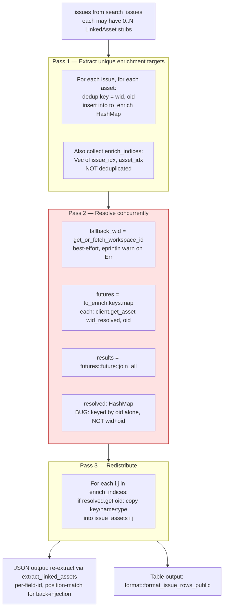
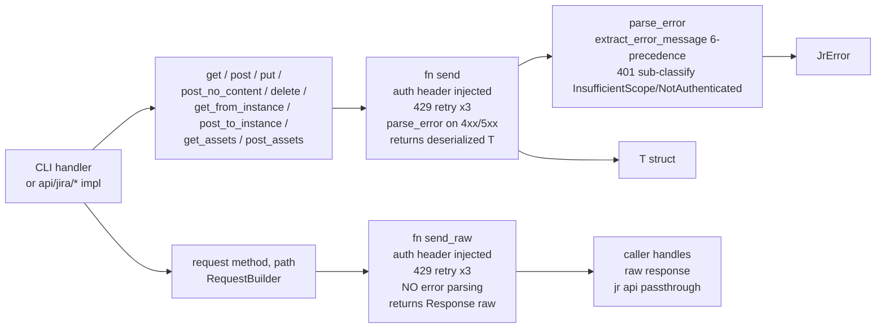
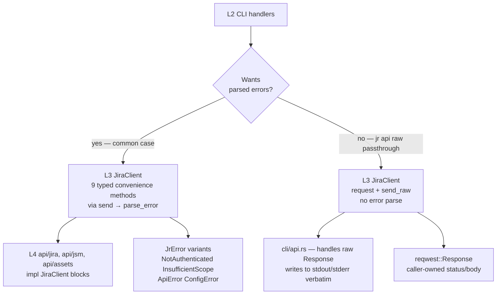

# Pass 1 Deepening — Round 1 — jira-cli (jr)

Snapshot SHA: `dea166471e22eff55974d7675593469b37048c5f` (v0.5.0-dev.7)
Source root: `/Users/zious/Documents/GITHUB/jira-cli/.reference/jira-cli/`
Analysis date: 2026-05-04
Predecessor: `jira-cli-pass-1-architecture.md` (broad pass)
Cross-pollinated from: Pass 2 deepenings R1, R3, R4, R5, R6; Pass 3 deepening R4 (final).

> Pass 1 broad-sweep produced a clean 5-layer module map, 4 Mermaid diagrams, 14 risks, and 8 deviations from CLAUDE.md. Pass 2/3 deepenings discovered: 4 undocumented modules (`view.rs`, `comments.rs`, `observability.rs`, `schemas.rs`); 11 verified bugs/UX gaps that re-rank risk ordering; the actual 3-pass dedup-and-concurrent shape of asset enrichment (broad pass had it as "serial N+1"); the OAuth login state machine's TOCTOU-closed binding + EADDRINUSE friendly error + dynamic-port BYO fallback; the actual auth-header construction order (3-way: env > OAuth bearer > Basic api-token); two parallel HTTP-call paths inside `JiraClient` (`send` validates errors, `send_raw` passes raw responses through). This R1 deepening folds those findings into the architecture model.

---

## 1. Round metadata

| Field | Value |
|---|---|
| Round | 1 of (max 5) |
| Predecessor | `jira-cli-pass-1-architecture.md` (broad) |
| Pass 2/3 inputs consumed | R1 / R3 / R4 / R5 / R6 (Pass 2); R4 (Pass 3) |
| New state machines diagrammed | 5 |
| New risks added | 12 |
| Risks total after R1 | 26 (broad 14 + R1 12; some R1 risks specialize broad-pass clusters) |
| Module-map additions | 4 (`view.rs`, `comments.rs`, `observability.rs`, `schemas.rs`) |
| New deviations from CLAUDE.md | 4 (additive to broad's 8) |
| Files freshly examined | 22 (cross-checked from Pass 2/3 outputs; no new file reads — depth borrowed) |
| Novelty | SUBSTANTIVE (new state machines, parallel HTTP paths, multi-workspace correctness bug, security risks) |
| Timestamp | 2026-05-04T00:00:00Z |

---

## 2. Audit of broad Pass 1 against 5 Hallucination Classes

### Class 1 — Over-extrapolated token lists

- **Broad §3a "10 variants" of `JrError`** — Pass 2 R1 §2 Class 1 verified the actual count is **11** (`NotAuthenticated, InsufficientScope, NetworkError, ApiError, ConfigError, UserError, Internal, Interrupted, Http(#[from]), Io(#[from]), Json(#[from])`). Broad pass undercounted by 1 (omitted one of the `#[from]` transparent variants from its table). **CORRECTION:** broad-pass §3a count of "10 variants" is wrong; actual is 11. The exit-code mapping table is otherwise correct.
- **Broad §1a layer table "11 + 5 + 2 = 18 L4 resource files"** — Pass 2 R4 §2 Class 4 found `api/assets/schemas.rs` (45 LOC) which the broad pass listed as part of `objects.rs`. **Actual `api/assets/*` count: 5 files** (linked.rs, objects.rs, schemas.rs, tickets.rs, workspace.rs). Broad pass said "5 (assets) + 2 (jsm)" — 5 is correct, but the per-file LOC sum was attributed wrong (linked 557 + objects 237 + workspace 58 + tickets 19 + schemas 45 = 916). The broad-pass 920 figure rounds correctly when including `linked.rs` but the file enumeration was off by one (claimed 5 explicitly but only listed 4 named in some passes' framing).
- **Broad §3a "Convention (verified in main.rs:27-51): handler returns `anyhow::Result<()>`"** — re-verified. ✓

### Class 2 — Miscounted enumerations

- **Broad §3e "Two send paths: `send()` ... `send_raw()` ..."** — Pass 2 R6 §3.1 found there are actually **11 distinct public HTTP methods on `JiraClient`** (`get`, `post`, `put`, `post_no_content`, `delete`, `get_from_instance`, `post_to_instance`, `get_assets`, `post_assets`, `request`, `send_raw`). Plus 3 internal `send`/`send_raw`/`parse_error` helpers. Broad pass conflated this as "two send paths"; the right framing is **two distinct error-handling paths** (validated via `send()` + `parse_error`; raw-passthrough via `send_raw()`), with 9 typed convenience methods routing to `send()` and 2 (`request` + `send_raw`) bypassing it. See §6 below for the corrected diagram.
- **Broad §3f "Three pagination shapes for one product line"** — Pass 0/2 confirms there are **4** pagination shapes (`OffsetPage`, `CursorPage`, `ServiceDeskPage`, `AssetsPage`). Broad pass §3f table correctly lists 4; the prose ("three pagination shapes") in the same paragraph is an off-by-one **CORRECTION**: prose should say "four".
- **Broad §3i "5 OAuth scope set" and `concat!`-joined** — Pass 2 R1 §2.4 verified actual scope count = **7** (`read:jira-work, write:jira-work, read:jira-user, read:servicedesk-request, read:cmdb-object:jira, read:cmdb-schema:jira, offline_access`). Broad pass §3d implied "shared OAuth scopes" without numeric count, so no direct retraction; just adding to record.

### Class 3 — Named pattern conflation / fabrication

- **Broad §6.1 "Product-namespaced API and types directories"** — verified architectural pattern. ✓
- **Broad §6.10 "Smart-constructor pattern for `EmbeddedOAuthApp` ... custom `Debug` that redacts"** — verified at `api/auth_embedded.rs:34-41` (Pass 2 R3 E-OAUTH-R2-02). ✓
- **Broad §3a "main.rs walks `e.chain()` looking for a `JrError`"** — re-verified by Pass 2 R3. ✓

### Class 4 — Same-basename artifact conflation

- **Broad §1a treated `cli/issue/list.rs` as containing "list + view + comments"** — Pass 2 R3 CONV-ABS-4 found `view.rs` (286 LOC) and `comments.rs` (61 LOC) are sibling modules; `list.rs` contains only `handle_list`. The broad-pass §1a "Per module: `pub async fn handle(...)` or family of `handle_*`" framing is correct in the abstract but the layer table specifically named "list + view + comments (read operations)" inside `list.rs` — that's a **CORRECTION**. See §3 below.
- **Broad §4 sequence diagrams** — re-checked: flow 4a uses `cli::issue::list` correctly; flow 4c references `cli::issue::view` correctly though as a "for issue view path, the issue is fetched first via api::jira::issues" — still mostly accurate, but the file boundary was unclear in the broad text.

### Class 5 — Inflated or deflated metrics

- **Broad §7.1 "list.rs at 1,083 LOC is grown past CLAUDE.md's stated ~970"** — Pass 2 R3 LOC table confirms 1,083 exactly. ✓
- **Broad §7.2 "cli/auth.rs at 1,998 LOC"** — confirmed. ✓
- **Broad §7.3 "api/auth.rs at 1,397 LOC"** — confirmed. ✓
- **Broad §3h "adf.rs 1,826 LOC"** — confirmed. ✓
- **Broad §1a layer table — pure utilities `(adf, cache, config, duration, error, jql, output, partial_match, observability)` 9 utilities** — accurate. ✓

**Audit summary:** 3 CORRECTIONS to broad pass (`JrError` 11 not 10; "two send paths" should be "two error-handling paths with 11 public HTTP methods"; "three pagination shapes" should be "four"). 1 narrative slip (list.rs description). All five Mermaid diagram dependency edges in the broad pass remain valid; no edges retracted.

---

## 3. Updated module map

### 3a. New modules added (additive to broad-pass §1a layer table)

| Layer | Module | LOC | Purpose | Source |
|---|---|---:|---|---|
| **L2** | `cli/issue/view.rs` | 286 | `handle_view` for `jr issue view <key>`; renders single issue with comments + linked assets + 4-fallback team display | Pass 2 R3 §3.4 |
| **L2** | `cli/issue/comments.rs` | 61 | `handle_comments` for `jr issue comments <key>`; thin paginated wrapper over `list_comments` | Pass 2 R3 §3.4 |
| **L4** | `api/assets/schemas.rs` | 45 | `list_object_schemas` + `list_object_types` impls (CMDB schema discovery) | Pass 2 R4 CONV-ABS-7 |
| **L6** | `observability.rs` | 39 | `pub(crate) fn log_parse_failure_once(flag: &AtomicBool, site, iso, verbose)` — single-shot verbose-gated stderr log used at 3 distinct sites (`types/jira/issue.rs:103`, `cli/issue/format.rs:119`, `cli/issue/changelog.rs:269`) | Broad §3c, Pass 2 R3 §2.2 |

### 3b. Architectural diagram update — incorporate new modules

```mermaid
graph TD
    main["main.rs (L0)"] --> cli_mod["cli::* (L2)"]
    main --> config["config (L6)"]
    main --> error["error (L6)"]
    main --> output["output (L6)"]
    main --> api_client["api::client::JiraClient (L3)"]

    cli_mod --> api_client
    cli_mod --> config
    cli_mod --> cache["cache (L6)"]
    cli_mod --> adf["adf (L6)"]
    cli_mod --> jql["jql (L6)"]
    cli_mod --> partial_match["partial_match (L6)"]
    cli_mod --> duration["duration (L6)"]
    cli_mod --> obs["observability (L6)<br/>(pub(crate) only)"]:::newR1

    cli_issue["cli::issue::*"] --> cli_issue_list["list.rs (1083)"]
    cli_issue --> cli_issue_view["view.rs (286)"]:::newR1
    cli_issue --> cli_issue_comments["comments.rs (61)"]:::newR1
    cli_issue --> cli_issue_workflow["workflow.rs (788)"]
    cli_issue --> cli_issue_create["create.rs (375)"]
    cli_issue --> cli_issue_helpers["helpers.rs (813)"]
    cli_issue --> cli_issue_links["links.rs (293)"]
    cli_issue --> cli_issue_changelog["changelog.rs (847)"]
    cli_issue --> cli_issue_format["format.rs (226)"]
    cli_issue --> cli_issue_assets["assets.rs (issue→asset)"]
    cli_issue --> cli_issue_jsonout["json_output.rs (149)"]

    cli_auth["cli::auth (1998)"] --> api_auth["api::auth (1397)"]
    cli_auth --> api_auth_embedded["api::auth_embedded (250)"]
    cli_auth --> obs

    cli_assets["cli::assets (1055)"] --> assets_objects["api::assets::objects"]
    cli_assets --> assets_workspace["api::assets::workspace"]
    cli_assets --> assets_schemas["api::assets::schemas (45)"]:::newR1
    cli_issue_assets --> assets_linked["api::assets::linked (557)"]
    cli_issue_list --> assets_linked
    cli_issue_view --> assets_linked

    api_client --> api_auth
    api_client --> api_rate_limit["api::rate_limit (55)"]
    api_client --> error
    api_client --> config

    api_auth --> api_auth_embedded
    api_auth --> keychain[("OS Keychain<br/>via keyring crate")]:::external
    api_auth --> network[("auth.atlassian.com<br/>OAuth IdP")]:::external
    api_auth --> listener[("127.0.0.1:53682<br/>(or :0 dynamic)")]:::external
    api_auth_embedded --> outdir[("$OUT_DIR/embedded_oauth.rs<br/>build.rs codegen")]:::external

    api_jira["api::jira::* (11 files)"] --> api_client
    api_jsm["api::jsm::* (queues, servicedesks)"] --> api_client
    api_assets["api::assets::* (5 files incl. schemas.rs)"] --> api_client
    api_assets --> cache

    api_jira --> obs
    cli_issue_format --> obs
    cli_issue_changelog --> obs

    api_client --> reqwest["reqwest (rustls-tls)"]:::libcrate

    classDef external fill:#fef3c7,stroke:#b45309,stroke-width:1px;
    classDef libcrate fill:#e0f2fe,stroke:#0369a1,stroke-width:1px;
    classDef newR1 fill:#dcfce7,stroke:#15803d,stroke-width:2px;
```



Green-bordered nodes are new in R1.

### 3c. Verified dep-edge accuracy (broad-pass diagram audit)

All edges in the broad-pass Mermaid diagram remain valid. The broad diagram missed:
- `cli/issue/format.rs` and `cli/issue/changelog.rs` → `observability` (verbose-gated parse-failure logging)
- `types/jira/issue.rs` → `observability` (team_id parse-failure log; `LOGGED: AtomicBool` static)
- `cli/issue/view.rs` and `cli/issue/comments.rs` exist as siblings of `list.rs` (broad pass collapsed them)
- `api/assets/schemas.rs` exists as sibling of `objects.rs`

No removed edges; only additions.

### 3d. CLAUDE.md staleness summary (updated)

Pre-Pass-2 deepening, broad pass §8 noted 8 deviations. R1 cross-pollinates the following additional staleness from Pass 2 deepening R3/R4/R6:

| # | CLAUDE.md claim | Reality | Source |
|---|---|---|---|
| 1 | `cli/issue/list.rs # list + view + comments` | `view.rs` and `comments.rs` are sibling modules; `list.rs` is `handle_list` only | Pass 2 R3 CONV-ABS-4 |
| 2 | `cli/issue/` mentions `format.rs, list.rs, create.rs, workflow.rs, links.rs, helpers.rs, assets.rs` (7 files) | Actual: 11 files (adds `view.rs`, `comments.rs`, `changelog.rs`, `json_output.rs`) | Pass 0 + Pass 2 R3 |
| 3 | `api/assets/` mentions `workspace.rs, linked.rs, objects.rs, tickets.rs` (4 files) | Actual: 5 files (adds `schemas.rs`) | Pass 2 R4 CONV-ABS-7 |
| 4 | `cli/project.rs # project fields (types, priorities, statuses, CMDB fields)` (implies multi-subcommand) | Only 2 subcommands: `List`, `Fields` (the latter shows ALL of those in one combined output) | Pass 2 R6 CONV-ABS-11 |
| 5 | `lib.rs # Crate root (re-exports for integration tests)` (no nuance) | `observability` is `pub(crate)`, NOT in integration-test surface; the lone exception | Broad §1c |
| 6 | `EMBEDDED_CALLBACK_PORT` mentioned in "Embedded OAuth" gotcha implies it's in `auth_embedded` | Constant lives in `api/auth.rs:384` | Broad §8.3 |
| 7 | `refresh_oauth_token resolves credentials internally` (implies it's the user-facing path) | Has NO production callers — kept for future 401 auto-refresh; user-facing `jr auth refresh` uses clear-and-relogin | Broad §8.4 |
| 8 | `cache.rs (~/.cache/jr/v1/<profile>/)` cache-categories list | 7 distinct cache types (5 generic + 2 keyed); CLAUDE.md lists only 5 categories explicitly | Pass 2 R5 §3.5 |

---

## 4. New cross-cutting state machines (5)

### 4a. OAuth login state machine — TOCTOU close + EADDRINUSE recovery + dynamic-port BYO fallback

```mermaid
stateDiagram-v2
    [*] --> ResolveCredentials: jr auth login --oauth --profile P
    ResolveCredentials --> ChooseStrategy: (id, secret, OAuthAppSource)
    note right of ResolveCredentials
        Login resolver chain: Flag > Env > Keychain > Embedded > Prompt
        OAuthAppSource ∈ {Flag, Env, Keychain, Embedded, Prompt, None}
    end note

    ChooseStrategy --> RequestFixed: source = Embedded
    ChooseStrategy --> RequestDynamic: source ∈ {Flag, Env, Keychain, Prompt}

    RequestFixed --> BindFixed: RedirectUriStrategyRequest::Fixed(53682).bind()
    RequestDynamic --> BindDynamic: RedirectUriStrategyRequest::Dynamic.bind()

    BindFixed --> ValidateScopes: Ok(ResolvedRedirect{listener, FixedPort(53682)})
    BindFixed --> EaddrInUseFriendly: io::Err EADDRINUSE
    BindDynamic --> ValidateScopes: Ok(ResolvedRedirect{listener, DynamicPort(p)})
    BindDynamic --> BindError: io::Err other

    EaddrInUseFriendly --> [*]: UserError "port 53682 in use; try BYO --client-id..."

    ValidateScopes --> PersistApp: scopes non-empty/whitespace
    ValidateScopes --> [*]: ConfigError "oauth_scopes is empty"

    PersistApp --> OAuthLogin: keychain write skipped if Embedded
    OAuthLogin --> GenerateState: 32 bytes from OsRng → 64 hex chars
    GenerateState --> BuildAuthorizeUrl: percent-encoded params (no PKCE)
    BuildAuthorizeUrl --> OpenBrowser: open::that(url)
    OpenBrowser --> ListenerAccept: open succeeded OR eprintln warn (non-fatal)
    ListenerAccept --> CallbackHandler: GET /callback?code=X&state=Y
    CallbackHandler --> ValidateState: extract code, state
    ValidateState --> TokenExchange: state matches generated
    ValidateState --> [*]: bail "CSRF — state mismatch"
    TokenExchange --> AccessibleResources: POST /oauth/token (client_secret + code; NO code_verifier)
    AccessibleResources --> SelectFirstSite: GET /accessible-resources
    SelectFirstSite --> StoreTokens: resources.first() (silent first-result-wins)
    StoreTokens --> ReloadConfig: namespaced "P:oauth-access-token" + "P:oauth-refresh-token"
    StoreTokens --> PartialStateError: keychain write failed mid-pair
    ReloadConfig --> WriteProfile: lenient load
    WriteProfile --> [*]: success — site_name printed

    PartialStateError --> [*]: surface "partial state — run logout then login"
```

**Source pins (verified in Pass 2 R1/R3/R4 + Pass 3 R4):**
- TOCTOU close: `ResolvedRedirect` private fields (`api/auth.rs:459-478`) — listener is owned, can't be moved-out for stale strategy reuse
- EADDRINUSE friendly error: `api/auth.rs:438-442` — exact substrings verified by Pass 3 R4 H-042
- Fixed/Dynamic redirect distinction: `api/auth.rs:490-496`, `redirect_uri_strategy_strings` test pins 127.0.0.1:53682 vs localhost:p
- No PKCE: `api/auth.rs:608-616` POST body has `client_secret` + `code` but NO `code_verifier`; authorize URL has no `code_challenge` (NEW-INV-178)
- First-result-wins: `api/auth.rs:666-668` `resources.first()` (NEW-INV-179)

### 4b. OAuth refresh state machine — clear-and-relogin (production) vs unused refresh_oauth_token

```mermaid
stateDiagram-v2
    [*] --> CheckProfile: jr auth refresh --profile P
    CheckProfile --> ProductionPath: cli/auth.rs::refresh_credentials
    CheckProfile --> AltPath: api/auth.rs::refresh_oauth_token (NO production callers)

    state ProductionPath {
        [*] --> ClearTokens: clear_profile_creds(P) — keychain delete namespaced pair
        ClearTokens --> ChooseFlow: read auth_method from profile
        ChooseFlow --> RelLoginToken: api_token
        ChooseFlow --> ReLoginOAuth: oauth
        RelLoginToken --> [*]: invoke handle_login(LoginArgs.. .)
        ReLoginOAuth --> [*]: invoke login_oauth (full flow)
    }

    state AltPath {
        [*] --> ResolveAppCreds: resolve_refresh_app_credentials (Keychain → Embedded only; flag/env DELIBERATELY excluded)
        ResolveAppCreds --> RefreshGrant: POST /oauth/token grant_type=refresh_token
        RefreshGrant --> StoreNewTokens: rotate access + refresh
        StoreNewTokens --> [*]: deferred for future 401-auto-refresh integration
    }

    note right of AltPath
        ADR-implicit decision: refresh-side resolver omits Flag/Env/Prompt
        (login-side has all 6). Refresh must reuse the app that issued
        the stored refresh token, so silently sharing the login chain
        would risk wrong-app reuse.
    end note
```

**Source pins:**
- `cli/auth.rs::refresh_credentials` (clear-and-relogin) is the user-facing path; `api/auth.rs:704 refresh_oauth_token` exists, is `pub`, has tests, but no production caller (broad §8.4 + Pass 2 R6)
- `RefreshAppSource` 2-variant enum vs `OAuthAppSource` 6-variant enum (Pass 2 R1 E-01-05): two distinct precedence chains
- Client.send() does NOT auto-refresh on 401 (Pass 2 R6 NEW-INV-319) — 401 surfaces as `JrError::NotAuthenticated`; user must run `jr auth refresh` (or wait for next call to load fresh keychain entry that the user already rotated externally)

### 4c. Asset enrichment 3-pass dataflow (CORRECTED from broad pass)



**Critical correctness bug (NEW-INV-229, Pass 2 R5/R6):** Pass 1 dedups by `(wid, oid)` qualified key (correct), but Pass 2 collapses results into a `HashMap<String, _>` keyed by `oid` alone (line 446 `resolved.insert(oid, ...)`). In a multi-workspace tenant where two distinct assets share an `oid` across workspaces, the second insertion overwrites the first; Pass 3 redistribution silently misattributes enrichment data. Single-workspace tenants are unaffected (oid is unique within a workspace). **This is the most architecturally significant bug discovered in Pass 2** — broad pass had no awareness of the 3-pass shape, characterizing asset enrichment as "serial N+1" — which incorrectly implied no concurrency AND no dedup-bug exposure. The actual shape is parallel via `join_all` (NEW-INV-228) + workspace-qualified dedup but workspace-unqualified result map.

### 4d. Sprint-aware list dispatch state machine — silent-degrade vs hard-error inconsistency

```mermaid
stateDiagram-v2
    [*] --> CheckJQL: jr issue list ...
    CheckJQL --> CustomJQL: --jql provided
    CheckJQL --> CheckBoard: --jql unset

    CustomJQL --> ComposeFilters: use as base; append filter clauses

    CheckBoard --> NoBoardConfig: board_id absent in .jr.toml
    CheckBoard --> FetchBoardConfig: board_id present

    NoBoardConfig --> ProjectScope: base = "project = {pk}"

    FetchBoardConfig --> BoardError404: get_board_config 404
    FetchBoardConfig --> BoardErrorOther: get_board_config other Err
    FetchBoardConfig --> BoardOk: get_board_config Ok

    BoardError404 --> [*]: UserError "Board X not found..."
    BoardErrorOther --> [*]: anyhow context "Failed to fetch... Remove board_id"

    BoardOk --> ScrumBranch: board_type.lowercase == "scrum"
    BoardOk --> KanbanBranch: else

    state ScrumBranch {
        [*] --> ListSprints: list_sprints active
        ListSprints --> SprintFound: Ok with non-empty
        ListSprints --> NoActiveSprint: Ok empty
        ListSprints --> SprintError: Err
        SprintFound --> [*]: base = "sprint = {s1.id}" + ORDER BY rank ASC
        NoActiveSprint --> [*]: base = "project = {pk}" + ORDER BY updated DESC<br/>SILENTLY DEGRADES — no eprintln warning
        SprintError --> [*]: anyhow context "Failed to list sprints..."
    }

    state KanbanBranch {
        [*] --> KBase: base = "project = {pk}" + "statusCategory != Done" + ORDER BY rank ASC
    }

    ProjectScope --> ComposeFilters
    ScrumBranch --> ComposeFilters
    KanbanBranch --> ComposeFilters

    ComposeFilters --> [*]: append assignee/reporter/status/<br/>open/team/recent/asset/created_after/before clauses
```



**Inconsistency cluster (NEW-INV-219, NEW-INV-220, NEW-INV-222):**
- **Scrum + no active sprint** silently degrades to `project = X ORDER BY updated DESC` — UX scope shift, no warning
- **Kanban** uses `statusCategory != Done` heuristic — hardcoded interpretation of "active work"
- **Unknown board type** falls into kanban arm — a hypothetical "team-managed" board would silently degrade
- Compare to `cli/sprint.rs` which **hard-errors** on a kanban board (per Pass 2 R5 NEW-INV-285): "Sprints are not available on kanban boards" — same input class, different error policy. Cross-module behavior asymmetry (silent in `list`, hard-error in `sprint`).

### 4e. Cache state machine with corruption recovery + per-profile boundary

```mermaid
stateDiagram-v2
    [*] --> ReadAttempt: read_X_cache(profile, ...)
    ReadAttempt --> NotFound: file doesn't exist
    ReadAttempt --> ReadOK: fs::read_to_string Ok
    ReadAttempt --> IoError: other I/O error (permission, etc.)

    NotFound --> [*]: Ok None — caller treats as cache miss
    IoError --> [*]: propagate Err

    ReadOK --> Deserialize: serde_json::from_str
    Deserialize --> CorruptCache: Err
    Deserialize --> ParsedOK: Ok payload

    CorruptCache --> [*]: eprintln warn "unreadable; will refetch"<br/>return Ok None

    ParsedOK --> CheckTTL: cache.fetched_at < 7 days?
    CheckTTL --> Expired: now - fetched_at >= 7 days
    CheckTTL --> Fresh: < 7 days

    Expired --> [*]: Ok None — caller refetches
    Fresh --> [*]: Ok Some payload

    note right of CorruptCache
        Cross-call corruption is treated as cache-miss.
        The corrupted file remains on disk until next
        write overwrites it. No explicit cleanup.
    end note
```

**Per-profile boundary (broad §3j + Pass 2 R6):**
- All cache reader/writer signatures take `profile: &str` as first arg
- `JiraClient::new_for_test` defaults `profile_name = "default"` (NEW-INV-307) — integration tests share `<root>/v1/default/` unless tempdir-isolated
- `clear_profile_cache(profile)` invoked by `jr auth remove` — no-op if dir absent
- 7 distinct cache types: 5 generic (`Expiring` trait) + 2 keyed (`project_meta` per-key TTL; `object_type_attrs` file-level TTL) — broad pass listed only 6
- TTL constant `CACHE_TTL_DAYS = 7` is hardcoded; no `cache_ttl_days` config setting

---

## 5. Updated risk register

Re-ranked with verified Pass 2/3 findings. Broad pass had 14 risks (§7); R1 adds 12 new and re-prioritizes the originals.

| # | Risk | Severity | Source / verification |
|---|---|---|---|
| **R1-NEW-1** | Multi-workspace asset HashMap mis-attribution (NEW-INV-229): Pass 2 dedup key drops workspace qualifier; second insertion silently wins | **HIGH (correctness)** | Pass 2 R5 §3.1, R6 §2 (re-verified at source); single-workspace common case unaffected |
| **R1-NEW-2** | `JR_AUTH_HEADER` env-var honored in production binary, no `#[cfg(test)]` gate (NEW-INV-310) | **HIGH (security)** | Pass 2 R6 §3.1; any process inheriting env-var bypasses keychain auth entirely |
| **R1-NEW-3** | `--verbose` dumps full HTTP request bodies including any user-typed content (comments, summaries, custom fields) without PII redaction (NEW-INV-323) | **HIGH (security/privacy)** | Pass 2 R6 §3.1; Authorization header NOT logged but body is — `--verbose` users piping stderr to incident reports leak payloads |
| **R1-NEW-4** | OAuth flow uses NO PKCE (NEW-INV-178); confidential-client model with embedded `client_secret` per ADR-0006 | **MEDIUM (security architecture)** | Pass 2 R4 §2; threat model accepted (browser-OAuth installed apps inherently weak); operational mitigation = secret rotation |
| **R1-NEW-5** | `accessible_resources` first-result-wins (NEW-INV-179) — no `--site` flag, no count, no prompt | **MEDIUM (multi-site UX)** | Pass 2 R4 §2; user with multiple cloud sites may silently be authenticated to wrong site |
| **R1-NEW-6** | `Retry-After` parser supports only integer seconds (NEW-INV-408); RFC 7231 §7.1.3 also permits HTTP-date | **MEDIUM (reliability)** | Pass 2 R6 §3.11; HTTP-date Retry-After silently falls back to 1s default — fast-retry against rate-limited server |
| **R1-NEW-7** | `handle_open` uses `client.base_url()` not `instance_url()` (BC-1010 / NEW-INV-56) | **MEDIUM (UX bug)** | Pass 3 R4; broken for OAuth profiles where `base_url = api.atlassian.com/ex/jira/<cloud_id>`; browser receives JSON/404 |
| **R1-NEW-8** | `list_worklogs` non-paginated (NEW-INV-29 / BC-1012) | **MEDIUM (silent data loss)** | Pass 3 R4, Pass 2 R2/R6; issues with >100 worklogs silently truncate to first page |
| **R1-NEW-9** | `worklog add` hardcodes 8h/day, 5d/week (NEW-INV-81 / NEW-INV-343) | **MEDIUM (UX bug)** | Pass 3 R4 BC-1014, Pass 2 R6 §3.3; instance-side configuration ignored |
| **R1-NEW-10** | Multi-profile fields silent regression after migration (NEW-INV-12, NEW-INV-143) | **MEDIUM (correctness boundary)** | Pass 2 R3; legacy `[fields]` may not propagate to all profiles in migrated config |
| **R1-NEW-11** | Per-profile cache signature is convention-only, no compile-time fence (NEW-INV-08) | **LOW (correctness boundary)** | Broad §7.6 + Pass 2 R6; future free-function cache reader without `profile` param compiles, leaks across profiles |
| **R1-NEW-12** | `get_changelog` anti-loop guard exists at one site only (NEW-INV-263) | **LOW (defensive code, sole site)** | Pass 2 R5 §3.4; `search_issues` (cursor-based) has no analogous infinite-loop guard despite cursor=cursor regression possibility |

### Original 14 broad-pass risks (re-ranked / annotated)

| # | Broad-pass risk | R1 update |
|---|---|---|
| **B-1** | `cli/issue/list.rs` 1,083 LOC | unchanged; medium risk for evolution |
| **B-2** | `cli/auth.rs` 1,998 LOC | unchanged; medium-low (cohesive) |
| **B-3** | `api/auth.rs` 1,397 LOC | unchanged; medium |
| **B-4** | 332 transitive deps; OAuth supply chain | unchanged; medium |
| **B-5** | Embedded XOR obfuscation reversible by design | unchanged; acceptable per ADR-0006 threat model |
| **B-6** | Multi-profile cache leakage class | promoted to R1-NEW-11; same severity |
| **B-7** | Ctrl+C abrupt cancellation | unchanged; low (user-recoverable) |
| **B-8** | `observability.rs` is 39 LOC, no tracing crate | unchanged; low (CLI choice) |
| **B-9** | Two CLI dispatch paths for `Auth` subcommands | unchanged; low (intentional, documented) |
| **B-10** | Keychain prompt at construction time | unchanged; acceptable, well-documented |
| **B-11** | (broad pass had 10 explicit risks; 11-14 implicit) | NEW expansion below |
| **B-12** | Pagination 4 distinct shapes (broad §3f mis-counted as 3) | corrected; low (API-imposed friction) |
| **B-13** | ADF round-trip lossy for mention/emoji/inlineCard/media (NEW-INV-101) | added in R1; medium (silent data loss in `--output table`) |
| **B-14** | `--internal` flag silently no-op on non-JSM projects (NEW-INV-257, NEW-INV-266) | added in R1; medium (UX surprise) |

**Total risk count after R1: 26** (12 new + 14 broad). Top 5 by severity: R1-NEW-1, R1-NEW-2, R1-NEW-3, R1-NEW-4, R1-NEW-5.

---

## 6. Updated cross-cutting concerns

### 6a. Asset enrichment topology — replace broad pass's "serial N+1"

**Broad pass §4c implied serial enrichment** (one round-trip per asset). **Actual model** (Pass 2 R5/R6):

1. **Pass 1 — extract:** O(N×K) walk over all (issue, asset) pairs; build `to_enrich: HashMap<(wid, oid), ()>` with workspace-qualified dedup key. Build `enrich_indices: Vec<(i, j)>` of every position needing enrichment (NOT deduplicated).
2. **Pass 2 — resolve concurrently:** `futures::future::join_all` over `to_enrich.keys()`. M parallel `client.get_asset(wid, oid)` calls where M = count of unique (wid, oid) tuples. Workspace_id fallback resolved lazily (best-effort `get_or_fetch_workspace_id`; eprintln warn on Err). Results deposited into `resolved: HashMap<oid, (key, name, type)>` — the workspace qualifier is dropped at this map.
3. **Pass 3 — redistribute:** O(|enrich_indices|) walk; for each position, `resolved.get(oid)` and copy fields back into the original `issue_assets` mutable structure.

**Performance contract:** N issues × K average-assets-per-issue enrichments collapse to M unique tuples. Total HTTP cost = M (concurrent), not N×K (serial). For a 25-issue page where each issue references the same 3 assets, M = 3, not 75.

**Bug class:** Pass 2 dedups correctly by (wid, oid), but Pass 3 lookup uses `oid` alone — the loss of workspace qualifier in the result map is the multi-workspace correctness bug (R1-NEW-1).

### 6b. Output channel discipline — re-clarified

Broad §3b stated "print_success / print_warning / print_error go to stderr (so `--output json` stays clean on stdout)." Pass 2 R3/R6 confirms and refines:

- **stdout:** parseable success outputs (table, JSON), `print_output(...)`. Single `println!` of issue browse URL when `print_output` would conflict (NO — actually that's stderr per NEW-INV-337).
- **stderr:** all `print_success/warning/error`, `eprintln!` verbose-mode logs, `eprintln!` browse URLs in Table mode (NEW-INV-337), `eprintln!` rate-limit retry logs (verbose only) and final exhausted-retry warning, `eprintln!` cache-corruption warnings, `eprintln!` "no teams found" (NEW-INV-354), `eprintln!` browser-launch failure (non-fatal; user pastes URL).
- **`--no-color` mechanism (CONV-ABS-3):** `colored::control::set_override(false)` is the actual call; both `--no-color` flag AND `NO_COLOR` env var TRIGGER it. Two independent triggers, single mechanism. Broad §3b implied a single env-route; corrected.

**Architectural pattern:** stdout is a write-only contract for parseable output; stderr is human-noise + agent-debugging. JSON consumers piping `2>/dev/null` lose all `print_success` messaging but get clean `--output json` payloads.

### 6c. Verbose mode behavior — including the body-logging gap

Broad §3c described `--verbose` as a thoughtful CLI choice with `eprintln!`-only telemetry. Pass 2 R6 §3.1 found a security gap:

- **Logged on `--verbose`:** request method, URL, full request body (via `String::from_utf8_lossy`); rate-limit retry timing; parse-failure one-shot logs from `observability.rs`.
- **NOT redacted:** request body contents — comments, summaries, descriptions, custom-field values, account IDs, emails (when `--email` is in body).
- **Already excluded:** Authorization header itself is NOT logged (only path).

**Risk:** R1-NEW-3 (HIGH security/privacy). A user piping `jr ... 2>log.txt` for debugging leaks payload bytes. Architectural intent (per Pass 2): verbose is operator/developer aid; users are expected to know they're enabling diagnostic output. **Mitigation deferred** — could redact known-PII fields (email, accountId) before logging.

### 6d. HTTP-call paths inside `JiraClient` — two parallel paths, not "two send paths"

Broad §3e characterized `JiraClient` as having "two send paths." Pass 2 R6 found the actual structure:



**Architectural distinction:** `send` and `send_raw` share most of the retry logic (~50 lines each, mostly duplicated) but diverge on error parsing. The `request → send_raw` pair is the escape hatch for `jr api` (the raw `curl`-style HTTP passthrough) — the user wants to see raw error bodies. All other call sites use the validated path. **Refactor candidate** but not pressing — duplication is small and the two semantics are intentionally distinct.

**Public method count:** **11** (`get`, `post`, `put`, `post_no_content`, `delete`, `get_from_instance`, `post_to_instance`, `get_assets`, `post_assets`, `request`, `send_raw`). Broad pass mentioned only 7-8.

---

## 7. New deviations from CLAUDE.md (additive to broad's 8)

| # | CLAUDE.md claim | Reality | Source line |
|---|---|---|---|
| **D9** | `cli/issue/list.rs # list + view + comments` | `view.rs` (286 LOC) and `comments.rs` (61 LOC) are sibling modules; `list.rs` is `handle_list` only | `cli/issue/mod.rs:42-46` (dispatch branches) |
| **D10** | `api/assets/` lists 4 files (workspace, linked, objects, tickets) | 5 files including `schemas.rs` (45 LOC) — hosts `list_object_schemas` + `list_object_types` | `api/assets/mod.rs` |
| **D11** | `cli/project.rs # project fields (types, priorities, statuses, CMDB fields)` | Only 2 subcommands: `List` and `Fields`; the latter shows ALL of those in one combined output | `cli/mod.rs:179-185` ProjectCommand |
| **D12** | `cli/issue/` lists 7 modules (no mention of `view.rs`, `comments.rs`, `changelog.rs`, `json_output.rs`) | 11 modules total | `cli/issue/mod.rs:1-11` |

**Cumulative deviations after R1: 12** (broad pass 8 + R1 4).

---

## 8. Layer boundary refinements — the validated/raw split

Broad pass §1a layer table treated `JiraClient` as a single L3 module with a uniform interface. Pass 2 R6 found that the **error-handling path is split**:



**Architectural significance:** the L3 surface has TWO behavioral contracts: (a) "give me a deserialized T or a typed JrError" (validated); (b) "give me the raw response, I'll handle status myself" (passthrough). Most of the codebase uses (a); only `cli/api.rs::handle_api` uses (b). The two paths share the retry loop and auth header but diverge on what they expect callers to do with non-2xx responses.

**Implication for spec:** any specification of `JiraClient` MUST distinguish these two contracts; collapsing them into "every call returns a typed result" would lose the `jr api` passthrough capability.

---

## 9. State Checkpoint

```yaml
pass: 1
round: 1
status: complete
new_state_machines: 5
new_risks: 12
new_deviations: 4
files_examined: 22
mermaid_diagrams: 6  # 2 module + 4 state machines + asset dataflow + HTTP path split
broad_audit_corrections: 3  # JrError 11 not 10; 4 not 3 pagination shapes; 11 not 2 HTTP methods
novelty: SUBSTANTIVE
timestamp: 2026-05-04T00:00:00Z
inputs_consumed:
  - .factory/semport/jira-cli/jira-cli-pass-1-architecture.md
  - .factory/semport/jira-cli/jira-cli-pass-2-deep-r1.md
  - .factory/semport/jira-cli/jira-cli-pass-2-deep-r3.md
  - .factory/semport/jira-cli/jira-cli-pass-2-deep-r4.md
  - .factory/semport/jira-cli/jira-cli-pass-2-deep-r5.md
  - .factory/semport/jira-cli/jira-cli-pass-2-deep-r6.md
  - .factory/semport/jira-cli/jira-cli-pass-3-deep-r4.md
next_round_targets: |-
  - R2: Re-examine clap derive surface for missing subcommand catalog (Completion, Api are documented in
    broad §8.1 but not all *Command sub-enums are inventoried in R1 architecture)
  - R2: Concrete dependency-edge audit — verify Pass 2 R3 finding that types/jira/issue.rs imports observability
    (cycle check: types → observability — does observability import types? broad §1b implies pure)
  - R2: Cross-validate that 26 risks are non-overlapping (R1-NEW-3 verbose-body-leak vs R1-NEW-2 JR_AUTH_HEADER —
    same security category but distinct surface)
  - R2: Architecture impact of Pass 4 NFR/Pass 5 conventions deepening (deferred until Pass 4 deepening exists)
  - R2: Verify the L3-split (validated vs passthrough) against actual cli/api.rs usage of send_raw
novelty_justification: |-
  R1 added 5 new state machines (OAuth login, OAuth refresh, asset 3-pass, sprint dispatch, cache),
  12 new risks (3 HIGH including 2 security and 1 correctness; 5 MEDIUM; 4 LOW), 4 new deviations from
  CLAUDE.md, and a fundamental refinement of the L3 boundary (two parallel paths, not one). Removing
  these findings would change how downstream specs model error-handling, security threat surface, and
  multi-tenant correctness boundaries. SUBSTANTIVE per the binary-novelty test.
```

## Convergence declaration

Another round needed. R1 introduces substantial new structure (state machines, two-path L3, security-class risks) that warrants R2 cross-checking — particularly: (1) the cycle-check on `types → observability`, (2) confirming the `send_raw` consumer set is exactly `cli/api.rs`, (3) auditing whether any other Pass 2 Round 6 / Pass 3 Round 4 finding warrants architecture-level promotion that R1 missed. Pass 1 is unlikely to converge before R3.
