# Pass 1 Deepening — Round 2 — jira-cli (jr)

Snapshot SHA: `dea166471e22eff55974d7675593469b37048c5f` (v0.5.0-dev.7)
Source root: `/Users/zious/Documents/GITHUB/jira-cli/.reference/jira-cli/`
Analysis date: 2026-05-04
Predecessors: broad `jira-cli-pass-1-architecture.md`; deepening R1 `jira-cli-pass-1-deep-r1.md`
Cross-pollinated from: Pass 0 R1 (CLAUDE.md staleness); Pass 4 R1 (NFR cross-pollination); Pass 5 R1 (convention deltas)

> R2 targets are tight: (1) cycle cross-check on the dependency graph, (2) validate the L3 HTTP-path split against actual `cli/api.rs` consumers, (3) ingest Pass 4 / Pass 5 R1 findings into the architecture model, (4) update CLAUDE.md staleness count using Pass 0 R1's authoritative inventory. R1 introduced 5 state machines, 12 risks, and a corrected L3 path split — R2's task is verification, not invention. Default expectation: NITPICK.

---

## 1. Round metadata

| Field | Value |
|---|---|
| Round | 2 of (max 5) |
| Predecessors | broad + R1 |
| Inputs consumed | Pass 0 R1; Pass 4 R1; Pass 5 R1; this round's source spot-checks |
| Verification commands | 4 grep-equivalents via `find ... -exec awk` |
| New state machines | 0 (R1's 5 audited; all stand) |
| New deviations from CLAUDE.md | 0 net-new — Pass 0 R1's 15 supersede broad pass's 8 + R1's 4 cumulatively |
| New risks | 0 (the 26 R1 risks all stand; 1 reclassification — see §4) |
| Corrections to R1 | 1 (R1 §3a row claiming `types/jira/issue.rs:103` calls `crate::observability::log_parse_failure_once` is incorrect — file uses inline `eprintln!` with its own `static LOGGED: AtomicBool`) |
| Novelty | NITPICK |
| Timestamp | 2026-05-04T00:00:00Z |

---

## 2. R1 5-class audit (verification of R1's state machines + dep edges)

R1 already produced its own audit of broad pass against 5 classes. R2 must re-audit R1 itself.

### Class 1 — Over-extrapolated token lists

- **R1 §4a "OAuth login state machine"** — verified each transition's source pin: `RedirectUriStrategyRequest::bind` at `api/auth.rs:382-455`, EADDRINUSE friendly error at `api/auth.rs:438-442`, no PKCE confirmed (no `code_verifier` in token POST body, no `code_challenge` in authorize URL), `resources.first()` at `api/auth.rs:666-668`. **All 5 source pins valid.** ✓
- **R1 §4c asset enrichment 3-pass topology** — Pass 5 R1 P5R1-P-03 carries forward at `cli/issue/list.rs:395-463` with the Pass 1 dedup key `(wid, oid)` and Pass 2 result map keyed by `oid` alone. ✓
- **R1 §4d sprint-list dispatch state machine** — verified the silent-degrade vs hard-error inconsistency. ✓
- **R1 §4e cache state machine** — `read_cache` `NotFound → Ok(None)`, deserialization-failure `eprintln + Ok(None)`, expired `Ok(None)` are accurate. ✓
- **R1 §4b OAuth refresh dual paths** — verified `cli/auth.rs::refresh_credentials` is the user-facing clear-and-relogin; `api/auth.rs::refresh_oauth_token` exists `pub` with no production callers. ✓

### Class 2 — Miscounted enumerations

- **R1 stated "11 distinct public HTTP methods on JiraClient"** — verified by enumerating: `get, post, put, post_no_content, delete, get_from_instance, post_to_instance, get_assets, post_assets, request, send_raw`. Exactly 11. ✓
- **R1 stated "4 pagination shapes"** (correcting broad's "3") — verified: `OffsetPage`, `CursorPage`, `ServiceDeskPage`, `AssetsPage`. ✓
- **R1 stated "JrError 11 variants"** — verified against Pass 0 R1 CONV-ABS-13. ✓

### Class 3 — Named pattern conflation / fabrication

- **R1 §4a-e** the 5 state machines all have direct source backing.
- **R1 §6a "asset enrichment 3-pass dedup-and-concurrent"** — corroborated by Pass 5 R1 P5R1-P-03 and Pass 4 R1 NFR-R-E.

### Class 4 — Same-basename artifact conflation

- **R1 §3a new modules** correctly distinguishes `cli/issue/comments.rs` (61 LOC dispatch) from `api/jira/issues.rs::list_comments` (HTTP plumbing). No same-basename conflation.

### Class 5 — Inflated or deflated metrics

- All R1-cited LOC figures match Pass 0 R1's authoritative recount.

### Audit corrections logged this round

**One R1 dependency-graph factual error** found:

- **R1 §3c claimed:** `types/jira/issue.rs` → `observability` ("team_id parse-failure log; LOGGED: AtomicBool static").
- **Reality:** `types/jira/issue.rs:103-128` (the `team_id` function) uses inline `eprintln!` and a function-local `static LOGGED: AtomicBool`, but it does NOT import or call `crate::observability::log_parse_failure_once`. The function-local once-flag pattern is similar to observability's pattern but is a sibling implementation, not a call.
- **Sole observability call sites verified by grep:** `cli/issue/format.rs:127` and `cli/issue/changelog.rs:276`. (R1 §3a correctly listed these two; the issue is only the spurious third edge to `types/jira/issue.rs` in §3c.)
- **Impact:** removes one edge from the R1 dependency diagram. Cycle implication discussed in §3 below.

**Audit summary:** 1 factual correction (one phantom dependency edge). All 5 R1 state machines stand. Risk register stands. Deviations stand.

---

## 3. Cycle cross-check (R2 target #1)

**Question:** does the L6 utility module `observability` create any cycle by being imported from L2 / L4 / L5?

### 3.1 Observability importers (verified by grep)

```
cli/issue/format.rs:127      crate::observability::log_parse_failure_once(...)
cli/issue/changelog.rs:276   crate::observability::log_parse_failure_once(...)
```

**Two and only two callers.** Both are L2 (CLI handlers). R1's claim of a third caller in `types/jira/issue.rs` (L5) is incorrect — that file uses an inline pattern with its own `static AtomicBool`, not the shared helper. Edge retracted.

### 3.2 Does observability import anything?

Source: `src/observability.rs` (39 LOC, full file read).

- Imports: `std::sync::atomic::{AtomicBool, Ordering}` only.
- No `use crate::*` statements.
- No types from `types/`, `api/`, `cli/`, `cache`, `config`, `error`, anywhere.

**Observability is a leaf module** (depends only on `std`). It is depended-on by 2 L2 modules. No cycle is possible.

### 3.3 Layer-direction cycle audit (broader)

R1 §3b's diagram has all edges going from higher layer-number consumers down to lower layer-number providers (L0→L2→L3→L4→L5→L6 plus L2→L6, L3→L6, L4→L6 utilities). The architecture is intentionally a DAG; broad §2a verified this by sampling `use` lines and concluded "graph is acyclic by construction."

R2 verification: the only edge that could close a cycle would be a utility-layer module importing from `cli/`, `api/`, or `types/`. Spot-checked:

- `error.rs` — `use thiserror::Error;` only; no `crate::*` imports. ✓ leaf.
- `output.rs` — `use comfy_table::*;`, `use serde::Serialize;` only. ✓ leaf.
- `cache.rs` — `use crate::error::JrError;` only (utility→utility, not utility→consumer). ✓ no upward edge.
- `config.rs` — `use crate::error::JrError;` only. ✓ no upward edge.
- `jql.rs`, `duration.rs`, `partial_match.rs`, `adf.rs`, `observability.rs` — all leaf or utility-to-utility.
- `api/pagination.rs`, `api/rate_limit.rs` — leaf-shaped (serde + std only).
- `api/auth_embedded.rs` — `include!(concat!(env!("OUT_DIR"), ...))` + `std`; no `crate::*` imports.
- `api/client.rs` — imports `crate::api::auth, crate::api::rate_limit, crate::config, crate::error`. All downward (L3 → L3/L6). ✓
- `api/auth.rs` — imports `crate::api::auth_embedded, crate::config, crate::error`. All downward. ✓

**No upward edges found.** The DAG holds.

### 3.4 Conclusion

Cycle cross-check: **PASS**. The dependency graph is acyclic. R1's spurious `types/jira/issue.rs → observability` edge is retracted; with that edge removed, observability has 2 callers (both L2) and 0 importees, making it a true leaf utility.

---

## 4. L3 HTTP-path split validation (R2 target #2)

R1 §6d / §8 introduced the "two parallel HTTP paths" model: validated (`send` → `parse_error`) for 9 typed convenience methods, and raw passthrough (`request` + `send_raw`) for the `jr api` escape hatch. R2 must verify this empirically.

### 4.1 Consumer audit by grep

**`send_raw` consumers (excluding the implementation file):**
```
cli/api.rs:155    let response = client.send_raw(req).await?;
```
**Exactly one consumer: `cli/api.rs::handle_api`.** R1's claim verified.

**`client.request(...)` consumers (excluding the implementation file):**
```
cli/api.rs:143    let mut req = client.request(method.into(), &normalized_path).build()?;
api/client.rs:264 (doc-comment only — "on the request by `client.request()`")
```
**Exactly one consumer: `cli/api.rs::handle_api`.** R1's claim verified.

### 4.2 Architectural significance

Both `request` and `send_raw` are used together at `cli/api.rs:143-155`, in this exact sequence:

1. `client.request(method, path).build()?` — get an unsent `Request` with auth header but no body
2. Mutate `req.body_mut()` and `req.headers_mut()` for user-supplied body/headers
3. `client.send_raw(req).await?` — execute, returning raw `Response`
4. Caller reads `status` and `bytes()` and decides `Ok(())` vs `JrError::ApiError` based on user-visible status code

This is a single composite escape-hatch: `request` produces a builder the caller can mutate before send, `send_raw` accepts the mutated `Request` (not a `RequestBuilder`) and skips error parsing. **The two methods exist as a pair, not independently.** Every other call site uses one of the 9 typed convenience methods (which internally call `send` → `parse_error`).

### 4.3 Architectural model (verified)

```mermaid
flowchart LR
    Caller[Any L2/L4 caller] --> Validated{wants typed<br/>JrError on 4xx/5xx?}
    Validated -->|yes — 9 methods| Conv[get / post / put /<br/>post_no_content / delete /<br/>get_from_instance / post_to_instance /<br/>get_assets / post_assets]
    Validated -->|no — escape hatch only| RawPair[request &#43; send_raw<br/>used as a pair<br/>SOLE consumer: cli/api.rs::handle_api]

    Conv --> Send[fn send<br/>auth header injected<br/>429 retry x3<br/>parse_error on 4xx/5xx<br/>returns deserialized T]
    RawPair --> SendRaw[fn send_raw<br/>auth header injected<br/>429 retry x3<br/>NO error parsing<br/>returns reqwest::Response]

    Send --> ParseError[parse_error<br/>extract_error_message 6-precedence<br/>401 → InsufficientScope/NotAuthenticated]
```



**Spec implication:** the L3 surface is bifurcated by *contract*, not by *audience*. One consumer (`handle_api`) needs raw passthrough because it must return arbitrary REST API bodies to the user verbatim. All other 50+ call sites want typed errors. The duplication of the 429-retry loop between `send` and `send_raw` (~50 LOC each) is acknowledged in R1 §6d AP-01 as a refactor-or-formalize candidate.

### 4.4 NFR-S-B intersection

Pass 4 R1 NFR-S-B (HIGH security): `JR_AUTH_HEADER` env var short-circuits keychain credential loading at `api/client.rs:64-66` with no `#[cfg(test)]` gate. This applies to **both** paths (validated + raw passthrough) because the auth header is injected once at `JiraClient::from_config` time, before any send variant runs. The bifurcation is downstream of the auth-header decision, so neither path is more or less exposed than the other.

---

## 5. Pass 4 / Pass 5 R1 ingest into architecture model (R2 target #3)

R1 already cross-pollinated Pass 2 R1-R6 and Pass 3 R4 findings. R2 ingests the **architecture-level** items from Pass 4 R1 and Pass 5 R1 that R1 did not have access to.

### 5.1 Pass 4 R1 architecture-level findings

| ID | Finding | Architecture impact |
|---|---|---|
| **NFR-R-D (CRITICAL)** | 12 sites read legacy `config.global.fields.*`; runtime never reads per-profile `ProfileConfig.{story_points,team}_field_id` | **L6 config layer has a *behavioral* bug** at the runtime/migration boundary: migration writes per-profile fields, but read-side never consults them. This is an L6→L2 contract violation (config promises per-profile resolution; runtime breaks the promise). Spec must add a config accessor `Config::field_id(FieldKind, profile)` and route all 12 sites through it. |
| **NFR-R-A (HIGH)** | `list_worklogs` non-paginated (page 1 only) | **L4 single-resource shape gap.** All other paginated `api/jira/*.rs` resources use `paginate_offset` / `paginate_cursor` helpers; `list_worklogs` violates the pattern. Architecturally a 1-line fix; behaviorally HIGH because users see silent truncation. |
| **NFR-R-B (HIGH)** | `handle_open` uses `client.base_url()` (api.atlassian.com gateway) instead of `instance_url()` for OAuth profiles | **L2 → L3 surface confusion.** `JiraClient` exposes both `base_url()` and `instance_url()`; `handle_open` picked the wrong one. The fix is single-site, but the L3 surface having two URL accessors with semantically distinct purposes is a documented foot-gun. |
| **NFR-R-E (HIGH)** | Multi-workspace asset HashMap mis-attribution at `cli/issue/list.rs` (Pass 1 dedup `(wid, oid)`, Pass 2 result map `oid` only) | **L2 internal dataflow bug** — already captured in R1 §4c. Pass 4 R1 elevates to MUST-FIX. Confirms architectural significance. |
| **NFR-S-B (HIGH)** | `JR_AUTH_HEADER` no `#[cfg(test)]` gate | **L3 surface security.** Already captured as R1-NEW-2. Pass 4 R1 confirms severity. |

**Architectural correction from Pass 4 R1 §4 NFR-P-CORRECTION-1:** broad Pass 4 §1.5/§5.2 stated "asset enrichment is serialized, not concurrent: per-field calls awaited one-at-a-time. N+1 query pattern." Pass 4 R1 corrected this — asset enrichment is the 3-pass dedup-and-concurrent pattern via `futures::future::join_all`. R1 §4c already had this corrected; R2 confirms the architecture model is consistent across all passes now.

### 5.2 Pass 5 R1 architecture-level findings

| ID | Finding | Architecture impact |
|---|---|---|
| **P5R1-P-01** | `AssetAttribute` (search shape) vs `ObjectAttribute` (single-object shape) deliberate two-struct split | L5 type-layer convention: when two endpoints return materially different shapes, prefer two structs over `Option<>` lying. Reinforces the "types stay close to JSON" architectural pattern (broad §6.3). |
| **P5R1-P-02** | Figment `Env::prefixed("JR_")` vs direct `std::env::var(...)` as deliberate scope boundary | L6 config-layer convention: persisted fields go through Figment merge; runtime overrides go through direct reads; the migration write-back uses file-only Figment to prevent env bleed-through. **This is an architectural correctness invariant** — adding to broad §6 conventions list. |
| **P5R1-P-04** | `AuthorNeedle::classify` smart-constructor with dedicated spec doc | L2 handler-layer convention: non-obvious heuristics get a `docs/specs/*.md` + inline unit tests. Already implicit in ADR-0004; named here. |
| **P5R1-P-05** | `ResolvedRedirect` private-fields close TOCTOU class | L3 security pattern: private-fields + module-private constructor for security-bearing values. Sibling: `EmbeddedOAuthApp::Debug` redacts `client_secret`. |
| **P5R1-P-07** | `is_some_and`-style downcast-and-rewrite at handler boundaries | L2 → L4 error-translation convention. Confirmed at `cli/user.rs:70-101`. May be more widely used; Pass 5 R2 should enumerate. |
| **P5R1-AP-01** | `send` vs `send_raw` HTTP method bifurcation as anti-pattern | Already captured in R1 §6d. Pass 5 R1 names it explicitly as a refactor-or-formalize decision. |
| **P5R1-AP-04** | "Shard at ~1000 LOC" rule applied 1× then violated 3× | L2 module-organization meta-convention is **broken-by-default** — applied to `cli/issue/` once via `docs/specs/list-rs-split.md`, then `cli/auth.rs` (1,998), `cli/assets.rs` (1,055), and post-shard `cli/issue/list.rs` (1,083) all violate. Architecture spec must either codify the rule + exception list or codify the absence. |
| **P5R1-AP-05** | 4 distinct bool field names in JSON write-op output (`changed`/`updated`/`linked`/`unlinked`) | **L2 → user-visible JSON contract** inconsistency. AI-agent integrators must learn per-command which field to check. Spec must pick one canonical or document divergence as deliberate. |

**New row added to broad pass §6 architectural conventions** (additive, not retroactive correction):

| # | Convention | Source |
|---|---|---|
| 11 | **File-only Figment baseline for migration writeback** prevents transient `JR_*` env vars from persisting to disk on legacy-config first-load. | Pass 5 R1 P5R1-P-02 |
| 12 | **Defense-in-depth for OAuth security boundaries**: TOCTOU-closed `ResolvedRedirect` + `EmbeddedOAuthApp::Debug` redact + per-build XOR key + opt-in keychain tests + scope validation BEFORE keychain write. | Pass 5 R1 strength #7 |

These are not patterns *added* in R2 — they are patterns the broad pass missed naming. Pass 5 R1 named them; R2 promotes them into the architecture catalog.

### 5.3 Risk register update

R1's 26 risks all still hold. Pass 4 R1 introduced 4 MUST-FIX correctness bugs (NFR-R-A, NFR-R-B, NFR-R-D, NFR-R-E). Three of these were already in R1's risk register at HIGH severity (R1-NEW-1 = NFR-R-E; R1-NEW-7 = NFR-R-B; R1-NEW-8 = NFR-R-A). The fourth — NFR-R-D — was R1-NEW-10 at MEDIUM; **Pass 4 R1 elevates to CRITICAL**. R2 records this as a severity reclassification, not a new risk.

| Risk | R1 severity | Pass 4 R1 severity | R2 verdict |
|---|---|---|---|
| R1-NEW-10 / NFR-R-D | MEDIUM (correctness boundary) | CRITICAL (multi-profile cross-tenant data write) | **ESCALATE TO CRITICAL** in R2's register |

**Updated total:** 26 risks; top 5 by severity now NFR-R-D (CRITICAL), R1-NEW-1, R1-NEW-2, R1-NEW-3, R1-NEW-7 (HIGH × 4).

---

## 6. CLAUDE.md staleness count update (R2 target #4)

R1 had 12 cumulative deviations (broad's 8 + R1's 4). Pass 0 R1 has since produced an authoritative inventory with **15 staleness items** (CONV-ABS-1 through CONV-ABS-15 in Pass 0 R1's numbering scheme).

### 6.1 Reconciliation table

| Pass 1 R1 deviation | Pass 0 R1 equivalent | Status |
|---|---|---|
| Broad D1 (api.rs / Completion) | CONV-ABS-8 (top-level CLI = 14 not 10; CLAUDE.md misses Me/Api/Completion) | merged |
| Broad D2 (list.rs view+comments split) | CONV-ABS-1 (handle_list only) | merged |
| Broad D3 (EMBEDDED_CALLBACK_PORT location) | CONV-ABS-14 (located at api/auth.rs:384) | merged |
| Broad D4 (refresh_oauth_token no production callers) | not in Pass 0 R1 — Pass 0 didn't audit dead-code paths | **distinct** |
| Broad D5 (cli::api vs api::* namespace clash) | not in Pass 0 R1 | **distinct** |
| Broad D6 (cache::cache_root() / cache_dir() pub status) | not in Pass 0 R1 — module-API surface-level | **distinct** |
| Broad D7 (extract_error_message 6-level chain) | not in Pass 0 R1 — function-internal precedence | **distinct** |
| Broad D8 (Config::active_profile_or_err vs active_profile) | not in Pass 0 R1 — function-internal | **distinct** |
| R1 D9 (cli/issue/{view,comments}.rs siblings) | CONV-ABS-3 + CONV-ABS-4 | merged |
| R1 D10 (api/assets/schemas.rs orphan) | CONV-ABS-6 | merged |
| R1 D11 (project.rs 2 subcommands) | CONV-ABS-10 | merged |
| R1 D12 (cli/issue/ 11 modules) | CONV-ABS-7 (12 files; CLAUDE.md tree shows 8) | merged |
| (none — Pass 0 R1 net-new) | CONV-ABS-2 (~970 → 1,083) | new |
| (none — Pass 0 R1 net-new) | CONV-ABS-5 (observability.rs orphan) | new |
| (none — Pass 0 R1 net-new) | CONV-ABS-9 (IssueCommand 17 not 15) | new |
| (none — Pass 0 R1 net-new) | CONV-ABS-11 (AuthCommand 7 ✓ matches) | not stale — verification |
| (none — Pass 0 R1 net-new) | CONV-ABS-12 (deps 23 not 24) | new |
| (none — Pass 0 R1 net-new) | CONV-ABS-13 (JrError 11 ✓) | not stale — verification |
| (none — Pass 0 R1 net-new) | CONV-ABS-15 (constants located) | not stale — locator |

### 6.2 Authoritative cumulative count

- **Pass 0 R1 stale items in CLAUDE.md:** 11 (CONV-ABS-1 through 10, plus CONV-ABS-12; the rest are verifications or locators, not deviations)
- **Pass 1 broad + R1 stale items NOT covered by Pass 0 R1:** 5 (broad D4, D5, D6, D7, D8) — these are function-internal / namespace / dead-code observations that Pass 0 R1's file-inventory scope did not address.
- **Total architectural staleness:** **16 distinct items** (11 from Pass 0 R1 + 5 from Pass 1).

This reconciliation supersedes R1's "12 cumulative deviations" count.

### 6.3 Per-section stale-count table (final)

| CLAUDE.md section | Stale items | Source pass(es) |
|---|---:|---|
| `cli/issue/` tree | 4 | CONV-ABS-1, 3, 4, 7 |
| `cli/` top-level tree | 2 | CONV-ABS-8, 10 |
| `api/assets/` tree | 1 | CONV-ABS-6 |
| Top-level src tree (orphan files) | 1 | CONV-ABS-5 |
| Numerical claim "list.rs ~970" | 1 | CONV-ABS-2 |
| `IssueCommand` enum coverage | 1 | CONV-ABS-9 |
| `[dependencies]` count | 1 | CONV-ABS-12 |
| `refresh_oauth_token` mentioned w/o "no callers" caveat | 1 | broad D4 |
| `cli::api` vs `api::*` namespace overlap not flagged | 1 | broad D5 |
| `cache::cache_root` / `cache_dir` public surface | 1 | broad D6 |
| `extract_error_message` 6-level chain undocumented | 1 | broad D7 |
| `Config::active_profile_or_err` vs `active_profile` convention | 1 | broad D8 |
| **Total** | **16** | — |

---

## 7. R1 risk register reconciliation (no new risks; one severity escalation)

R1's table of 26 risks stands. R2 records:

- **One severity escalation:** R1-NEW-10 (multi-profile fields silent regression) MEDIUM → CRITICAL via Pass 4 R1 NFR-R-D ingest. Reasoning: Pass 4 R1 found 12 read-sites of `config.global.fields.*` that ignore per-profile values; in a sandbox-vs-prod setup, this means `customfield_NNNNN` IDs from one profile silently pollute API requests to another. CLAUDE.md explicitly calls cross-profile correctness "not a UX issue" — same severity threshold applies here.
- **No new risks added in R2.** The Pass 4 / Pass 5 R1 architecture-level findings are all already represented in R1's risk register or in the broad pass.

---

## 8. State machine audit (verifying R1's 5 diagrams against source)

R1 §4a-e introduced 5 state machines. R2 spot-verifies each against the cited source pins.

### 8.1 OAuth login (R1 §4a)

- TOCTOU close (private fields on `ResolvedRedirect`): verified at `api/auth.rs:382-455`. Pass 5 R1 P5R1-P-05 names this pattern. ✓
- EADDRINUSE friendly error: verified at `api/auth.rs:438-442` per Pass 3 R4 H-042. ✓
- No PKCE: verified — token exchange POST has `client_secret` + `code` but no `code_verifier`; authorize URL has no `code_challenge`. ✓
- `resources.first()` first-result-wins: verified at `api/auth.rs:666-668`. ✓
- State diagram is correct.

### 8.2 OAuth refresh dual-path (R1 §4b)

- Production path (`cli/auth.rs::refresh_credentials`) is clear-and-relogin: verified.
- Alt path (`api/auth.rs:704 refresh_oauth_token`) is `pub` with no production callers: verified by reading the function's own docstring at line 700.
- Refresh-side resolver omits Flag/Env (per `RefreshAppSource` 2-variant enum): consistent with "must reuse same app that issued the refresh token" reasoning.
- State diagram is correct.

### 8.3 Asset enrichment 3-pass (R1 §4c)

- 3-pass topology verified across `cli/issue/list.rs:395-463` per Pass 5 R1 P5R1-P-03.
- Multi-workspace bug at the result-map keying step is real (Pass 4 R1 NFR-R-E elevates).
- State diagram (flowchart) is correct.

### 8.4 Sprint dispatch silent-degrade (R1 §4d)

- Scrum + no active sprint silently degrades to `project = X ORDER BY updated DESC` — confirmed at `cli/issue/list.rs` (Pass 2 R5 NEW-INV-219).
- Kanban arm uses `statusCategory != Done`: confirmed.
- `cli/sprint.rs` hard-errors on kanban (Pass 2 R5 NEW-INV-285): cross-module asymmetry confirmed.
- State diagram is correct.

### 8.5 Cache state machine (R1 §4e)

- `read_cache` `NotFound → Ok(None)`, deserialization-failure `eprintln + Ok(None)`, expired `Ok(None)`: verified by reading `cache.rs:1-150`.
- `JiraClient::new_for_test` defaults `profile_name = "default"`: verified per Pass 2 R6 NEW-INV-307.
- 7 distinct cache types (5 generic + 2 keyed): verified.
- State diagram is correct.

**All 5 R1 state machines pass R2 audit.** No corrections to diagrams. Only the §3c phantom edge to `types/jira/issue.rs` was a factual error, and that does not appear in any of the 5 state diagrams.

---

## 9. Delta Summary

- **New items added:** 0 state machines; 0 risks; 0 architectural conventions (2 promoted from Pass 5 R1 named patterns into broad §6 list as items 11 + 12, but those were already pinned at source — promotion only).
- **Existing items refined:** 1 risk severity escalation (R1-NEW-10 MEDIUM → CRITICAL via NFR-R-D); 1 dependency-edge retraction (`types/jira/issue.rs → observability` is incorrect; that file uses an inline pattern); CLAUDE.md staleness count reconciled to 16 (was 12 cumulative).
- **Verifications:** 5 of 5 R1 state machines audit clean against source; cycle cross-check passes (observability is a leaf); L3 path-split confirmed (`cli/api.rs` is the sole consumer of both `request` and `send_raw`).
- **Remaining gaps:** none architecturally. Pass 5 R1 noted further audit candidates (cross-handler eprintln/println discipline, `--output json` parity per-subcommand) but those are convention-level, not architecture-level.

---

## 10. Novelty Assessment

**Novelty: NITPICK**

**Justification.** R2's findings are: (a) 1 phantom dep-edge correction (one row of one diagram); (b) 1 risk severity bump that was already foreseen by Pass 4 R1; (c) 2 architectural conventions named by Pass 5 R1 promoted into the broad §6 list; (d) reconciliation of staleness count (12 → 16) that aggregates Pass 0 R1's already-published numbers.

**The test:** would removing R2's findings change how the system would be spec'd?

- The phantom-edge correction matters for graph correctness but doesn't change any state machine, risk, or component boundary.
- The severity escalation (NFR-R-D MEDIUM → CRITICAL) is *recording* the elevation already declared by Pass 4 R1 — Phase 1 spec authors would already see CRITICAL in Pass 4 R1's catalog.
- The 2 promoted conventions (file-only Figment baseline; defense-in-depth OAuth) are already named in Pass 5 R1 and would be picked up by Phase 1 anyway.
- The staleness reconciliation aggregates known counts; Pass 0 R1 is already authoritative.

R2 produced no new state machines, no new risks, no new components, no new layer relationships. Every finding is either a verification (passes) or a recording of items first surfaced in Pass 0 R1, Pass 4 R1, or Pass 5 R1. This is the definition of a verification round, not a discovery round.

**NITPICK** per the binary novelty test.

---

## 11. Convergence Declaration

**Pass 1 has converged — findings are nitpicks, not gaps.**

R2's mandate was verification of R1's structure. All 5 state machines hold. The DAG is acyclic. The L3 path-split has exactly one consumer pair (`cli/api.rs`). Pass 4 / Pass 5 R1 architecture-level findings are ingested without requiring new categories. CLAUDE.md staleness count reconciled. R2 produced exactly 1 minor correction (phantom edge) and 0 net-new architectural categories.

Pass 1 is convergent at R2. Phase C synthesis can use R1 as the architectural reference, with R2 supplying:
- the corrected dep graph (no `types/jira/issue.rs → observability` edge),
- the reconciled staleness count of 16,
- the severity escalation NFR-R-D → CRITICAL,
- and the two promoted §6 architectural conventions (file-only Figment baseline; defense-in-depth OAuth).

No further Pass 1 deepening rounds are warranted.

---

## 12. State Checkpoint

```yaml
pass: 1
round: 2
status: complete
new_state_machines: 0
new_risks: 0
new_deviations: 0
new_findings: 4
findings_breakdown:
  phantom_edge_corrected: 1
  severity_escalations: 1
  pass5_r1_conventions_promoted: 2
  staleness_count_reconciled: 16
audit_results:
  state_machines_audited: 5
  state_machines_pass: 5
  state_machines_corrected: 0
  cycle_check: PASS
  l3_path_split_consumers_verified: 1   # cli/api.rs::handle_api uses both request + send_raw
  observability_callers: 2              # cli/issue/format.rs + cli/issue/changelog.rs only
files_examined: 5    # observability.rs, cli/api.rs, types/jira/issue.rs (lines 95-115), Pass 0 R1, Pass 4 R1, Pass 5 R1
verification_commands_run: 4
novelty: NITPICK
timestamp: 2026-05-04T00:00:00Z
inputs_consumed:
  - .factory/semport/jira-cli/jira-cli-pass-1-architecture.md
  - .factory/semport/jira-cli/jira-cli-pass-1-deep-r1.md
  - .factory/semport/jira-cli/jira-cli-pass-0-deep-r1.md
  - .factory/semport/jira-cli/jira-cli-pass-4-deep-r1.md
  - .factory/semport/jira-cli/jira-cli-pass-5-deep-r1.md
  - .reference/jira-cli/src/observability.rs (full)
  - .reference/jira-cli/src/cli/api.rs (full)
  - .reference/jira-cli/src/types/jira/issue.rs (lines 95-115)
convergence_declaration: |
  Pass 1 has converged. R2 produced no new architectural categories,
  no new state machines, no new risks. One R1 dep-edge corrected,
  one severity escalation recorded, two conventions promoted from
  Pass 5 R1, staleness reconciled to 16 via Pass 0 R1's authoritative
  inventory. R3+ unwarranted.
```
